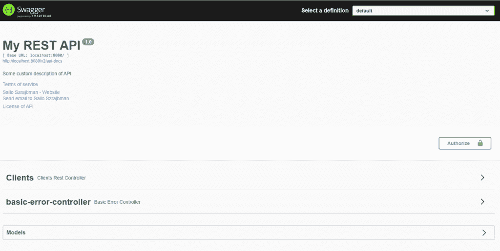
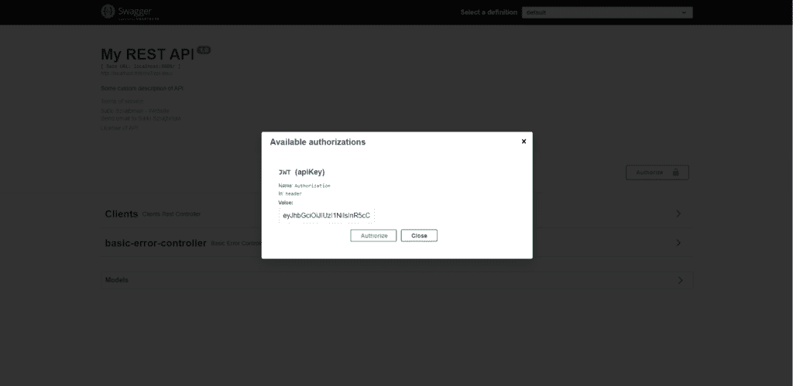
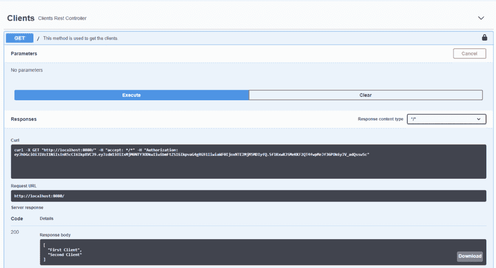

# 用 Spring Boot 和 Swagger UI 设置 JWT

> 原文：<https://web.archive.org/web/20220930061024/https://www.baeldung.com/spring-boot-swagger-jwt>

## 1.介绍

在这个简短的教程中，我们将看到如何配置 Swagger UI，使其在调用我们的 API 时包含一个 JSON Web 令牌(JWT)。

## 2.Maven 依赖性

在这个例子中，我们将使用 [springfox-boot-starter](https://web.archive.org/web/20221020153607/https://search.maven.org/search?q=g:io.springfox%20AND%20a:springfox-boot-starter) ，它包含了开始使用 Swagger 和 Swagger UI 所需的所有依赖项。让我们将它添加到我们的`pom.xml`文件中:

```
<dependency>
    <groupId>org.springframework.boot</groupId>
    <artifactId>spring-boot-starter-web</artifactId>
</dependency>
<dependency>
    <groupId>io.springfox</groupId>
    <artifactId>springfox-boot-starter</artifactId>
    <version>3.0.0</version>
</dependency>
```

## 3.摇摆构型

首先，我们需要定义我们的`ApiKey` 来包含 JWT 作为授权头:

```
private ApiKey apiKey() { 
    return new ApiKey("JWT", "Authorization", "header"); 
}
```

接下来，让我们用全局`AuthorizationScope`配置 JWT `SecurityContext`:

```
private SecurityContext securityContext() { 
    return SecurityContext.builder().securityReferences(defaultAuth()).build(); 
} 

private List<SecurityReference> defaultAuth() { 
    AuthorizationScope authorizationScope = new AuthorizationScope("global", "accessEverything"); 
    AuthorizationScope[] authorizationScopes = new AuthorizationScope[1]; 
    authorizationScopes[0] = authorizationScope; 
    return Arrays.asList(new SecurityReference("JWT", authorizationScopes)); 
}
```

然后，我们配置我们的 API `Docket` bean 以包含 API 信息、安全上下文和安全方案:

```
@Bean
public Docket api() {
    return new Docket(DocumentationType.SWAGGER_2)
      .apiInfo(apiInfo())
      .securityContexts(Arrays.asList(securityContext()))
      .securitySchemes(Arrays.asList(apiKey()))
      .select()
      .apis(RequestHandlerSelectors.any())
      .paths(PathSelectors.any())
      .build();
} 
```

```
private ApiInfo apiInfo() {
    return new ApiInfo(
      "My REST API",
      "Some custom description of API.",
      "1.0",
      "Terms of service",
      new Contact("Sallo Szrajbman", "www.baeldung.com", "[[email protected]](/web/20221020153607/https://www.baeldung.com/cdn-cgi/l/email-protection)"),
      "License of API",
      "API license URL",
      Collections.emptyList());
}
```

## 4.休息控制器

在我们的`ClientsRestController`中，让我们编写一个简单的`getClients `端点来返回客户端列表:

```
@RestController(value = "/clients")
@Api( tags = "Clients")
public class ClientsRestController {

    @ApiOperation(value = "This method is used to get the clients.")
    @GetMapping
    public List<String> getClients() {
        return Arrays.asList("First Client", "Second Client");
    }
}
```

## 5.Swagger UI

现在，当我们启动应用程序时，我们可以在`http://localhost:8080/swagger-ui/` URL 访问 Swagger UI。

下面来看看带有`Authorize`按钮的 Swagger UI:

[](/web/20221020153607/https://www.baeldung.com/wp-content/uploads/2020/10/swaggerui-1024x516-1.png)

当我们点击`Authorize`按钮时，Swagger UI 会询问 JWT。

我们只需要输入我们的令牌并点击`Authorize`，从那时起，所有对我们的 API 的请求将自动在 HTTP 头中包含令牌:

[](/web/20221020153607/https://www.baeldung.com/wp-content/uploads/2020/10/swagger-authorize-1024x499-1.png)

## 6.JWT 的 API 请求

当向我们的 API 发送请求时，我们可以看到有一个“Authorization”头，其中包含我们的令牌值:

[](/web/20221020153607/https://www.baeldung.com/wp-content/uploads/2020/10/swagger-get-clients-1024x556-1.png)

## 7.结论

在本文中，我们看到了 Swagger UI 如何提供定制配置来设置 JWT，这在处理我们的应用程序授权时很有帮助。在 Swagger UI 中授权后，所有请求将自动包括我们的 JWT。

本文中的源代码可以在 GitHub 上的[处获得。](https://web.archive.org/web/20221020153607/https://github.com/eugenp/tutorials/tree/master/spring-boot-modules/spring-boot-swagger-jwt)