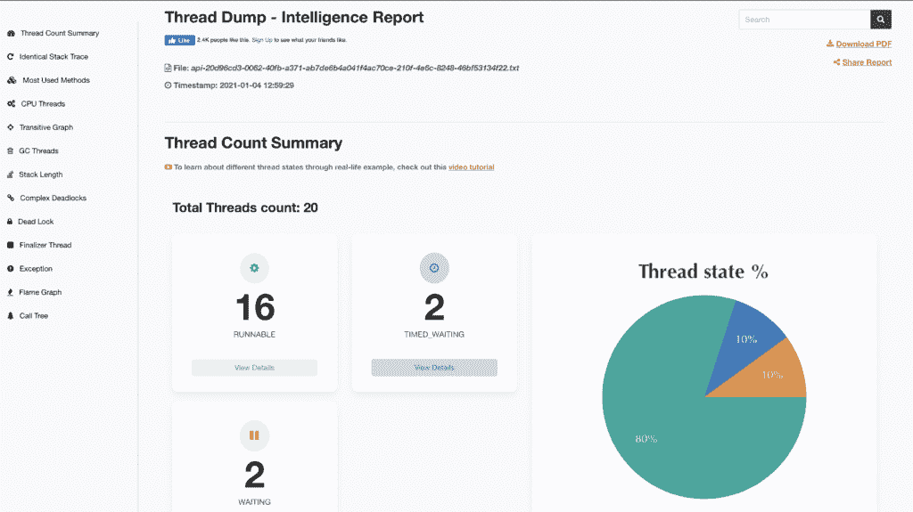
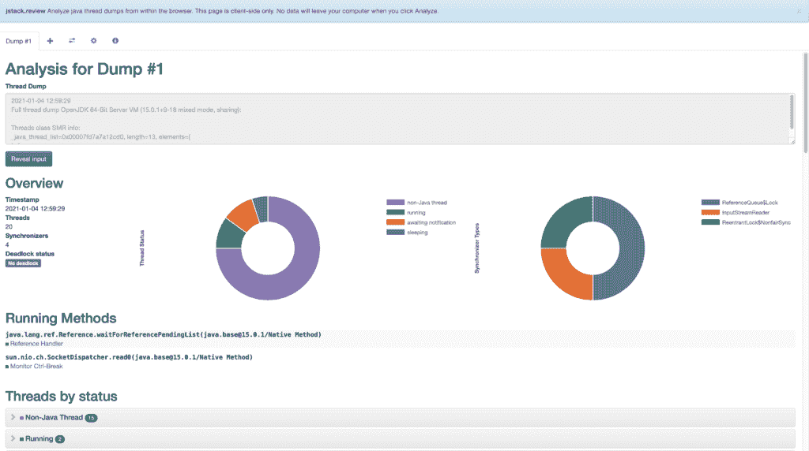
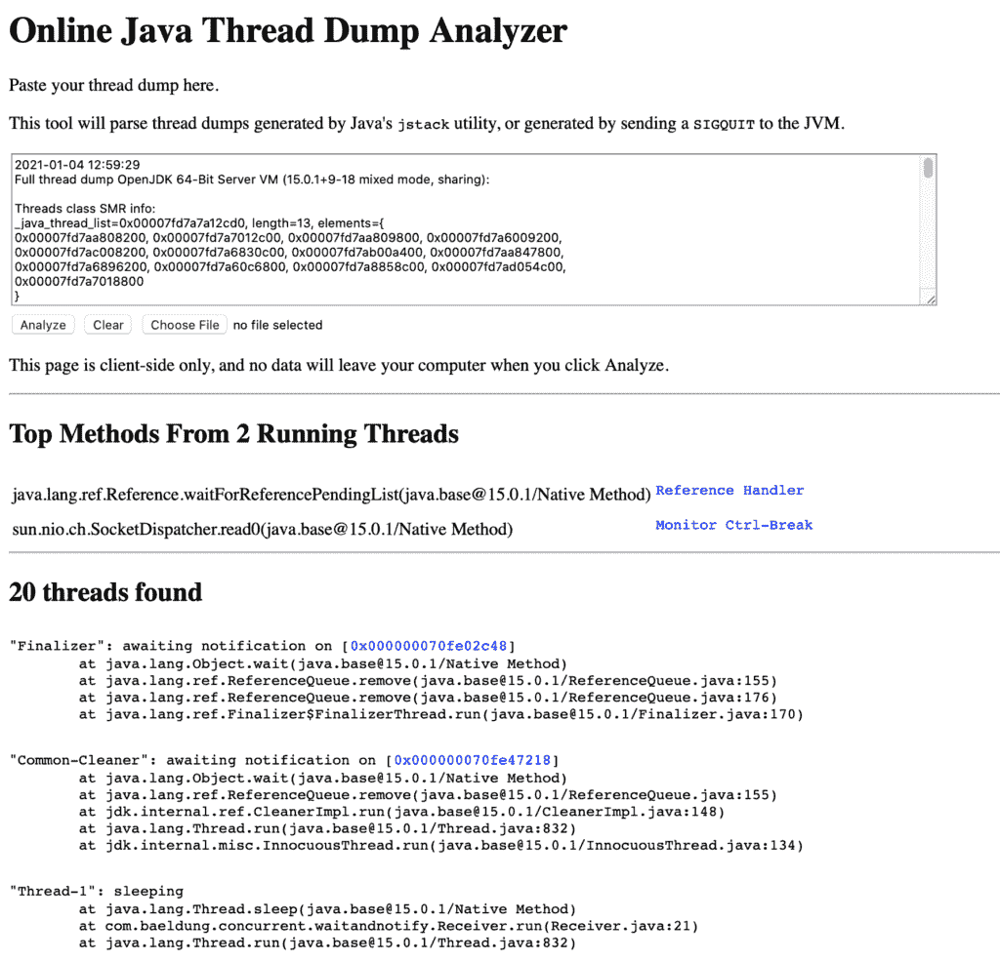
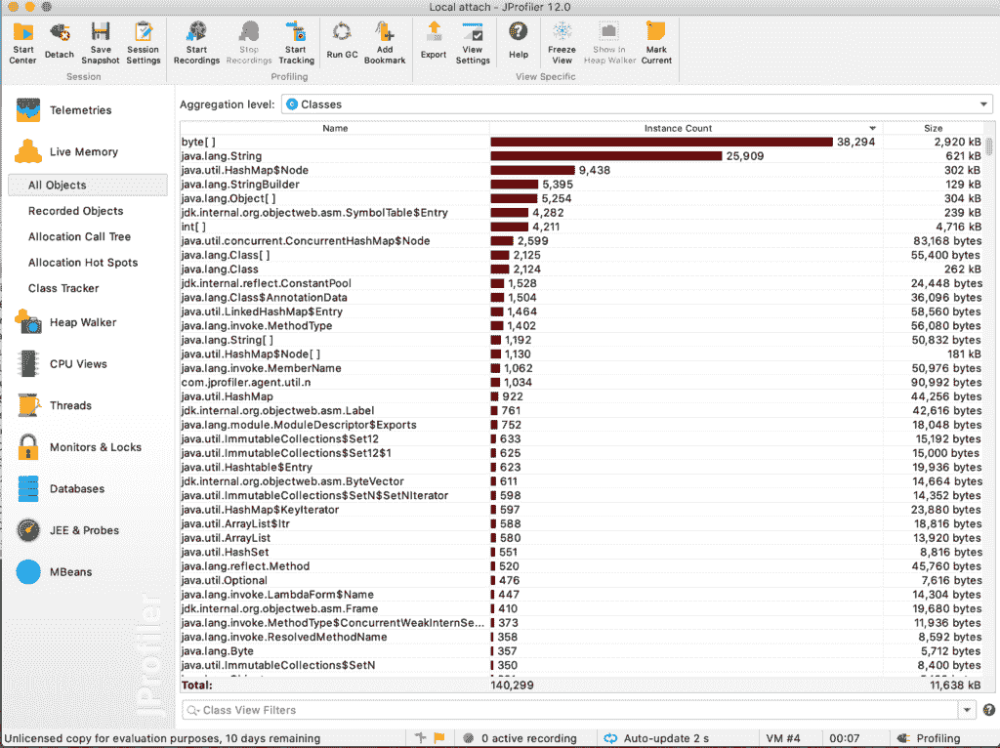
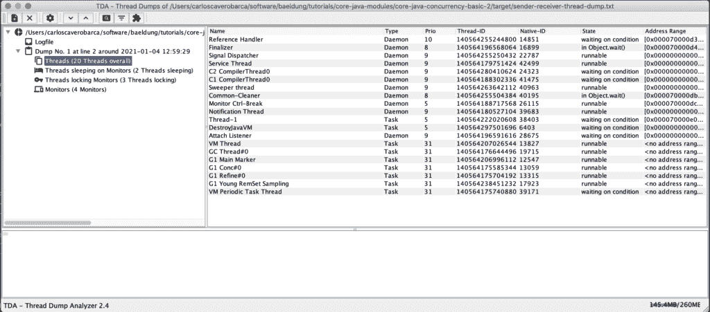
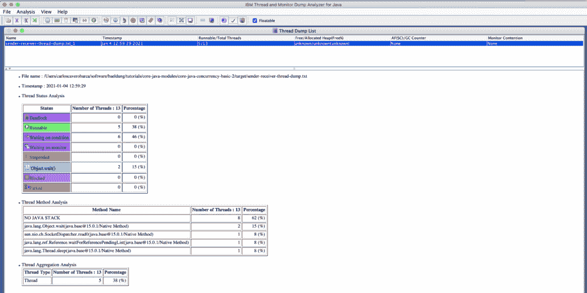

# 如何分析 Java 线程转储

> 原文：<https://web.archive.org/web/20220930061024/https://www.baeldung.com/java-analyze-thread-dumps>

## 1.介绍

应用程序有时会挂起或运行缓慢，确定根本原因并不总是一项简单的任务。**一个** **线程转储** **提供了一个正在运行的 Java 进程的当前状态的快照**。但是，生成的数据包括多个长文件。因此，我们需要分析 Java 线程转储，并在大量不相关的信息中挖掘问题。

在本教程中，我们将了解如何过滤掉这些数据，以便有效地诊断性能问题。此外，我们将学习检测瓶颈，甚至简单的错误。

## 2.JVM 中的线程

JVM 使用线程来执行每个内部和外部操作。众所周知，垃圾收集过程有自己的线程，但是 Java 应用程序内部的任务也会创建自己的线程。

在线程的生命周期中，它会经历各种状态。每个线程都有一个跟踪当前操作的执行堆栈。除此之外，JVM 还存储了之前成功调用的所有方法。因此，可以分析整个堆栈来研究应用程序出错时发生了什么。

为了展示本教程的主题，我们将使用一个简单的 [`Sender-Receiver`应用程序(`NetworkDriver` )](/web/20221010235231/https://www.baeldung.com/java-wait-notify#sender-receiver-synchronization-problem) 作为例子。Java 程序发送和接收数据包，因此我们将能够分析幕后发生的事情。

### 2.1.捕获 Java 线程转储

一旦应用程序开始运行，就有多种方式[生成 Java 线程转储](/web/20221010235231/https://www.baeldung.com/java-thread-dump)用于诊断。在本教程中，我们将使用 JDK7+安装中包含的两个实用程序。首先，我们将执行 [JVM 进程状态(jps)](https://web.archive.org/web/20221010235231/https://docs.oracle.com/en/java/javase/11/tools/jps.html) 命令来发现我们的应用程序的 PID 进程:

```
$ jps 
80661 NetworkDriver
33751 Launcher
80665 Jps
80664 Launcher
57113 Application 
```

其次，我们获取应用程序的 PID，在本例中，是紧挨着`NetworkDriver.` 的那个，然后，我们将使用 [jstack](https://web.archive.org/web/20221010235231/https://docs.oracle.com/en/java/javase/11/tools/jstack.html) 来捕获线程转储。最后，我们将结果存储在一个文本文件中:

```
$ jstack -l 80661 > sender-receiver-thread-dump.txt
```

### 2.2.样本转储的结构

让我们看看生成的线程转储。第一行显示时间戳，而第二行通知 JVM:

```
2021-01-04 12:59:29
Full thread dump OpenJDK 64-Bit Server VM (15.0.1+9-18 mixed mode, sharing):
```

下一节将展示安全内存回收(SMR)和非 JVM 内部线程:

```
Threads class SMR info:
_java_thread_list=0x00007fd7a7a12cd0, length=13, elements={
0x00007fd7aa808200, 0x00007fd7a7012c00, 0x00007fd7aa809800, 0x00007fd7a6009200,
0x00007fd7ac008200, 0x00007fd7a6830c00, 0x00007fd7ab00a400, 0x00007fd7aa847800,
0x00007fd7a6896200, 0x00007fd7a60c6800, 0x00007fd7a8858c00, 0x00007fd7ad054c00,
0x00007fd7a7018800
}
```

然后，转储显示线程列表。每个线程包含以下信息:

*   如果开发者包含一个有意义的线程名，它可以提供有用的信息
*   **优先级** (prior):线程的优先级
*   **Java ID**(tid):JVM 给定的唯一 ID
*   **Native ID** (nid):操作系统给出的唯一 ID，用于提取与 CPU 或内存处理的相关性
*   **状态:**线程的[实际状态](/web/20221010235231/https://www.baeldung.com/java-thread-lifecycle)
*   **堆栈跟踪:**解密我们的应用程序所发生的事情的最重要的信息来源

我们可以从上到下看到不同的线程在拍摄快照时正在做什么。让我们只关注堆栈中等待使用消息的有趣部分:

```
"Monitor Ctrl-Break" #12 daemon prio=5 os_prio=31 cpu=17.42ms elapsed=11.42s tid=0x00007fd7a6896200 nid=0x6603 runnable  [0x000070000dcc5000]
   java.lang.Thread.State: RUNNABLE
	at sun.nio.ch.SocketDispatcher.read0([[email protected]](/web/20221010235231/https://www.baeldung.com/cdn-cgi/l/email-protection)/Native Method)
	at sun.nio.ch.SocketDispatcher.read([[email protected]](/web/20221010235231/https://www.baeldung.com/cdn-cgi/l/email-protection)/SocketDispatcher.java:47)
	at sun.nio.ch.NioSocketImpl.tryRead([[email protected]](/web/20221010235231/https://www.baeldung.com/cdn-cgi/l/email-protection)/NioSocketImpl.java:261)
	at sun.nio.ch.NioSocketImpl.implRead([[email protected]](/web/20221010235231/https://www.baeldung.com/cdn-cgi/l/email-protection)/NioSocketImpl.java:312)
	at sun.nio.ch.NioSocketImpl.read([[email protected]](/web/20221010235231/https://www.baeldung.com/cdn-cgi/l/email-protection)/NioSocketImpl.java:350)
	at sun.nio.ch.NioSocketImpl$1.read([[email protected]](/web/20221010235231/https://www.baeldung.com/cdn-cgi/l/email-protection)/NioSocketImpl.java:803)
	at java.net.Socket$SocketInputStream.read([[email protected]](/web/20221010235231/https://www.baeldung.com/cdn-cgi/l/email-protection)/Socket.java:981)
	at sun.nio.cs.StreamDecoder.readBytes([[email protected]](/web/20221010235231/https://www.baeldung.com/cdn-cgi/l/email-protection)/StreamDecoder.java:297)
	at sun.nio.cs.StreamDecoder.implRead([[email protected]](/web/20221010235231/https://www.baeldung.com/cdn-cgi/l/email-protection)/StreamDecoder.java:339)
	at sun.nio.cs.StreamDecoder.read([[email protected]](/web/20221010235231/https://www.baeldung.com/cdn-cgi/l/email-protection)/StreamDecoder.java:188)
	- locked <0x000000070fc949b0> (a java.io.InputStreamReader)
	at java.io.InputStreamReader.read([[email protected]](/web/20221010235231/https://www.baeldung.com/cdn-cgi/l/email-protection)/InputStreamReader.java:181)
	at java.io.BufferedReader.fill([[email protected]](/web/20221010235231/https://www.baeldung.com/cdn-cgi/l/email-protection)/BufferedReader.java:161)
	at java.io.BufferedReader.readLine([[email protected]](/web/20221010235231/https://www.baeldung.com/cdn-cgi/l/email-protection)/BufferedReader.java:326)
	- locked <0x000000070fc949b0> (a java.io.InputStreamReader)
	at java.io.BufferedReader.readLine([[email protected]](/web/20221010235231/https://www.baeldung.com/cdn-cgi/l/email-protection)/BufferedReader.java:392)
	at com.intellij.rt.execution.application.AppMainV2$1.run(AppMainV2.java:61)

   Locked ownable synchronizers:
	- <0x000000070fc8a668> (a java.util.concurrent.locks.ReentrantLock$NonfairSync)
```

乍一看，我们看到主堆栈跟踪正在执行`java.io.BufferedReader.readLine`，这是预期的行为。如果我们再往下看，我们会看到**所有由我们的应用程序在幕后执行的 JVM 方法**。因此，我们能够通过查看源代码或其他内部 JVM 处理来识别问题的根源。

在转储结束时，我们会注意到有几个**附加线程** **执行后台操作，如垃圾收集(GC)或对象** **终止**:

```
"VM Thread" os_prio=31 cpu=1.85ms elapsed=11.50s tid=0x00007fd7a7a0c170 nid=0x3603 runnable  
"GC Thread#0" os_prio=31 cpu=0.21ms elapsed=11.51s tid=0x00007fd7a5d12990 nid=0x4d03 runnable  
"G1 Main Marker" os_prio=31 cpu=0.06ms elapsed=11.51s tid=0x00007fd7a7a04a90 nid=0x3103 runnable  
"G1 Conc#0" os_prio=31 cpu=0.05ms elapsed=11.51s tid=0x00007fd7a5c10040 nid=0x3303 runnable  
"G1 Refine#0" os_prio=31 cpu=0.06ms elapsed=11.50s tid=0x00007fd7a5c2d080 nid=0x3403 runnable  
"G1 Young RemSet Sampling" os_prio=31 cpu=1.23ms elapsed=11.50s tid=0x00007fd7a9804220 nid=0x4603 runnable  
"VM Periodic Task Thread" os_prio=31 cpu=5.82ms elapsed=11.42s tid=0x00007fd7a5c35fd0 nid=0x9903 waiting on condition
```

最后，转储显示 Java 本地接口(JNI)引用。当内存泄漏发生时，我们应该特别注意这一点，因为它们不会被自动垃圾收集:

```
JNI global refs: 15, weak refs: 0
```

线程转储在结构上非常相似，但是我们想要去掉为我们的用例生成的不重要的数据。另一方面，我们需要从堆栈跟踪产生的大量日志中保存重要信息并对其进行分组。我们来看看怎么做！

## 3.分析线程转储的建议

为了理解我们的应用程序发生了什么，我们需要有效地分析生成的快照。我们将拥有大量的**信息** **，以及转储**时所有线程的精确数据。然而，我们需要整理日志文件，进行一些过滤和分组，以便从堆栈跟踪中提取有用的提示。一旦我们准备好了转储，我们将能够使用不同的工具来分析问题。让我们看看如何破译样本转储的内容。

### 3.1.同步问题

过滤堆栈跟踪的一个有趣技巧是线程的状态。我们将主要**关注** **可运行或阻塞的线程以及最终定时等待的**线程。这些状态将向我们指出两个或更多线程之间的冲突方向:

*   在**死锁** **的情况下，运行的几个线程持有共享对象**上的同步块
*   在**线程争用**、**时，一个**、**线程被阻塞等待其他线程完成。**例如，上一节生成的转储

### 3.2.执行问题

根据经验，**对于异常高的 CPU 使用率，我们只需要查看可运行线程**。我们将使用线程转储和其他命令来获取额外的信息。其中一个命令是`[top](/web/20221010235231/https://www.baeldung.com/linux/top-command) -H -p PID,` ,它显示了在特定进程中哪些线程正在消耗 OS 资源。以防万一，我们还需要查看内部 JVM 线程，比如 GC。另一方面，**当处理性能异常低时**，**我们将查看阻塞的线程。**

在这些情况下，单个转储肯定不足以了解发生了什么。为了比较相同线程在不同时间的堆栈，我们需要间隔很近的多个转储**。一方面，一个快照并不总是足以找出问题的根源。另一方面，我们需要避免快照之间的噪声(太多的信息)。**

 **为了理解线程随时间的演变，**一个推荐的最佳实践是至少进行****3 次转储，每 10 秒进行一次**。另一个有用的技巧是将转储分成小块，以避免加载文件时崩溃。

### 3.3.推荐

为了有效地破解问题的根源，我们需要组织堆栈跟踪中的大量信息。因此，我们将考虑以下建议:

*   在执行问题中，**以 10 秒的间隔捕捉几个快照**将有助于关注实际问题。如果需要的话，还建议拆分文件，以避免加载崩溃
*   创建新线程时使用**命名，以便更好地识别您的源代码**
*   根据问题的不同，**忽略内部 JVM 处理**(例如 GC)
*   **关注** **发出 CPU 或内存使用异常时，长时间运行或阻塞的线程**
*   **通过使用`top -H -p PID`将线程的堆栈与 CPU 处理**相关联
*   最重要的是，**使用分析工具**

手动分析 Java 线程转储可能是一项单调乏味的工作。对于简单的应用程序，可以识别出产生问题的线程。另一方面，对于复杂的情况，我们需要工具来简化这项任务。我们将在接下来的小节中展示如何使用这些工具，使用为示例线程争用生成的转储。

## 4.在线工具

有几个在线工具可用。使用这种软件时，我们需要考虑安全问题。记住**我们可能会与第三方实体**共享日志。

### **4.1。快速线程**

FastThread 可能是为生产环境分析线程转储的最佳在线工具。它提供了一个非常好的图形用户界面。它还包括多种功能，如线程的 CPU 使用率、堆栈长度以及最常用和最复杂的方法:

[](/web/20221010235231/https://www.baeldung.com/wp-content/uploads/2021/01/fast-thread.png)

FastThread 结合了一个 REST API 特性来自动分析线程转储。只需一个简单的 cURL 命令，就可以立即发送结果。主要缺点是安全性，因为 **it** **将堆栈跟踪存储在云中**。

### **4.2。JStack 审查**

JStack Review 是一个在线工具，可以分析浏览器中的转储。它只是客户端的，因此**没有数据存储在你的计算机之外**。从安全角度来看，这是使用它的一个主要优势。它提供了所有线程的图形化概览，显示了正在运行的方法，还按状态对它们进行了分组。JStack Review 将产生堆栈的线程与其他线程分开，这一点非常重要，可以忽略，例如内部进程。最后，它还包括同步器和被忽略的行:

[](/web/20221010235231/https://www.baeldung.com/wp-content/uploads/2021/01/jstack.png)

### **4.3。** **Spotify 在线 Java 线程转储**分析器

[Spotify Online Java Thread Dump Analyser](https://web.archive.org/web/20221010235231/https://spotify.github.io/threaddump-analyzer/)是一款用 JavaScript 编写的在线开源工具。它以纯文本形式显示结果，将有堆栈和没有堆栈的线程分开。它还显示正在运行的线程中排名靠前的方法:

[](/web/20221010235231/https://www.baeldung.com/wp-content/uploads/2021/01/spotify-thread-dump.png)

## 5.独立应用程序

还有几个我们可以在本地使用的独立应用程序。

### **5.1。** JProfiler

JProfiler 是市场上最强大的工具，在 Java 开发人员社区中非常有名。可以用 10 天的试用许可证来测试功能。JProfiler 允许创建概要文件，并将正在运行的应用程序附加到概要文件上。它包括多种功能来现场识别问题，例如 CPU 和内存使用情况以及数据库分析。它还支持与 ide 的集成:

[](/web/20221010235231/https://www.baeldung.com/wp-content/uploads/2021/01/jprofiler.png)

### 5.2。IBM Java 线程监控和转储分析器(TMDA)

IBM TMDA 可以用来识别线程竞争、死锁和瓶颈。它是免费分发和维护的，但 IBM 不提供任何保证或支持:

[](/web/20221010235231/https://www.baeldung.com/wp-content/uploads/2021/01/ibm-thread-monitor.png)

### 5.3。Irockel **线程转储分析器(TDA)**

Irockel TDA 是 LGPL v2.1 许可的独立开源工具。最新版本(v2.4)于 2020 年 8 月发布，因此维护良好。它以树的形式显示线程转储，并提供一些统计数据来简化导航:

[](/web/20221010235231/https://www.baeldung.com/wp-content/uploads/2021/01/irockel-tda.png)

最后，ide 支持线程转储的基本分析，因此可以在开发期间调试应用程序。

## 5.结论

在本文中，我们展示了 Java 线程转储分析如何帮助我们查明同步或执行问题。

最重要的是，我们回顾了如何正确地分析它们，包括组织嵌入在快照中的大量信息的建议。**