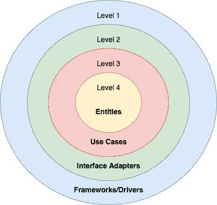
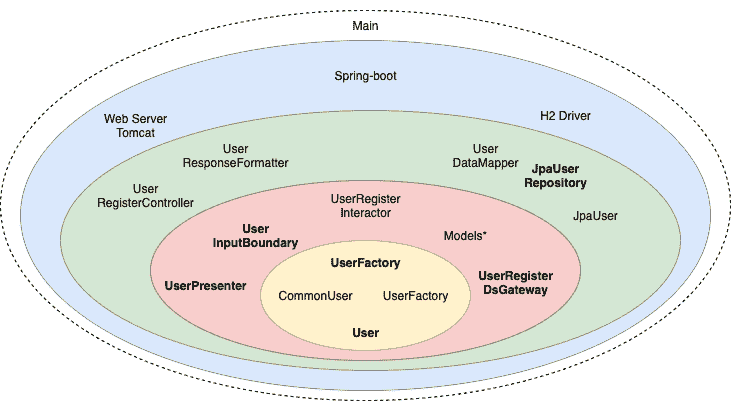

# 用 Spring Boot 清洁建筑

> 原文：<https://web.archive.org/web/20220930061024/https://www.baeldung.com/spring-boot-clean-architecture>

## 1.概观

当我们开发长期系统时，我们应该预料到一个易变的环境。

一般来说，我们的功能需求、框架、I/O 设备，甚至我们的代码设计都可能因为各种原因而改变。考虑到这一点，**干净的架构是高维护性代码的指南，考虑到我们周围的所有不确定性**。

在本文中，我们将创建一个用户注册 API 的例子，它遵循了 Robert C. Martin 的 Clean Architecture。我们将使用他的原始层——实体、用例、接口适配器和框架/驱动程序。

## 2.干净的架构概述

干净的架构编译了许多代码设计和原则，像[](/web/20221128043253/https://www.baeldung.com/solid-principles)[稳定的抽象](https://web.archive.org/web/20221128043253/https://wiki.c2.com/?StableAbstractionsPrinciple)等等。但是，**的核心思想是** **根据业务价值** 对系统进行层级划分。因此，最高级别有业务规则，每个较低的级别离 I/O 设备越来越近。

此外，我们可以将级别转换为层。在这种情况下，情况正好相反。内层等于最高层，依此类推:

[](/web/20221128043253/https://www.baeldung.com/wp-content/uploads/2021/01/user-clean-architecture-layers-1.png)

考虑到这一点，我们可以根据业务需要设置多个级别。但是，始终考虑到 **依赖规则——一个较高的级别决不能依赖于一个较低的级别**。

## 3.规则

让我们开始为用户注册 API 定义系统规则。首先，业务规则:

*   用户密码必须超过五个字符

其次，我们有应用规则。它们可以是不同的格式，如用例或故事。我们将使用一个讲故事的短语:

*   系统接收用户名和密码，验证用户是否存在，并保存新用户及其创建时间

注意这里没有提到任何数据库、用户界面或类似的东西。因为 **我们的业务不关心这些细节**，我们的代码也不应该。

## 4.实体层

正如 clean architecture 所建议的，让我们从我们的业务规则开始:

```
interface User {
    boolean passwordIsValid();

    String getName();

    String getPassword();
}
```

还有，一个`UserFactory`:

```
interface UserFactory {
    User create(String name, String password);
}
```

我们创建了一个用户 [工厂方法](/web/20221128043253/https://www.baeldung.com/creational-design-patterns#factory-method) 因为两个原因。将 [稳定的抽象原则](https://web.archive.org/web/20221128043253/https://wiki.c2.com/?StableAbstractionsPrinciple) 储存起来，以隔离用户创建。

接下来，让我们实现这两者:

```
class CommonUser implements User {

    String name;
    String password;

    @Override
    public boolean passwordIsValid() {
        return password != null && password.length() > 5;
    }

    // Constructor and getters
}
```

```
class CommonUserFactory implements UserFactory {
    @Override
    public User create(String name, String password) {
        return new CommonUser(name, password);
    }
}
```

如果我们有一个复杂的业务，那么我们应该尽可能清晰地构建我们的领域代码。所以，这一层是应用[设计模式](/web/20221128043253/https://www.baeldung.com/design-patterns-series)的好地方。特别是，**[域驱动设计](/web/20221128043253/https://www.baeldung.com/java-modules-ddd-bounded-contexts)要考虑进去。**

### 4.1.单元测试

现在，让我们测试一下我们的`CommonUser`:

```
@Test
void given123Password_whenPasswordIsNotValid_thenIsFalse() {
    User user = new CommonUser("Baeldung", "123");

    assertThat(user.passwordIsValid()).isFalse();
}
```

正如我们所看到的，单元测试非常清晰。毕竟，**没有 mocks 对于这一层**来说是一个很好的信号。

一般来说，如果我们在这里开始考虑 mocks，也许我们正在将我们的实体与用例混合在一起。

## 5.用例层

**用例是与我们系统**的自动化相关的 **规则。在干净的架构中，我们称他们为交互者。**

### 5.1.`UserRegisterInteractor`

首先，我们将构建我们的`UserRegisterInteractor`,这样我们可以看到我们要去哪里。然后，我们将创建并讨论所有用过的零件:

```
class UserRegisterInteractor implements UserInputBoundary {

    final UserRegisterDsGateway userDsGateway;
    final UserPresenter userPresenter;
    final UserFactory userFactory;

    // Constructor

    @Override
    public UserResponseModel create(UserRequestModel requestModel) {
        if (userDsGateway.existsByName(requestModel.getName())) {
            return userPresenter.prepareFailView("User already exists.");
        }
        User user = userFactory.create(requestModel.getName(), requestModel.getPassword());
        if (!user.passwordIsValid()) {
            return userPresenter.prepareFailView("User password must have more than 5 characters.");
        }
        LocalDateTime now = LocalDateTime.now();
        UserDsRequestModel userDsModel = new UserDsRequestModel(user.getName(), user.getPassword(), now);

        userDsGateway.save(userDsModel);

        UserResponseModel accountResponseModel = new UserResponseModel(user.getName(), now.toString());
        return userPresenter.prepareSuccessView(accountResponseModel);
    }
}
```

正如我们所见，我们正在完成所有的用例步骤。还有，**这一层负责控制实体的舞蹈。尽管如此，我们并没有对 UI 或数据库的工作方式做任何假设。** 但是，我们用的是`UserDsGateway`和`UserPresenter`。那么，我们怎么能不认识他们呢？因为，连同`UserInputBoundary`，这些是我们的输入和输出边界。

### 5.2.输入和输出边界

边界是定义组件如何交互的契约。****输入边界将我们的用例暴露给外层:****

```
interface UserInputBoundary {
    UserResponseModel create(UserRequestModel requestModel);
}
```

接下来，我们有了利用外层的**输出边界。首先，让我们定义数据源网关:**

```
interface UserRegisterDsGateway {
    boolean existsByName(String name);

    void save(UserDsRequestModel requestModel);
}
```

二、视图演示者:

```
interface UserPresenter {
    UserResponseModel prepareSuccessView(UserResponseModel user);

    UserResponseModel prepareFailView(String error);
} 
```

注意**我们正在使用** **[依赖倒置原则](/web/20221128043253/https://www.baeldung.com/java-dependency-inversion-principle)来使我们的业务从数据库和 ui**等细节中解放出来。

### 5.3.去耦模式

在继续之前，**注意** **边界是如何定义系统** 的自然划分的契约。但是我们还必须决定我们的应用程序将如何交付:

*   整体式——可能使用某种包装结构来组织
*   通过使用模块
*   通过使用服务/微服务

考虑到这一点，**我们可以用任何解耦模式****达到干净的架构目标。因此，**我们应该准备根据我们当前和未来的业务需求在这些策略之间进行转换**。在选择了我们的解耦模式之后，代码划分应该基于我们的边界发生。**

### 5.4.请求和响应模型

到目前为止，我们已经使用接口创建了跨层的操作。接下来，让我们看看如何跨越这些边界传输数据。

注意我们所有的边界是如何只处理`String`或`Model`对象的:

```
class UserRequestModel {

    String login;
    String password;

    // Getters, setters, and constructors
}
```

**基本上只有** **简单的数据结构可以跨越** 的界限。同样，所有的`Models`都只有字段和访问器。另外，数据对象属于内侧。所以，我们可以保持依赖规则。

但是为什么我们会有这么多相似的物体呢？当我们得到重复的代码时，它可以是两种类型:

*   错误或偶然的重复——代码相似是偶然的，因为每个对象都有不同的改变原因。如果我们试图移除它，我们将冒着违反 [单一责任原则](/web/20221128043253/https://www.baeldung.com/java-single-responsibility-principle) 的风险。
*   真正的重复——代码因同样的原因而改变。因此，我们应该删除它

由于每个模型有不同的职责，我们得到了所有这些对象。

### 5.5.测试`UserRegisterInteractor`

现在，让我们创建我们的单元测试:

```
@Test
void givenBaeldungUserAnd12345Password_whenCreate_thenSaveItAndPrepareSuccessView() {
    given(userDsGateway.existsByIdentifier("identifier"))
        .willReturn(true);

    interactor.create(new UserRequestModel("baeldung", "123"));

    then(userDsGateway).should()
        .save(new UserDsRequestModel("baeldung", "12345", now()));
    then(userPresenter).should()
        .prepareSuccessView(new UserResponseModel("baeldung", now()));
}
```

正如我们所看到的，大多数用例测试是关于控制实体和边界请求的。而且，我们的界面允许我们轻松地模仿细节。

## 6.接口适配器

至此，我们完成了所有的业务。现在，让我们开始插入我们的细节。

**我们的业务应该只处理对 it 最方便的数据格式，**我们的外部代理也应该如此，如 DBs 或 ui。**但是，这种格式通常是不同的**。为此，**接口适配器层负责转换数据**。

### 6.1.`UserRegisterDsGateway`使用 JPA

首先，让我们用 [`JPA`](/web/20221128043253/https://www.baeldung.com/the-persistence-layer-with-spring-and-jpa) 来映射我们的`user`表:

```
@Entity
@Table(name = "user")
class UserDataMapper {

    @Id
    String name;

    String password;

    LocalDateTime creationTime;

    //Getters, setters, and constructors
}
```

正如我们所见，`Mapper`的目标是将我们的对象映射到数据库格式。

接下来，`JpaRepository`使用我们的[实体](/web/20221128043253/https://www.baeldung.com/jpa-entities):

```
@Repository
interface JpaUserRepository extends JpaRepository<UserDataMapper, String> {
}
```

假设我们将使用 spring-boot，那么这就是保存用户所需要的全部。

现在，是时候实施我们的`UserRegisterDsGateway:`

```
class JpaUser implements UserRegisterDsGateway {

    final JpaUserRepository repository;

    // Constructor

    @Override
    public boolean existsByName(String name) {
        return repository.existsById(name);
    }

    @Override
    public void save(UserDsRequestModel requestModel) {
        UserDataMapper accountDataMapper = new UserDataMapper(requestModel.getName(), requestModel.getPassword(), requestModel.getCreationTime());
        repository.save(accountDataMapper);
    }
}
```

在大多数情况下，代码是不言自明的。除了我们的方法之外，还要注意 `UserRegisterDsGateway's` 的名称。如果我们选择了`UserDsGateway`来代替，那么其他`User`用例将会违反 [**接口分离原则**](/web/20221128043253/https://www.baeldung.com/java-interface-segregation) 。

### 6.2.`User`注册 API

现在，让我们创建 HTTP 适配器:

```
@RestController
class UserRegisterController {

    final UserInputBoundary userInput;

    // Constructor

    @PostMapping("/user")
    UserResponseModel create(@RequestBody UserRequestModel requestModel) {
        return userInput.create(requestModel);
    }
}
```

正如我们所见，**的唯一目标是接收请求并向客户端发送响应**。

### 6.3.准备响应

在回应之前，我们应该格式化我们的回应:

```
class UserResponseFormatter implements UserPresenter {

    @Override
    public UserResponseModel prepareSuccessView(UserResponseModel response) {
        LocalDateTime responseTime = LocalDateTime.parse(response.getCreationTime());
        response.setCreationTime(responseTime.format(DateTimeFormatter.ofPattern("hh:mm:ss")));
        return response;
    }

    @Override
    public UserResponseModel prepareFailView(String error) {
        throw new ResponseStatusException(HttpStatus.CONFLICT, error);
    }
}
```

我们的 `UserRegisterInteractor` 迫使我们创造了一个展示者。尽管如此，表示规则只涉及适配器内部。此外， **w** **凡是很难测试的东西，我们都应该把它分为可测试的和不可测试的。** 所以， `UserResponseFormatter` 很容易让我们验证我们的呈现规则:

```
@Test
void givenDateAnd3HourTime_whenPrepareSuccessView_thenReturnOnly3HourTime() {
    UserResponseModel modelResponse = new UserResponseModel("baeldung", "2020-12-20T03:00:00.000");
    UserResponseModel formattedResponse = userResponseFormatter.prepareSuccessView(modelResponse);

    assertThat(formattedResponse.getCreationTime()).isEqualTo("03:00:00");
}
```

如我们所见，在将逻辑发送到视图之前，我们测试了所有的逻辑。因此，**只有卑微的物体在不可测试的部分**。

## 7.驱动因素和框架

事实上，我们通常不在这里编码。这是因为该层**代表与外部代理**的最低级别连接。例如，连接数据库或 web 框架的 H2 驱动程序。在这里，**我们将使用 [spring-boot](/web/20221128043253/https://www.baeldung.com/spring-boot) 作为 [web](/web/20221128043253/https://www.baeldung.com/bootstraping-a-web-application-with-spring-and-java-based-configuration) 和[依赖注入](/web/20221128043253/https://www.baeldung.com/spring-dependency-injection)框架**。所以，我们需要它的启动点:

```
@SpringBootApplication
public class CleanArchitectureApplication {
    public static void main(String[] args) {
      SpringApplication.run(CleanArchitectureApplication.class);
    }
}
```

**直到现在，我们都没有在业务中使用任何** **[弹簧标注](/web/20221128043253/https://www.baeldung.com/spring-bean-annotations)** **。除了弹簧专用适配器**，作为我们的 `UserRegisterController` 。这是**因为** **我们应该** **把弹簧靴当成其他任何细节** 。

## 8.可怕的主阶级

最后，最后一块！

到目前为止，我们遵循了[稳定抽象原则](https://web.archive.org/web/20221128043253/https://wiki.c2.com/?StableAbstractionsPrinciple)。 同样，我们用 [控制反转](/web/20221128043253/https://www.baeldung.com/inversion-control-and-dependency-injection-in-spring) 保护我们的内层免受外部代理的侵害。最后，我们将所有对象的创建和使用分离开来。此时，由我们来 **创建我们剩余的依赖项，并将它们注入我们的项目** :

```
@Bean
BeanFactoryPostProcessor beanFactoryPostProcessor(ApplicationContext beanRegistry) {
    return beanFactory -> {
        genericApplicationContext(
          (BeanDefinitionRegistry) ((AnnotationConfigServletWebServerApplicationContext) beanRegistry)
            .getBeanFactory());
    };
}

void genericApplicationContext(BeanDefinitionRegistry beanRegistry) {
    ClassPathBeanDefinitionScanner beanDefinitionScanner = new ClassPathBeanDefinitionScanner(beanRegistry);
    beanDefinitionScanner.addIncludeFilter(removeModelAndEntitiesFilter());
    beanDefinitionScanner.scan("com.baeldung.pattern.cleanarchitecture");
}

static TypeFilter removeModelAndEntitiesFilter() {
    return (MetadataReader mr, MetadataReaderFactory mrf) -> !mr.getClassMetadata()
      .getClassName()
      .endsWith("Model");
}
```

在我们的例子中，我们使用 spring-boot [依赖注入](/web/20221128043253/https://www.baeldung.com/spring-dependency-injection) 来创建我们所有的实例。由于我们没有使用 [`@Component`](/web/20221128043253/https://www.baeldung.com/spring-bean-annotations#component) ，我们扫描了我们的根包，只忽略了`Model` 对象 。

尽管这个策略看起来更复杂，但它将我们的业务从 DI 框架中分离出来。另一方面，**主类获得了对我们整个系统**的控制权。这就是为什么 clean architecture 认为它是一个包含所有其他层的特殊层:

[](/web/20221128043253/https://www.baeldung.com/wp-content/uploads/2021/01/user-clean-architecture-layers.png)

## 9.结论

在本文中，我们了解了 Bob 叔叔的 **干净的架构是如何建立在许多设计模式和原则** 之上的。此外，我们使用 Spring Boot 创建了一个应用它的用例。

尽管如此，我们还是抛开了一些原则。但是，它们都指向同一个方向。我们可以引用它的创造者的话来概括:“一个好的建筑师 **必须最大化未做出的决定** 。”，我们通过 **使用边界** 从细节上保护我们的业务代码。

像往常一样，完整的代码可以在 GitHub 的[上找到。](https://web.archive.org/web/20221128043253/https://github.com/eugenp/tutorials/tree/master/patterns-modules/clean-architecture)**