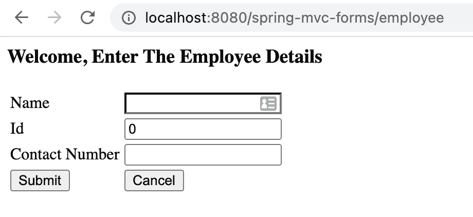
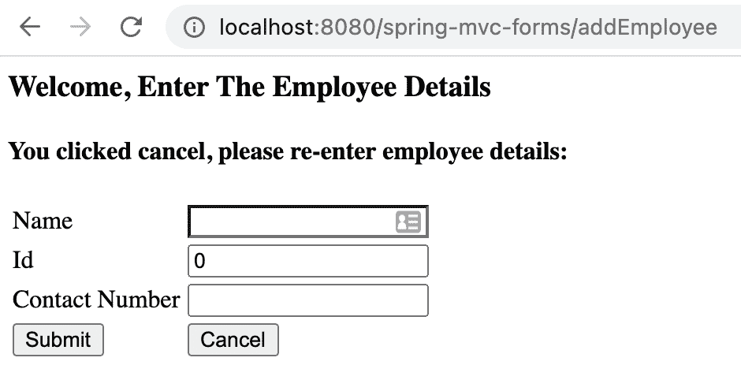
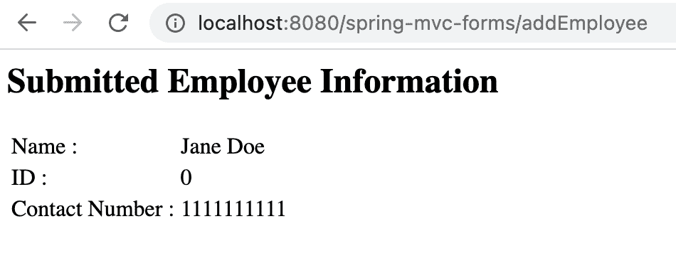

# 表单上的多个提交按钮

> 原文:[https://web . archive . org/web/20220930061024/https://www . bael dung . com/spring-form-multiple-submit-buttons](https://web.archive.org/web/20220930061024/https://www.baeldung.com/spring-form-multiple-submit-buttons)

## 1.概观

在这个快速教程中，**我们将在[的基础上构建 Spring MVC](/web/20220525133819/https://www.baeldung.com/spring-mvc-form-tutorial) 中的表单入门，并在 JSP 表单**中再添加一个按钮，映射到同一个 URI。

## 2.简短回顾

之前，我们创建了一个小的 web 应用程序来输入员工的详细信息并保存在内存中。

首先，我们编写了一个模型 [`Employee`](/web/20220525133819/https://www.baeldung.com/spring-mvc-form-tutorial#the-model) 来绑定实体，然后是一个 [`EmployeeController`](/web/20220525133819/https://www.baeldung.com/spring-mvc-form-tutorial#the-controller) 来处理流程和映射，最后是一个名为 [`employeeHome`](/web/20220525133819/https://www.baeldung.com/spring-mvc-form-tutorial#the-view) 的视图，它描述了用户键入输入值的表单。

该表单有一个按钮`Submit`，它映射到控制器的 [`RequestMapping`](/web/20220525133819/https://www.baeldung.com/spring-requestmapping) ，称为`addEmployee`，使用该模型将用户输入的细节添加到内存数据库中。

在接下来的几节中，**我们将看到如何添加另一个按钮，`Cancel,`到控制器**中具有相同`RequestMapping`路径的同一个表单中。

## 3.表单

首先，让我们向表单`employeeHome.jsp`添加一个新按钮:

```
<%@ taglib prefix="form" uri="http://www.springframework.org/tags/form"%>
...
<body>
    <h3>Welcome, Enter The Employee Details</h3>
    <h4>${message}</h4>
    <form:form method="POST" action="${pageContext.request.contextPath}/addEmployee" 
      modelAttribute="employee">
        <table>
            ...
            <tr>
                <td><input type="submit" name="submit" value="Submit" /></td>
                <td><input type="submit" name="cancel" value="Cancel" /></td>
            </tr>
...
```

正如我们所看到的，**我们在现有的`Submit` 按钮上添加了一个属性`name`，并添加了另一个`Cancel`按钮，将`name`设置为`cancel`** 。

我们还在页面顶部添加了一个模型属性`message` ，当点击`Cancel`时就会显示出来。

## 4.控制器

接下来，让我们修改[控制器](/web/20220525133819/https://www.baeldung.com/spring-controller-vs-restcontroller)，为`RequestMapping`添加一个新属性`param`，以区分两次按钮点击:

```
@RequestMapping(value = "/addEmployee", method = RequestMethod.POST, params = "submit")
public String submit(@Valid @ModelAttribute("employee") final Employee employee, 
  final BindingResult result, final ModelMap model) {
        // same code as before
}
@RequestMapping(value = "/addEmployee", method = RequestMethod.POST, params = "cancel")
public String cancel(@Valid @ModelAttribute("employee") final Employee employee, 
  final BindingResult result, final ModelMap model) {
    model.addAttribute("message", "You clicked cancel, please re-enter employee details:");
    return "employeeHome";
}
```

这里，**我们在现有的** `**submit**.`方法中增加了一个新的参数`params`，值得注意的是，其值与表格中指定的`name`相同。

然后我们添加了另一个具有相似签名的方法`cancel`，唯一的区别是参数`params`被指定为`cancel`。和以前一样，这与 JSP 表单中按钮`Cancel`的`name`值完全相同。

## 5.测试

为了进行测试，我们将在一个 web 容器(比如 Tomcat)上部署项目。

点击网址`[http://localhost:8080/spring-mvc-forms/employee](https://web.archive.org/web/20220525133819/http://localhost:8080/spring-mvc-forms/employee),`，我们将看到:

[](/web/20220525133819/https://www.baeldung.com/wp-content/uploads/2021/02/Multiple-Button-Form_.png)

点击`Cancel`后，我们会看到:

[](/web/20220525133819/https://www.baeldung.com/wp-content/uploads/2021/02/Cancel-Clicked-1.png)

在这里，我们看到我们在控制器的方法`cancel`中编码的消息。

点击`Submit`，我们看到键入的员工信息[和之前的](/web/20220525133819/https://www.baeldung.com/spring-mvc-form-tutorial#testing-the-application)一样:

[](/web/20220525133819/https://www.baeldung.com/wp-content/uploads/2021/02/Submit-Clicked-1.png)

## 6.结论

在本教程中，我们学习了如何在一个 [Spring MVC](/web/20220525133819/https://www.baeldung.com/category/spring-mvc/) 应用程序的同一个表单中添加另一个按钮，该按钮映射到控制器上的同一个`RequestMapping`。

如果需要的话，我们可以使用代码片段中展示的相同技术**添加更多按钮。**

和往常一样，源代码可以在 GitHub 上的[处获得。](https://web.archive.org/web/20220525133819/https://github.com/eugenp/tutorials/tree/master/spring-web-modules/spring-mvc-forms-jsp)