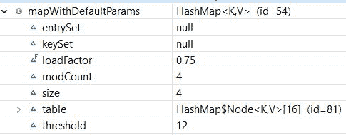

# Java HashMap 加载因子

> 原文:[https://web . archive . org/web/20220930061024/https://www . bael dung . com/Java-hashmap-load-factor](https://web.archive.org/web/20220930061024/https://www.baeldung.com/java-hashmap-load-factor)

## 1.概观

在本文中，我们将看到 Java 的`HashMap`中加载因子的重要性，以及它如何影响 map 的性能。

## 2.什么是`HashMap`？

`[HashMap](/web/20220707143819/https://www.baeldung.com/java-hashmap)`类属于 Java 集合框架，提供了`Map`接口的基本实现。当我们想以键值对的形式存储数据时，可以使用它。这些键值对被称为映射条目，由`Map.Entry`类表示。

## 3.`HashMap`内部构件

在讨论负载系数之前，让我们先回顾几个术语:

`HashMap`的工作原理是**哈希——一种将对象数据映射到某个有代表性的整数值**的算法。散列函数被应用于键对象，以计算桶的索引，从而存储和检索任何键-值对。

**容量是`HashMap`中的桶数。**初始容量是创建`M` *ap* 时的容量。最后，`HashMap`的默认初始容量是 16。

随着`HashMap`中元素数量的增加，容量也随之扩大。**负载系数是决定何时增加`Map`容量的指标。**默认负载系数为容量的 75%。

**a`HashMap`的阈值大约是当前容量和负载系数的乘积。**重新散列是重新计算已经存储的条目的散列码的过程。简单地说，当哈希表中条目的数量超过阈值时，`Map`将被重新哈希，这样它的存储桶数量大约是以前的两倍。

当散列函数为两个不同的关键字返回相同的桶位置时，就会发生冲突。

让我们创建我们的`HashMap`:

```
Map<String, String> mapWithDefaultParams = new HashMap<>();
mapWithDefaultParams.put("1", "one");
mapWithDefaultParams.put("2", "two");
mapWithDefaultParams.put("3", "three");
mapWithDefaultParams.put("4", "four"); 
```

下面是我们的`Map`的结构:

[](/web/20220707143819/https://www.baeldung.com/wp-content/uploads/2021/02/HashMapwithDefaultParams-1.jpg)

正如我们所看到的，我们的`HashMap`是用默认初始容量(16)和默认负载系数(0.75)创建的。同样，阈值是 16 * 0.75 = 12，这意味着在添加第 12 个条目(键-值-对)后，它将把容量从 16 增加到 32。

## 4.定制初始容量和负载系数

在上一节中，我们用默认的构造函数创建了我们的`HashMap`。在接下来的小节中，我们将看到如何创建一个`HashMap` 来将初始容量和负载因子传递给构造函数。

### 4.1.具有初始容量

首先，让我们用初始容量创建一个`Map`:

```
Map<String, String> mapWithInitialCapacity = new HashMap<>(5); 
```

它将创建一个具有初始容量(5)和默认装载系数(0.75)的空`Map`。

### 4.2.初始容量和负载系数

类似地，我们可以使用初始容量和负载系数来创建我们的`Map`:

```
Map<String, String> mapWithInitialCapacityAndLF = new HashMap<>(5, 0.5f); 
```

这里，它将创建一个空的`Map`，初始容量为 5，装载系数为 0.5。

## 5.表演

尽管我们可以灵活选择初始容量和负载系数，但我们需要明智地选择它们。这两者都影响了`Map`的性能。让我们深入了解这些参数与性能的关系。

### 5.1.复杂性

众所周知，`HashMap`在内部使用哈希代码作为存储键值对的基础。如果`hashCode()`方法写得很好，`HashMap`将把项目分布到所有的桶中。因此， **`HashMap`以恒定的时间`O(1)`** 存储和检索条目。

但是，当项目数量增加而存储桶大小固定时，问题就出现了。它将在每个桶中有更多的项目，并将扰乱时间复杂度。

解决方案是，当项目数量增加时，我们可以增加存储桶的数量。然后，我们可以在所有存储桶中重新分配项目。这样，我们将能够在每个桶中保持恒定数量的项目，并保持`O(1)`的时间复杂度。

**在这里，负载系数帮助我们决定何时增加桶的数量**。随着装载系数的降低，将会有更多的空闲桶，从而减少碰撞的机会。这将帮助我们为`Map`取得更好的业绩。因此，**我们需要保持较低的负载系数来实现较低的时间复杂度**。

一个`HashMap`通常具有空间复杂度`O(n)`，其中`n`是条目的数量。**较高的加载因子值减少了空间开销，但增加了查找成本**。

### 5.2.重散列

当`Map`中的项目数量超过阈值限制时，`Map`的容量加倍。如前所述，当容量增加时，我们需要将所有条目(包括现有条目和新条目)平均分布在所有存储桶中。在这里，我们需要重新散列。也就是说，对于每个现有的键值对，使用增加的容量作为参数再次计算哈希代码。

**基本上，当负载系数增加时，复杂度增加。进行再散列是为了保持所有操作的低负载系数和低复杂性。**

让我们初始化我们的`Map`:

```
Map<String, String> mapWithInitialCapacityAndLF = new HashMap<>(5,0.75f);
mapWithInitialCapacityAndLF.put("1", "one");
mapWithInitialCapacityAndLF.put("2", "two");
mapWithInitialCapacityAndLF.put("3", "three");
mapWithInitialCapacityAndLF.put("4", "four");
mapWithInitialCapacityAndLF.put("5", "five");
```

而且让我们来看看`Map`的结构:

[](/web/20220707143819/https://www.baeldung.com/wp-content/uploads/2021/02/HashMap_before-1.jpg)

现在，让我们添加更多的条目到我们的`Map`:

```
mapWithInitialCapacityAndLF.put("6", "Six");
mapWithInitialCapacityAndLF.put("7", "Seven");
//.. more entries
mapWithInitialCapacityAndLF.put("15", "fifteen");
```

让我们再次观察我们的`Map`结构:

[](/web/20220707143819/https://www.baeldung.com/wp-content/uploads/2021/02/HashMap_after-1.jpg)

尽管重新散列有助于保持低复杂性，但这是一个昂贵的过程。如果我们需要存储大量的数据，我们应该创建具有足够容量的`HashMap`。这比自动重散列更有效。

### 5.3.冲突

**由于糟糕的哈希码算法**可能会发生冲突，并且通常会降低`Map`的性能。

在 Java 8 之前，Java 中的`HashMap`通过使用 [`LinkedList`](/web/20220707143819/https://www.baeldung.com/java-linkedlist) 存储映射条目来处理冲突。如果一个键出现在已经存在另一个条目的同一个桶中，它将被添加到`LinkedList`的开头。在最坏的情况下，这将增加复杂性到`O(n)`。

为了避免这个问题，Java 8 和更高版本使用平衡树(也称为[红黑树](/web/20220707143819/https://www.baeldung.com/cs/red-black-trees))代替`LinkedList`来存储冲突条目。这提高了从`O(n)`到`O(log n)`的`HashMap`的最坏情况性能。

`HashMap`最初使用`LinkedList.` ,然后当条目数量超过某个阈值时，它会用平衡二叉树替换`LinkedList`。`TREEIFY_THRESHOLD`常数决定该阈值。目前，这个值是 8，这意味着如果在同一个桶中有超过 8 个元素，`Map`将使用一棵树来保存它们。

## 6.结论

在本文中，我们讨论了最流行的数据结构之一:`HashMap`。我们还看到了负载系数和容量如何影响其性能。

和往常一样，本文的代码示例可以在 GitHub 的[上找到。](https://web.archive.org/web/20220707143819/https://github.com/eugenp/tutorials/tree/master/core-java-modules/core-java-collections-maps-3)