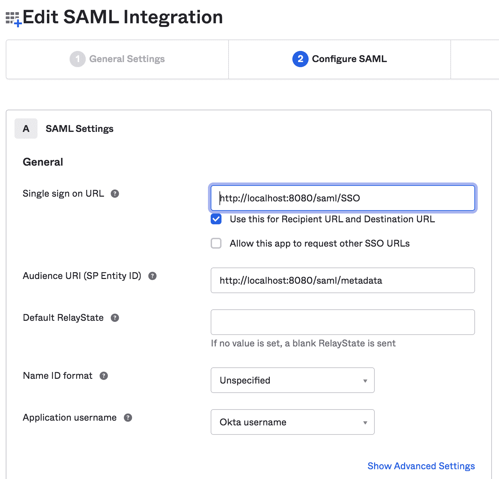
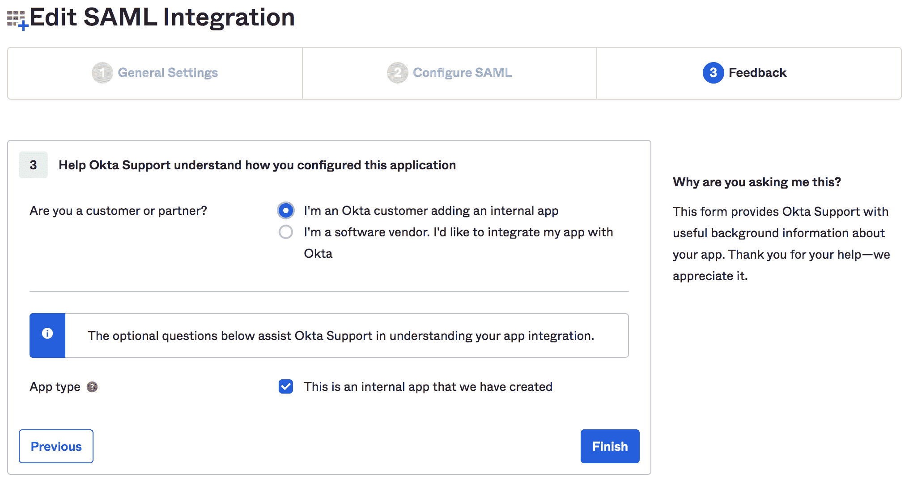
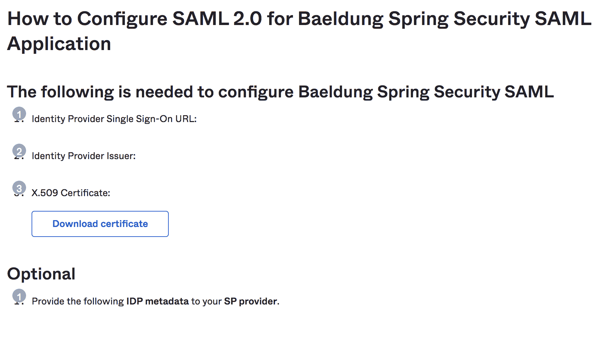
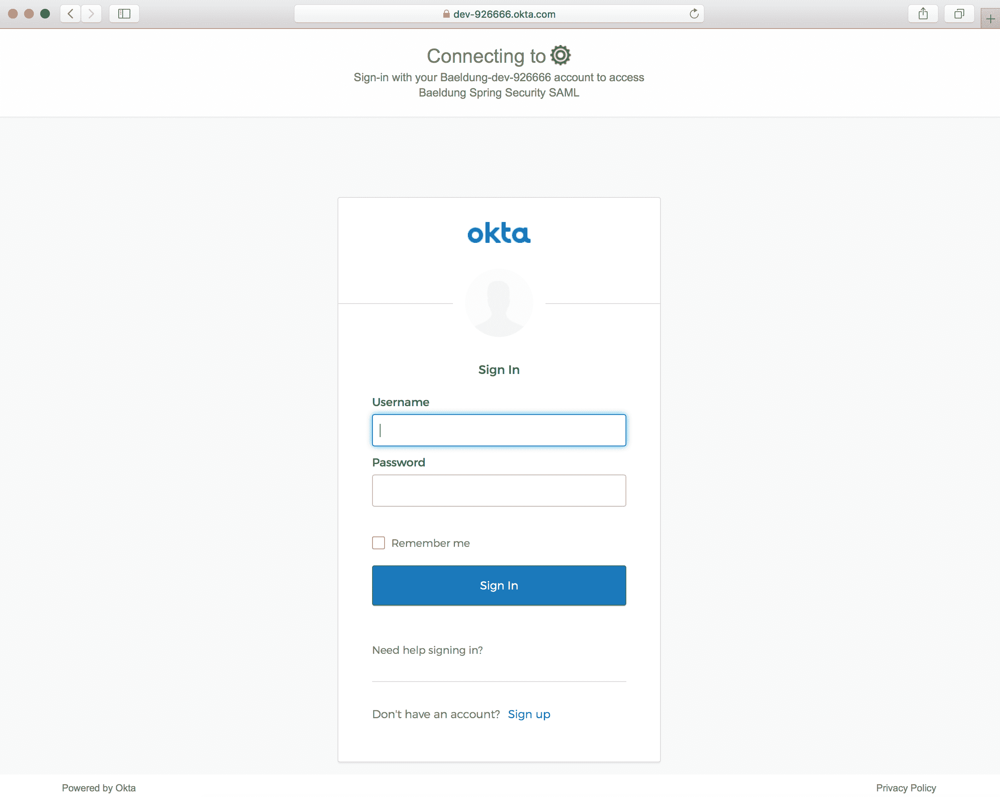

# Spring 安全的 SAML 指南

> 原文：<https://web.archive.org/web/20220930061024/https://www.baeldung.com/spring-security-saml>

## 1.概观

在本教程中，我们将使用 [Okta 作为身份提供者(IdP)](/web/20220630005925/https://www.baeldung.com/spring-security-okta) 来探索 [Spring Security SAML](https://web.archive.org/web/20220630005925/https://spring.io/projects/spring-security-saml) 。

## 2.什么是 SAML？

**安全断言标记语言( [SAML](/web/20220630005925/https://www.baeldung.com/cs/saml-introduction) )是一种开放标准，允许 IdP 安全地将用户的认证和授权细节发送给服务提供商(SP)** 。它使用基于 XML 的消息在 IdP 和 SP 之间进行通信。

换句话说，当用户试图访问服务时，他需要使用 IdP 登录。登录后，**IdP 将带有 XML 格式的授权和认证细节的 SAML 属性发送给 SP。**

除了提供安全的身份验证传输机制， **SAML 还促进了单点登录(SSO)** ，允许用户登录一次，然后使用相同的凭证登录其他服务提供商。

## 3.安装教程

首先，作为前提条件，我们应该[建立一个 Okta 开发者账号](/web/20220630005925/https://www.baeldung.com/spring-security-okta#developerAccountSignUp)。

### 3.1.创建新应用程序

然后，我们将创建一个新的支持 SAML 2.0 的 Web 应用程序集成:

[](/web/20220630005925/https://www.baeldung.com/wp-content/uploads/2021/03/Screen-Shot-2021-02-19-at-4.00.09-PM.png)

接下来，我们将填写应用名称和应用徽标等一般信息:

[](/web/20220630005925/https://www.baeldung.com/wp-content/uploads/2021/03/Screen-Shot-2021-02-19-at-4.02.25-PM.png)

### 3.2.编辑 SAML 集成

在这一步中，我们将提供 SAML 设置，如 SSO URL 和受众 URI:

[](/web/20220630005925/https://www.baeldung.com/wp-content/uploads/2021/03/Screen-Shot-2021-02-19-at-4.04.10-PM.png)

最后，我们可以提供关于我们整合的反馈:

[](/web/20220630005925/https://www.baeldung.com/wp-content/uploads/2021/03/Screen-Shot-2021-02-19-at-4.04.29-PM.png)

### 3.3.查看安装说明

完成后，我们可以查看 Spring Boot 应用程序的设置说明:

[](/web/20220630005925/https://www.baeldung.com/wp-content/uploads/2021/03/Screen-Shot-2021-02-19-at-4.04.56-PM.png)

注意:我们应该复制像 IdP 发行者 URL 和 IdP 元数据 XML 这样的指令，这些指令将在 Spring 安全配置中进一步用到:

[](/web/20220630005925/https://www.baeldung.com/wp-content/uploads/2021/03/Screen-Shot-2021-02-19-at-4.06.33-PM.png)

## 4.Spring Boot 设置

除了通常的 Maven 依赖项，如 [`spring-boot-starter-web`](https://web.archive.org/web/20220630005925/https://search.maven.org/search?q=g:org.springframework.boot%20a:spring-boot-starter-web) 和`[spring-boot-starter-security](https://web.archive.org/web/20220630005925/https://search.maven.org/search?q=g:org.springframework.boot%20a:spring-boot-starter-security),`，我们将需要`[spring-security-saml2-core](https://web.archive.org/web/20220630005925/https://search.maven.org/search?q=g:org.springframework.security.extensions%20a:spring-security-saml2-core)`依赖项:

```
<dependency>
    <groupId>org.springframework.boot</groupId>
    <artifactId>spring-boot-starter-web</artifactId>
    <version>2.6.1</version>
</dependency>
<dependency>
    <groupId>org.springframework.boot</groupId>
    <artifactId>spring-boot-starter-security</artifactId>
    <version>2.6.1</version>
</dependency>
<dependency>
    <groupId>org.springframework.security.extensions</groupId>
    <artifactId>spring-security-saml2-core</artifactId>
    <version>1.0.10.RELEASE</version>
</dependency>
```

另外，确保**添加 [`Shibboleth`库](https://web.archive.org/web/20220630005925/https://build.shibboleth.net/nexus/content/repositories/releases/)来下载`spring-security-saml2-core` 依赖项所需的最新`opensaml` jar** :

```
<repository>
    <id>Shibboleth</id>
    <name>Shibboleth</name>
    <url>https://build.shibboleth.net/nexus/content/repositories/releases/</url>
</repository>
```

或者，我们可以在 Gradle 项目中设置依赖关系:

```
compile group: 'org.springframework.boot', name: 'spring-boot-starter-web', version: "2.5.1" 
compile group: 'org.springframework.boot', name: 'spring-boot-starter-security', version: "2.5.1"
compile group: 'org.springframework.security.extensions', name: 'spring-security-saml2-core', version: "1.0.10.RELEASE" 
```

## 5.Spring 安全配置

现在我们已经准备好了 Okta SAML 设置和 Spring Boot 项目，让我们从 SAML 2.0 与 Okta 集成所需的 Spring 安全配置开始。

### 5.1.SAML 入口点

首先，我们将创建一个 [`SAMLEntryPoint`](https://web.archive.org/web/20220630005925/https://docs.spring.io/spring-security-saml/docs/current/api/org/springframework/security/saml/SAMLEntryPoint.html) 类的 bean，它将作为 SAML 认证的入口点:

```
@Bean
public WebSSOProfileOptions defaultWebSSOProfileOptions() {
    WebSSOProfileOptions webSSOProfileOptions = new WebSSOProfileOptions();
    webSSOProfileOptions.setIncludeScoping(false);
    return webSSOProfileOptions;
}

@Bean
public SAMLEntryPoint samlEntryPoint() {
    SAMLEntryPoint samlEntryPoint = new SAMLEntryPoint();
    samlEntryPoint.setDefaultProfileOptions(defaultWebSSOProfileOptions());
    return samlEntryPoint;
}
```

这里，`WebSSOProfileOptions` bean 允许我们设置从 SP 发送到 IdP 的请求的参数，请求用户验证。

### 5.2.登录和注销

接下来，让我们为我们的 SAML URIs 创建一些过滤器，比如/ `discovery,` / `login`和/ `logout`:

```
@Bean
public FilterChainProxy samlFilter() throws Exception {
    List<SecurityFilterChain> chains = new ArrayList<>();
    chains.add(new DefaultSecurityFilterChain(new AntPathRequestMatcher("/saml/SSO/**"),
        samlWebSSOProcessingFilter()));
    chains.add(new DefaultSecurityFilterChain(new AntPathRequestMatcher("/saml/discovery/**"),
        samlDiscovery()));
    chains.add(new DefaultSecurityFilterChain(new AntPathRequestMatcher("/saml/login/**"),
        samlEntryPoint));
    chains.add(new DefaultSecurityFilterChain(new AntPathRequestMatcher("/saml/logout/**"),
        samlLogoutFilter));
    chains.add(new DefaultSecurityFilterChain(new AntPathRequestMatcher("/saml/SingleLogout/**"),
        samlLogoutProcessingFilter));
    return new FilterChainProxy(chains);
}
```

然后，我们将添加一些相应的过滤器和处理程序:

```
@Bean
public SAMLProcessingFilter samlWebSSOProcessingFilter() throws Exception {
    SAMLProcessingFilter samlWebSSOProcessingFilter = new SAMLProcessingFilter();
    samlWebSSOProcessingFilter.setAuthenticationManager(authenticationManager());
    samlWebSSOProcessingFilter.setAuthenticationSuccessHandler(successRedirectHandler());
    samlWebSSOProcessingFilter.setAuthenticationFailureHandler(authenticationFailureHandler());
    return samlWebSSOProcessingFilter;
}

@Bean
public SAMLDiscovery samlDiscovery() {
    SAMLDiscovery idpDiscovery = new SAMLDiscovery();
    return idpDiscovery;
}

@Bean
public SavedRequestAwareAuthenticationSuccessHandler successRedirectHandler() {
    SavedRequestAwareAuthenticationSuccessHandler successRedirectHandler = new SavedRequestAwareAuthenticationSuccessHandler();
    successRedirectHandler.setDefaultTargetUrl("/home");
    return successRedirectHandler;
}

@Bean
public SimpleUrlAuthenticationFailureHandler authenticationFailureHandler() {
    SimpleUrlAuthenticationFailureHandler failureHandler = new SimpleUrlAuthenticationFailureHandler();
    failureHandler.setUseForward(true);
    failureHandler.setDefaultFailureUrl("/error");
    return failureHandler;
}
```

到目前为止，我们已经配置了身份验证的入口点(`samlEntryPoint`)和一些过滤器链。所以，让我们深入探究一下它们的细节。

当用户第一次尝试登录时，`samlEntryPoint` 将处理输入请求。然后，`samlDiscovery` bean(如果启用的话)将发现要联系的 IdP 以进行身份验证。

接下来，当用户登录时，**IdP 将 SAML 响应重定向到`/saml/sso` URI 进行处理**，相应的`samlWebSSOProcessingFilter`将对关联的 auth token 进行认证。

成功后，`successRedirectHandler`会将用户重定向到默认的目标 URL ( `/home`)。否则，`authenticationFailureHandler`会将用户重定向到`/error` URL。

最后，让我们为单个和全局注销添加注销处理程序:

```
@Bean
public SimpleUrlLogoutSuccessHandler successLogoutHandler() {
    SimpleUrlLogoutSuccessHandler successLogoutHandler = new SimpleUrlLogoutSuccessHandler();
    successLogoutHandler.setDefaultTargetUrl("/");
    return successLogoutHandler;
}

@Bean
public SecurityContextLogoutHandler logoutHandler() {
    SecurityContextLogoutHandler logoutHandler = new SecurityContextLogoutHandler();
    logoutHandler.setInvalidateHttpSession(true);
    logoutHandler.setClearAuthentication(true);
    return logoutHandler;
}

@Bean
public SAMLLogoutProcessingFilter samlLogoutProcessingFilter() {
    return new SAMLLogoutProcessingFilter(successLogoutHandler(), logoutHandler());
}

@Bean
public SAMLLogoutFilter samlLogoutFilter() {
    return new SAMLLogoutFilter(successLogoutHandler(),
        new LogoutHandler[] { logoutHandler() },
        new LogoutHandler[] { logoutHandler() });
}
```

### 5.3.元数据处理

现在，我们将向 SP 提供 IdP 元数据 XML。这将有助于让我们的 IdP 知道用户登录后应该重定向到哪个 SP 端点。

因此，我们将配置 [`MetadataGenerator`](https://web.archive.org/web/20220630005925/https://docs.spring.io/spring-security-saml/docs/current/api/org/springframework/security/saml/metadata/MetadataGenerator.html) bean，使 Spring SAML 能够处理元数据:

```
public MetadataGenerator metadataGenerator() {
    MetadataGenerator metadataGenerator = new MetadataGenerator();
    metadataGenerator.setEntityId(samlAudience);
    metadataGenerator.setExtendedMetadata(extendedMetadata());
    metadataGenerator.setIncludeDiscoveryExtension(false);
    metadataGenerator.setKeyManager(keyManager());
    return metadataGenerator;
}

@Bean
public MetadataGeneratorFilter metadataGeneratorFilter() {
    return new MetadataGeneratorFilter(metadataGenerator());
}

@Bean
public ExtendedMetadata extendedMetadata() {
    ExtendedMetadata extendedMetadata = new ExtendedMetadata();
    extendedMetadata.setIdpDiscoveryEnabled(false);
    return extendedMetadata;
}
```

`MetadataGenerator` bean 需要 [`KeyManager`](https://web.archive.org/web/20220630005925/https://docs.spring.io/spring-security-saml/docs/current/api/org/springframework/security/saml/key/KeyManager.html) 的实例来加密 SP 和 IdP 之间的交换:

```
@Bean
public KeyManager keyManager() {
    DefaultResourceLoader loader = new DefaultResourceLoader();
    Resource storeFile = loader.getResource(samlKeystoreLocation);
    Map<String, String> passwords = new HashMap<>();
    passwords.put(samlKeystoreAlias, samlKeystorePassword);
    return new JKSKeyManager(storeFile, samlKeystorePassword, passwords, samlKeystoreAlias);
}
```

这里，我们必须为`KeyManager` bean 创建并提供一个密钥库。我们可以使用 JRE 命令创建自签名密钥和密钥库:

```
keytool -genkeypair -alias baeldungspringsaml -keypass baeldungsamlokta -keystore saml-keystore.jks
```

### 5.4.`MetadataManager`

然后，我们将使用 [`ExtendedMetadataDelegate`](https://web.archive.org/web/20220630005925/https://docs.spring.io/spring-security-saml/docs/current/api/org/springframework/security/saml/metadata/ExtendedMetadataDelegate.html) 实例将 IdP 元数据配置到我们的 Spring Boot 应用程序中:

```
@Bean
@Qualifier("okta")
public ExtendedMetadataDelegate oktaExtendedMetadataProvider() throws MetadataProviderException {
    org.opensaml.util.resource.Resource resource = null
    try {
        resource = new ClasspathResource("/saml/metadata/sso.xml");
    } catch (ResourceException e) {
        e.printStackTrace();
    }
    Timer timer = new Timer("saml-metadata")
    ResourceBackedMetadataProvider provider = new ResourceBackedMetadataProvider(timer,resource);
    provider.setParserPool(parserPool());
    return new ExtendedMetadataDelegate(provider, extendedMetadata());
}

@Bean
@Qualifier("metadata")
public CachingMetadataManager metadata() throws MetadataProviderException, ResourceException {
    List<MetadataProvider> providers = new ArrayList<>(); 
    providers.add(oktaExtendedMetadataProvider());
    CachingMetadataManager metadataManager = new CachingMetadataManager(providers);
    metadataManager.setDefaultIDP(defaultIdp);
    return metadataManager;
}
```

这里，我们解析了包含 IdP 元数据 XML 的`sso.xml`文件中的元数据，它是在查看设置说明时从 Okta 开发人员帐户复制的。

类似地，`defaultIdp`变量包含 IdP 发行者 URL，从 Okta 开发人员帐户复制而来。

### 5.5.XML 解析

对于 XML 解析，我们可以使用 [`StaticBasicParserPool`](https://web.archive.org/web/20220630005925/https://javadoc.io/doc/org.opensaml/xmltooling/latest/org/opensaml/xml/parse/StaticBasicParserPool.html) 类的一个实例:

```
@Bean(initMethod = "initialize")
public StaticBasicParserPool parserPool() {
    return new StaticBasicParserPool();
}

@Bean(name = "parserPoolHolder")
public ParserPoolHolder parserPoolHolder() {
    return new ParserPoolHolder();
}
```

### 5.6.SAML 处理器

然后，我们需要一个处理器来解析 HTTP 请求中的 SAML 消息:

```
@Bean
public HTTPPostBinding httpPostBinding() {
    return new HTTPPostBinding(parserPool(), VelocityFactory.getEngine());
}

@Bean
public HTTPRedirectDeflateBinding httpRedirectDeflateBinding() {
    return new HTTPRedirectDeflateBinding(parserPool());
}

@Bean
public SAMLProcessorImpl processor() {
    ArrayList<SAMLBinding> bindings = new ArrayList<>();
    bindings.add(httpRedirectDeflateBinding());
    bindings.add(httpPostBinding());
    return new SAMLProcessorImpl(bindings);
}
```

这里，我们在 Okta 开发人员帐户中使用了 POST 和 Redirect 绑定。

### 5.7.`SAMLAuthenticationProvider`实施

最后，我们需要一个定制的 [`SAMLAuthenticationProvider`](https://web.archive.org/web/20220630005925/https://docs.spring.io/spring-security-saml/docs/current/api/org/springframework/security/saml/SAMLAuthenticationProvider.html) 类的实现来检查 [`ExpiringUsernameAuthenticationToken`](https://web.archive.org/web/20220630005925/https://docs.spring.io/spring-security-saml/docs/current/api/org/springframework/security/providers/ExpiringUsernameAuthenticationToken.html) 类的实例并设置获得的权限:

```
public class CustomSAMLAuthenticationProvider extends SAMLAuthenticationProvider {
    @Override
    public Collection<? extends GrantedAuthority> getEntitlements(SAMLCredential credential, Object userDetail) {
        if (userDetail instanceof ExpiringUsernameAuthenticationToken) {
            List<GrantedAuthority> authorities = new ArrayList<GrantedAuthority>();
            authorities.addAll(((ExpiringUsernameAuthenticationToken) userDetail).getAuthorities());
            return authorities;
        } else {
            return Collections.emptyList();
        }
    }
} 
```

此外，我们应该将`CustomSAMLAuthenticationProvider`配置为`SecurityConfig` 类中的 bean:

```
@Bean
public SAMLAuthenticationProvider samlAuthenticationProvider() {
    return new CustomSAMLAuthenticationProvider();
}
```

### 5.8.`SecurityConfig`

最后，我们将使用已经讨论过的`samlEntryPoint`和`samlFilter`来配置基本的 HTTP 安全性:

```
@Override
protected void configure(HttpSecurity http) throws Exception {
    http.csrf().disable();

    http.httpBasic().authenticationEntryPoint(samlEntryPoint);

    http
      .addFilterBefore(metadataGeneratorFilter(), ChannelProcessingFilter.class)
      .addFilterAfter(samlFilter(), BasicAuthenticationFilter.class)
      .addFilterBefore(samlFilter(), CsrfFilter.class);

    http
      .authorizeRequests()
      .antMatchers("/").permitAll()
      .anyRequest().authenticated();

    http
      .logout()
      .addLogoutHandler((request, response, authentication) -> {
          response.sendRedirect("/saml/logout");
      });
}
```

瞧啊。我们完成了 Spring Security SAML 配置，它允许用户登录到 IdP，然后从 IdP 接收 XML 格式的用户身份验证细节。最后，它验证用户令牌以允许访问我们的 web 应用程序。

## 6.`HomeController`

既然我们的 Spring Security SAML 配置已经准备好了，Okta 开发人员帐户设置也准备好了，我们可以设置一个简单的控制器来提供一个登录页面和主页。

### 6.1.索引和授权映射

首先，让我们添加到默认目标 URI ` (/)`和/ `auth` URI 的映射:

```
@RequestMapping("/")
public String index() {
    return "index";
}

@GetMapping(value = "/auth")
public String handleSamlAuth() {
    Authentication auth = SecurityContextHolder.getContext().getAuthentication();
    if (auth != null) {
        return "redirect:/home";
    } else {
        return "/";
    }
}
```

然后，我们将添加一个简单的`index.html`，允许用户使用`login`链接重定向 Okta SAML 认证:

```
<!doctype html>
<html>
<head>
<title>Baeldung Spring Security SAML</title>
</head>
<body>
    <h3><Strong>Welcome to Baeldung Spring Security SAML</strong></h3>
    <a th:href="@{/auth}">Login</a>
</body>
</html>
```

现在，我们准备运行我们的 Spring Boot 应用程序，并在 [http://localhost:8080/](https://web.archive.org/web/20220630005925/http://localhost:8080/) 访问它:

[](/web/20220630005925/https://www.baeldung.com/wp-content/uploads/2021/03/Screen-Shot-2021-02-24-at-7.20.44-AM.png) 
当点击`Login`链接时，将打开一个 Okta 登录页面:

[](/web/20220630005925/https://www.baeldung.com/wp-content/uploads/2021/03/Screen-Shot-2021-02-24-at-7.21.07-AM.png)

### 6.2.主页

接下来，让我们添加到`/home` URI 的映射，以便在成功通过身份验证时重定向用户:

```
@RequestMapping("/home")
public String home(Model model) {
    Authentication authentication = SecurityContextHolder.getContext().getAuthentication();
    model.addAttribute("username", authentication.getPrincipal());
    return "home";
}
```

此外，我们将添加`home.html`来显示登录的用户和注销链接:

```
<!doctype html>
<html>
<head>
<title>Baeldung Spring Security SAML: Home</title>
</head>
<body>
    <h3><Strong>Welcome!</strong><br/>You are successfully logged in!</h3>
    <p>You are logged as <span th:text="${username}">null</span>.</p>
    <small>
        <a th:href="@{/logout}">Logout</a>
    </small>
</body>
</html>
```

成功登录后，我们应该会看到主页:

[](/web/20220630005925/https://www.baeldung.com/wp-content/uploads/2021/03/Screen-Shot-2021-02-24-at-7.22.17-AM.png)

## 7.结论

在本教程中，我们讨论了 Spring Security SAML 与 Okta 的集成。

首先，我们用 SAML 2.0 web 集成设置了一个 Okta 开发者账户。然后，我们用必需的 Maven 依赖项创建了一个 Spring Boot 项目。

接下来，我们完成了 Spring Security SAML 所需的所有**设置，如`samlEntryPoint`、`samlFilter`、元数据处理和 SAML 处理器**。

最后，我们创建了一个控制器和几个像`index`和`home`这样的页面来测试 SAML 与 Okta 的集成。

和往常一样，源代码可以在 GitHub 的[上找到。](https://web.archive.org/web/20220630005925/https://github.com/eugenp/tutorials/tree/master/spring-security-modules/spring-security-saml)