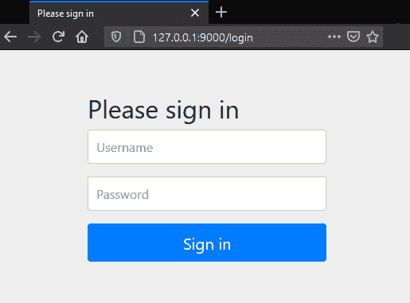

# Spring Security OAuth 授权服务器

> 原文:[https://web . archive . org/web/20220930061024/https://www . bael dung . com/spring-security-oauth-auth-server](https://web.archive.org/web/20220930061024/https://www.baeldung.com/spring-security-oauth-auth-server)

## 1.介绍

OAuth 是一个描述授权过程的开放标准。它可以用来授权用户访问 API。例如，REST API 可以限制只有具有适当角色的注册用户才能访问。

OAuth 授权服务器负责对用户进行身份验证，并发布包含用户数据和适当访问策略的访问令牌。

在本教程中，我们将使用[Spring Security OAuth Authorization Server](https://web.archive.org/web/20220626080629/https://github.com/spring-projects/spring-authorization-server#spring-authorization-server)项目实现一个简单的 OAuth 应用程序。

在这个过程中，我们将创建一个客户机-服务器应用程序，该应用程序将从 REST API 获取一系列 Baeldung 文章。客户端服务和服务器服务都需要 OAuth 认证。

## 2.授权服务器实现

让我们从查看 OAuth 授权服务器配置开始。它将作为文章资源和客户机服务器的认证源。

### 2.1.属国

首先，我们需要向我们的`pom.xml`文件添加一些依赖项:

```
<dependency>
    <groupId>org.springframework.boot</groupId>
    <artifactId>spring-boot-starter-web</artifactId>
    <version>2.5.4</version>
</dependency>
<dependency>
    <groupId>org.springframework.boot</groupId>
    <artifactId>spring-boot-starter-security</artifactId>
    <version>2.5.4</version>
</dependency>
<dependency>
    <groupId>org.springframework.security</groupId>
    <artifactId>spring-security-oauth2-authorization-server</artifactId>
    <version>0.2.0</version>
</dependency>
```

### 2.2.配置

现在，让我们通过设置`application.yml`文件中的`server.port`属性来配置我们的认证服务器将运行的端口:

```
server:
  port: 9000
```

之后，我们可以转移到 Spring beans 配置。首先，我们需要一个`@Configuration`类，在其中我们将创建一些特定于 OAuth 的 beans。第一个将是客户服务的存储库。在我们的例子中，我们将有一个使用`RegisteredClient` builder 类创建的客户端:

```
@Configuration
@Import(OAuth2AuthorizationServerConfiguration.class)
public class AuthorizationServerConfig {
    @Bean
    public RegisteredClientRepository registeredClientRepository() {
        RegisteredClient registeredClient = RegisteredClient.withId(UUID.randomUUID().toString())
          .clientId("articles-client")
          .clientSecret("{noop}secret")
          .clientAuthenticationMethod(ClientAuthenticationMethod.CLIENT_SECRET_BASIC)
          .authorizationGrantType(AuthorizationGrantType.AUTHORIZATION_CODE)
          .authorizationGrantType(AuthorizationGrantType.REFRESH_TOKEN)
          .redirectUri("http://127.0.0.1:8080/login/oauth2/code/articles-client-oidc")
          .redirectUri("http://127.0.0.1:8080/authorized")
          .scope(OidcScopes.OPENID)
          .scope("articles.read")
          .build();
        return new InMemoryRegisteredClientRepository(registeredClient);
    }
}
```

我们正在配置的属性是:

*   客户机 ID——Spring 将使用它来识别哪个客户机试图访问资源
*   客户端密码–客户端和服务器都知道的秘密，在两者之间提供信任
*   身份验证方法–在我们的例子中，我们将使用基本身份验证，它只是一个用户名和密码
*   授权类型–我们希望允许客户端生成授权代码和刷新令牌
*   重定向 URI–客户端将在基于重定向的流中使用它
*   scope–该参数定义客户端可能拥有的授权。在我们的例子中，我们将需要`OidcScopes.OPENID`和我们的定制商品。阅读

接下来，让我们配置一个 bean 来应用默认的 OAuth 安全性，并生成一个默认的表单登录页面:

```
@Bean
@Order(Ordered.HIGHEST_PRECEDENCE)
public SecurityFilterChain authServerSecurityFilterChain(HttpSecurity http) throws Exception {
    OAuth2AuthorizationServerConfiguration.applyDefaultSecurity(http);
    return http.formLogin(Customizer.withDefaults()).build();
}
```

每个授权服务器需要其令牌的签名密钥，以在安全域之间保持适当的边界。让我们生成一个 2048 字节的 RSA 密钥:

```
@Bean
public JWKSource<SecurityContext> jwkSource() {
    RSAKey rsaKey = generateRsa();
    JWKSet jwkSet = new JWKSet(rsaKey);
    return (jwkSelector, securityContext) -> jwkSelector.select(jwkSet);
}

private static RSAKey generateRsa() {
    KeyPair keyPair = generateRsaKey();
    RSAPublicKey publicKey = (RSAPublicKey) keyPair.getPublic();
    RSAPrivateKey privateKey = (RSAPrivateKey) keyPair.getPrivate();
    return new RSAKey.Builder(publicKey)
      .privateKey(privateKey)
      .keyID(UUID.randomUUID().toString())
      .build();
}

private static KeyPair generateRsaKey() {
    KeyPairGenerator keyPairGenerator = KeyPairGenerator.getInstance("RSA");
    keyPairGenerator.initialize(2048);
    return keyPairGenerator.generateKeyPair();
}
```

除了签名密钥之外，每个授权服务器还需要有一个唯一的发行者 URL。我们将通过创建`ProviderSettings` bean 将其设置为端口`9000` 上`http://auth-server` 的本地主机别名:

```
@Bean
public ProviderSettings providerSettings() {
    return ProviderSettings.builder()
      .issuer("http://auth-server:9000")
      .build();
}
```

此外，我们将在我们的`/etc/hosts`文件中添加一个`127.0.0.1 auth-server`条目。这允许我们在本地机器上运行客户机和 auth 服务器，并避免两者之间的会话 cookie 覆盖问题。

最后，我们将使用一个`@EnableWebSecurity` 带注释的配置类来启用 Spring web 安全模块:

```
@EnableWebSecurity
public class DefaultSecurityConfig {

    @Bean
    SecurityFilterChain defaultSecurityFilterChain(HttpSecurity http) throws Exception {
        http.authorizeRequests(authorizeRequests ->
          authorizeRequests.anyRequest().authenticated()
        )
          .formLogin(withDefaults());
        return http.build();
    }

    // ...
}
```

这里，我们调用`authorizeRequests.anyRequest().authenticated()`来要求对所有请求进行认证，并且我们通过调用`formLogin(defaults())`方法来提供基于表单的认证。

此外，我们将定义一组用于测试的示例用户。对于这个例子，让我们创建一个只有一个管理员用户的存储库:

```
@Bean
UserDetailsService users() {
    UserDetails user = User.withDefaultPasswordEncoder()
      .username("admin")
      .password("password")
      .build();
    return new InMemoryUserDetailsManager(user);
}
```

## 3.资源服务器

现在，我们将创建一个资源服务器，它将从 GET 端点返回一个文章列表。端点应该只允许通过 OAuth 服务器验证的请求。

### 3.1.属国

首先，让我们包括所需的依赖项:

```
<dependency>
    <groupId>org.springframework.boot</groupId>
    <artifactId>spring-boot-starter-web</artifactId>
    <version>2.5.4</version>
</dependency>
<dependency>
    <groupId>org.springframework.boot</groupId>
    <artifactId>spring-boot-starter-security</artifactId>
    <version>2.5.4</version>
</dependency>
<dependency>
    <groupId>org.springframework.boot</groupId>
    <artifactId>spring-boot-starter-oauth2-resource-server</artifactId>
    <version>2.5.4</version>
</dependency>
```

### 3.2.配置

在我们开始实现代码之前，我们应该在`application.yml`文件中配置一些属性。第一个是服务器端口:

```
server:
  port: 8090
```

接下来，是安全配置的时候了。我们需要为我们的认证服务器设置正确的 URL，包括我们之前在`ProviderSettings` bean 中配置的主机和端口:

```
spring:
  security:
    oauth2:
      resourceserver:
        jwt:
          issuer-uri: http://auth-server:9000
```

现在，我们可以设置我们的 web 安全配置。同样，我们想明确地说，对文章资源的每个请求都应该得到授权，并拥有适当的`articles.read`权限:

```
@EnableWebSecurity
public class ResourceServerConfig {

    @Bean
    SecurityFilterChain securityFilterChain(HttpSecurity http) throws Exception {
        http.mvcMatcher("/articles/**")
          .authorizeRequests()
          .mvcMatchers("/articles/**")
          .access("hasAuthority('SCOPE_articles.read')")
          .and()
          .oauth2ResourceServer()
          .jwt();
        return http.build();
    }
}
```

如此处所示，我们还调用了`oauth2ResourceServer()`方法，该方法将基于`application.yml`配置来配置 OAuth 服务器连接。

### 3.3.物品控制器

最后，我们将创建一个 REST 控制器，它将在`GET /articles`端点下返回一个文章列表:

```
@RestController
public class ArticlesController {

    @GetMapping("/articles")
    public String[] getArticles() {
        return new String[] { "Article 1", "Article 2", "Article 3" };
    }
}
```

## 4.API 客户端

对于最后一部分，我们将创建一个 REST API 客户机，它将从资源服务器获取文章列表。

### 4.1.属国

首先，让我们包括所需的依赖项:

```
<dependency>
    <groupId>org.springframework.boot</groupId>
    <artifactId>spring-boot-starter-web</artifactId>
    <version>2.5.4</version>
</dependency>
<dependency>
    <groupId>org.springframework.boot</groupId>
    <artifactId>spring-boot-starter-security</artifactId>
    <version>2.5.4</version>
</dependency>
<dependency>
    <groupId>org.springframework.boot</groupId>
    <artifactId>spring-boot-starter-oauth2-client</artifactId>
    <version>2.5.4</version>
</dependency>
<dependency>
    <groupId>org.springframework</groupId>
    <artifactId>spring-webflux</artifactId>
    <version>5.3.9</version>
</dependency>
<dependency>
    <groupId>io.projectreactor.netty</groupId>
    <artifactId>reactor-netty</artifactId>
    <version>1.0.9</version>
</dependency> 
```

### 4.2.配置

正如我们前面所做的，我们将定义一些用于身份验证的配置属性:

```
server:
  port: 8080

spring:
  security:
    oauth2:
      client:
        registration:
          articles-client-oidc:
            provider: spring
            client-id: articles-client
            client-secret: secret
            authorization-grant-type: authorization_code
            redirect-uri: "http://127.0.0.1:8080/login/oauth2/code/{registrationId}"
            scope: openid
            client-name: articles-client-oidc
          articles-client-authorization-code:
            provider: spring
            client-id: articles-client
            client-secret: secret
            authorization-grant-type: authorization_code
            redirect-uri: "http://127.0.0.1:8080/authorized"
            scope: articles.read
            client-name: articles-client-authorization-code
        provider:
          spring:
            issuer-uri: http://auth-server:9000
```

现在，让我们创建一个`WebClient`实例来执行对资源服务器的 HTTP 请求。我们将使用标准实现，只增加一个 OAuth 授权过滤器:

```
@Bean
WebClient webClient(OAuth2AuthorizedClientManager authorizedClientManager) {
    ServletOAuth2AuthorizedClientExchangeFilterFunction oauth2Client =
      new ServletOAuth2AuthorizedClientExchangeFilterFunction(authorizedClientManager);
    return WebClient.builder()
      .apply(oauth2Client.oauth2Configuration())
      .build();
}
```

`WebClient`需要一个`OAuth2AuthorizedClientManager`作为依赖项。让我们创建一个默认实现:

```
@Bean
OAuth2AuthorizedClientManager authorizedClientManager(
        ClientRegistrationRepository clientRegistrationRepository,
        OAuth2AuthorizedClientRepository authorizedClientRepository) {

    OAuth2AuthorizedClientProvider authorizedClientProvider =
      OAuth2AuthorizedClientProviderBuilder.builder()
        .authorizationCode()
        .refreshToken()
        .build();
    DefaultOAuth2AuthorizedClientManager authorizedClientManager = new DefaultOAuth2AuthorizedClientManager(
      clientRegistrationRepository, authorizedClientRepository);
    authorizedClientManager.setAuthorizedClientProvider(authorizedClientProvider);

    return authorizedClientManager;
}
```

最后，我们将配置 web 安全性:

```
@EnableWebSecurity
public class SecurityConfig {

    @Bean
    SecurityFilterChain securityFilterChain(HttpSecurity http) throws Exception {
        http
          .authorizeRequests(authorizeRequests ->
            authorizeRequests.anyRequest().authenticated()
          )
          .oauth2Login(oauth2Login ->
            oauth2Login.loginPage("/oauth2/authorization/articles-client-oidc"))
          .oauth2Client(withDefaults());
        return http.build();
    }
}
```

在这里，以及在其他服务器中，我们需要对每个请求进行身份验证。此外，我们需要配置登录页面 URL(在`.yml` config 中定义)和 OAuth 客户端。

### 4.3.文章客户端控制器

最后，我们可以创建数据访问控制器。我们将使用之前配置的`WebClient`向我们的资源服务器发送一个 HTTP 请求:

```
@RestController
public class ArticlesController {

    private WebClient webClient;

    @GetMapping(value = "/articles")
    public String[] getArticles(
      @RegisteredOAuth2AuthorizedClient("articles-client-authorization-code") OAuth2AuthorizedClient authorizedClient
    ) {
        return this.webClient
          .get()
          .uri("http://127.0.0.1:8090/articles")
          .attributes(oauth2AuthorizedClient(authorizedClient))
          .retrieve()
          .bodyToMono(String[].class)
          .block();
    }
}
```

在上面的例子中，我们以`OAuth2AuthorizedClient`类的形式从请求中获取 OAuth 授权令牌。它由 Spring 使用带有适当标识的`@RegisterdOAuth2AuthorizedClient`注释自动绑定。在我们的例子中，它来自我们之前在`.yml`文件中配置的`article-client-authorizaiton-code`。

这个授权令牌被进一步传递给 HTTP 请求。

### 4.4.访问文章列表

现在，当我们进入浏览器并尝试访问`http://127.0.0.1:8080/articles`页面时，我们将被自动重定向到`http://auth-server:9000/login` URL 下的 OAuth 服务器登录页面:

[](/web/20220626080629/https://www.baeldung.com/wp-content/uploads/2021/03/loginPage.png)

提供正确的用户名和密码后，授权服务器会将我们重定向回所请求的 URL——文章列表。

对 articles 端点的进一步请求不需要登录，因为访问令牌将存储在 cookie 中。

## 5.结论

在本文中，我们学习了如何设置、配置和使用 Spring Security OAuth 授权服务器。

和往常一样，GitHub 上的所有源代码[都是可用的。](https://web.archive.org/web/20220626080629/https://github.com/Baeldung/spring-security-oauth/tree/master/oauth-authorization-server)