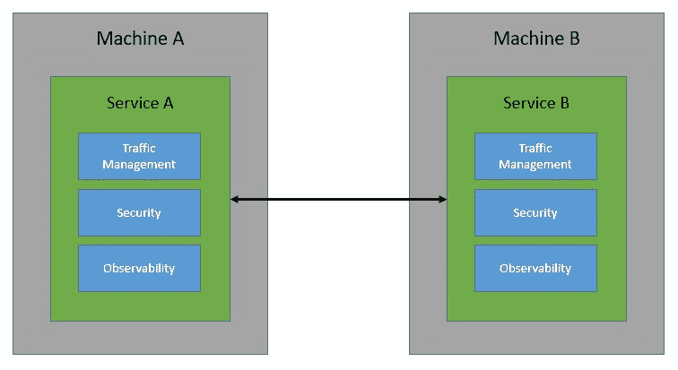
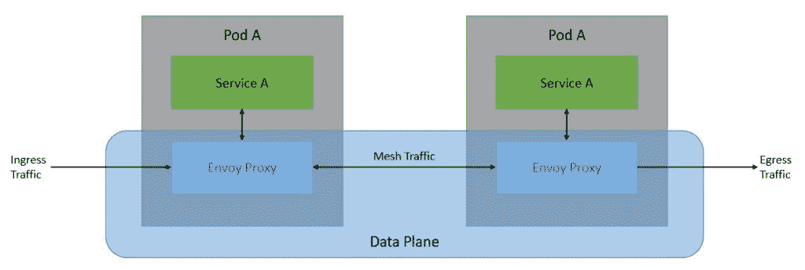
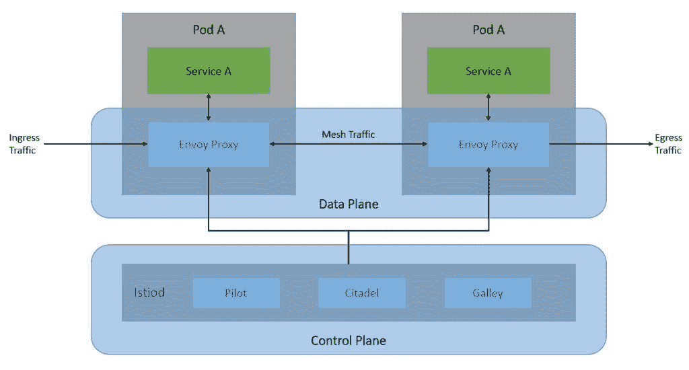
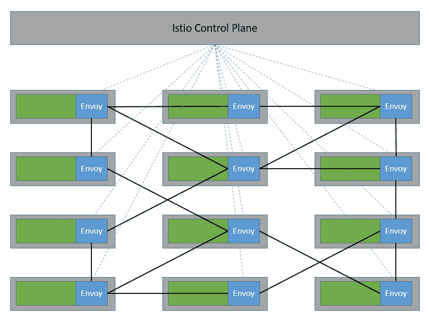
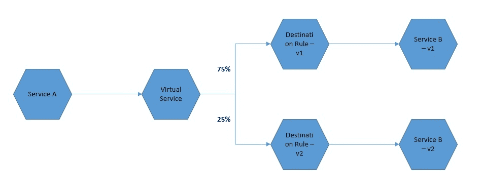
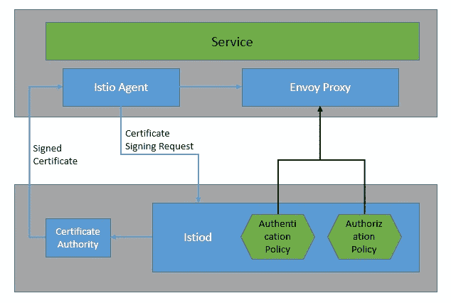
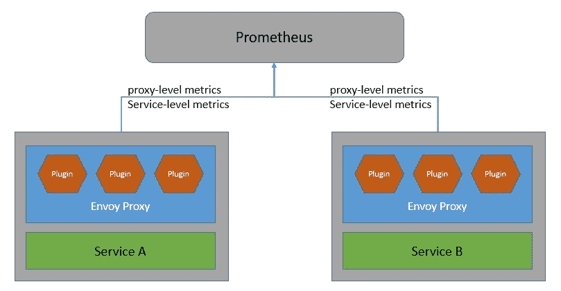
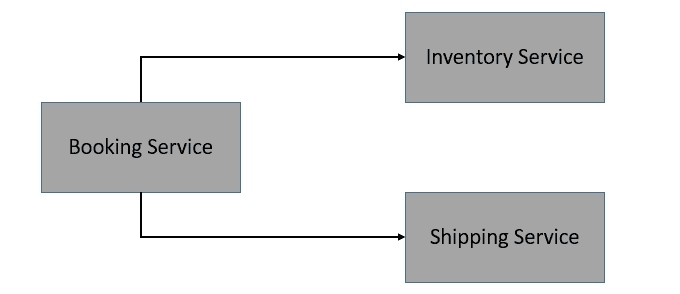

# 使用 Istio 的服务网格架构

> 原文：<https://web.archive.org/web/20220930061024/https://www.baeldung.com/ops/istio-service-mesh>

## 1.介绍

在本教程中，我们将浏览服务网格架构的基础知识，并理解它如何补充分布式系统架构。

我们将主要关注 Istio，它是服务网格的一个实现。在这个过程中，我们将介绍 Istio 的核心架构，并了解如何在 Kubernetes 上从中受益。

## 2.什么是服务网格？

在过去的几十年里，我们已经看到单片应用程序如何开始分解成更小的应用程序。它发现云原生计算和微服务架构受到了前所未有的欢迎。此外，像 [Docker](https://web.archive.org/web/20221029013823/https://www.docker.com/) 这样的集装箱化技术和像 [Kubernetes](https://web.archive.org/web/20221029013823/https://kubernetes.io/) 这样的编排系统只是在这方面有所帮助。

虽然在像 Kubernetes 这样的分布式系统上采用微服务架构有很多优势，但它也有相当多的复杂性。由于分布式服务必须相互通信，我们必须考虑发现、路由、重试和故障转移。

我们还必须考虑其他几个问题，如安全性和可观察性:

现在，在每个服务中构建这些通信功能可能会非常繁琐——当服务环境变得越来越大，通信变得越来越复杂时就更是如此。这正是服务网格可以帮助我们的地方。基本上，**服务网格承担了管理分布式软件系统中所有服务对服务通信的责任**。

服务网格能够做到这一点的方式是通过一组网络代理。本质上，服务之间的请求通过代理进行路由，这些代理与服务一起运行，但位于基础设施层之外:

这些**代理基本上为服务**创建了一个网状网络——因此得名服务网格！通过这些代理，服务网格能够控制服务到服务通信的各个方面。因此，我们可以用它来解决[分布式计算的八个谬误](https://web.archive.org/web/20221029013823/https://en.wikipedia.org/wiki/Fallacies_of_distributed_computing)，这是一组描述我们经常对分布式应用做出的错误假设的断言。

## 3.服务网格的特征

现在让我们来理解服务网格可以为我们提供的一些特性。请注意，实际功能的列表取决于服务网格的实现。但是，一般来说，我们应该在所有的实现中预期这些特性中的大部分。

我们可以将这些特性大致分为三类:流量管理、安全性和可观察性。

### 3.1.交通管理

服务网格的基本特征之一是流量管理。这包括动态服务发现和路由。它还实现了一些有趣的用例，如流量阴影和流量分流。这些对于执行 canary 发布和 A/B 测试非常有用。

由于所有服务到服务的通信都是由服务网格处理的，因此它**还支持一些可靠性特性**。例如，服务网格可以提供重试、超时、速率限制和断路器。这些现成的故障恢复功能使通信更加可靠。

### 3.2.安全性

服务网格通常还处理服务到服务通信的安全方面。这包括通过相互 TLS (MTLS)实施流量加密，通过证书验证提供身份验证，以及通过访问策略确保授权。

在服务网格中还可能有一些有趣的安全用例。例如，**我们可以实现网络分段**允许一些服务通信，同时禁止其他服务。此外，服务网格可以为审计需求提供精确的历史信息。

### 3.3.可观察性

鲁棒的可观测性是处理分布式系统复杂性的基础要求。因为服务网格处理所有的通信，所以它很适合提供可观察性特性。例如，它可以提供有关分布式跟踪的信息。

一个服务网格**可以生成很多指标，比如延迟、流量、错误和饱和度**。此外，服务网格还可以生成访问日志，为每个请求提供完整的记录。这些对于理解单个服务以及整个系统的行为非常有用。

## 4.Istio 简介

Istio 是最初由 IBM、Google 和 Lyft 开发的服务网格的开源实现**。它可以透明地分层到分布式应用程序上，并提供服务网格的所有好处，如流量管理、安全性和可观察性。**

它设计用于各种部署，如内部部署、云托管、Kubernetes 容器和运行在虚拟机上的服务器。虽然 **Istio 是平台中立的**，但它经常与部署在 Kubernetes 平台上的微服务一起使用。

从根本上说，Istio 的工作原理是部署一个扩展版本的 [Envoy 作为代理](https://web.archive.org/web/20221029013823/https://www.envoyproxy.io/)到每一个微服务上，作为一个 sidecar:

这个**代理网络构成了 Istio 架构的数据平面**。这些代理的配置和管理是从控制平面完成的:

**控制平面基本上是服务网**的大脑。它在运行时为数据平面中的特使代理提供发现、配置和证书管理。

当然，只有当我们拥有大量相互通信的微服务时，我们才能意识到 Istio 的好处。这里，sidecar 代理在专用基础设施层中形成了一个复杂的服务网格:

Istio 在与外部库和平台集成方面非常灵活。例如，我们可以将 Istio 与外部日志平台、遥测或策略系统集成。

## 5.了解 Istio 组件

我们已经看到，Istio 架构由数据平面和控制平面组成。此外，有几个核心组件使 Istio 能够发挥作用。

在本节中，我们将详细介绍这些核心组件。

### 5.1.数据平面

Istio 的数据平面主要包括特使代理的扩展版本。Envoy 是一个开源的边缘和服务代理，有助于将网络问题从底层应用中分离出来。应用程序简单地向`localhost`发送消息和从`localhost`接收消息，而不需要任何网络拓扑知识。

核心上，Envoy 是一个网络代理，运行在 OSI 模型的 L3 和 L4 层。它**通过使用一系列可插拔的网络过滤器**来执行连接处理。此外，Envoy 还支持针对基于 HTTP 的流量的附加 L7 层过滤器。此外，Envoy 对 HTTP/2 和 gRPC 传输有一流的支持。

Istio 作为服务网格提供的许多功能实际上是由 Envoy 代理的底层内置功能实现的:

*   流量控制:Envoy 支持细粒度流量控制应用程序，为 HTTP、gRPC、WebSocket 和 TCP 流量提供丰富的路由规则
*   网络弹性:Envoy 包括对自动重试、电路中断和故障注入的现成支持
*   安全性:Envoy 还可以实施安全策略，并对底层服务之间的通信应用访问控制和速率限制

Envoy 与 Istio 配合得如此好的另一个原因是它的可扩展性。Envoy **提供了基于 WebAssembly** 的可插拔扩展模型。这在自定义策略实施和遥测生成中非常有用。此外，我们还可以使用基于 Proxy-Wasm 沙箱 API 的 Istio 扩展来扩展 Istio 中的 Envoy 代理。

### 5.2.制导机

正如我们前面看到的，控制平面负责管理和配置数据平面中的特使代理。控制平面中对此负责的组件是`istiod`。在这里，`istiod`负责**将高级路由规则和流量控制行为转换成特使专用的配置**，并在运行时将它们传播到 sidecars。

如果我们回想一下 Istio 控制平面的架构，我们会注意到它曾经是一组独立的组件一起工作。它由服务发现的 Pilot、配置的 Galley、证书生成的 Citadel 和可扩展性的 Mixer 等组件组成。由于复杂性，这些**单独的组件被合并成一个名为`istiod`** 的组件。

在核心部分，`istiod`仍然使用与早期的单个组件相同的代码和 API。例如，Pilot 负责抽象特定于平台的服务发现机制，并将它们合成为 sidecars 可以使用的标准格式。因此，Istio 可以支持多种环境的发现，如 Kubernetes 或虚拟机。

此外，`istiod`还提供安全性，通过内置的身份和凭证管理实现强大的服务对服务和最终用户身份验证。此外，通过`istiod`，我们可以基于服务身份实施安全策略。该进程`istiod`还充当认证机构(CA ),并生成证书以促进数据平面中的相互 TLS (MTLS)通信。

## 6.Istio 如何工作

我们已经了解了服务网格的典型特征。此外，我们还了解了 Istio 架构及其核心组件的基础知识。现在，是时候了解 Istio 如何通过其架构中的核心组件来提供这些特性了。

我们将重点讨论我们之前讨论过的相同类别的功能。

### 6.1.交通管理

通过使用 Istio 流量管理 API，我们可以对服务网格中的流量进行粒度控制。我们可以使用这些 API 向 Istio 添加我们自己的流量配置。此外，我们可以使用 Kubernetes 自定义资源定义(CRD)来定义 API 资源。帮助我们控制流量路由的关键 API 资源是虚拟服务和目的地规则:

基本上，**虚拟服务让我们配置如何将请求路由到 Istio 服务网格中的服务**。因此，虚拟服务由一个或多个按顺序评估的路由规则组成。在评估虚拟服务的路由规则之后，应用目的地规则。目的地规则帮助我们控制到目的地的流量—例如，按版本对服务实例进行分组。

### 6.2.安全性

Istio 中的安全性始于为每个服务提供强身份。与每个 Envoy 代理一起运行的 Istio 代理与`istiod`一起自动执行密钥和证书轮换:

Istio **提供了两种类型的认证——对等认证和请求认证**。对等身份验证用于服务对服务的身份验证，其中 Istio 提供 mutual TLS 作为全栈解决方案。请求身份验证用于最终用户身份验证，其中 Istio 使用自定义身份验证提供程序或 OpenID Connect (OIDC)提供程序提供 JSON Web Token (JWT)验证。

Istio 还允许我们通过简单地对服务应用授权策略来加强对服务的访问控制。授权策略对特使代理中的入站流量实施访问控制。有了它，我们可以在各种级别应用访问控制:网格、名称空间和服务范围。

### 6.3.可观察性

Istio 为网格内的所有服务通信生成详细的遥测信息，如指标、分布式跟踪和访问日志。Istio **生成一组丰富的代理级指标、面向服务的指标和控制平面指标**。

早期，Istio 遥测架构将混频器作为核心组件。但是从 Telemetry v2 开始，Mixer 提供的功能被 Envoy 代理插件所取代:

此外，Istio 通过特使代理生成分布式跟踪。Istio 支持许多跟踪后端，如 [Zipkin](https://web.archive.org/web/20221029013823/https://zipkin.io/) 、 [Jaeger](https://web.archive.org/web/20221029013823/https://www.jaegertracing.io/) 、 [Lightstep](https://web.archive.org/web/20221029013823/https://lightstep.com/) 和 [Datadog](https://web.archive.org/web/20221029013823/https://www.datadoghq.com/) 。我们还可以控制跟踪生成的采样率。此外，Istio 还以一组可配置的格式为服务流量生成访问日志。

## 7.Istio 实践

既然我们已经了解了足够多的背景知识，那么我们就可以看到 Istio 的实际应用了。首先，我们将在 Kubernetes 集群中安装 Istio。此外，我们将使用一个简单的基于微服务的应用程序来演示 Istio 在 Kubernetes 上的功能。

### 7.1.装置

有几种方法可以安装 Istio，但最简单的方法是下载并解压特定操作系统(如 Windows)的最新版本。解压缩后的包包含位于`bin`目录中的`istioctl`客户端二进制文件。我们**可以使用`istioctl`在目标 Kubernetes 集群上安装 Istio** :

[PRE0]

这将使用演示配置文件在默认的 Kubernetes 集群上安装 Istio 组件。我们也可以使用任何其他特定于供应商的概要文件来代替演示。

最后，当我们在这个 Kubernetes 集群上部署任何应用程序时，我们需要**指示 Istio 自动注入 Envoy sidecar 代理**:

[PRE1]

我们在这里使用`kubectl`,假设像 Minikube 和 Kubernetes CLI `kubectl`这样的 [Kubernetes 集群已经在我们的机器上可用。](https://web.archive.org/web/20221029013823/https://kubernetes.io/docs/tutorials/hello-minikube/)

### 7.2.示例应用程序

出于演示的目的，我们将设想一个非常简单的应用程序来进行在线订购。该应用程序包含三个微服务，它们相互交互以满足最终用户的订单请求:

我们不会深入这些微服务的细节，但是使用 [Spring Boot 和 REST API](/web/20221029013823/https://www.baeldung.com/spring-boot-start)创建它们非常简单。最重要的是，我们[为这些微服务](/web/20221029013823/https://www.baeldung.com/dockerizing-spring-boot-application)创建了一个 Docker 映像，这样我们就可以在 Kubernetes 上部署它们。

### 7.3.部署

在像 Minikube 这样的 Kubernetes 集群上部署容器化的[工作负载相当简单。我们将使用`Deployment` 和`Service`资源类型来声明和访问工作负载。通常，我们在 YAML 文件中定义它们:](/web/20221029013823/https://www.baeldung.com/spring-boot-minikube)

[PRE2]

这是对`Deployment`和`order-service`的一个非常简单的定义。类似地，我们可以为`inventory-service`和`shipping-service`定义 YAML 文件。

使用`kubectl`部署这些资源也相当简单:

[PRE3]

因为我们已经为默认名称空间启用了 Envoy sidecar 代理的自动注入，所以一切都会为我们处理好。或者，我们可以使用`istioctl`的`kube-inject`命令手动注入 Envoy sidecar 代理。

### 7.4.访问应用程序

现在，Istio 主要负责处理所有网格流量。因此，**默认情况下，不允许任何进出网状网的流量**。Istio 使用网关来管理网状网络的入站和出站流量。这样，我们可以精确地控制进入或离开网格的流量。Istio 提供了一些预配置的网关代理部署:`istio-ingressgateway`和`istio-egressgateway`。

为此，我们将为我们的应用程序创建一个网关和一个虚拟服务:

[PRE4]

这里，我们使用 Istio 提供的默认入口控制器。此外，我们已经定义了一个虚拟服务来将我们的请求路由到`booking-service`。

类似地，**我们也可以为来自网格的出站流量**定义一个出口网关。

## 8.Istio 的常见用例

现在，我们已经看到了如何使用 Istio 在 Kubernetes 上部署一个简单的应用程序。但是，我们仍然没有利用 Istio 为我们提供的任何有趣的功能。在本节中，我们将浏览服务网格的一些常见用例，并了解如何使用 Istio 在我们的简单应用程序中实现它们。

### 8.1.请求路由

我们希望以特定的方式处理请求路由有几个原因。例如，我们**可能会部署多个版本的微服务，比如`shipping-service`** ，并且希望只将一小部分请求路由到新版本。

我们可以使用虚拟服务的路由规则来实现这一点:

[PRE5]

路由规则还允许我们基于属性(如头参数)定义匹配条件。此外，目的地字段指定匹配条件的流量的实际目的地。

### 8.2.断路

断路器基本上是一种软件**设计模式，用于检测故障并封装防止故障进一步级联的逻辑**。这有助于创建弹性微服务应用，限制故障和延迟峰值的影响。

在 Istio 中，当调用像`inventory-service`这样的服务时，我们可以使用`DestinationRule`中的`trafficPolicy`配置来应用电路中断:

[PRE6]

这里，我们将`DestinationRule`配置为`maxConnections`为 1，`httpMaxPendingRequests`为 1，`maxRequestsPerConnection`为 1。这实际上意味着，如果我们超过并发请求的数量超过 1，断路器将开始捕获一些请求。

### 8.3.启用相互 TLS

相互认证是指在 TLS 这样的认证协议中，双方同时对对方进行认证的情况**。默认情况下，所有具有代理的服务之间的流量都使用 Istio 中的相互 TLS。但是，没有代理的服务仍然继续以纯文本格式接收流量。**

虽然 Istio 会自动将代理服务之间的所有流量升级到相互 TLS，但这些服务仍然可以接收纯文本流量。我们可以选择使用`PeerAuthentication`策略在全网范围内实施相互 TLS:

[PRE7]

我们还可以选择在每个名称空间或服务中强制实施相互 TLS，而不是在整个网格范围内。然而，**特定于服务的`PeerAuthentication`策略优先于名称空间范围的策略**。

### 8.4.JWT 的访问控制

JSON Web Token (JWT) 是**一种创建数据的标准，它的有效负载包含断言多个声明的 JSON**。这已被广泛接受，用于在身份提供者和服务提供者之间传递经过身份验证的用户的身份和标准或自定义声明。

我们可以在 Istio 中启用授权策略，以允许访问基于 JWT 的类似`booking-service`的服务:

[PRE8]

这里，`AuthorizationPolicy`强制所有请求都具有一个有效的 JWT，并将`requestPrincipal`设置为一个特定的值。Istio 通过组合 JWT 的声明`iss`和`sub`创建了`requestPrincipal`属性。

## 9.事后思考

因此，我们现在已经看到了像 Istio 这样的服务网格如何使我们更容易处理像微服务这样的分布式架构中的一些常见问题。但是尽管如此， **Istio 是一个复杂的系统，增加了最终部署的复杂性**。像所有其他技术一样，Istio 不是灵丹妙药，必须在适当考虑的情况下使用。

### 9.1.我们应该总是使用服务网格吗？

虽然我们已经看到了足够多的使用服务网格的理由，但是让我们列举一些可能会促使我们不使用它的理由:

*   服务网格以部署和操作服务网格的额外成本来处理所有服务到服务的通信。对于较简单的应用程序，这可能是不合理的
*   由于我们非常习惯于处理这些问题，比如应用程序代码中的断路，这可能会导致服务网格中的重复处理
*   增加对外部系统(如服务网格)的依赖可能对应用程序的可移植性有害，尤其是在没有服务网格行业标准的情况下
*   由于服务网格通常通过代理拦截网格流量来工作，因此它可能会给请求增加不必要的延迟
*   服务网格增加了许多需要精确处理的附加组件和配置；这需要专业知识，并增加了学习曲线
*   最后，我们可能会将业务逻辑(应该在服务网格中)与业务逻辑(不应该在服务网格中)混合在一起

因此，正如我们所看到的，服务网格的故事并不全是关于好处的，但这并不意味着它们不是真的。对我们来说，重要的是**仔细评估我们的需求和应用程序的复杂性，然后权衡服务网格的好处**和它们增加的复杂性。

### 9.2.Istio 的替代品有哪些？

虽然 Istio 非常受欢迎，并得到了业内一些领导者的支持，但它肯定不是唯一的选择。虽然我们不能在这里做一个彻底的比较，但是让我们来看看其中的几个选项，Linkerd 和 Consul。

[**Linkerd**](https://web.archive.org/web/20221029013823/https://linkerd.io/) **是为 Kubernetes 平台**创建的开源服务网格。它也很受欢迎，目前在 CNCF 处于孵化项目的状态。其工作原理类似于任何其他服务网格，如 Istio。它还利用 TCP 代理来处理网格流量。Linkerd 使用一个用 Rust 编写的微代理，称为 Linkerd-proxy。

总的来说，Linkerd 没有 Istio 复杂，因为它只支持 Kubernetes。但是，除此之外，Linkerd 中可用的特性列表与 Istio 中的非常相似。Linkerd 的**核心架构也与 Istio** 非常相似。基本上，Linkerd 包括三个主要组件:用户界面、数据平面和控制平面。

[**领事**](https://web.archive.org/web/20221029013823/https://www.consul.io/) **是来自 [HashiCorp](https://web.archive.org/web/20221029013823/https://www.hashicorp.com/) 的服务网格**的开源实现。它具有与 HashiCorp 的其他基础设施管理产品套件良好集成的优势，可以提供更广泛的功能。Consul 中的数据层具有支持代理和本地集成模型的灵活性。它带有一个内置的代理，但也可以很好地与特使。

除了 Kubernetes 之外，Consul 还可以与其他平台如 [Nomad](https://web.archive.org/web/20221029013823/https://www.nomadproject.io/) 一起工作。Consul 通过在每个节点上运行 Consul 代理来执行健康检查。这些代理与一个或多个存储和复制数据的 Consul 服务器通信。虽然它提供了像 Istio，**这样的服务网络的所有标准功能，但它是一个部署和管理起来更加复杂的系统**。

## 10.结论

总的来说，在本教程中，我们介绍了服务网格模式的基本概念以及它为我们提供的特性。特别是，我们浏览了 Istio 的细节。这涵盖了 Istio 的核心架构及其基本组件。此外，我们还详细介绍了安装和使用 Istio 的一些常见用例。