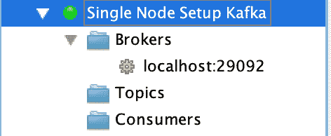
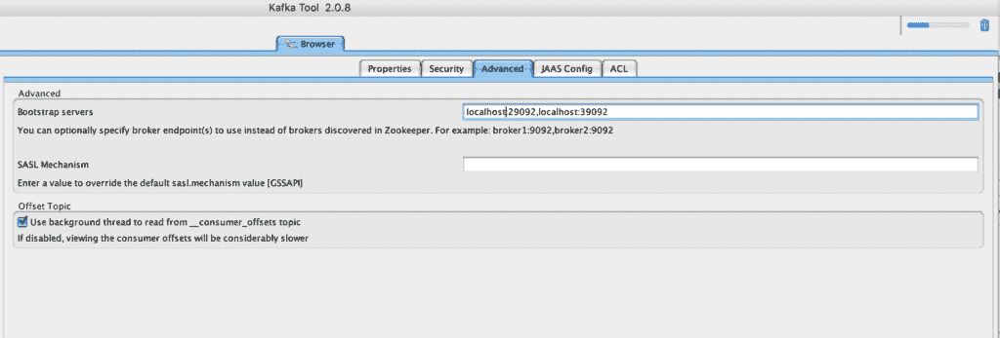

# 使用 Docker 设置 Apache Kafka 的指南

> 原文：<https://web.archive.org/web/20220930061024/https://www.baeldung.com/ops/kafka-docker-setup>

## 1.概观

Docker 是软件行业中最流行的容器引擎之一，用于创建、打包和部署应用程序。

在本教程中，我们将学习如何使用 Docker 进行 [Apache Kafka](/web/20221123060307/https://www.baeldung.com/spring-kafka#overview) 设置。

## 延伸阅读:

## [阿帕奇卡夫卡与春天简介](/web/20221123060307/https://www.baeldung.com/spring-kafka)

A quick and practical guide to using Apache Kafka with Spring.[Read more](/web/20221123060307/https://www.baeldung.com/spring-kafka) →

## [Kafka 与 MQTT 和 MongoDB 的连接示例](/web/20221123060307/https://www.baeldung.com/kafka-connect-mqtt-mongodb)

Have a look at a practical example using Kafka connectors.[Read more](/web/20221123060307/https://www.baeldung.com/kafka-connect-mqtt-mongodb) →

## [卡夫卡流 vs .卡夫卡消费者](/web/20221123060307/https://www.baeldung.com/java-kafka-streams-vs-kafka-consumer)

Learn how Kafka Streams simplify the processing operations when retrieving messages from Kafka topics.[Read more](/web/20221123060307/https://www.baeldung.com/java-kafka-streams-vs-kafka-consumer) →

## 2.单节点设置

一个单节点 Kafka broker 设置将满足大多数的本地开发需求，所以让我们从学习这个简单的设置开始。

### 2.1.`docker-compose.yml` 配置

要启动 Apache Kafka 服务器，我们首先需要启动一个 [Zookeeper](/web/20221123060307/https://www.baeldung.com/java-zookeeper#overview) 服务器。

我们可以在一个`[docker-compose.yml](/web/20221123060307/https://www.baeldung.com/docker-compose)`文件中**配置这种依赖性，这将确保 Zookeeper 服务器总是在 Kafka 服务器之前启动，在 Kafka 服务器之后停止。**

让我们创建一个简单的带有两个服务的`docker-compose.yml`文件，即`zookeeper`和`kafka`:

[PRE0]

在这个设置中，我们的 Zookeeper 服务器在 port= `2181`上监听`kafka`服务，该服务是在同一个容器设置中定义的。然而，对于在主机上运行的任何客户端，它将在端口`22181`上暴露。

类似地， **`kafka`服务通过端口`29092`** 向主机应用程序公开，但它实际上是在由`KAFKA_ADVERTISED_LISTENERS` 属性配置的容器环境**内的端口`9092` 上公布的。**

### 2.2.启动 Kafka 服务器

让我们通过使用 [`docker-compose`](https://web.archive.org/web/20221123060307/https://docs.docker.com/compose/reference/) 命令启动容器来启动 Kafka 服务器:

[PRE1]

现在让我们使用 **[`nc`](/web/20221123060307/https://www.baeldung.com/linux/netcat-command#scanning-for-open-ports-using-netcat) 命令来验证两台服务器都在监听各自的端口**:

[PRE2]

此外，我们还可以在容器启动时检查详细日志，并验证 Kafka 服务器是否启动:

[PRE3]

这样，我们的 Kafka 设置就可以使用了。

### 2.3.使用 Kafka 工具连接

最后，让我们使用 **[Kafka 工具](https://web.archive.org/web/20221123060307/https://kafkatool.com/download.html) GUI 实用程序与我们新创建的 Kafka 服务器**建立连接，稍后，我们将可视化这个设置:

我们必须注意，我们需要使用 **`Bootstrap servers`属性来连接到在端口`29092`监听主机的 Kafka 服务器**。

最后，我们应该能够在左侧栏中可视化连接:

因此，主题和消费者的条目是空的，因为这是一个新的设置。一旦创建了主题，我们应该能够跨分区可视化数据。此外，如果有活跃的消费者连接到我们的 Kafka 服务器，我们也可以查看他们的详细信息。

## 3.Kafka 集群设置

对于更稳定的环境，我们需要一个有弹性的设置。让我们**扩展我们的`docker-compose.yml`文件来创建一个多节点 Kafka 集群设置。**

### 3.1.`docker-compose.yml`配置

Apache Kafka 的集群设置需要为 Zookeeper 服务器和 Kafka 服务器提供冗余。

因此，让我们为 Zookeeper 和 Kafka 服务各添加一个节点的配置:

[PRE4]

我们必须**确保服务名和`KAFKA_BROKER_ID`在整个服务中是唯一的**。

此外，每个服务必须**向主机公开一个唯一的端口。**虽然`zookeeper-1`和`zookeeper-2`正在侦听端口`2181`，但是它们分别通过端口`22181`和`32181`将其暴露给主机。同样的逻辑也适用于`kafka-1`和`kafka-2`服务，它们将分别监听端口`29092`和`39092`。

### 3.2.启动 Kafka 集群

让我们使用`docker-compose`命令启动集群:

[PRE5]

集群启动后，让我们使用 Kafka 工具连接到集群，方法是为 Kafka 服务器和各自的端口指定逗号分隔值:

最后，让我们看看集群中可用的多个代理节点:

## 4.结论

在本文中，我们使用 Docker 技术创建了 Apache Kafka 的单节点和多节点设置。

我们还使用 Kafka 工具来连接和可视化已配置的代理服务器细节。