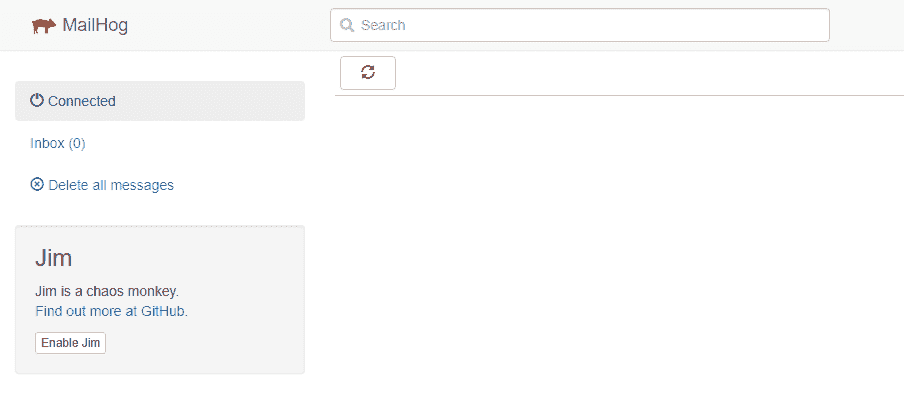
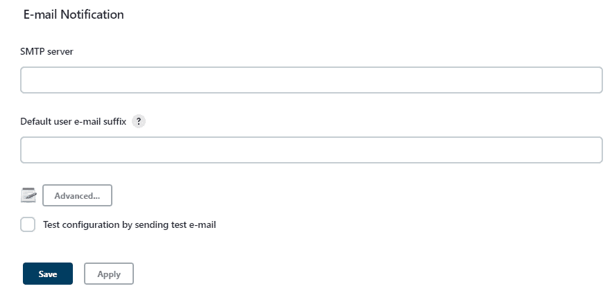
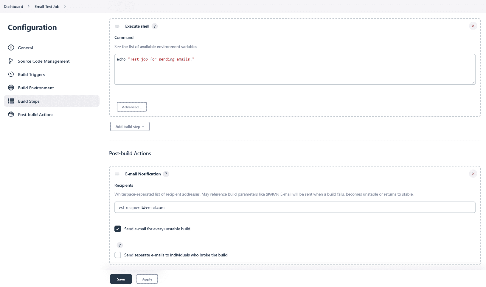
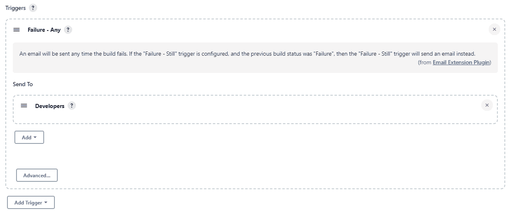
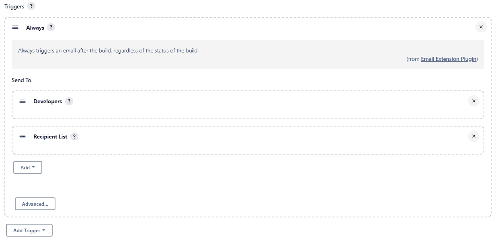

# 从 Jenkins 发送电子邮件通知

> 原文：<https://web.archive.org/web/20220930061024/https://www.baeldung.com/ops/jenkins-send-email-notifications>

## 1。概述

在本教程中，我们将看到从 [Jenkins](https://web.archive.org/web/20221208143849/https://www.jenkins.io/doc/) 发送电子邮件通知的两种不同方式。**当我们希望在管道中的问题得到及时通知时，它们会非常有用。**

## 2。环境设置

首先，我们将设置我们的环境。让我们使用 [Docker Compose](/web/20221208143849/https://www.baeldung.com/ops/docker-compose) ，因为它允许我们相当简单地完成它。

对于本教程，我们需要一个运行 [Jenkins Docker 图像](https://web.archive.org/web/20221208143849/https://hub.docker.com/r/jenkins/jenkins)的容器。此外，我们将使用 [MailHog](https://web.archive.org/web/20221208143849/https://hub.docker.com/r/mailhog/mailhog) 来测试电子邮件发送功能。

### 2.1 .坞站-复合〔t1〕

让我们创建描述我们环境的`docker-compose.yaml`文件:

```
version: '3.7'

services:

    mailhog:
      image: mailhog/mailhog:v1.0.1
      container_name: mailhog
      networks:
        - jenkins
      ports:
        - 1025:1025
        - 8025:8025

    jenkins:
      image: jenkins/jenkins:2.361.1-lts-jdk11
      container_name: jenkins
      networks:
        - jenkins
      ports:
        - 8080:8080
        - 50000:50000

networks:
  jenkins:
```

这里有一些我们需要了解的重要细节。首先，我们来看看[网络配置](/web/20221208143849/https://www.baeldung.com/ops/docker-compose#3-configuring-the-networking)。这两个容器使用相同的网络。这很重要，因为否则，他们就不能互相交流。

其次，我们来看看这些集装箱的港口。 **MailHog 使用端口`1025`作为 SMTP 服务器。因此，我们需要使用 Jenkins 的这个端口来发送电子邮件。**另一个端口可用于从我们的浏览器访问用户界面。Jenkins 在端口`8080`上提供其用户界面。

### 2.2。运行容器

让我们启动 Docker 容器:

`$ docker-compose up -d`

现在，我们可以在上述端口访问它们。让我们从 MailHog 开始，在我们的浏览器中打开 [http://localhost:8025/](https://web.archive.org/web/20221208143849/http://localhost:8025/) 。我们应该看到这个界面:

[](/web/20221208143849/https://www.baeldung.com/wp-content/uploads/2022/10/mailhog_interface_at_start.png)

只要我们从 Jenkins 发送这些电子邮件，它们就会出现在列表中。

现在，让我们访问 [http://localhost:8080/](https://web.archive.org/web/20221208143849/http://localhost:8080/) 并打开 Jenkins UI。

### 2.3。詹金斯设置

Jenkins 容器需要一些时间来启动，它在 UI 上显示一个加载指示器。之后，我们会看到一个密码提示，要求我们输入生成的管理员密码。

在下一个屏幕上，**我们应该安装所有建议的插件**并等待它完成。然后，我们可以创建一个新用户，但这不是必需的。让我们跳过它，继续作为管理员。同样，在`Instance Configuration`页面上，我们只需点击保存并完成即可。现在，我们可以使用所有必要的功能。

## 3。内置解决方案

**詹金斯为发送电子邮件提供了内置的[解决方案。](https://web.archive.org/web/20221208143849/https://plugins.jenkins.io/mailer/)**我们可以在`Configure System`选项下的`Manage Jenkins`菜单中进行配置。

让我们向下滚动到页面底部，看看`E-mail Notification`部分:

[](/web/20221208143849/https://www.baeldung.com/wp-content/uploads/2022/10/jenkins_configure_email_notification.png)

这里，我们需要配置 SMTP 细节。这应该是 MailHog 容器的地址和端口。SMTP 服务器可以简单地称为“mailHog ”,因为这两个容器可以相互访问。该端口可在`Advanced settings`部分下配置，在本教程中应设置为`1025`。

**我们甚至可以在选中复选框并提供电子邮件地址后测试该配置。**让我们应用配置并发送一封测试电子邮件。我们可以在 MailHog UI 上验证这一点，列表中出现了一封新邮件。

### 3.1。作业中的用法

我们可以从设置中发送测试电子邮件，但在现实世界的场景中，我们希望收到关于相关事件的电子邮件。例如，我们可能希望在构建失败时得到通知。让我们为此创建一个简单的作业，只打印一条消息。

首先，我们将从左侧菜单中选择`New Item`并创建一个名为“Email Test Job”的`Freestyle project`。

当我们创建这个任务时，我们被重定向到配置屏幕。让我们向下滚动到`Build Steps`并添加一个`Execute shell`步骤。我们在这里添加一个简单的脚本:

```
echo "Test job for sending emails."
```

在此部分，我们可以添加一些将在我们的作业之后执行的操作。**我们将创建一个`E-mail Notification`构建后操作。**让我们将电子邮件地址设置为收件人，并保存作业配置:

[](/web/20221208143849/https://www.baeldung.com/wp-content/uploads/2022/10/jenkins_email_test_job_configuration.png)

让我们保存配置，然后点击`Build Now`运行该作业并检查结果。我们在控制台输出中看到了我们的消息，但是我们没有通过 MailHog 收到任何电子邮件。这是这种情况下的预期行为。

**此电子邮件通知仅针对特定事件触发。**当一个构建失败、变得不稳定或者回到稳定状态时，会发送一封电子邮件。这意味着我们应该创造一个情境，让其中一个事件发生。例如，我们可以通过修改执行的 shell 脚本来创建一个失败的构建。让我们用这个脚本中的一个非零退出代码退出。这使得 Jenkins 将其视为一个失败的构建:

```
echo "Test job for sending emails."
exit 1
```

让我们再次运行该作业并检查结果。**此执行在 Jenkins 中被标记为失败，我们也收到了 MailHog 的电子邮件。**电子邮件主题是“在 Jenkins 中构建失败:电子邮件测试作业#2”。我们可以看到身体里的细节。

让我们从脚本中删除`exit`命令，然后重新运行作业。**这一次，构建状态是成功的，我们再次收到了一封电子邮件。**主题是“詹金斯构建恢复正常:电子邮件测试工作#3”。然而，有时我们需要得到更多事件的通知，电子邮件扩展插件可以帮助我们。

## 4。电子邮件扩展插件

我们也可以使用电子邮件扩展插件从 Jenkins 那里发送电子邮件。最重要的是，它比内置的解决方案支持更多的事件。

让我们打开`Configure System`菜单。**我们应该会看到一个标题为`Extended E-mail Notification`的部分。**

让我们使用与上一个示例中相同的 SMTP 配置值。SMTP 服务器应该是带有`1025`端口的“mailhog”。我们可以根据需要进一步定制，但这对于我们的例子来说已经足够了。很遗憾，我们无法测试这个插件的配置。让我们在以前使用的作业中尝试一下。

### 4.1。作业中的用法

我们将更改之前使用的“电子邮件测试作业”的配置。**让我们删除之前的后期构建操作，并添加一个名为`Editable Email Notification`的新操作。**

首先，让我们在`Project Recipients List`字段输入一个电子邮件地址。该地址将接收通知。默认情况下，这个插件只在构建失败时发送电子邮件。我们应该更改它以查看它支持的所有事件。让我们打开高级设置，向下滚动到`Triggers`。我们已经可以看到，每当构建失败时，触发器都会向开发人员发送电子邮件:

[](/web/20221208143849/https://www.baeldung.com/wp-content/uploads/2022/10/jenkins_email_extension_failure_trigger.png)

让我们删除它，用类型为`Always`的触发器替换它。**我们还可以在这里找到许多其他类型的触发器。还有很多其他配置选项。例如，我们可以设置谁接收通知，电子邮件的主题和内容，甚至添加附件。**但是，我们可以保留本例的默认设置并保存作业:

[](/web/20221208143849/https://www.baeldung.com/wp-content/uploads/2022/10/jenkins_email_extension_always_trigger.png)

让我们运行它，看看我们在 MailHog 中的收件箱。我们收到了一封关于成功构建的电子邮件。让我们再次更改作业的 shell 脚本，并返回一个错误代码退出:

```
echo "Test job for sending emails."
exit 1
```

如果我们再次运行该作业，我们会收到一封关于失败的电子邮件通知。让我们从脚本中删除`exit`命令，并再次测试它。结果，我们收到一封电子邮件，说构建已经修复。

## 5。结论

在本文中，我们看到了 Jenkins 发送电子邮件通知的两种不同方法。首先，我们使用内置的解决方案，它可以在构建失败或再次稳定时发送电子邮件。其次，我们使用了电子邮件扩展插件，当我们需要对触发通知的事件进行更多控制时，可以使用它。