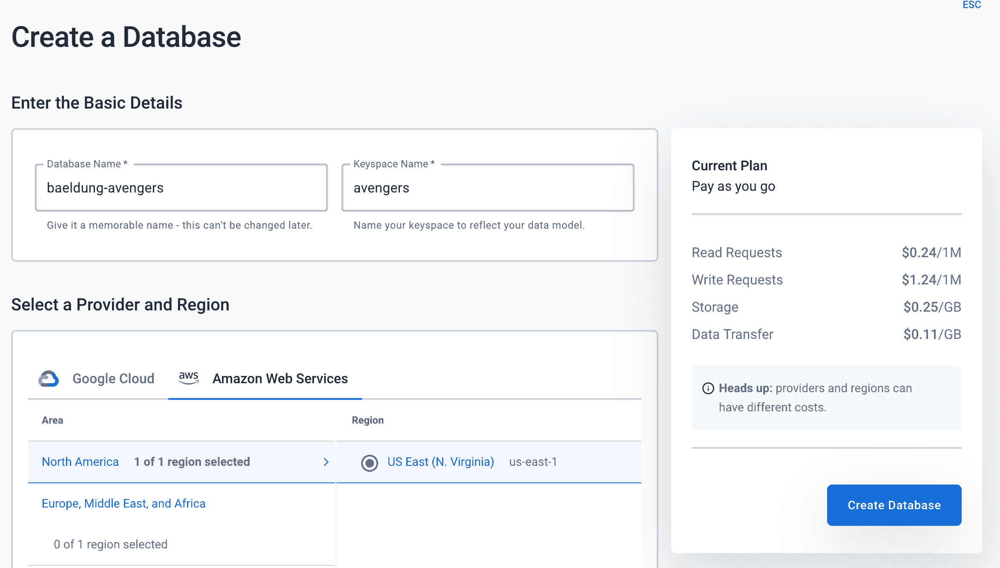
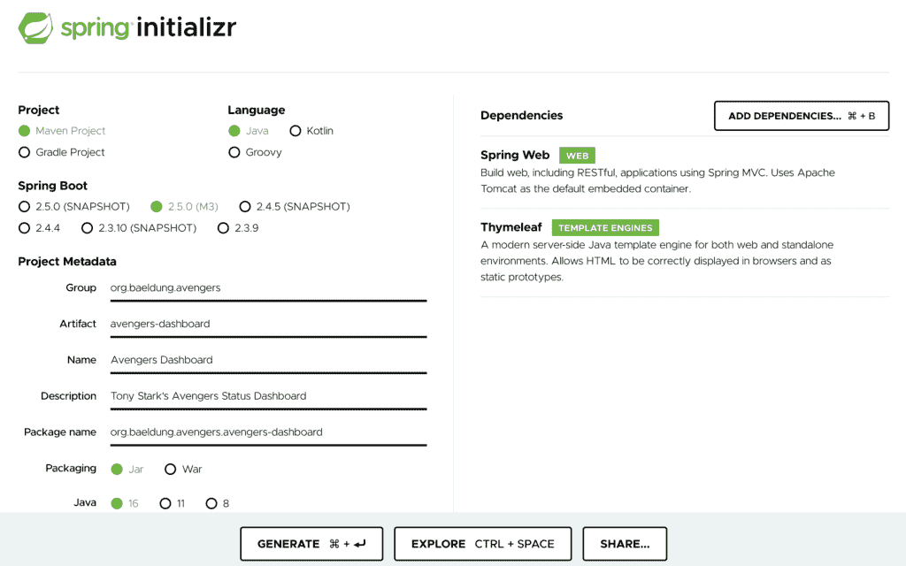

# 使用卡珊德拉，阿斯特拉和星际之门建造一个仪表板

> 原文：<https://web.archive.org/web/20220930061024/https://www.baeldung.com/cassandra-astra-stargate-dashboard>

## **1。简介**

在本文中，我们将构建“托尼·斯塔克复仇者状态仪表板”，复仇者使用它来监控团队成员的状态。

这将使用 [DataStax Astra](https://web.archive.org/web/20220625170842/https://dtsx.io/3ih9uqv) 构建，一个由 [Apache Cassandra](https://web.archive.org/web/20220625170842/https://cassandra.apache.org/) 支持的 DBaaS 使用 [Stargate](https://web.archive.org/web/20220625170842/https://stargate.io/?utm_medium=referral&utm_source=baeldung&utm_campaign=series-1-of-3&utm_content=avengers-dash-series-1) 提供额外的 API 来使用它。在此之上，我们将使用一个 Spring Boot 应用程序来呈现仪表板并显示正在发生的事情。

我们将使用 Java 16 构建它，所以在继续之前，请确保它已经安装并准备好使用。

## 2.Astra 是什么？

DataStax Astra 是一个数据库即服务产品，由 Apache Cassandra 提供支持。这为我们提供了一个完全托管、完全管理的 Cassandra 数据库，我们可以用它来存储我们的数据，其中包括 Cassandra 在可扩展性、高可用性和性能方面提供的所有功能。

除此之外，Astra 还整合了 Stargate 数据平台，通过不同的 API 公开完全相同的底层数据。这使我们能够使用 REST 和 GraphQL APIs 访问传统的 Cassandra 表——这两种 API 彼此之间以及与更传统的 CQL API 之间 100%兼容。这些可以使访问我们的数据变得非常灵活，只需要一个标准的 HTTP 客户端——比如 Spring `RestTemplate`。

它还提供了一个 JSON 文档 API，允许更加灵活的数据访问。有了这个 API，就不需要模式，如果需要，每条记录都可以是不同的形状。此外，记录可以根据需要变得复杂，支持 JSON 表示数据的全部功能。

不过这也有代价——文档 API 与其他 API 不可互换，因此提前决定数据需要如何建模以及哪些 API 最适合访问数据非常重要。

## **3。我们的应用数据模型**

我们正在围绕 Cassandra 之上的 Astra 系统构建我们的系统。这将直接反映在我们对数据建模的方式上。

Cassandra 旨在以非常高的吞吐量处理大量数据，并以表格形式存储记录。Astra 增加了一些替代 API——REST 和 graph QL——以及使用文档 API 表示文档和简单表格数据的能力。

这仍然由 Cassandra 支持，它以不同的方式进行模式设计。在现代系统中，空间不再是一个限制因素。复制数据不再是问题，不再需要跨数据集合或分区的连接。这意味着我们可以在我们的集合中反规范化我们的数据以满足我们的需要。

**因此，我们的数据模型将围绕两个集合构建——`events`和`statuses`。**`events`收藏是曾经发生过的每个状态事件的记录——这可能会变得非常大，这是卡桑德拉的理想选择。这将在下一篇文章中详细讨论。

此集合中的记录将如下所示:

| 复仇者 | 猎鹰 |
| 时间戳 | 2021-04-02T14:23:12Z |
| 纬度 | 40.714558 |
| 经度 | -73.975029 |
| 状态 | Zero point seven two |

这给了我们一个事件更新，给出了更新的准确时间戳和位置，以及复仇者状态的百分比值。

`statuses`集合包含一个包含仪表板数据的文档，仪表板数据是进入`events` 集合的数据的非规范化的汇总视图。该文档将类似于以下内容:

```
{
    "falcon": {
	"realName": "Sam Wilson",
	"location": "New York",
	"status": "INJURED",
	"name": "Falcon"
    },
    "wanda": {
        "realName": "Wanda Maximoff",
        "location": "New York",
        "status": "HEALTHY"
    }
}
```

这里我们有一些不变的一般数据——`name` 和`realName`字段——我们有一些从这个复仇者的最近事件中生成的汇总数据——`location`来自`latitude`和`longitude`值，而`status`是事件中`status`字段的一般汇总。

本文主要关注`statuses`集合，并使用文档 API 访问它。我们的下一篇文章将展示如何使用基于行的数据的`events`集合。

## **4。如何设置 data tax Astra**

在我们开始应用程序之前，我们需要一个数据存储。我们将使用 DataStax Astra 的 Cassandra 产品。开始之前，我们需要[向 Astra](https://web.archive.org/web/20220625170842/https://astra.datastax.com/register) 注册一个免费账户，并创建一个新的数据库。这需要为数据库和内部的密钥空间取一个合理的名称:

[](/web/20220625170842/https://www.baeldung.com/wp-content/uploads/2021/05/db-setup.png)

(注意–屏幕在发布时是准确的，但此后可能会发生变化)

这需要几分钟的时间来设置。一旦完成，我们将需要创建一个访问令牌。

为此，我们需要访问新创建的数据库的“Settings”选项卡，并生成一个令牌:

[](/web/20220625170842/https://www.baeldung.com/wp-content/uploads/2021/05/db-token.png)

一旦所有这些都完成了，我们还需要我们的数据库细节。这包括:

*   数据库 ID
*   地区
*   Keyspace(键空间)

这些可以在“连接”选项卡上找到。

最后，我们需要一些数据。出于本文的目的，我们使用一些预先填充的数据。这可以在 shell 脚本[这里](https://web.archive.org/web/20220625170842/https://github.com/Baeldung/datastax-cassandra/blob/main/avengers-dashboard/data.sh)中找到。

## **5。如何设置 Spring Boot**

我们将使用 [Spring Initializr](https://web.archive.org/web/20220625170842/https://start.spring.io/) 创建我们的新应用程序；**我们也将使用 Java 16——允许我们使用[记录](/web/20220625170842/https://www.baeldung.com/java-record-keyword)。**这反过来意味着我们需要 Spring Boot 2.5-目前这意味着 2.5.0-M3。

此外，我们需要 Spring Web 和百里香叶作为依赖项:

[](/web/20220625170842/https://www.baeldung.com/wp-content/uploads/2021/05/spring-initaliz-avengers.png)

一旦准备好了，我们可以下载并解压到某个地方，我们就可以开始构建我们的应用程序了。

在继续之前，我们还需要配置我们的 Cassandra 凭证。这些都是从阿斯特拉仪表板上获取的信息:

```
ASTRA_DB_ID=e26d52c6-fb2d-4951-b606-4ea11f7309ba
ASTRA_DB_REGION=us-east-1
ASTRA_DB_KEYSPACE=avengers
ASTRA_DB_APPLICATION_TOKEN=AstraCS:xxx-token-here 
```

纯粹出于本文的目的，这些秘密被这样管理。在实际应用中，应该安全地管理它们，例如使用 [Vault](/web/20220625170842/https://www.baeldung.com/vault) 。

## 6.编写文档客户端

为了与 Astra 交互，我们需要一个能够进行必要 API 调用的客户端。这将直接作用于 Astra 公开的[文档 API](https://web.archive.org/web/20220625170842/https://docs.datastax.com/en/astra/docs/document-api.html) ，允许我们的应用程序作用于丰富的文档。出于这里的目的，我们需要能够通过 ID 获取单个记录，并提供对该记录的部分更新。

为了管理这一点，我们将编写一个封装所有这一切的`DocumentClient` bean:

```
@Repository
public class DocumentClient {
  @Value("https://${ASTRA_DB_ID}-${ASTRA_DB_REGION}.apps.astra.datastax.com/api/rest/v2/namespaces/${ASTRA_DB_KEYSPACE}")
  private String baseUrl;

  @Value("${ASTRA_DB_APPLICATION_TOKEN}")
  private String token;

  @Autowired
  private ObjectMapper objectMapper;

  private RestTemplate restTemplate;

  public DocumentClient() {
    this.restTemplate = new RestTemplate();
    this.restTemplate.setRequestFactory(new HttpComponentsClientHttpRequestFactory());
  }

  public <T> T getDocument(String collection, String id, Class<T> cls) {
    var uri = UriComponentsBuilder.fromHttpUrl(baseUrl)
      .pathSegment("collections", collection, id)
      .build()
      .toUri();
    var request = RequestEntity.get(uri)
      .header("X-Cassandra-Token", token)
      .build();
    var response = restTemplate.exchange(request, cls);
    return response.getBody();
  }

  public void patchSubDocument(String collection, String id, String key, Map<String, Object> updates) {
    var updateUri = UriComponentsBuilder.fromHttpUrl(baseUrl)
      .pathSegment("collections", collection, id, key)
      .build()
      .toUri();
    var updateRequest = RequestEntity.patch(updateUri)
      .header("X-Cassandra-Token", token)
      .body(updates);
    restTemplate.exchange(updateRequest, Map.class);
  } 
} 
```

这里，我们的`baseUrl`和`token`字段是根据我们之前定义的属性配置的。然后我们有一个`getDocument()` 方法可以调用 Astra 从期望的集合中获取指定的记录，还有一个`patchSubDocument()`方法可以调用 Astra 来修补集合中任何单个文档的一部分。

这就是与 Astra 的文档 API 进行交互所需的全部内容，因为它只是通过 HTTP 交换 JSON 文档。

注意，我们需要改变我们的`RestTemplate`所使用的请求工厂。这是因为 Spring 使用的默认方法不支持 HTTP 调用上的 PATCH 方法。

## **7。通过文档 API** 获取复仇者状态

**我们的第一个需求是能够检索我们团队成员的状态。这是我们之前提到的`statuses`集合中的文档。**这将建立在我们之前写的`DocumentClient`之上。

### 7.1。从 Astra 检索状态

为了表示这些，我们需要一个[记录](/web/20220625170842/https://www.baeldung.com/java-record-keyword),如下所示:

```
public record Status(String avenger, 
  String name, 
  String realName, 
  String status, 
  String location) {}
```

我们还需要一个记录来表示从 Cassandra 中检索到的所有状态:

```
public record Statuses(Map<String, Status> data) {}
```

这个`Statuses`类表示与文档 API 返回的 JSON 完全相同的 JSON，因此可以用来通过`RestTemplate`和 Jackson 接收数据。

然后，我们需要一个服务层从 Cassandra 检索状态，并返回它们以供使用:

```
@Service
public class StatusesService {
  @Autowired
  private DocumentClient client;

  public List<Status> getStatuses() {
    var collection = client.getDocument("statuses", "latest", Statuses.class);

    var result = new ArrayList<Status>();
    for (var entry : collection.data().entrySet()) {
      var status = entry.getValue();
      result.add(new Status(entry.getKey(), status.name(), status.realName(), status.status(), status.location()));
    }

    return result;
  }  
} 
```

**在这里，我们使用我们的客户端从“状态”集合中获取记录，在我们的`Statuses`记录中表示。**检索后，我们只提取文档返回给调用者。注意，我们必须重新构建`Status`对象来包含 id，因为它们实际上存储在 Astra 文档的更高层。

### 7.2。显示仪表板

现在我们有了一个服务层来检索数据，我们需要对它做些什么。这意味着一个控制器来处理来自浏览器的 HTTP 请求，然后呈现一个显示实际仪表板的模板。

首先，控制器:

```
@Controller
public class StatusesController {
  @Autowired
  private StatusesService statusesService;

  @GetMapping("/")
  public ModelAndView getStatuses() {
    var result = new ModelAndView("dashboard");
    result.addObject("statuses", statusesService.getStatuses());

    return result;
  }
} 
```

这将从 Astra 中检索状态，并将它们传递给模板进行渲染。

我们的主“dashboard.html”模板如下:

```
<!doctype html>
<html lang="en">
<head>
  <meta charset="utf-8" />
  <meta name="viewport" content="width=device-width, initial-scale=1" />
  <link href="https://cdn.jsdelivr.net/npm/[[email protected]](/web/20220625170842/https://www.baeldung.com/cdn-cgi/l/email-protection)/dist/css/bootstrap.min.css" rel="stylesheet"
    integrity="sha384-eOJMYsd53ii+scO/bJGFsiCZc+5NDVN2yr8+0RDqr0Ql0h+rP48ckxlpbzKgwra6" crossorigin="anonymous" />
  <title>Avengers Status Dashboard</title>
</head>
<body>
  <nav class="navbar navbar-expand-lg navbar-dark bg-dark">
    <div class="container-fluid">
      <a class="navbar-brand" href="#">Avengers Status Dashboard</a>
    </div>
  </nav>

  <div class="container-fluid mt-4">
    <div class="row row-cols-4 g-4">
      <div class="col" th:each="data, iterstat: ${statuses}">
        <th:block th:switch="${data.status}">
          <div class="card text-white bg-danger" th:case="DECEASED" th:insert="~{common/status}"></div>
          <div class="card text-dark bg-warning" th:case="INJURED" th:insert="~{common/status}"></div>
          <div class="card text-dark bg-warning" th:case="UNKNOWN" th:insert="~{common/status}"></div>
          <div class="card text-white bg-secondary" th:case="RETIRED" th:insert="~{common/status}"></div>
          <div class="card text-dark bg-light" th:case="*" th:insert="~{common/status}"></div>
        </th:block>
      </div>
    </div>
  </div>

  <script src="https://cdn.jsdelivr.net/npm/[[email protected]](/web/20220625170842/https://www.baeldung.com/cdn-cgi/l/email-protection)/dist/js/bootstrap.bundle.min.js"
    integrity="sha384-JEW9xMcG8R+pH31jmWH6WWP0WintQrMb4s7ZOdauHnUtxwoG2vI5DkLtS3qm9Ekf"
    crossorigin="anonymous"></script>
</body>
</html>
```

这使用了另一个嵌套模板“common/status.html”来显示单个复仇者的状态:

```
<div class="card-body">
  <h5 class="card-title" th:text="${data.name}"></h5>
  <h6 class="card-subtitle"><span th:if="${data.realName}" th:text="${data.realName}"></span> </h6>
  <p class="card-text"><span th:if="${data.location}">Location: <span th:text="${data.location}"></span></span> </p>
</div>
<div class="card-footer">Status: <span th:text="${data.status}"></span></div> 
```

这利用了 [Bootstrap](https://web.archive.org/web/20220625170842/https://getbootstrap.com/) 来格式化我们的页面，并为每个复仇者显示一张卡片，根据状态进行着色，并显示该复仇者的当前详细信息:

[](/web/20220625170842/https://www.baeldung.com/wp-content/uploads/2021/05/avengers-dashboard.png)

## 8.通过文档 API 更新状态

 **我们现在可以显示复仇者联盟成员的当前状态数据。我们缺少的是用现场反馈更新它们的能力。这将是一个新的 HTTP 控制器，可以通过文档 API 更新我们的文档，以反映最新的状态细节。

在下一篇文章中，同一个控制器将把最新状态记录到`statuses`集合中，也记录到`events`集合中。这将允许我们记录事件的整个历史，以便以后从相同的输入流进行分析。因此，控制器的输入将是单个事件，而不是汇总的状态。

### 8.1。更新 Astra 中的状态

**因为我们将状态数据表示为单个文档，所以我们只需要更新它的适当部分。**这使用了我们客户的`patchSubDocument()`方法，为确定的复仇者指向正确的部分。

我们用执行更新的`StatusesService`类中的新方法来实现这一点:

```
public void updateStatus(String avenger, String location, String status) throws Exception {
  client.patchSubDocument("statuses", "latest", avenger, 
    Map.of("location", location, "status", status));
} 
```

### 8.2。更新状态的 API

**我们现在需要一个可以被调用的控制器来触发这些更新。**这将是一个新的`RestController`端点，接受复仇者 ID 和最新事件详情:

```
@RestController
public class UpdateController {
  @Autowired
  private StatusesService statusesService;

  @PostMapping("/update/{avenger}")
  public void update(@PathVariable String avenger, @RequestBody UpdateBody body) throws Exception {
    statusesService.updateStatus(avenger, lookupLocation(body.lat(), body.lng()), getStatus(body.status()));
  }

  private String lookupLocation(Double lat, Double lng) {
    return "New York";
  }

  private String getStatus(Double status) {
    if (status == 0) {
      return "DECEASED";
    } else if (status > 0.9) {
      return "HEALTHY";
    } else {
      return "INJURED";
    }
  }

  private static record UpdateBody(Double lat, Double lng, Double status) {}
}
```

这允许我们接受特定复仇者的请求，包含该复仇者的当前纬度、经度和状态。然后我们将这些值转换成状态值，并将它们传递给`StatusesService`来更新状态记录。

在未来的文章中，这将被更新，也将创建一个新的事件记录，这样我们就可以跟踪每个复仇者的整个历史事件。

注意，我们没有正确地查找用于经纬度的位置名称——它只是硬编码的。实现这一点有多种选择，但它们超出了本文的范围。

## **9。总结**

在这里，我们已经看到了如何在 Cassandra 的基础上利用 Astra Document API 来构建状态仪表板。由于 Astra 是无服务器的，您的演示数据库在未使用时将会缩小到零，因此您不会继续产生使用费。在下一篇文章中，我们将转而使用 Row APIs，它允许我们以一种非常简单的方式处理大量记录。

本文的所有代码都可以在 GitHub 上找到[。](https://web.archive.org/web/20220625170842/https://github.com/Baeldung/datastax-cassandra/tree/main/avengers-dashboard)**