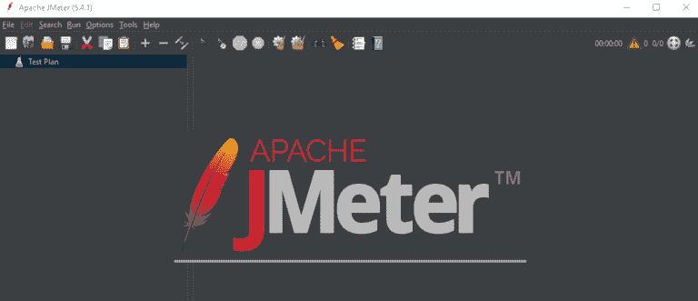
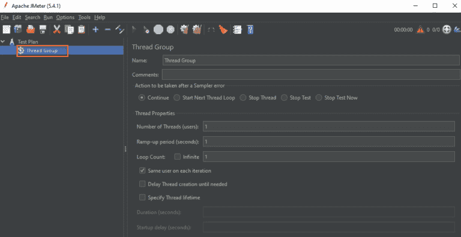
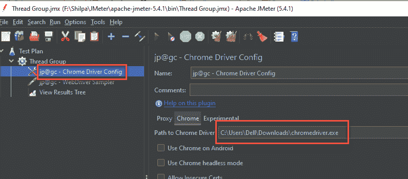
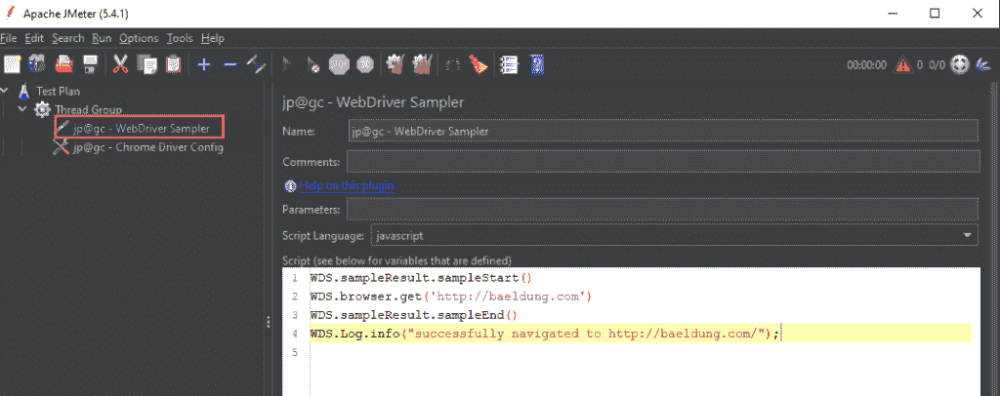
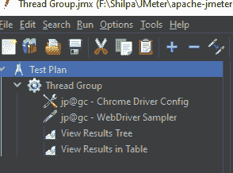

# 使用 JMeter 运行 Selenium 脚本

> 原文：<https://web.archive.org/web/20220930061024/https://www.baeldung.com/selenium-jmeter>

## 1.概观

在本教程中，我们将讨论使用 JMeter 运行 Selenium 脚本的步骤。

## 2.使用 JMeter 的 Selenium 脚本

**JMeter 为性能和负载测试提供开源解决方案。**也可用于功能测试。但是随着 CSS `,` JS 和 HTML5 等技术的进步，我们将越来越多的逻辑和行为推送到客户端。因此，更多的事情增加了浏览器的执行时间。这些事情包括:

*   客户端 Javascript 执行——AJAX、JS 模板等。
*   CSS 转换–3D 矩阵转换、动画等。
*   第三方插件——脸书喜欢双击广告等。

反过来，这可能会影响网站或 web 应用程序的整体性能。但是 JMeter 没有这样一个矩阵来衡量这些感知性能。JMeter 也不能测量客户端的用户体验，比如加载时间或页面呈现，因为 JMeter 不是一个真正的浏览器。

Selenium 之类的 Web 驱动程序可以在客户端(本例中是浏览器)自动执行和收集上面讨论的性能指标。因此，虽然 JMeter 负载测试会给系统带来足够的负载，但 JMeter WebDriver 计划会从用户体验的角度获得响应时间和其他行为。

因此，除了测量性能，我们还可以在使用 JMeter 的 WebDriver 集时测量其他行为。所以让我们进一步讨论这个问题。

## 3.先决条件

在使用 [JMeter](/web/20221222053022/https://www.baeldung.com/jmeter) 运行 [Selenium](/web/20221222053022/https://www.baeldung.com/java-selenium-with-junit-and-testng) 脚本之前，应该满足以下先决条件:

*   我们应该在系统中安装 [JMeter](https://web.archive.org/web/20221222053022/https://jmeter.apache.org/usermanual/get-started.html)
*   接下来，我们应该使用 JMeter 插件管理器安装" [Selenium/WebDriver](https://web.archive.org/web/20221222053022/https://jmeter-plugins.org/wiki/WebDriverSampler/) "插件
*   在系统中下载 [gecko 驱动/chrome 驱动](https://web.archive.org/web/20221222053022/https://chromedriver.chromium.org/)二进制文件

现在我们可以继续前进，创建一个示例 JMeter 项目来运行 Selenium 脚本。

## 4.JMeter 项目

至此，我们已经安装了在 JMeter 中运行 Selenium 脚本的环境。现在，让我们创建一个 JMeter 项目来配置和测试它。我们将创建一个线程组，它将拥有一个 Selenium Web Driver Sampler 实例。我们将在这个采样器中包含一个 Selenium 脚本，然后执行它。

下面给出了详细描述:

首先，我们启动 JMeter GUI:

[](/web/20221222053022/https://www.baeldung.com/wp-content/uploads/2021/06/JMeterStart-768x331-1.png)

**然后我们可以通过点击“编辑- >添加”来添加一个简单的“线程组”，选择线程组**:

[](/web/20221222053022/https://www.baeldung.com/wp-content/uploads/2021/06/createTG-768x395-1.png)

然后，我们需要添加 Chrome 驱动程序配置。现在，我们单击左侧窗格中的 chrome 驱动程序配置，并指定“Chrome 驱动程序路径”:

[](/web/20221222053022/https://www.baeldung.com/wp-content/uploads/2021/06/chromeConfigSetting.png)

请注意，Chrome 浏览器的版本应该与“Chromedrive.exe”版本相匹配，这样脚本才能成功运行。

接下来，我们需要将 web 驱动程序采样器添加到线程组:

[](/web/20221222053022/https://www.baeldung.com/wp-content/uploads/2021/06/WDSampler-1024x406-1.png)

我们可以将下面给出的脚本添加到线程组中:

```
WDS.sampleResult.sampleStart()
WDS.browser.get('http://baeldung.com')
WDS.sampleResult.sampleEnd()
WDS.log.info("successfully navigated to http://baeldung.com/");
```

**最后，让我们添加一个“查看表中的结果”和/或“查看结果树”监听器，以便我们可以查看脚本执行的结果。**

我们在上面创建的线程组如下图所示:

[](/web/20221222053022/https://www.baeldung.com/wp-content/uploads/2021/06/threadGroup1.png)

## 5.运行 Selenium 脚本

现在，我们已经用想要执行的 Selenium 脚本创建了线程组。**接下来，我们“运行线程组”**。

Selenium Web 驱动程序的实例被创建，一个新的 Chrome 驱动程序窗口打开，打开 Baeldung 的主页

[](/web/20221222053022/https://www.baeldung.com/wp-content/uploads/2021/06/output1.png)

从上面的 JMeter 结果表可以看出，我们已经成功执行了包含一个简单的 Selenium 脚本的线程组，该脚本打开了一个新的 Chrome 浏览器窗口，然后打开了指定的网页。这样，我们可以通过在线程组中添加一个 WebDriver 示例并执行它来执行任何 Selenium 脚本。

## 6.结论

在本教程中，我们演示了使用 JMeter 运行 Selenium 脚本。我们通过创建包含 Selenium Web 驱动程序实例的线程组，在 JMeter 中执行了 Selenium 脚本。

GitHub 上的[提供了实现的完整代码。](https://web.archive.org/web/20221222053022/https://github.com/eugenp/tutorials/tree/master/testing-modules/selenium-junit-testng)