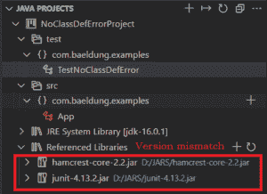
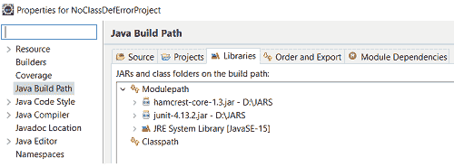
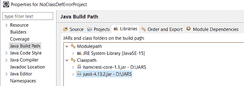

# JUnit 中的 java.lang.NoClassDefFoundError

> 原文：<https://web.archive.org/web/20220930061024/https://www.baeldung.com/junit-noclassdeffounderror>

## 1.概观

在本文中，我们将了解为什么 `java.lang.NoClassDefFoundError`出现在 [JUnit](/web/20220817201726/https://www.baeldung.com/junit) 中，以及如何修复它。这个问题主要与 IDE 的配置有关。因此，我们将关注最流行的 ide:Visual Studio 代码、Eclipse 和 IntelliJ 来重现和解决这个错误。

## 2.什么是`java.lang.NoClassDefFoundError`？

当 Java 运行时运行一个 Java 程序时，它不会一次加载所有的类和依赖项。相反，它调用 Java 类加载器在需要时将类加载到内存中。**加载类时，如果类加载器找不到类的定义，它抛出`NoClassDefFoundError`。**

Java 找不到类的定义有几个原因，它们是:

*   缺少一些相关的罐子，这是最常见的原因。
*   所有 jar 都作为依赖项添加，但是路径错误。
*   依赖关系中的版本不匹配**。**

## 3.VS 代码

为了编写 Junit4 测试用例，我们需要 Junit4 jar。然而， **Junit4 对 `hamcrest-core` jar 有一个内部依赖。**

如果我们没有将`hamcrest-core` jar 作为依赖项添加到类路径中，Java 就会抛出`NoClassDefFoundError`。类路径如下所示:

另一个场景是我们添加了两个 jar，但是版本不匹配。例如，如果我们添加了 JUnit jar 版本 4.13.2 和`hamcrest-core` jar 版本 2.2，则会抛出`NoClassDefFoundError`:

在这两种情况下，打印相同的堆栈跟踪:

[PRE0]

为了解决这两个场景中的错误(缺少依赖项和版本不匹配)，我们需要添加正确的依赖项。Junit4 的正确依赖关系是`junit-4.13.2.jar`和`hamcrest-core-1.3.jar`。将这两个 jar 添加到依赖项(引用的库)中可以解决这个错误。在 VS 代码中添加和移除外部 jar 的指令出现在[这里](https://web.archive.org/web/20220817201726/https://code.visualstudio.com/docs/java/java-project)。我们的参考库部分应设置为:

## 4.黯然失色

在支持 Java 9 和更高版本的 Eclipse IDE 中，我们有一个类路径和一个模块路径。为了解决模块依赖性，我们使用模块路径。然而，**在模块路径中添加外部 jar 并不能使它们对[类加载器](/web/20220817201726/https://www.baeldung.com/java-classloaders)** 可用。因此，类加载器认为它们是缺失的依赖项，并抛出`NoClassDefFoundError`。

因此，如果我们的依赖关系如下图所示，运行 Junit 测试用例会产生一个`NoClassDefFoundError:`

运行 JUnit 测试时生成的堆栈跟踪是:

[PRE1]

在 Eclipse 中，我们需要将 jar 添加到类路径下，而不是模块路径中。因此，要正确添加外部 jar，请遵循以下路径:

右键单击项目->构建路径->配置构建路径

在打开的窗口中，从模块路径下删除 jar，并将它们添加到类路径下。这就解决了`NoClassDefFoundError`。运行 JUnit 的正确类路径应该类似于:

## 5\. IntelliJ

**运行 JUnit 5 测试用例需要 Jupiter 引擎和 Jupiter API。**Jupiter 引擎在内部依赖于 Jupiter API，因此在大多数情况下，只在 pom.xml 中添加 Jupiter 引擎依赖关系就足够了。然而，在我们的`pom.xml`中只添加 Jupiter API 依赖关系，而缺少 Jupiter 引擎依赖关系会导致`NoClassDefFoundError`。

`pom.xml`中的不正确设置如下:

[PRE2]

使用此设置运行一个简单的测试用例会产生以下堆栈跟踪:

[PRE3]

在 IntelliJ 中，为了修正依赖关系，我们需要修正`pom.xml`。修正后的`pom.xml`看起来是这样的:

[PRE4]

或者，我们可以添加`junit-jupiter-engine`，因为添加它会自动将`junit-jupiter-api` jar 添加到类路径中并解决错误。

## 6.摘要

在本文中，我们看到了在 JUnit 中发生`java.lang.NoClassDefFoundError`的不同原因。我们还看到了如何在不同的 ide 中解决错误。本教程的全部代码可以在 GitHub 的[上找到。](https://web.archive.org/web/20220817201726/https://github.com/eugenp/tutorials/tree/master/testing-modules/junit-5)