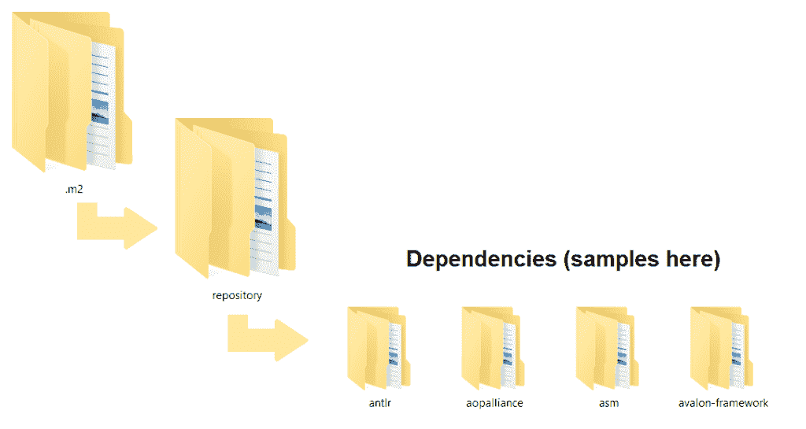

# 使用 Maven 强制存储库更新

> 原文：<https://web.archive.org/web/20220930061024/https://www.baeldung.com/maven-force-update>

## 1.概观

在本教程中，我们将学习如何在本地 [Maven](/web/20220628060751/https://www.baeldung.com/maven) 库损坏时强制更新它。为了做到这一点，我们将使用一个简单的例子来理解为什么一个存储库会被破坏以及如何修复它。

## 2.先决条件

为了学习和运行本教程中的命令，我们需要使用一个 [Spring Initializr](/web/20220628060751/https://www.baeldung.com/spring-boot-custom-starter) 项目并安装一个 JDK 和 Maven。

## 3.Maven 存储库结构

Maven 将项目的所有依赖项保存在`.m2`文件夹中。例如，在下图中，我们可以观察到 [Maven 仓库](/web/20220628060751/https://www.baeldung.com/maven-local-repository)的结构:

正如我们所见，Maven 下载了`repository`文件夹下的所有依赖项。因此，下载到我们的本地存储库对于在运行时访问所有需要的代码是必要的。

## 4.正在下载**依赖关系**

我们知道 Maven 基于`pom.xml`文件配置工作。**当 Maven 执行这个`pom.xml`文件时，依赖项将从一个中央 Maven 资源库下载，并放入您本地的** **Maven 资源库**。如果我们的本地存储库中已经有了依赖项，Maven 将不会下载它们。

当我们执行以下命令时，下载发生:

[PRE0]

以上两者都包括执行以下命令:

[PRE1]

因此，我们可以通过运行`dependency:resolve`命令来单独解决依赖关系，而无需使用软件包或安装。

## 5.损坏的**依赖关系**

下载依赖项时，可能会发生网络故障，导致依赖项损坏。中断的依赖项下载是损坏的主要原因。Maven 将相应地显示一条消息:

`Could not resolve dependencies for project ...`

接下来让我们看看如何解决这个问题。

## 6.自动修复损坏的依赖关系

Maven 通常在通知构建失败时显示损坏的依赖项:

`Could not transfer artifact [artifact-name-here] ...`

为了解决这个问题，我们可以有自动或手动的方法。此外，我们应该在调试模式下运行任何存储库更新，在`-U`之后添加`-X`选项，以便更好地了解更新过程中发生了什么。

### 6.1.强制更新所有快照依赖关系

正如我们已经知道的，Maven 不会再次下载现有的依赖项。因此，为了强制 Maven 更新所有损坏的快照依赖项，我们应该在命令中添加`-U/–update-snapshots` 选项:

[PRE2]

**但是，我们必须记住，如果 Maven 已经下载了快照相关性，并且校验和相同，则选项** **不会重新下载快照相关性。**

这也将打包或安装我们的项目。最后，我们将学习如何在不包含当前工作项目的情况下更新存储库。

### 6.2.依赖性解析目标

我们可以告诉 Maven 解决我们的依赖性并更新快照，而不需要任何打包或安装命令。为此，我们将使用`dependency:resolve`目标，包括`-U `选项:

[PRE3]

### 6.3.清除本地存储库目标

我们知道`-U `只是重新下载损坏的快照依赖关系。因此，在本地发布依赖关系被破坏的情况下，我们可能需要更深入的命令。为此，我们应该使用:

[PRE4]

`dependency:purge-local-repository `的目的是从本地 Maven 存储库中清除(删除并可选地重新解析)工件。默认情况下，工件将被重新解析。

### 6.4.清除本地存储库选项

通过为`resolutionFuzziness`选项指定“`groupId”` ，并使用`include`选项指定要搜索的确切组 ID，可以将清除本地存储库配置为仅针对特定的依赖项组运行:

[PRE5]

**`resolutionFuzziness`选项可以有值:`version`、`artifactId`、`groupId`、`file`。**

上面的例子将搜索并清除`org.slf4j`组中的所有工件。我们还设置了`verbose`选项，这样我们可以看到被删除工件的详细日志。

如果找到任何符合条件的文件，日志将显示如下文本:

[PRE6]

注意，**要指定删除或刷新包含或排除的工件，我们可以使用选项`include/exclude:`**

[PRE7]

## 7.手动删除存储库

**尽管`-U`选项和`purge-local-repository` 可能会解决损坏的依赖项，而无需刷新所有的依赖项。`m2`本地存储库将导致所有依赖项的强制重新下载。**

当有旧的或者可能损坏的依赖项时，这可能是有用的。那么简单的重新打包或重新安装就可以了。此外，我们可以使用`dependency:resolve` 选项来单独解决项目的依赖性。

## 8.结论

在本教程中，我们讨论了 Maven 强制更新本地存储库的选项和目标。

所使用的示例是简单的 Maven 命令，通过适当的`pom.xml`配置，这些命令可以用于任何项目。