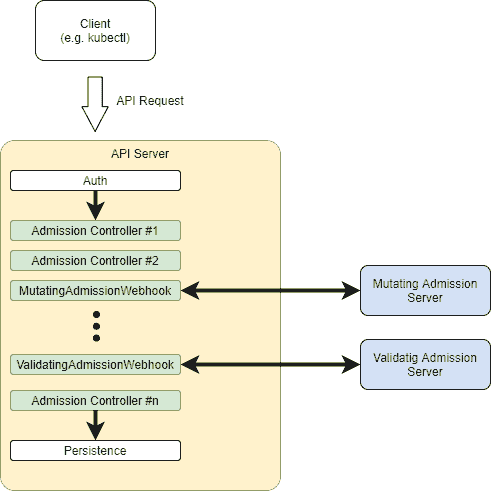

# 用 Java 创建 Kubertes 准入控制器

> 原文：<https://web.archive.org/web/20220930061024/https://www.baeldung.com/java-kubernetes-admission-controller>

## 1.介绍

在使用 Kubernetes 一段时间后，我们很快就会意识到其中包含了大量的样板代码。即使对于一个简单的服务，我们也需要提供所有需要的细节，通常采用相当冗长的 YAML 文档的形式。

此外，当处理在给定环境中部署的多个服务时，那些 YAML 文档往往包含许多重复的元素。例如，我们可能想要给所有部署添加一个给定的`ConfigMap`或一些边柜容器。

在本文中，我们将探索如何坚持 DRY 原则，并使用 Kubernetes 准入控制器避免所有这些重复的代码。

## 2.什么是准入控制器？

准入控制器是 Kubernetes 使用的一种机制，用于在 API 请求被认证之后、执行之前对其进行预处理。

API 服务器进程(`kube-apiserver`)已经附带了几个内置控制器，每个控制器负责 API 处理的一个特定方面。

`AllwaysPullImage`是一个很好的例子:该准入控制器修改 pod 创建请求，因此映像拉取策略变为“总是”，而不管通知的值。[Kubernetes 文档](https://web.archive.org/web/20220625082950/https://kubernetes.io/docs/reference/access-authn-authz/admission-controllers/#what-does-each-admission-controller-do)包含标准准入控制器的完整列表。

除了那些实际上作为`kubeapi-server`进程的一部分运行的内置控制器，Kubernetes 还支持外部准入控制器。**在这种情况下，准入控制器只是一个 HTTP 服务，处理来自 API 服务器的请求。**

此外，这些外部准入控制器可以动态地添加和删除，因此命名为动态准入控制器。这将产生如下所示的处理管道:

在这里，我们可以看到，传入的 API 请求一旦通过身份验证，就会通过每个内置的准入控制器，直到到达持久层。

## 3.准入控制器类型

目前，有两种类型的准入控制器:

*   变异准入控制器
*   验证准入控制器

正如它们的名字所暗示的，主要区别是它们对传入请求的处理类型。变异控制器可以在将请求传递给下游之前修改它们，而验证控制器只能验证它们。

关于这些类型的重要一点是 API 服务器执行它们的顺序:首先是变异控制器，然后是验证控制器。这是有意义的，因为只有当我们有最终请求时，验证才会发生，最终请求可能被任何变异的控制器改变。

### 3.1.入学审查请求

内置准入控制器(变异和验证)使用简单的 HTTP 请求/响应模式与外部准入控制器通信:

*   请求:一个`AdmissionReview` JSON 对象，在其`request`属性中包含要处理的 API 调用
*   响应:一个`AdmissionReview ` JSON 对象，在其`response`属性中包含结果

这是一个请求的例子:

[PRE0]

在可用字段中，有些字段特别重要:

*   `operation`:这表明该请求是否将创建、修改或删除资源
*   *对象:*正在处理的资源的规格细节。
*   `oldObject: `修改或删除资源时，该字段包含已有的资源

预期的响应也是一个`AdmissionReview` JSON 对象，用一个`response `字段代替`response:`

[PRE1]

让我们分析一下`response `对象的字段:

*   `uid`:该字段的值必须与传入的`request`字段中的相应字段相匹配
*   `allowed:` 审核操作的结果。`true`表示 API 调用处理可以进入下一步
*   `patchType:` 仅对变异准入控制器有效。指示由`AdmissionReview`请求返回的补丁类型
*   `patch`:要在传入对象中应用的补丁。下一部分的详细信息

### 3.2.补丁数据

**出现在来自变异准入控制器的响应中的`patch` 字段告诉 API 服务器在请求可以继续进行**之前需要改变什么。它的值是一个 Base64 编码的 [JSONPatch](/web/20220625082950/https://www.baeldung.com/spring-rest-json-patch) 对象，包含 API 服务器用来修改传入 API 调用体的指令数组:

[PRE2]

在本例中，我们有一条指令将一个卷附加到部署规范的`volumes`数组中。**处理补丁时的一个常见问题是，除非元素已经存在于原始对象**中，否则无法将元素添加到现有数组中。这在处理 Kubernetes API 对象时尤其令人恼火，因为最常见的对象(例如部署)包括可选数组。

例如，只有当传入的`deployment`已经至少有一个卷时，前面的例子才有效。如果不是这种情况，我们必须使用稍微不同的指令:

[PRE3]

这里，我们定义了一个新的`volumes`字段，它的值是一个包含卷定义的数组。以前，该值是一个对象，因为这是我们附加到现有数组的内容。

## 4.样本用例:等待

现在我们对准入控制器的预期行为有了基本的了解，让我们写一个简单的例子。Kubernetes 中的一个常见问题是管理运行时依赖，尤其是在使用微服务架构时。例如，如果一个特定的微服务需要访问一个数据库，如果前者离线，那么启动就没有意义。

**为了解决这样的问题，我们可以在启动主容器**之前使用一个`initContainer `和我们的`pods`来做这个检查。一个简单的方法是使用流行的 [`wait-for-it`](https://web.archive.org/web/20220625082950/https://github.com/vishnubob/wait-for-it) shell 脚本，也可以作为 [docker 镜像](https://web.archive.org/web/20220625082950/https://hub.docker.com/r/willwill/wait-for-it/)。

该脚本接受一个`hostname`和`port`参数，并试图连接到它。如果测试成功，容器退出并显示成功状态代码，pod 初始化继续进行。否则，它将失败，关联的控制器将根据定义的策略继续重试。将这种飞行前检查外部化最酷的一点是，任何相关的 Kubernetes 服务都会注意到这个故障。因此，不会向它发送任何请求，这有可能提高整体弹性。

### 4.1.接纳控制器的情况

这是添加了`wait-for-it` init 容器的典型部署:

[PRE4]

虽然没有那么复杂(至少在这个简单的例子中)，但是向每个部署添加相关的代码有一些缺点。**特别是，我们给部署作者强加了一个负担，让他们具体说明应该如何进行依赖检查**。相反，更好的体验只需要定义`what`应该被测试。

进入我们的准入控制器。**为了解决这个用例，我们将编写一个变异准入控制器，它在资源中寻找特定注释的存在，如果存在**，就给它添加`initContainer`。这就是带注释的部署规范的样子:

[PRE5]

这里，我们使用注释`com.baeldung/wait-for-it`来表示我们必须测试的主机和端口。**然而，重要的是，没有任何事情告诉我们应该进行测试。**理论上，我们可以在保持部署规范不变的情况下以任何方式改变测试。

现在，让我们继续实现。

### 4.2.项目结构

如前所述，外部准入控制器只是一个简单的 HTTP 服务。因此，我们将创建一个 Spring Boot 项目作为我们的基本结构。对于这个例子，这就是我们所需要的 Spring Web Reactive starter，但是，对于一个现实世界的应用程序来说，添加像 T2 执行器 T3 和/或一些 T4 云配置 T5 这样的特性也是有用的。

### 4.3.处理请求

接纳请求的入口点是一个简单的 Spring REST 控制器，它将传入负载的处理委托给一个服务:

[PRE6]

这里，我们使用一个`ObjectNode`作为输入参数。这意味着我们将尝试处理 API 服务器发送的任何格式良好的 JSON。**这种松散方法的原因是，在撰写本文时，仍然没有为这个有效载荷**发布官方模式。在这种情况下，使用非结构化类型意味着一些额外的工作，但确保我们的实现能够更好地处理特定 Kubernetes 实现或版本决定扔给我们的任何额外字段。

此外，假设请求对象可以是 Kubernetes API 中的任何可用资源，那么在这里添加太多的结构并没有多大帮助。

### 4.4.修改准入请求

肉的加工发生在`AdmissionService`类中。这是一个用单个公共方法注入控制器的`@Component`类:`processAdmission.`该方法处理传入的审查请求并返回适当的响应。

完整的代码可以在网上找到，基本上由一长串 JSON 操作组成。大部分都是琐碎的，但一些摘录值得一些解释:

[PRE7]

第一，为什么要加“禁用”属性？**事实证明，在一些高度受控的环境中，更改现有部署的配置参数可能比删除和/或更新它更容易**。因为我们使用了 [`@ConfigurationProperties` 机制](/web/20220625082950/https://www.baeldung.com/configuration-properties-in-spring-boot)来填充这个属性，所以它的实际值可以来自多种来源。

接下来，我们测试缺少的注释，我们将把它视为我们应该保持部署不变的标志。这种方法确保了我们在这种情况下想要的“选择加入”行为。

另一个有趣的片段来自于`injectInitContainer()`方法中的 JSONPatch 生成逻辑:

[PRE8]

因为不能保证传入的规范包含`initContainers`字段，所以我们必须处理两种情况:它们可能缺失或者存在。如果它丢失了，我们使用一个`ObjectMapper`实例`(om`来创建一个新的`ArrayNode`。否则，我们就使用传入数组。

这样做时，我们可以使用一个“添加”补丁指令。**尽管其名称如此，但其行为是创建字段或替换同名的现有字段**。`value`字段总是一个数组，它包括(可能是空的)原始的`initContainers`数组。最后一步添加实际的`wait-for-it`容器:

[PRE9]

因为容器名在一个 pod 中必须是唯一的，所以我们只是在一个固定的前缀上添加一个随机的 UUID。这避免了与现有容器的任何名称冲突。

### 4.5.部署

开始使用准入控制器的最后一步是将其部署到目标 Kubernetes 集群。正如所料，这需要编写一些 YAML 或使用类似于 [Terraform](/web/20220625082950/https://www.baeldung.com/ops/terraform-intro) 的工具。不管怎样，这些都是我们需要创造的资源:

*   运行我们的准入控制器。最好旋转该服务的多个副本，因为失败可能会阻止任何新的部署
*   将来自 API 服务器的请求路由到运行准入控制器的可用 pod
*   描述哪些 API 调用应该被路由到我们的`Service`的`MutatingWebhookConfiguration`资源

例如，假设我们希望 Kubernetes 在每次创建或更新部署时使用我们的准入控制器。在`MutatingWebhookConfiguration`文档中，我们将看到这样一个`rule`定义:

[PRE10]

关于我们的服务器，重要的一点是:Kubernetes 要求 HTTPS 与外部准入控制器通信。这意味着我们需要为 SpringBoot 服务器提供适当的证书和私钥。请查看用于部署样本准入控制器的 Terraform 脚本，以了解实现此目的的一种方法。

另外，快速提示:**虽然在文档中没有提到，但是一些 Kubernetes 实现(例如 GCP)需要使用端口 443** ，所以我们需要改变 SpringBoot HTTPS 端口的默认值(8443)。

### 4.6.测试

一旦我们准备好了部署工件，最后是时候在现有集群中测试我们的准入控制器了。在我们的例子中，我们使用 Terraform 来执行部署，所以我们所要做的就是一个`apply`:

[PRE11]

完成后，我们可以使用`kubectl`检查部署和准入控制器的状态:

[PRE12]

现在，让我们创建一个简单的 nginx 部署，包括我们的注释:

[PRE13]

我们可以检查相关的日志，看看`wait-for-it` init 容器确实被注入了:

[PRE14]

为了确保万无一失，让我们检查一下 YAML 的部署:

[PRE15]

这个输出显示了我们的准入控制器添加到部署中的`initContainer `。

## 5.结论

在本文中，我们介绍了如何用 Java 创建 Kubernetes 准入控制器，并将其部署到现有的集群中。

像往常一样，例子的完整源代码可以在 GitHub 上找到[。](https://web.archive.org/web/20220625082950/https://github.com/eugenp/tutorials/tree/master/kubernetes/k8s-admission-controller)