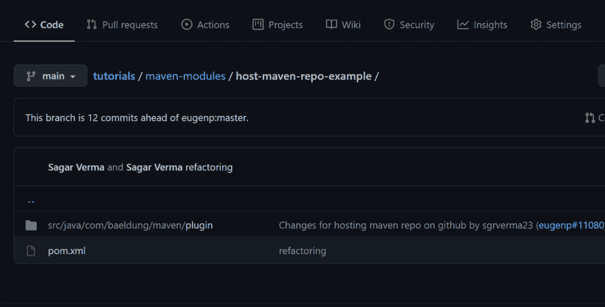
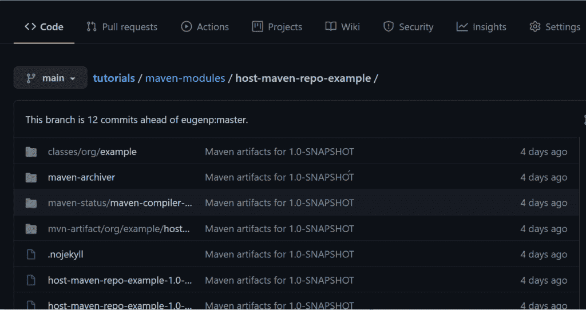

# 在 GitHub 上托管 Maven 存储库

> 原文：<https://web.archive.org/web/20220930061024/https://www.baeldung.com/maven-repo-github>

## 1.概观

在本教程中，我们将了解如何使用`site-maven plugin`在 GitHub 上托管一个带有源代码的 Maven 存储库。这是使用像 Nexus 这样的存储库的一个可承受的替代方案。

## 2.先决条件

如果我们还没有，我们需要在 GitHub 上为 Maven 项目创建一个 repo。在本文中，我们使用一个存储库“`host-maven-repo-example`”和分支“`main`”。这是 GitHub 上的一个空回购:

## 3.Maven 项目

让我们创建一个简单的 Maven 项目。我们会把这个项目生成的工件推送到 GitHub。

这个项目的`pom.xml`如下:

[PRE0]

首先，我们需要**在我们的项目**中本地创建一个内部回购。在推送到 GitHub 之前，Maven 工件将被部署到项目构建目录中的这个位置。

我们将把本地回购定义添加到我们的`pom.xml`:

[PRE1]

现在，让**将 [`maven-deploy-plugin`](https://web.archive.org/web/20220717092619/https://maven.apache.org/plugins/maven-deploy-plugin/) 配置**添加到我们的`pom.xml`中。我们将使用这个插件将我们的工件添加到目录`${project.build.directory}/mvn-artifact`中的本地存储库中:

[PRE2]

另外，**如果我们想将带有 Maven 工件的源文件推送到 GitHub，那么我们也需要包含源代码插件**:

[PRE3]

一旦上述配置和插件被添加到`pom.xml`，构建**将在本地**的目录`target/mvn-artifact`中部署 Maven 工件。

现在，**下一步是将这些工件从本地目录**部署到 GitHub。

## 4.配置 GitHub 认证

在将工件部署到 GitHub 之前，我们将在`~/.` `m2/settings.xml`中配置认证信息。这是为了让`site-maven-plugin`能够将工件推送到 GitHub。

根据我们想要的认证方式，我们将向我们的`settings.xml`添加两个配置中的一个。接下来让我们检查这些选项。

### 4.1.使用 GitHub 用户名和密码

要使用 GitHub 用户名和密码，我们将在我们的`settings.xml`中配置它们:

[PRE4]

### 4.2.使用个人访问令牌

**使用 GitHub API 或命令行时，推荐的认证方式是使用[个人访问令牌(PAT)](https://web.archive.org/web/20220717092619/https://docs.github.com/en/github/authenticating-to-github/keeping-your-account-and-data-secure/creating-a-personal-access-token)** :

[PRE5]

## 5.使用`site-maven-plugin`将工件推送到 GitHub

最后一步是**配置 [`site-maven plugin`](https://web.archive.org/web/20220717092619/https://github.com/github/maven-plugins) 推送我们本地的分期回购**。该暂存回购存在于`target`目录中:

[PRE6]

作为一个例子，对于本教程，假设我们有存储库`eugenp/host-maven-repo-example`。那么`repositoryName`标签值将是`host-maven-repo-example`，而`repositoryOwner`标签值将是`eugenp`。

现在，我们将**执行`mvn deploy`命令将工件上传到 GitHub** 。如果不存在，`main`分支将被自动创建。在成功构建之后，在浏览器和`main` 分支下检查 GitHub 上的回购。我们所有的二进制文件都将出现在回购协议中。

在我们的例子中，它看起来像这样:

## 6.结论

最后，我们看到了如何使用`site-maven-plugin`在 GitHub 上托管 Maven 工件。

和往常一样，这些例子的代码可以在 GitHub 的[上找到。](https://web.archive.org/web/20220717092619/https://github.com/eugenp/tutorials/tree/master/maven-modules/host-maven-repo-example)