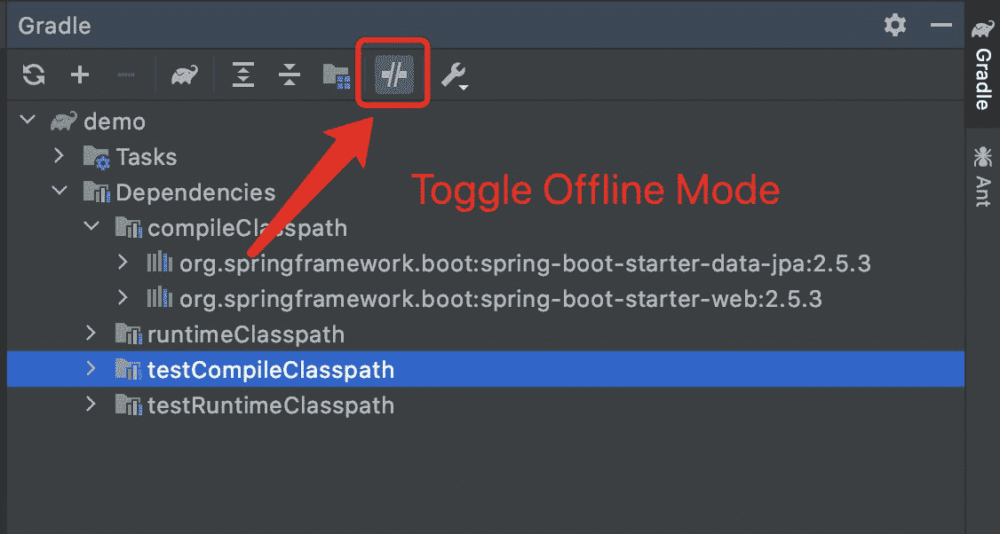
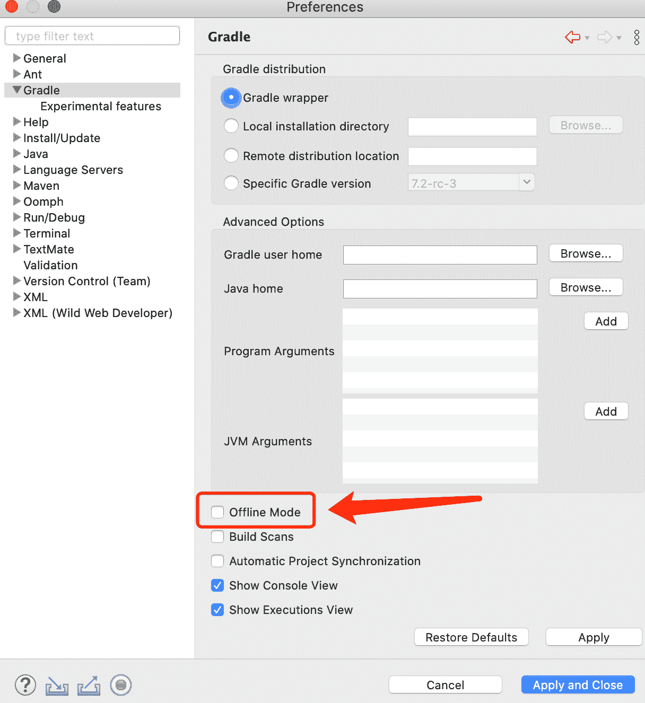

# 梯度离线模式

> 原文：<https://web.archive.org/web/20220930061024/https://www.baeldung.com/gradle-offline-mode>

## 1.概观

Gradle 是全球数百万开发者的首选构建工具，也是 Android 应用的官方构建工具。

我们一般用 Gradle 从网络上下载依赖项，但有时无法访问网络。在这些情况下，Gradle 的离线模式将是有用的。

在这个简短的教程中，我们将讨论如何在 Gradle 中实现离线模式。

## 2.准备

在进入离线模式之前，我们需要先安装 Gradle。然后，我们需要构建我们的应用程序来下载它们所有的依赖项，否则，当我们尝试使用离线模式时会失败。

## 3.离线模式

我们通常在命令行工具或 ide(像 JetBrains IntelliJ IDEA 和 Eclipse)中使用 Gradle，所以我们主要学习如何在这些工具中使用离线模式。

### 3.1.命令行

一旦我们在系统中安装了 Gradle，我们就可以下载依赖项并构建我们的应用程序:

[PRE0]

现在，我们可以通过添加`–offline`选项来实现离线模式:

[PRE1]

### 3.2.JetBrains IntelliJ 想法

当我们使用 IntelliJ 时，我们可以用它来集成和配置 Gradle，然后我们会看到 Gradle 窗口。

如果我们需要使用离线模式，只需进入 Gradle 窗口并点击`Toggle Offline Mode`按钮:

单击按钮启用离线模式后，我们可以重新加载所有依赖项，并发现离线模式可以工作。

### 3.3.黯然失色

最后，我们来看看如何在 Eclipse 中实现离线模式。我们可以通过导航到`Preferences -> Gradle`部分找到 Eclipse 中的 Gradle 配置。我们可以看到`Offline Mode`配置并将其关闭:

结果，我们会发现脱机模式在 Eclipse 中也能工作。

## 4.结论

在这个快速教程中，我们讨论了 Gradle 中的离线模式。我们学习了如何从命令行以及两个流行的 ide 中启用离线模式:Eclipse 和 IntelliJ。