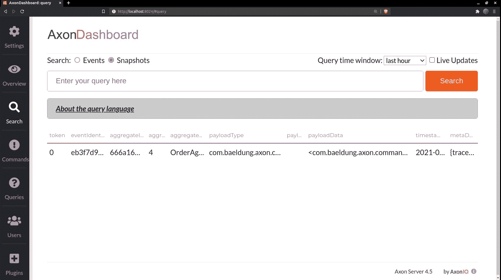

# 轴突中的快照聚集

> 原文:[https://web . archive . org/web/20220930061024/https://www . bael dung . com/axon-snapshot ting-aggregates](https://web.archive.org/web/20220930061024/https://www.baeldung.com/axon-snapshotting-aggregates)

## 1.概观

在本文中，我们将了解 [Axon](/web/20220529020318/https://www.baeldung.com/axon-cqrs-event-sourcing) 如何支持聚合快照。

我们认为这篇文章是我们关于 [轴突](/web/20220529020318/https://www.baeldung.com/axon-cqrs-event-sourcing) 的主要指南的扩展。因此，我们将再次使用 [Axon 框架](https://web.archive.org/web/20220529020318/https://axoniq.io/product-overview/axon-framework) 和 [Axon 服务器](https://web.archive.org/web/20220529020318/https://axoniq.io/product-overview/axon-server) 。我们将在本文的实现中使用前者，后者是事件存储和消息路由器。

## 2.聚合快照

让我们先来了解一下对聚合进行快照意味着什么。**当我们从应用程序中的** **[事件源](https://web.archive.org/web/20220529020318/https://martinfowler.com/eaaDev/EventSourcing.html)开始，一个自然的问题是我如何在我的应用程序中保持源一个聚集的性能？** 虽然有几个优化选项，但最直接的是引入快照功能。

**聚合快照是存储聚合状态的快照以改善加载的过程** **。**当合并快照时，在命令处理之前加载集合变成了两步过程:

1.  检索最新的快照(如果有)，并使用它作为聚合的来源。快照带有一个序列号，定义到哪一点为止它代表聚合的状态。
2.  从快照序列开始检索剩余的事件，并获取剩余的聚合。

如果应该启用快照，则需要一个触发快照创建的过程。快照创建过程应确保快照类似于其创建点的整个聚合状态。最后，聚合加载机制(读:repository)应该首先加载快照，然后加载任何剩余的事件。

## 3.轴突中的聚集快照

Axon 框架支持聚合的快照。要全面了解这一过程，请查看 Axon 参考指南的[](https://web.archive.org/web/20220529020318/https://docs.axoniq.io/reference-guide/axon-framework/tuning/event-snapshots)部分。

**在该框架内，快照流程由两个主要部分组成:**

*   [`Snapshotter`](https://web.archive.org/web/20220529020318/https://apidocs.axoniq.io/latest/org/axonframework/eventsourcing/Snapshotter.html)
*   [`SnapshotTriggerDefinition`](https://web.archive.org/web/20220529020318/https://apidocs.axoniq.io/latest/org/axonframework/eventsourcing/SnapshotTriggerDefinition.html)

**`Snapshotter`是为聚合实例构建快照** **的组件。**默认情况下，框架将使用整个聚合的状态作为快照。

`SnapshotTriggerDefinition`定义了对`Snapshotter`的触发以构建快照。一个触发器可以:

*   在设定数量的事件后，或
*   一旦装载到一定量，或
*   在规定的时间。

快照的存储和检索驻留在事件存储和聚合的存储库中。**为此，** **事件存储包含一个独特的部分来存储快照。** 在 Axon Server 中，一个单独的快照文件反映了这一部分。

快照加载由存储库完成，为此咨询事件存储。**这样，** **加载一个聚合，合并一个快照，完全由框架负责。**

## 4.配置快照

我们将在前面的文章中介绍 [阶域](https://web.archive.org/web/20220529020318/https://github.com/eugenp/tutorials/tree/master/axon) 。快照构建、存储和加载已经由`Snapshotter`、事件存储和存储库负责。

**因此，要将快照引入到`OrderAggregate`中，我们只需配置`SnapshotTriggerDefinition`** 。

### 4.1。定义快照触发器

由于应用程序使用 Spring，我们可以向应用程序上下文添加一个`SnapshotTriggerDefinition`。为此，我们添加了一个`Configuration`类:

```
@Configuration
public class OrderApplicationConfiguration {
    @Bean
    public SnapshotTriggerDefinition orderAggregateSnapshotTriggerDefinition(
      Snapshotter snapshotter,
      @Value("${axon.aggregate.order.snapshot-threshold:250}") int threshold) {
        return new EventCountSnapshotTriggerDefinition(snapshotter, threshold);
    }
}
```

在本例中，我们选择了 [`EventCountSnapshotTriggerDefinition`](https://web.archive.org/web/20220529020318/https://apidocs.axoniq.io/latest/org/axonframework/eventsourcing/EventCountSnapshotTriggerDefinition.html) 。 该定义在聚合的事件计数与“阈值”匹配时触发快照的创建请注意，阈值可通过属性进行配置。

定义还需要`Snapshotter`，Axon 会自动将其添加到应用程序上下文中。因此，在构造触发器定义时，它可以作为一个参数连接。

另一个我们可能用到的实现，是 [`AggregateLoadTimeSnapshotTriggerDefinition`](https://web.archive.org/web/20220529020318/https://apidocs.axoniq.io/latest/org/axonframework/eventsourcing/AggregateLoadTimeSnapshotTriggerDefinition.html) 。如果加载的聚合超过了 `loadTimeMillisThreshold.` ，该定义将触发快照的创建。最后，由于它是一个快照触发器，它还需要 `Snapshotter` 来构建快照。

### 4.2。使用快照触发器

既然`SnapshotTriggerDefinition`是应用程序的一部分，我们需要为`OrderAggregate`设置它。Axon 的 [`Aggregate`](https://web.archive.org/web/20220529020318/https://apidocs.axoniq.io/latest/org/axonframework/spring/stereotype/Aggregate.html) 注释允许我们指定快照触发器的 bean 名称。

在注释上设置 bean 名称将自动为聚合配置触发器定义:

```
@Aggregate(snapshotTriggerDefinition = "orderAggregateSnapshotTriggerDefinition")
public class OrderAggregate {
    // state, command handlers and event sourcing handlers omitted
}
```

**通过将`snapshotTriggerDefinition`设置为构造定义的 bean 名称，我们指示框架为这个聚合配置它。**

## 5.正在拍摄照片

配置将触发定义阈值设置为“250”**该设置表示** **框架在发布****250 个事件后构造一个快照。**尽管这对于大多数应用程序来说是一个合理的默认值，但这会延长我们的测试时间。

因此，为了执行测试，我们将把`axon.aggregate.order.snapshot-threshold`属性调整为‘5’现在，我们可以更容易地测试快照是否有效。

为此，我们启动 Axon 服务器和订单应用程序。在向一个`OrderAggregate`发出足够的命令来生成五个事件之后，我们可以通过在 Axon 服务器仪表板中进行搜索来检查应用程序是否存储了快照。

要搜索快照，我们需要单击左侧选项卡中的“搜索”按钮，选择左上角的“快照”,然后单击右侧的橙色“搜索”按钮。下表应该显示这样一个条目:

[](/web/20220529020318/https://www.baeldung.com/wp-content/uploads/2021/09/axon-server-dashboard-snapshot-search.jpg)

## 6.结论

在本文中，我们了解了什么是聚合快照，以及 Axon Framework 如何支持这一概念。

启用快照唯一需要的是在聚合上配置一个`SnapshotTriggerDefinition`。快照的创建、存储和检索工作都由我们负责。

你可以在 GitHub 上找到订单应用的实现和代码片段 [。关于这个主题的任何其他问题，也可以查看](https://web.archive.org/web/20220529020318/https://github.com/eugenp/tutorials/tree/master/axon) [讨论 AxonIQ](https://web.archive.org/web/20220529020318/https://discuss.axoniq.io/) 。