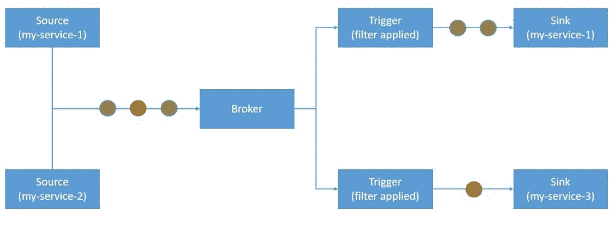

# 具有 Knative 的无服务器架构

> 原文：<https://web.archive.org/web/20220930061024/https://www.baeldung.com/ops/knative-serverless>

## 1.介绍

在本教程中，我们将探索如何在 Kubernetes 平台上部署无服务器工作负载。我们将使用 Knative 作为框架来执行这项任务。在这个过程中，我们还将了解使用 Knative a 作为我们的[无服务器应用](/web/20220529024933/https://www.baeldung.com/cs/serverless-architecture)框架的好处。

## 2.Kubernetes 和 Knative

开发一个没有工具帮助的无服务器应用程序一点也不好玩！还记得 Docker 和 Kubernetes 如何通过微服务架构转变了云原生应用的管理。当然，我们也可以从无服务器领域的框架和工具中获益。嗯，没有理由为什么库伯内特不能帮助我们。

### 2.1.用于无服务器的 Kubernetes

作为一个 CNCF 毕业的项目，Kubernetes 已经成为编排集装箱化工作负载领域的领跑者之一。它允许我们使用像 [Docker](https://web.archive.org/web/20220529024933/https://www.docker.com/) 或 [Buildah](https://web.archive.org/web/20220529024933/https://buildah.io/) 这样的流行工具，自动部署、扩展和管理打包为 [OCI 映像](https://web.archive.org/web/20220529024933/https://github.com/opencontainers/image-spec)的应用程序:

显而易见的好处包括优化资源利用。但是，这不也是我们在无服务器方面的目标吗？

当然，就我们打算通过容器编排服务和无服务器服务实现的目标而言，有许多重叠之处。但是，虽然 Kubernetes 为我们提供了一个自动化许多东西的极好工具，但我们仍然负责配置和管理它。无服务器旨在摆脱这一点。

但是，我们当然可以利用 Kubernetes 平台来运行无服务器环境。这有许多好处。首先，它帮助我们摆脱特定于供应商的 SDK 和 API 将我们锁定在特定的云供应商。底层的 Kubernetes 平台帮助我们相对容易地将我们的无服务器应用从一个云供应商移植到另一个云供应商。

此外，我们从构建应用程序的标准无服务器框架中获益。记住 Ruby on Rails 和 off late 的好处，Spring Boot！最早的一个这样的框架[出自 AWS](https://web.archive.org/web/20220529024933/https://serverlesscode.com/post/serverless-formerly-jaws/) ，以[无服务器](https://web.archive.org/web/20220529024933/https://serverless.com/)而出名。这是一个用 Node.js 编写的开源 web 框架，可以帮助我们在几个 FaaS 服务提供商上部署我们的无服务器应用程序。

### 2.2.Knative 简介

Knative 基本上是**的一个开源项目，它增加了在 Kubernetes** 上部署、运行和管理无服务器应用程序的组件。我们可以将我们的服务或功能打包成一个容器映像，然后交给 Knative。然后，Knative 只在需要的时候为特定的服务运行容器。

Knative 的核心架构包括两个广泛的组件，Serving 和 Eventing，它们运行在底层的 Kubernetes 基础设施上。

[Knative Serving](https://web.archive.org/web/20220529024933/https://knative.dev/docs/serving/) 允许我们部署可以根据需要自动扩展的容器。它构建在 Kubernetes 和 Istio 之上，通过部署一组对象作为[定制资源定义](https://web.archive.org/web/20220529024933/https://kubernetes.io/docs/concepts/extend-kubernetes/api-extension/custom-resources/) (CRDs):

Knative Serving 主要由四个这样的对象组成，服务、路由、配置和修订版。服务对象管理我们工作负载的整个生命周期，并自动创建其他对象，如路由和配置。每次我们更新服务时，都会创建一个新的版本。我们可以定义服务，将流量路由到最新版本或任何其他版本。

[Knative Eventing](https://web.archive.org/web/20220529024933/https://knative.dev/docs/eventing/) 为应用程序提供了消费和产生事件的基础设施。这有助于将事件驱动架构与无服务器应用程序相结合:

Knative Eventing **使用定制资源，如源、代理、触发器和接收器**。然后，我们可以使用 Trigger 过滤事件并将其转发给订阅者。服务是向代理发出事件的组件。这里的代理充当事件的中心。我们可以使用触发器基于任何属性过滤这些事件，然后路由到接收器。

Knative Eventing 使用 HTTP POST 请求来发送和接收符合[cloud events](https://web.archive.org/web/20220529024933/https://cloudevents.io/)的事件。 **CloudEvents 基本上是一个以标准方式描述事件数据**的规范。目标是简化跨服务和平台的事件声明和交付。这是 CNCF 无服务器工作组的一个项目。

## 3.安装和设置

正如我们之前看到的，Knative 基本上是一组组件，如服务和事件，运行在 Istio 等服务网格和 Kubernetes 等工作负载编排集群上。然后，为了便于操作，我们必须安装命令行实用程序。因此，在继续安装 Knative 之前，我们需要确保一些依赖性。

### 3.1.安装先决条件

有几个安装 Kubernetes 的选项，本教程不会深入讨论它们的细节。例如， [Docker Desktop](https://web.archive.org/web/20220529024933/https://www.docker.com/products/docker-desktop) 提供了启用一个非常简单的 Kubernetes 集群来满足大部分需求的可能性。然而，**其中一个简单的方法是在 Docker (kind)** 中使用 [Kubernetes 来运行一个带有 Docker 容器节点的本地 Kubernetes 集群。](https://web.archive.org/web/20220529024933/https://kind.sigs.k8s.io/)

在基于 Windows 的机器上，安装 kind 最简单的方法是使用[Chocolatey 包](https://web.archive.org/web/20220529024933/https://chocolatey.org/packages/kind):

[PRE0]

使用 Kubernetes 集群的一种便捷方式是使用命令行工具`kubectl`。同样，我们可以使用[巧克力包](https://web.archive.org/web/20220529024933/https://community.chocolatey.org/packages/kubernetes-cli)安装`kubectl`:

[PRE1]

最后， **Knative 还附带了一个名为 kn** 的命令行工具。Knative CLI 为创建 Knative 资源提供了一个快速简单的界面。它还有助于自动缩放和流量分流等复杂任务。

在 Windows 机器上安装 Knative CLI 最简单的方法是从他们的官方发布页面下载兼容的二进制文件。然后我们可以简单地从命令行开始使用二进制文件。

### 3.2.安装 Knative

一旦我们具备了所有的先决条件，我们就可以开始安装关键组件了。我们之前已经看到过,**kna vital 组件只不过是我们部署在底层 Kubernetes 集群**上的一堆 CRD。即使使用命令行实用程序，单独做这件事也可能有点复杂。

幸运的是，对于开发环境，我们有一个快速启动插件。这个插件可以使用 Knative 客户端在 Kind 上安装一个本地 Knative 集群。和以前一样，在 Windows 机器上安装这个快速启动插件最简单的方法是从他们的官方发布页面下载二进制文件。

这个**快速启动插件做了几件事让我们准备好开始**！首先，它确保我们安装了。然后它创建一个名为`knative`的集群。此外，它还安装了 Knative Serving，将 [Kourier](https://web.archive.org/web/20220529024933/https://github.com/knative-sandbox/net-kourier) 作为默认网络层，将 [nio.io](https://web.archive.org/web/20220529024933/https://nip.io/) 作为 DNS。最后，它安装 Knative Eventing 并创建内存中的代理和通道实现。

最后，为了确保 quickstart 插件安装正确，我们可以查询 Kind clusters 并确保我们在那里有一个名为`knative`的集群。

## 4.动手操作 Knative

现在，我们已经学习了足够多的理论，可以在实践中尝试 Knative 提供的一些功能。首先，我们需要一个容器化的工作负载。用 Java 创建一个简单的 Spring Boot 应用程序，并使用 Docker 对其进行容器化，这已经变得很简单了。我们不会深入讨论这个问题的细节。

有趣的是，Knative 并没有限制我们如何开发我们的应用程序。因此，我们可以像以前一样使用任何我们喜欢的 web 框架。此外，我们可以在 Knative 上部署各种类型的工作负载，从全尺寸应用程序到小型功能。当然，无服务器的好处在于创建更小的自治功能。

一旦我们有了容器化的工作负载，我们可以主要使用两种方法在 Knative 上部署它。由于所有的工作负载最终都被部署为 Kubernetes 资源，我们**可以简单地创建一个带有资源定义的 YAML 文件，并使用`kubectl`来部署**这个资源。或者，我们可以使用 Knative CLI 来部署我们的工作负载，而不必深入这些细节。

### 4.1.使用 Knative Serving 的部署

首先，我们将从[主动发球](https://web.archive.org/web/20220529024933/https://knative.dev/docs/serving/)开始。我们将了解如何在 Knative Serving 提供的无服务器环境中部署我们的工作负载。正如我们前面看到的，**服务是负责管理我们应用程序**的整个生命周期的服务对象。因此，我们首先将这个对象描述为应用程序的 YAML 文件:

[PRE2]

这是一个相当简单的资源定义，它提到了我们的应用程序的容器映像在一个可访问的注册表中的位置。这里需要注意的唯一重要的事情是我们为`spec.template.metadata.name`提供的值。这基本上是用来**命名修订版本，在以后的**识别中会派上用场。

使用 Kubernetes CLI 部署这个资源非常容易。我们可以使用下面的命令，假设我们已经将我们的 YAML 文件命名为`my-service.yaml`:

[PRE3]

当我们部署这个资源时， **Knative 代表我们执行许多步骤来管理我们的应用程序**。首先，它为应用程序的这个版本创建了一个新的不可变修订。然后，它执行网络编程，为应用程序创建路由、入口、服务和负载平衡器。最后，它可以根据需求扩展和缩小应用程序。

如果创建 YAML 文件似乎有点笨拙，我们也可以使用 Knative CLI 来达到相同的结果:

[PRE4]

这是一种简单得多的方法，并导致为我们的应用程序部署相同的资源。此外，Knative 采取同样必要的步骤，使我们的应用程序根据需求可用。

### 4.2.使用 Knative 服务的流量分割

使用 Kantive Serving 的唯一好处并不是自动扩展和缩减无服务器工作负载。它附带了许多其他强大的功能，使无服务器应用程序的管理更加容易。在本教程有限的范围内，不可能完全涵盖这一点。然而，其中一个功能是流量分流，我们将在本节重点讨论。

如果我们回忆一下 Knative 服务中的修订概念，值得注意的是，默认情况下 Knative 将所有流量定向到最新的修订。但是，由于我们仍然有所有以前的版本可用，很有可能将某些或所有流量定向到较旧的版本。

要做到这一点，我们需要做的就是修改描述我们服务的同一个 YAML 文件:

[PRE5]

正如我们所看到的，我们添加了一个新的部分来描述两个版本之间的流量划分。我们要求 **Knative 将一半的流量发送到新版本，而将另一半发送到以前的版本**。在我们部署这个资源之后，我们可以通过列出所有的修订来验证分割:

[PRE6]

虽然 Knative 很容易实现流量分流，但我们真的可以用它来做什么呢？这个特性可以有几个用例。例如，如果我们想要采用像 blue-green 或 canary 这样的部署模型，Knative 中的流量分流会非常方便。如果我们想采用像 A/B 测试这样的建立信任措施，我们也可以依赖这个特性。

### 4.3.具有 Knative Eventing 的事件驱动应用程序

接下来，我们来探索一下 [Knative Eventing](https://web.archive.org/web/20220529024933/https://knative.dev/docs/eventing/) 。正如我们之前看到的，Knative Eventing 帮助我们将事件驱动编程融入到无服务器架构中。但是我们为什么要关心事件驱动架构呢？基本上，事件驱动架构是**一种软件架构范例，它促进事件的产生、检测、消费和反应**。

通常，事件是状态的任何重大变化。例如，当订单从接受状态变为发货状态时。在这里，事件的生产者和消费者是完全分离的。现在，任何架构中的解耦组件都有几个好处。例如，它极大地简化了分布式计算模型中的水平扩展。

使用 Knative Eventing 的第一步是确保我们有一个可用的代理。现在，通常作为标准安装的一部分，我们应该在集群中拥有**一个可用的内存代理。我们可以通过列出所有可用的经纪人来快速验证这一点:**

[PRE7]

现在，事件驱动的架构非常灵活，可以是简单的单个服务，也可以是包含数百个服务的复杂网络。Knative Eventing 提供了底层基础设施，而没有对我们如何设计应用程序施加任何限制。

出于本教程的目的，让我们假设我们有一个既产生又消费事件的单一服务。首先，我们必须定义事件的来源。我们可以扩展我们之前使用的服务定义，将它转换为一个源:

[PRE8]

这里唯一显著的变化是我们将代理 URL 作为环境变量提供。现在，和以前一样，我们可以使用 kubectl 来部署这个资源，或者直接使用 Knative CLI。

因为 Knative Eventing **使用 HTTP POST** 发送和接收符合 CloudEvents 的事件，所以在我们的应用程序中使用它非常容易。我们可以简单地使用 CloudEvents 创建我们的事件负载，并使用任何 HTTP 客户端库将其发送给代理。

### 4.4.使用 Knative Eventing 过滤和订阅事件

到目前为止，我们已经将事件发送给了代理，但是之后会发生什么呢？现在，我们感兴趣的是能够过滤这些事件并将其发送到特定的目标。为此，我们必须定义一个触发器。基本上，**代理使用触发器将事件转发给正确的消费者**。现在，在这个过程中，我们还可以根据任何事件属性过滤我们想要发送的事件。

和以前一样，我们可以简单地创建一个 YAML 文件来描述我们的触发器:

[PRE9]

这是一个非常简单的触发器，它定义了我们用作事件源和事件接收器的同一个服务。有趣的是，我们在这个触发器中使用了**过滤器，只将特定类型的事件发送给订阅者**。我们可以创建更复杂的过滤器。

现在，和以前一样，我们可以使用 kubectl 部署这个资源，或者使用 Knative CLI 直接创建它。我们还可以创建任意多的触发器，将事件发送给不同的订阅者。一旦我们创建了这个触发器，我们的服务将能够产生任何类型的事件，并从中消费某个特定类型的事件！

在 Knative Eventing 中，**接收器可以是可寻址或可调用的资源**。可寻址资源接收并确认通过 HTTP 传送的事件。可调用资源能够接收通过 HTTP 传递的事件并转换该事件，还可以选择在 HTTP 响应中返回事件。除了我们现在看到的服务，渠道和经纪人也可以是汇。

## 5.结论

在本教程中，我们讨论了如何利用 Kubernetes 作为底层基础设施来托管使用 Knative 的无服务器环境。我们讨论了 Knative 的基本架构和组件，即 Knative 服务和 Knative 事件。这让我们有机会理解使用 Knaitive 这样的框架来构建无服务器应用程序的好处。