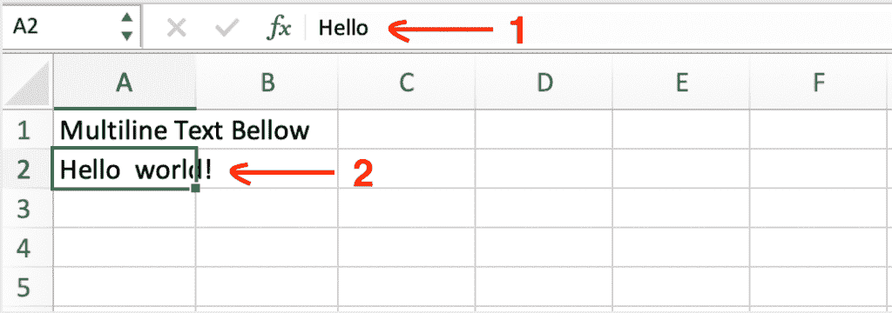

# 使用 Apache POI 的 Excel 单元格中的多行文本

> 原文：<https://web.archive.org/web/20220930061024/https://www.baeldung.com/apache-poi-write-multiline-text>

## 1.介绍

我们可以用 Apache POI 在 Microsoft Excel 电子表格中以编程方式创建多行文本。但是，它不会显示为多行。这是因为使用代码向单元格添加文本不会自动调整单元格高度并应用所需的格式将其转换为多行文本。

这个简短的教程将演示正确显示这些文本所需的代码。

## 2.Apache POI 和 Maven 依赖关系

Apache POI 是一个开源库，允许软件开发人员创建和操作 Microsoft Office 文档。作为先决条件，读者可以参考我们关于在 Java 中使用 Microsoft Excel 的文章以及如何使用 Apache POI 在 Excel 中插入一行的教程。

首先，我们首先需要将 [Apache POI](https://web.archive.org/web/20220524022706/https://search.maven.org/search?q=g:org.apache.poi%20a:poi) 依赖项添加到我们的项目`pom.xml`文件中:

```
<dependency>
    <groupId>org.apache.poi</groupId> 
    <artifactId>poi</artifactId> 
    <version>5.2.0</version> 
</dependency>
```

## 3.添加和格式化多行文本

让我们从一个包含多行文本的单元格开始:

```
cell.setCellValue("Hello \n world!");
```

如果我们要用上面的代码生成并保存一个 Excel 文件。它看起来像下图:

[](/web/20220524022706/https://www.baeldung.com/wp-content/uploads/2021/10/multiline_text_before_formatting.png)

我们可以单击上图中的 1 和 2，以验证该文本确实是一个多行文本。

使用代码设置单元格格式，并将其行高扩展到等于或大于两行文本的任何值:

```
cell.getRow()
  .setHeightInPoints(cell.getSheet().getDefaultRowHeightInPoints() * 2);
```

之后，我们需要设置单元格样式来换行:

```
CellStyle cellStyle = cell.getSheet().getWorkbook().createCellStyle();
cellStyle.setWrapText(true);
cell.setCellStyle(cellStyle);
```

保存用上述代码生成的文件并在 Microsoft Excel 中查看，将在单元格中显示多行文本。

[](/web/20220524022706/https://www.baeldung.com/wp-content/uploads/2021/10/multiline_text_after_formatting.png)

## 4.摘要

在本教程中，我们学习了如何使用 Apache POI 向单元格添加多行文本。然后，我们通过对单元格应用一些格式来确保它显示为两行文本。否则，单元格将显示为一行。

和往常一样，这篇文章的源代码可以在 GitHub 的[上找到。](https://web.archive.org/web/20220524022706/https://github.com/eugenp/tutorials/tree/master/apache-poi)