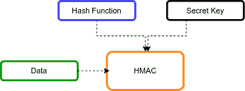

# 爪哇的 HMAC

> 原文:[https://web . archive . org/web/20220930061024/https://www . bael dung . com/Java-hmac](https://web.archive.org/web/20220930061024/https://www.baeldung.com/java-hmac)

## 1.概观

让我们考虑一个场景，其中双方想要通信，他们需要一种方法来验证他们接收的消息没有被篡改。[基于哈希的消息认证码](https://web.archive.org/web/20221207080813/https://en.wikipedia.org/wiki/HMAC) (HMAC)是一个很好的解决方案。

在本教程中，我们来看看如何在 Java 中使用 HMAC 算法。

## 2.散列消息认证码(HMAC)

HMAC 是一种加密方法，可以保证双方消息的完整性。

**HMAC 算法由一个密钥和一个哈希函数**组成。密钥是一条独特的信息或一串字符。消息的发送者和接收者都知道它。

哈希函数是一种将一个序列转换为另一个序列的映射算法。

下图显示了高级 HMAC 算法:

[](/web/20221207080813/https://www.baeldung.com/wp-content/uploads/2021/11/hmac-in-java.png)

HMAC 使用加密哈希函数，如 [MD5](/web/20221207080813/https://www.baeldung.com/java-md5) 和 [SHA-*](/web/20221207080813/https://www.baeldung.com/sha-256-hashing-java) 。

## 3.HMAC 使用 JDK 原料药

**Java 提供了内置的 [`Mac`类](https://web.archive.org/web/20221207080813/https://docs.oracle.com/en/java/javase/11/docs/api/java.base/javax/crypto/Mac.html)用于 HMAC 生成。在初始化了`Mac`对象之后，我们调用`doFinal()`方法来执行 HMAC 操作。该方法返回包含 HMAC 结果的字节数组。**

让我们定义一种使用各种哈希算法(如 MD5、SHA-1、SHA-224、SHA-256、SHA-384 和 SHA-512)计算 HMAC 的方法:

```
public static String hmacWithJava(String algorithm, String data, String key)
  throws NoSuchAlgorithmException, InvalidKeyException {
    SecretKeySpec secretKeySpec = new SecretKeySpec(key.getBytes(), algorithm);
    Mac mac = Mac.getInstance(algorithm);
    mac.init(secretKeySpec);
    return bytesToHex(mac.doFinal(data.getBytes()));
}
```

让我们编写一个示例测试来说明 HMAC 计算:

```
@Test
public void givenDataAndKeyAndAlgorithm_whenHmacWithJava_thenSuccess()
    throws NoSuchAlgorithmException, InvalidKeyException {

    String hmacSHA256Value = "5b50d80c7dc7ae8bb1b1433cc0b99ecd2ac8397a555c6f75cb8a619ae35a0c35";
    String hmacSHA256Algorithm = "HmacSHA256";
    String data = "baeldung";
    String key = "123456";

    String result = HMACUtil.hmacWithJava(hmacSHA256Algorithm, data, key);

    assertEquals(hmacSHA256Value, result);
}
```

在这个测试中，我们对简单的字符串数据和键使用了`HmacSHA512`算法。然后，我们断言 HMAC 结果等于预期数据。

## 4.阿帕奇公共图书馆

Apache Commons 库也为 HMAC 计算提供了一个实用类。

### 4.1.添加 Maven 依赖项

要使用 Apache Commons 实用程序类，我们需要将 [commons-codec](https://web.archive.org/web/20221207080813/https://search.maven.org/search?q=g:commons-codec) 添加到 pom.xml:

```
<dependency>
    <groupId>commons-codec</groupId>
    <artifactId>commons-codec</artifactId>
    <version>1.15</version>
</dependency> 
```

### 4.2.`HmacUtils`阶级

为了计算 HMAC，我们可以使用`HmacUtils`类。在初始化了`HmacUtils`对象之后，我们调用`hmacHex()`方法来执行 HMAC 操作。此方法返回包含 HMAC 结果的十六进制字符串。

让我们创建一个生成 HMAC 的方法:

```
public static String hmacWithApacheCommons(String algorithm, String data, String key) {
    String hmac = new HmacUtils(algorithm, key).hmacHex(data);
    return hmac;
}
```

让我们编写一个示例测试:

```
@Test
public void givenDataAndKeyAndAlgorithm_whenHmacWithApacheCommons_thenSuccess() {

    String hmacMD5Value = "621dc816b3bf670212e0c261dc9bcdb6";
    String hmacMD5Algorithm = "HmacMD5";
    String data = "baeldung";
    String key = "123456";

    String result = HMACUtil.hmacWithApacheCommons(hmacMD5Algorithm, data, key);

    assertEquals(hmacMD5Value, result);
}
```

在这个测试中，我们使用了`HmacMD5`算法。

## 5.BouncyCastle 库

同样，**我们也可以使用 [BouncyCastle](/web/20221207080813/https://www.baeldung.com/java-bouncy-castle) 库**。BouncyCastle 是我们可以在 Java 中使用的加密 API 的集合。

### 5.1.添加 Maven 依赖项

在我们开始使用这个库之前，我们需要将 [bcpkix-jdk15to18](https://web.archive.org/web/20221207080813/https://search.maven.org/search?q=a:bcpkix-jdk15to18) 依赖项添加到我们的`pom.xml`文件中:

```
<dependency>
    <groupId>org.bouncycastle</groupId>
    <artifactId>bcpkix-jdk15to18</artifactId>
    <version>1.69</version>
</dependency>
```

### 5.2.`Hmac`阶级

我们将从基于我们想要使用的散列算法的**实例化`HMac`类开始。然后我们将使用`update()`方法用输入数据更新 HMAC 对象。最后，我们将调用`doFinal()`方法来生成 HMAC 代码:**

```
public static String hmacWithBouncyCastle(String algorithm, String data, String key) {
    Digest digest = getHashDigest(algorithm);

    HMac hMac = new HMac(digest);
    hMac.init(new KeyParameter(key.getBytes()));

    byte[] hmacIn = data.getBytes();
    hMac.update(hmacIn, 0, hmacIn.length);
    byte[] hmacOut = new byte[hMac.getMacSize()];

    hMac.doFinal(hmacOut, 0);
    return bytesToHex(hmacOut);
}

private static Digest getHashDigest(String algorithm) {
    switch (algorithm) {
      case "HmacMD5":
        return new MD5Digest();
      case "HmacSHA256":
        return new SHA256Digest();
      case "HmacSHA384":
        return new SHA384Digest();
      case "HmacSHA512":
        return new SHA512Digest();
    }
    return new SHA256Digest();
}
```

以下示例为字符串数据生成 HMAC，然后对其进行验证:

```
@Test
public void givenDataAndKeyAndAlgorithm_whenHmacWithBouncyCastle_thenSuccess() {

    String hmacSHA512Value = "b313a21908df55c9e322e3c65a4b0b7561ab1594ca806b3affbc0d769a1" +
      "290c1922aa6622587bea3c0c4d871470a6d06f54dbd20dbda84250e2741eb01f08e33";
    String hmacSHA512Algorithm = "HmacSHA512";
    String data = "baeldung";
    String key = "123456";

    String result = HMACUtil.hmacWithBouncyCastle(hmacSHA512Algorithm, data, key);

    assertEquals(hmacSHA512Value, result);
}
```

在这个测试中，我们使用了`HmacSHA512`算法。

## 6.结论

**HMAC 提供数据完整性检查。**在本文中，我们学习了如何在 Java 中使用 HMAC 算法为输入字符串数据生成 HMAC。此外，我们讨论了 Apache Commons 和 BouncyCastle 库在 HMAC 计算中的使用。

和往常一样，GitHub 上的[提供了这篇文章的完整源代码。](https://web.archive.org/web/20221207080813/https://github.com/eugenp/tutorials/tree/master/core-java-modules/core-java-security-3)