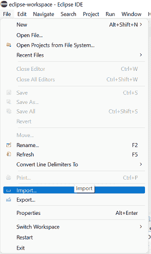
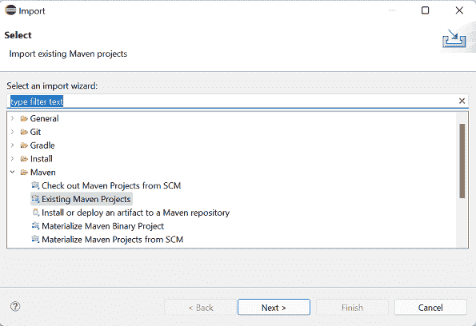
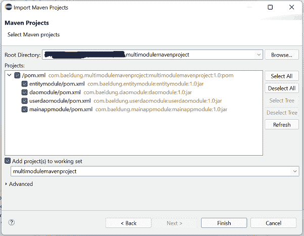
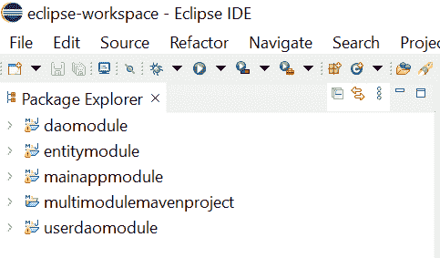
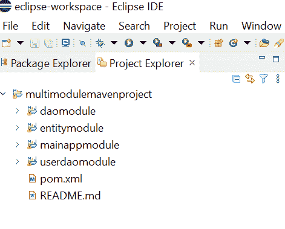

# 将 Maven 项目导入 Eclipse

> 原文:[https://web . archive . org/web/20220930061024/https://www . bael dung . com/maven-import-eclipse](https://web.archive.org/web/20220930061024/https://www.baeldung.com/maven-import-eclipse)

## 1.概观

在本教程中，我们将了解如何将现有的 Maven 项目导入 Eclipse。为此，**我们可以使用针对 Maven 的 Eclipse 插件或者 Apache Maven Eclipse 插件**。

## 2.Eclipse 和 Maven 项目设置

对于我们的例子，我们将使用 Eclipse 的最新版本，版本 2021-09 (4.21.0)，它是从 [Eclipse 下载](https://web.archive.org/web/20220525131510/https://www.eclipse.org/downloads/)页面获得的。

### 2.1.Maven 项目示例

对于我们的例子，我们将使用来自我们的 [GitHub 库](https://web.archive.org/web/20220525131510/https://github.com/eugenp/tutorials/tree/master/core-java-modules/multimodulemavenproject)的多模块 Maven 项目。一旦我们克隆了存储库或者下载了项目，我们的多模块 Maven 项目的根目录应该看起来像这样:

```
|--multimodulemavenproject
    |--daomodule
    |--entitymodule
    |--mainappmodule
    |--userdaomodule
    |--pom.xml
    |--README.md
```

### 2.2.Maven 项目中的微小变化

我们的多模块 Maven 项目本身就是一个子项目。因此，为了限制我们练习的范围，我们需要对`multimodulemavenproject`目录中的`pom.xml`做一些小的修改，这将是我们的项目根。这里，让我们**删除引用`multimodulemavenproject`的父**的行:

```
<parent>
    <groupId>com.baeldung</groupId>
    <artifactId>parent-modules</artifactId>
    <version>1.0.0-SNAPSHOT</version>
    <relativePath>../../</relativePath>
</parent>
```

删除这些行之后，我们就可以将 Maven 项目导入 Eclipse 了。

## 3.使用用于 Maven 的`m2e` Eclipse 插件导入

让我们使用菜单路径`File::Import::Maven::Existing Maven Projects` 将 Maven 项目导入 Eclipse **。我们可以从点击`File`菜单下的`Import`选项开始:**

[](/web/20220525131510/https://www.baeldung.com/wp-content/uploads/2021/11/import-1.png)

然后，我们展开`Maven`文件夹，选择`Existing Maven Projects`，点击`Next`按钮:

[](/web/20220525131510/https://www.baeldung.com/wp-content/uploads/2021/11/import2-1.png)

最后，让我们提供 Maven 项目的根目录路径，并单击`Finish`按钮:

[](/web/20220525131510/https://www.baeldung.com/wp-content/uploads/2021/11/import3-1.png)

在这一步之后，我们应该能够在 Eclipse 中看到`Package Explorer`视图:

[](/web/20220525131510/https://www.baeldung.com/wp-content/uploads/2021/11/package_view.png)

这个视图可能会有点混乱，因为我们看到的是单独的模块，而不是以分层的方式。这是因为 Eclipse 中的默认视图`Package Explorer`。然而，我们可以很容易地将视图切换到`Project Explorer`并以树状结构查看多模块项目:

[](/web/20220525131510/https://www.baeldung.com/wp-content/uploads/2021/11/project_explorer.png)

Maven 项目的顺利导入是由 Maven 的 **Eclipse 插件、 [m2e](https://web.archive.org/web/20220525131510/https://projects.eclipse.org/projects/technology.m2e) 实现的。**我们不需要将它单独添加到我们的 Eclipse 中，因为它**是与 Eclipse 安装**一起内置的**并且可以通过路径`Help::About Eclipse IDE::Installation Details::Installed Software`查看:**

[](/web/20220525131510/https://www.baeldung.com/wp-content/uploads/2021/11/m2e_plugin.png)

如果我们有一个没有内置`m2e`插件的旧版本 Eclipse，我们总是可以使用 Eclipse Marketplace 添加这个插件。

## 4.Apache Maven Eclipse 插件

Apache Maven Eclipse 插件也可以用来生成 Eclipse IDE 文件(*。`classpath`，*。`project`，*。`wtpmodules`，还有这个。`settings`文件夹)供项目使用。不过这个**插件是** **现在退役的** **由** **Maven，和** **使用** **Eclipse 的** **`m2e`插件推荐**。更多细节可以在 [Apache Maven 插件页面](https://web.archive.org/web/20220525131510/https://maven.apache.org/plugins/maven-eclipse-plugin/)找到。

## 5.结论

在本教程中，我们学习了将现有 Maven 项目导入 Eclipse 的两种方式。由于 Apache Maven Eclipse 插件现在已经退役，**我们应该为 Maven，`m2e`** 使用 Eclipse 插件，它内置于最新版本的 Eclipse 中。