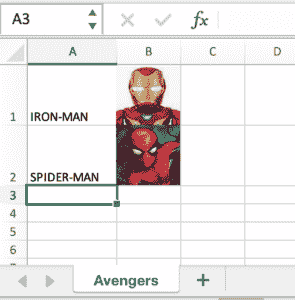

# 用 Java 将图像添加到 Excel 文件的单元格中

> 原文：<https://web.archive.org/web/20220930061024/https://www.baeldung.com/java-add-image-excel>

## 1.概观

在本教程中，我们将学习如何用 Java 向 Excel 文件中的单元格添加图像。

我们将动态创建一个 Excel 文件，并使用`[apache-poi](/web/20220627184359/https://www.baeldung.com/java-microsoft-excel).`向单元格添加一个图像

## 2.项目设置和相关性

Java 应用程序可以使用`apache-poi`动态地读取、写入和修改 Excel 电子表格的内容。它支持`.xls`和`.xlsx`两种 Excel 格式。

### 2.1.Apache Poi API 的 Maven 依赖性

首先，让我们将`[poi](https://web.archive.org/web/20220627184359/https://search.maven.org/classic/#search%7Cga%7C1%7Cg%3A%22org.apache.poi%22%20AND%20a%3A%22poi-ooxml%22)`依赖项添加到我们的项目中:

[PRE0]

### 2.2.Excel 工作簿创建

First, let's create a workbook and sheet to write in. We can choose either `XSSFWorkbook`, which works with `.xlsx` files, or `HSSFWorkbook`, which works with `.xls` files. Let's use `XSSFWorkbook`:

[PRE1]

在这里，我们创建了一个`Avengers`表，并用两个名字填充了`A1`和`A2`单元格。接下来，我们将把复仇者的图像添加到单元格`B1`和`B2`。

## 3.在工作簿中插入图像

### 3.1.从本地文件读取图像

要添加图像，我们首先需要从我们的项目目录中读取它们。对于我们的项目，我们在`resources`目录中有两个图像:

*   `/src/main/resources/ironman.png`
*   `/src/main/resources/spiderman.png`

[PRE2]

### 3.2.将图像`InputStream`转换成字节数组

接下来，让我们将图像转换成字节数组。这里，我们将使用来自`apache-poi`的`IOUtils`:

[PRE3]

### 3.3.在工作簿中添加图片

现在，我们将使用字节数组向我们的`workbook.`添加一张图片。[支持的图片类型](https://web.archive.org/web/20220627184359/https://poi.apache.org/components/spreadsheet/quick-guide.html#Images)是 PNG、JPG 和 DIB。我们在这里使用 PNG:

[PRE4]

作为这一步的结果，我们将获得用于创建`Drawing`对象的每张图片的索引。

### 3.4.创建一个`Drawing`容器

绘图家长是所有形状的顶级容器。这将返回一个`Drawing`接口——在我们的例子中是`XSSFDrawing`对象。我们将使用这个对象来创建图片，并将其放入我们定义的单元格中。

让我们创建绘图家长:

[PRE5]

## 4.在单元格中添加图像

现在，我们准备将图像添加到我们的单元格中。

### 4.1.创建锚点对象

首先，我们将创建一个客户端锚点对象，它附加到一个 Excel 工作表，用于设置图像在 Excel 工作表中的位置。它锚定在左上角和右下角的单元格上。

我们将创建两个锚点对象，每个图像一个:

[PRE6]

接下来，我们需要指定图像与锚对象的相对位置。

让我们将第一张图片放入单元格`B1`:

[PRE7]

同样，我们将第二幅图像放在单元格`B2`中:

[PRE8]

### 4.2.将锚点对象和图片索引添加到绘图容器

Now, let's call `createPicture` on the drawing patriarch to add an image. **We'll use the previously created anchor object and picture index of our images:**

[PRE9]

## 5.保存工作簿

在我们保存之前，让我们确保单元格足够宽，可以容纳我们使用`autoSizeColumn`添加的图片:

[PRE10]

最后，让我们保存工作簿:

[PRE11]

生成的 Excel 表应该如下所示:

## 6.结论

在本文中，我们学习了如何使用`apache-poi`库在 Java 中将图像添加到 Excel 工作表的单元格中。

我们需要加载图像，将其转换为字节，将其附加到工作表中，然后使用绘图工具在正确的单元格中定位图像。最后，我们能够调整列的大小并保存我们的工作簿。

和往常一样，本文的示例代码可以在 GitHub 的[上找到。](https://web.archive.org/web/20220627184359/https://github.com/eugenp/tutorials/tree/master/apache-poi-2)