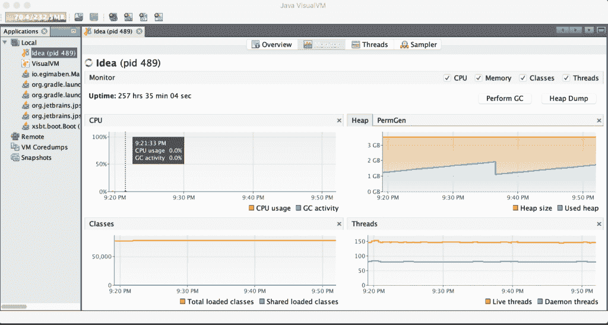
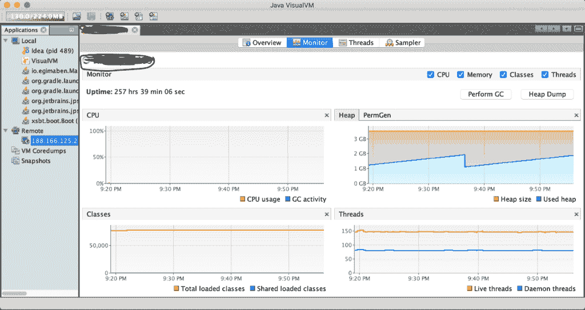

# 使用 VisualVM 和 JMX 进行远程监控

> 原文：<https://web.archive.org/web/20220930061024/https://www.baeldung.com/visualvm-jmx-remote>

## **1。简介**

在本文中，我们将学习如何使用 VisualVM 和 Java 管理扩展(JMX)来远程监控 Java 应用程序。

## **2。JMX**

JMX 是管理和监控 JVM 应用程序的标准 API。JVM 有内置的工具，JMX 可以用它来实现这个目的。因此，我们通常称这些实用程序为“开箱即用的管理工具”，或者在这种情况下，称为“JMX 代理”。

## **3。视觉虚拟机**

VisualVM 是一个可视化工具，它为 JVM 提供了轻量级的分析能力。还有很多其他主流的[剖析工具](/web/20220815124213/https://www.baeldung.com/java-profilers)。然而， **VisualVM 是免费的**，并且与 JDK 6U7 版本捆绑在一起，直到 JDK 8 的早期更新。对于其他版本， [Java VisualVM](https://web.archive.org/web/20220815124213/https://visualvm.github.io/) 作为一个独立的应用程序提供。

VisualVM **允许我们连接到本地和远程 JVM 应用程序**进行监控。

当在任何机器上启动时，它**会自动发现并开始监控本地运行的所有 JVM 应用程序**。然而，我们需要显式地连接远程应用程序。

### 3.1.JVM 连接模式

JVM 通过像`[jstatd](https://web.archive.org/web/20220815124213/https://docs.oracle.com/en/java/javase/11/tools/jstatd.html)`或 [JMX](https://web.archive.org/web/20220815124213/https://docs.oracle.com/javase/8/docs/technotes/guides/visualvm/jmx_connections.html) 这样的工具公开自己进行监控。反过来，这些工具为 VisualVM 等工具提供 API 来获取分析数据。

`jstatd`程序是一个与 JDK 捆绑在一起的守护程序。然而，它的能力有限。例如，我们不能监控 CPU 的使用情况，也不能进行线程转储。

另一方面，JMX 技术不需要任何守护进程在 JVM 上运行。此外，它可以用来分析本地和远程 JVM 应用程序。然而，我们确实需要用特殊属性启动 JVM，以启用开箱即用的监控特性。在本文中，我们将只关注 JMX 模式。

### **3.2。发射**

正如我们前面看到的，我们的 JDK 版本可以与 VisualVM 捆绑在一起，也可以不捆绑。在任一情况下，我们都可以通过执行适当的二进制文件来启动它:

```
./jvisualvm
```

如果二进制文件存在于`$JAVA_HOME/bin`文件夹中，那么上面的命令将打开 VisualVM 接口，如果单独安装的话，它可能在不同的文件夹中。

默认情况下，VisualVM 将启动并加载所有在本地运行的 Java 应用程序:

[](/web/20220815124213/https://www.baeldung.com/wp-content/uploads/2021/12/visualvm-launch.png)

### **3.3。功能**

VisualVM 提供了几个有用的特性:

*   显示本地和远程 Java 应用程序进程
*   从 CPU 使用率、GC 活动、加载的类数量和其他指标方面监控流程性能
*   可视化所有进程中的线程以及它们在不同状态(如睡眠和等待)下花费的时间
*   获取并显示线程转储，以便立即了解正在被监控的进程中发生了什么

[VisualVM 特性页面](https://web.archive.org/web/20220815124213/https://visualvm.github.io/features.html)有一个更全面的可用特性列表。像所有设计良好的软件一样， [VisualVM 可以通过安装`Plugins`选项卡上可用的第三方插件来扩展](https://web.archive.org/web/20220815124213/https://visualvm.github.io/plugins.html)以访问更多高级和独特的功能。

## **4。远程监控**

在这一节中，我们将演示如何使用 VisualVM 和 JMX 远程监控 Java 应用程序。我们还将有机会探索所有必要的配置和 JVM 启动选项。

### **4.1。应用程序配置**

我们用启动脚本启动大多数(如果不是全部)Java 应用程序。在这个脚本中，start 命令通常将基本参数传递给 JVM，以指定应用程序的需求，比如最大和最小内存需求。

假设我们有一个打包成`MyApp.jar`的应用程序，让我们看一个包含主要 JMX 配置参数的启动命令示例:

```
java -Dcom.sun.management.jmxremote.port=8080 
-Dcom.sun.management.jmxremote.ssl=false 
-Dcom.sun.management.jmxremote.authenticate=false 
-Xms1024m -Xmx1024m -jar MyApp.jar
```

在上面的命令中，`MyApp.jar` 通过端口 8080 配置的开箱即用监控功能启动。此外，为了简单起见，我们取消了 SSL 加密和密码验证。

在生产环境中，理想情况下，我们应该在公共网络中保护 VisualVM 和 JVM 应用程序之间的通信。

### **4.2。虚拟虚拟机配置**

现在我们有了在本地运行的 VisualVM 和在远程服务器上运行的`MyApp.jar`,我们可以开始远程监控会话了。

右键单击左侧面板并选择`Add JMX Connection`:

[](/web/20220815124213/https://www.baeldung.com/wp-content/uploads/2021/12/visualvm-jmx-connection.png)

在弹出的对话框的`Connection`字段中输入`host:port`组合，点击`OK.`

如果成功，我们现在应该能够通过双击左侧面板中的新连接看到一个监视窗口:

[](/web/20220815124213/https://www.baeldung.com/wp-content/uploads/2021/12/visualvm-remote-monitor.png)

## **5。结论**

在本文中，我们探索了用 VisualVM 和 JMX 远程监控 Java 应用程序。