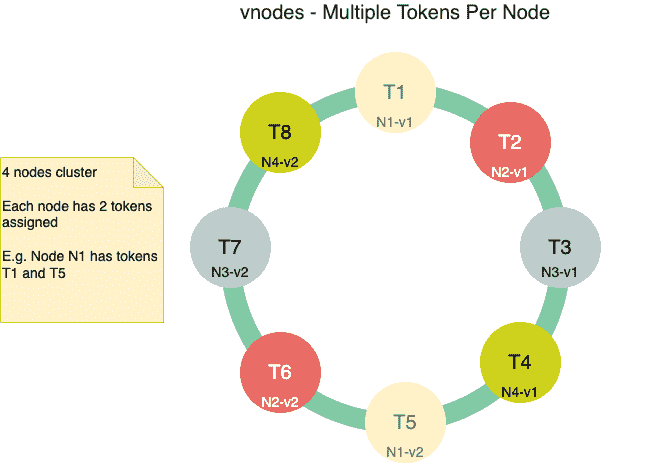

# Cassandra 中的复制策略和分区

> 原文：<https://web.archive.org/web/20220930061024/https://www.baeldung.com/cassandra-replication-partitioning>

## 1.概观

在本文中，我们将了解到 [Apache Cassandra](/web/20220627170830/https://www.baeldung.com/cassandra-with-java) 如何在集群中的节点之间划分和分布数据。此外，我们将看到 Cassandra 如何在多个节点中存储复制的数据以实现高可用性。

## 2.结节

**在 Cassandra 中，单个节点运行在服务器或虚拟机(VM)上**。Cassandra 是用 Java 语言编写的，这意味着 Cassandra 的一个运行实例是一个 Java 虚拟机(JVM)进程。Cassandra 节点可以位于云中、本地数据中心或任何磁盘中。对于数据存储，根据建议，我们应该使用本地存储或直连存储，而不是 SAN。

Cassandra 节点负责它以分布式哈希表形式存储的所有数据。Cassandra 提供了一个名为`nodetool`的工具来管理和检查节点或集群的状态。

## 3.令牌网

**卡珊德拉将集群中的每个节点映射到连续环形上的一个或多个令牌**。默认情况下，令牌是 64 位整数。因此，令牌的可能范围是从-2 ^(63) 到 2 ^(63) -1。它使用一致的哈希技术将节点映射到一个或多个令牌。

### 3.1.每个节点一个令牌

在每个节点一个令牌的情况下，每个节点负责小于或等于分配的令牌并且大于前一节点的分配的令牌的令牌范围的值。为了完成该环，具有最低令牌值的第一个节点负责小于或等于分配的令牌并且大于具有最高令牌值的最后一个节点的分配的令牌的值范围。

**在数据写入时，Cassandra 使用哈希函数根据分区密钥**计算令牌值。将该令牌值与每个节点的令牌范围进行比较，以识别数据所属的节点。

让我们看一个例子。下图显示了一个八节点群集，复制因子(`RF`)为 3，并且为每个节点分配了一个令牌:

带有`RF=3`的集群意味着每个节点有三个副本。

上图中最里面的环代表主要的数据令牌范围。

**每个节点使用一个令牌的缺点是，向集群添加节点或从集群中删除节点时，令牌会不平衡。**

假设在 N 个节点的散列环中，每个节点拥有相同数量的令牌，比如 100 个。此外，假设有一个现有的节点 X 拥有范围为 100 到 200 的令牌。现在，如果我们在节点 X 的左边添加一个新节点 Y，那么这个新节点 Y 现在拥有来自节点 X 的一半令牌。

也就是说，现在节点 X 将拥有 100–150 的令牌范围，节点 Y 将拥有 151–200 的令牌范围。来自节点 X 的一些数据必须移动到节点 y。这导致数据从一个节点 X 移动到另一个节点 y。

### 3.2.每个节点多个令牌(虚拟节点)

从 Cassandra 2.0 开始，默认情况下启用虚拟节点(vnodes)。在这种情况下， **Cassandra 将令牌范围分解成更小的范围，并将多个更小的范围分配给集群中的每个节点。**默认情况下，一个节点的令牌数是 256——这是在`cassandra.yaml`文件的`num_tokens `属性中设置的——这意味着一个节点中有 256 个虚拟节点。

这种配置使得用不同计算资源的机器来维护 Cassandra 集群变得更加容易。这意味着我们可以通过将`num_tokens` 属性设置为一个更大的值，将更多的 vnodes 分配给具有更大计算能力的机器。另一方面，对于计算能力较低的机器，我们可以将`num_tokens` 设置为一个较低的数字。

使用 vnodes 时，我们必须预先计算令牌值。否则，我们必须预先计算每个节点的令牌值，并将其设置为`num_tokens `属性的值。

下图显示了一个四节点群集，每个节点分配有两个令牌:

这种设置的优势在于**当添加新节点或删除现有节点时，数据会在多个节点之间重新分布**。

当我们在哈希环中添加一个新节点时，该节点现在将拥有多个令牌。这些令牌范围以前由多个节点拥有，因此添加后的数据移动来自多个节点。

## 4.分割者

分割器决定数据如何在 Cassandra 集群中的节点间分布。基本上，分区器是一个散列函数，通过散列行数据的分区键来确定令牌值。然后，这个分区密钥令牌用于确定和分发环内的行数据。

Cassandra 提供了不同的分区器，它们使用不同的算法来计算分区键的哈希值。我们可以通过实现`IPartitioner `接口来提供和配置我们自己的分区器。

从 Cassandra 版本 1.2 开始，`Murmur3Partitioner`就是默认的分区器。它使用`MurmurHash`函数来创建分区键的 64 位散列。

在`Murmur3Partitioner`之前，卡珊德拉默认有`RandomPartitioner `。它使用`MD5` 算法来散列分区键。

`Murmur3Partitioner `和`RandomPartitioner `都使用令牌在整个环上平均分配数据。然而，两个分区器之间的主要区别是 **`RandomPartitioner `使用加密哈希函数，而`Murmur3Partitioner `使用非加密哈希函数。**一般来说，加密哈希函数是非性能的，需要较长的时间。

## 5.复制策略

**Cassandra 通过在集群中的节点间复制数据来实现高可用性和容错能力。**复制策略决定了副本在集群中的存储位置。

群集中的每个节点不仅拥有分配的令牌范围内的数据，还拥有不同数据范围的副本。如果主节点关闭，则该复制节点可以响应该范围数据的查询。

**Cassandra 在后台异步复制数据。**和复制因子(`RF`)是确定集群中有多少节点获得相同数据的副本的数字。例如，环中的三个节点将拥有与`RF=3.`相同的数据副本，我们已经看到了令牌环部分的图表中显示的数据复制。

Cassandra 通过允许不同的`AbstractReplicationStrategy` 类实现来提供可插拔的复制策略。开箱即用，Cassandra 提供了几个实现，`SimpleStrategy`和`NetworkTopologyStrategy`。

一旦划分器计算出令牌并将数据放在主节点中，`SimpleStrategy `就将副本放在环周围的连续节点中。

另一方面，`NetworkTopologyStrategy`允许我们为每个数据中心指定不同的复制因子。在数据中心内，它将副本分配给不同机架中的节点，以最大限度地提高可用性。

无论是单数据中心还是多数据中心部署， **`NetworkTopologyStrategy`都是生产部署**中关键空间的推荐策略。

复制策略是为每个键空间独立定义的，并且是创建键空间时的必需选项。

## 6.一致性水平

一致性意味着我们读取的数据与我们刚刚在分布式系统中写入的数据相同。 **Cassandra 为读写查询**提供可调的[一致性级别](/web/20220627170830/https://www.baeldung.com/cassandra-consistency-levels)。换句话说，它为我们提供了可用性和一致性之间的细粒度平衡。

更高级别的一致性意味着需要更多的节点来响应读取或写入查询。这样，Cassandra 读取的数据往往与刚才写入的数据相同。

对于读取查询，一致性级别指定在将数据返回到客户端之前需要响应多少副本。对于写入查询，一致性级别指定在向客户端发送成功消息之前需要多少个副本来确认写入。

由于 Cassandra 是一个最终一致的系统，`RF`确保写操作在后台异步地发生在剩余的节点上。

## 7.告密者

[告密者](/web/20220627170830/https://www.baeldung.com/cassandra-request-routing-snitches)提供关于网络拓扑的信息，以便 Cassandra 可以有效地路由读/写请求。snitch 确定哪个节点属于哪个数据中心和机架。它还决定了集群中节点的相对主机邻近度。

复制策略使用此信息将副本放入单个数据中心或多个数据中心的集群中的适当节点。

## 8.结论

在本文中，我们学习了 Cassandra 中的一般概念，如节点、环和令牌。除此之外，我们还学习了 Cassandra 如何在集群中的节点之间划分和复制数据。这些概念描述了 Cassandra 如何使用不同的策略来高效地读写数据。

这些是使 Cassandra 高度可伸缩、可用、耐用和可管理的一些架构组件。