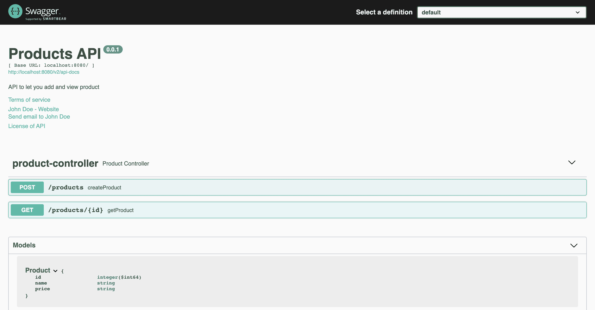
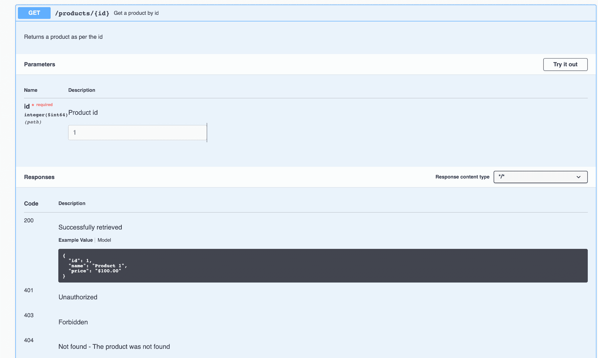

# 用霸气树立榜样和描述

> 原文:[https://web . archive . org/web/20220930061024/https://www . bael dung . com/swagger-set-example-description](https://web.archive.org/web/20220930061024/https://www.baeldung.com/swagger-set-example-description)

## 1.概观

在本教程中，我们将看到如何使用 Swagger 注释使我们的文档更具描述性。我们将学习如何向 API 的不同部分添加描述，比如方法、参数和错误代码。我们还将看到如何添加请求/响应示例。

## 2.项目设置

我们将创建一个简单的产品 API，提供创建和获取产品的方法。

为了从头创建一个 REST API，我们可以按照 Spring Docs 的教程使用 Spring Boot 创建一个 RESTful web 服务。

下一步将是为项目设置依赖项和配置。我们可以按照本文[中的步骤用 Spring REST API 设置 Swagger 2。](/web/20220617075716/https://www.baeldung.com/swagger-2-documentation-for-spring-rest-api)

## 3.创建 API

首先，我们将创建我们的产品 API 并检查生成的文档。

### 3.1.模型

让我们定义一下我们的`Product`类:

```
public class Product implements Serializable {
    private long id;
    private String name;
    private String price;

    // constructor and getter/setters
} 
```

### 3.2.控制器

让我们定义两个 API 方法:

```
@RestController
@ApiOperation("Products API")
public class ProductController {

    @PostMapping("/products")
    public ResponseEntity<Void> createProduct(@RequestBody Product product) {
        //creation logic
        return new ResponseEntity<>(HttpStatus.CREATED);
    }

    @GetMapping("/products/{id}")
    public ResponseEntity<Product> getProduct(@PathVariable Long id) {
        //retrieval logic
        return ResponseEntity.ok(new Product(1, "Product 1", "$21.99"));
    }
}
```

当我们运行这个项目时，这个库将读取所有被暴露的路径，并创建与它们相对应的文档。

让我们在默认 URL `http://localhost:8080/swagger-ui/index.html`查看文档:

[](/web/20220617075716/https://www.baeldung.com/wp-content/uploads/2022/02/Screenshot-2022-01-29-at-1.59.47-PM.png)

我们可以进一步扩展控制器方法来查看它们各自的文档。接下来，我们将详细了解它们。

## 4.使我们的文档具有描述性

现在，让我们通过向方法的不同部分添加描述来使我们的文档更具描述性。

### 4.1.向方法和参数添加描述

让我们来看一些使方法具有描述性的方法。我们将向方法、参数和响应代码添加描述。让我们从`getProduct()` 方法开始:

```
@ApiOperation(value = "Get a product by id", notes = "Returns a product as per the id")
@ApiResponses(value = {
  @ApiResponse(code = 200, message = "Successfully retrieved"),
  @ApiResponse(code = 404, message = "Not found - The product was not found")
})
@GetMapping("/products/{id}")
public ResponseEntity<Product> getProduct(@PathVariable("id") @ApiParam(name = "id", value = "Product id", example = "1") Long id) {
    //retrieval logic
    return ResponseEntity.ok(new Product(1, "Product 1", "$21.99"));
}
```

`**@ApiOperation**` **定义一个 API 方法的属性。**我们已经使用`value`属性为操作添加了一个名称，并使用`notes `属性添加了一个描述。

**@** `**ApiResponses** ` **用于覆盖响应代码**附带的默认消息。对于我们想要更改的每个响应消息，我们需要添加一个`@ApiResponse` 对象`.`

例如，假设没有找到产品，我们的 API 在这个场景中返回 HTTP 404 状态。如果我们不添加自定义消息，原始消息“未找到”可能很难理解。呼叫者可能会将其解释为 URL 是错误的。不过加上“找不到产品”的描述就更清楚了。

`**@ApiParam**` **定义方法参数的属性。**它可以与路径、查询、标题和表单参数一起使用。我们为“id”参数添加了一个名称、一个值(描述)和一个示例。如果我们不添加定制，库将只获取参数的名称和类型，正如我们在第一幅图中看到的。

让我们看看这是如何改变文档的:

[](/web/20220617075716/https://www.baeldung.com/wp-content/uploads/2022/02/Screenshot-2022-01-29-at-4.08.45-PM.png)

在这里，我们可以在 API 路径`/products/{id}`旁边看到名称“Get a product id”。我们还可以看到它正下方的描述。此外，在参数部分，我们有一个字段`id`的描述和示例。最后，在 Responses 部分，我们可以注意到 200 和 404 代码的错误描述是如何变化的。

### 4.2.向模型添加描述和示例

我们可以对我们的`createProduct()` 方法进行类似的改进。此外，由于该方法接受一个`Product`对象，所以在`Product`类本身中提供描述和示例更有意义。

让我们在`Product`类中做一些改变来实现这一点:

```
@ApiModelProperty(notes = "Product ID", example = "1", required = true) 
private Long id; 
@ApiModelProperty(notes = "Product name", example = "Product 1", required = false) 
private String name; 
@ApiModelProperty(notes = "Product price", example = "$100.00", required = true) 
private String price;
```

**@ `ApiModelProperty`注释定义了字段的属性。**我们在每个字段上使用这个注释来设置它的`notes` (描述)`example`和`required`属性。

让我们重新启动应用程序，并再次查看我们的`Product` 模型的文档:

[](/web/20220617075716/https://www.baeldung.com/wp-content/uploads/2022/02/Screenshot-2022-01-29-at-4.07.33-PM.png)

如果我们将其与原始文档图像进行比较，我们会发现新图像包含示例、描述和红色星号(*)，以标识所需的参数。

**通过向模型添加示例，我们可以在使用模型作为输入或输出的每个方法中自动创建示例响应。**例如，从对应于`getProduct()`方法的图像中，我们可以看到响应包含一个示例，该示例包含我们在模型中提供的相同值。

向我们的文档中添加示例是很重要的，因为它使值格式更加精确。如果我们的模型包含日期、时间或价格之类的字段，精确值格式是必要的。预先定义格式使开发过程对 API 提供者和 API 客户机都更有效。

## 5.结论

在本文中，我们研究了提高 API 文档可读性的不同方法。我们学习了如何使用注释`@ApiParam, @ApiOperation, @ApiResponses, @ApiResponse, and @ApiModelProperty`记录方法、参数、错误消息和模型。

和往常一样，这些例子的代码可以在 GitHub 的[上找到。](https://web.archive.org/web/20220617075716/https://github.com/eugenp/tutorials/tree/master/spring-boot-modules/spring-boot-swagger)