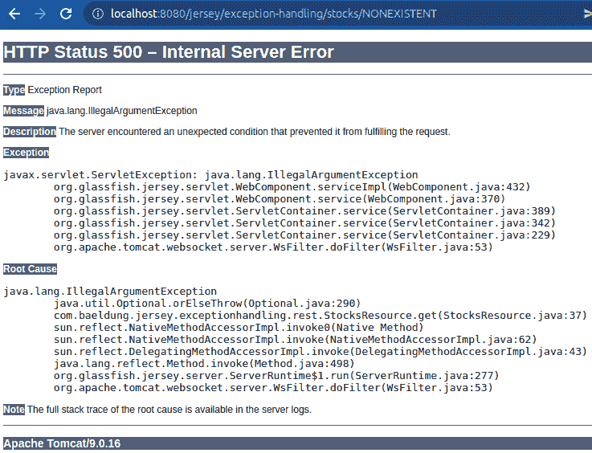

# 运动衫的异常处理

> 原文：<https://web.archive.org/web/20220930061024/https://www.baeldung.com/java-exception-handling-jersey>

## 1.介绍

在本教程中，我们将看到用[球衣](/web/20220617075716/https://www.baeldung.com/jersey-rest-api-with-spring)处理[异常](/web/20220617075716/https://www.baeldung.com/java-exceptions)的不同方式，这是一个 [JAX-RS](/web/20220617075716/https://www.baeldung.com/jax-rs-response) 的实现。

JAX-RS 为我们提供了许多处理异常的机制，我们可以选择和组合这些机制。处理 REST 异常是构建更好的 API 的重要一步。在我们的用例中，我们将构建一个购买股票的 API，并看看每个步骤如何影响其他步骤。

## 2.场景设置

我们的最小设置包括创建一个[存储库](/web/20220617075716/https://www.baeldung.com/the-persistence-layer-with-spring-data-jpa)、几个 beans 和一些端点。这要从我们的资源配置说起。在那里，我们将使用`@ApplicationPath`定义我们的起始 URL 和我们的端点包:

[PRE0]

### 2.1.豆子

我们只需要两颗豆子:`Stock`和`Wallet`，这样我们就可以把`Stock` s 存起来买了。对于我们的`Stock`，我们只需要一个`price`属性来帮助验证。更重要的是，我们的`Wallet`类将拥有验证方法来帮助构建我们的场景:

[PRE1]

### 2.2.端点

类似地，我们的 API 将有两个端点。这些将定义保存和检索 beans 的标准方法:

[PRE2]

[PRE3]

例如，让我们看看`StocksResource`中的 GET 方法:

[PRE4]

在 GET 方法中，我们抛出了第一个异常。我们稍后才处理这个问题，所以我们可以看到它的效果。

## 3.当我们抛出一个异常时会发生什么？

当发生未处理的异常时，我们可能会暴露应用程序内部的敏感信息。如果我们用一个不存在`Stock`来尝试来自`StocksResource`的 GET 方法，我们会得到一个类似如下的页面:

此页面显示应用程序服务器和版本，这可能有助于潜在攻击者利用漏洞。此外，还有关于我们的类名和行号的信息，这也可能帮助攻击者。最重要的是，这些信息大部分对 API 用户来说都是无用的，而且给人的印象很差。

为了帮助控制异常响应，JAX-RS 提供了类`ExceptionMapper`和`WebApplicationException`。让我们看看它们是如何工作的。

## 4.使用`WebApplicationException`自定义异常

使用`WebApplicationException`，我们可以创建定制的异常。**这种特殊类型的`RuntimeException`让我们定义响应状态和实体。**我们将从创建一个`InvalidTradeException`开始，它设置消息和状态:

[PRE5]

同样值得一提的是，JAX-RS 为常见的 HTTP 状态代码定义了`WebApplicationException`的子类。这些包括有用的异常，如`NotAllowedException`、`BadRequestException`等。**但是，当我们想要更复杂的错误消息时，我们可以返回一个 JSON 响应。**

### 4.1.JSON 异常

我们可以创建简单的 Java 类，并将它们包含在我们的`Response`中。在我们的例子中，我们有一个`subject`属性，我们将使用它来包装上下文数据:

[PRE6]

由于这个异常不打算被操纵，所以我们不会担心`subject`的类型。

### 4.2.利用一切

为了了解如何使用自定义异常，让我们定义一个购买`Stock`的方法:

[PRE7]

在这种方法中，我们使用到目前为止已经创建的所有东西。**对于不存在的股票或钱包，我们会抛出一个`InvalidTradeException` 。**还有，如果我们资金不足，造一个包含我们`Wallet`的`RestErrorResponse`，作为`WebApplicationException`扔出去。

### 4.3.用例示例

首先，让我们创建一个`Stock`:

[PRE8]

然后一个`Wallet`买下来:

[PRE9]

之后，我们将使用我们的`Wallet`购买`Stock`:

[PRE10]

我们将在响应中获得更新后的余额。此外，如果我们再次尝试购买，我们将获得详细的`RestErrorResponse`:

[PRE11]

## 5.带有`ExceptionMapper`的未处理异常

澄清一下，抛出一个`WebApplicationException`不足以摆脱默认的错误页面。我们必须为我们的`Response`指定一个实体，这不是`InvalidTradeException`的情况。通常，尽管我们试图处理所有的场景，但未处理的异常仍然可能发生。所以从处理这些开始是个好主意。**使用`ExceptionMapper`，我们为特定类型的异常定义捕捉点，并在提交之前修改`Response`:**

[PRE12]

例如，我们只是将异常信息重新传递到我们的`Response`中，它将准确显示我们返回的内容。随后，我们可以更进一步，在构建我们的`Response`之前检查状态代码:

[PRE13]

### 5.1.处理特定异常

如果有一个特定的`Exception`经常被抛出，我们也可以为它创建一个`ExceptionMapper`。**在我们的端点中，我们抛出一个`IllegalArgumentException`用于简单的验证，所以让我们从它的映射器开始。**这一次，有了 JSON 的回应:

[PRE14]

现在每次在我们的应用程序中出现未处理的`IllegalArgumentException`，我们的`IllegalArgumentExceptionMapper`都会处理它。

### 5.2.配置

要激活我们的异常映射器，我们必须返回到我们的 Jersey 资源配置并注册它们:

[PRE15]

这足以摆脱默认的错误页面。**然后，根据抛出的内容，当发生未处理的异常时，Jersey 将使用我们的一个异常映射器。**例如，当试图获取一个不存在的`Stock`时，将使用`IllegalArgumentExceptionMapper`:

[PRE16]

同样，对于其他未处理的异常，将使用更宽的`ServerExceptionMapper`。例如，当我们使用错误的 HTTP 方法时:

[PRE17]

## 6.结论

在本文中，我们看到了使用 Jersey 处理异常的许多方法。此外，为什么它很重要，以及如何配置它。之后，我们构建了一个简单的场景来应用它们。因此，我们现在有了一个更友好、更安全的 API。

和往常一样，源代码可以从 GitHub 上的[处获得。](https://web.archive.org/web/20220617075716/https://github.com/eugenp/tutorials/tree/master/jersey)