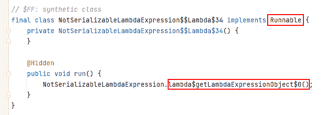
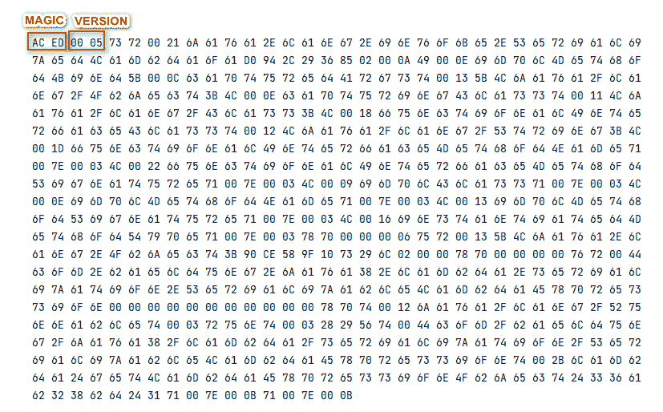
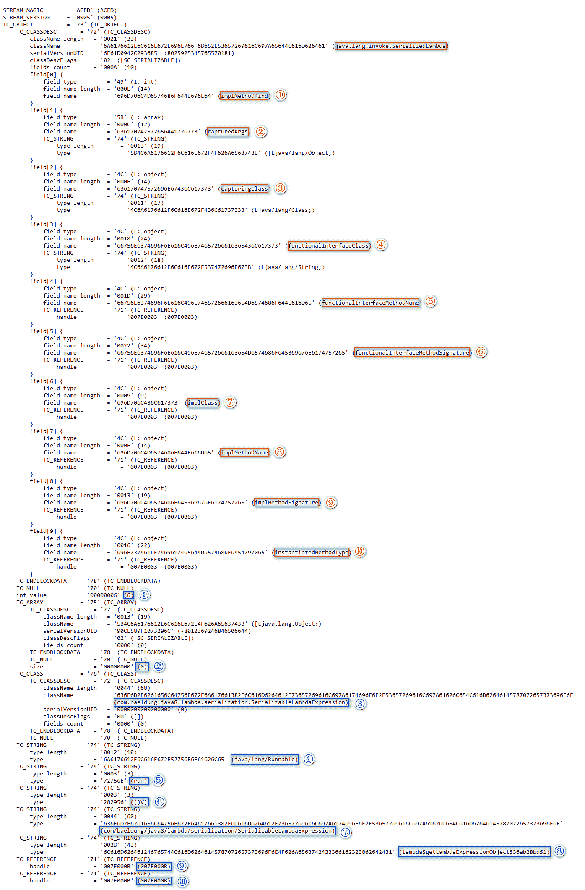
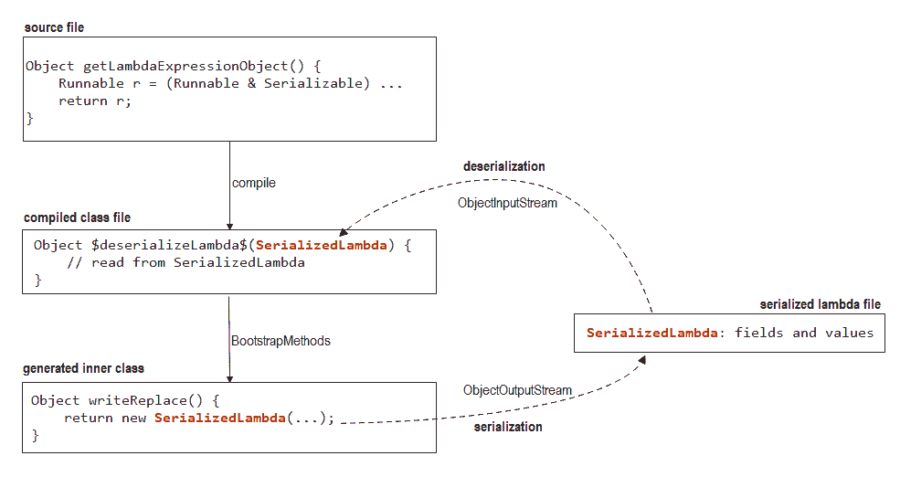

# 用 Java 序列化 Lambda

> 原文:[https://web . archive . org/web/20220930061024/https://www . bael dung . com/Java-serialize-lambda](https://web.archive.org/web/20220930061024/https://www.baeldung.com/java-serialize-lambda)

## 1.概观

一般来说，[Java 文档](https://web.archive.org/web/20220904191634/https://docs.oracle.com/javase/tutorial/java/javaOO/lambdaexpressions.html#serialization)强烈反对我们序列化一个[λ表达式](/web/20220904191634/https://www.baeldung.com/java-8-lambda-expressions-tips)。这是因为 lambda 表达式将生成合成结构。而且，这些合成的构造有几个潜在的问题:源代码中没有相应的构造，不同 Java 编译器实现之间的差异，以及与不同 JRE 实现的兼容性问题。然而，有时序列化 lambda 是必要的。

在本教程中，我们将解释如何序列化 lambda 表达式及其底层机制。

## 2.Lambda 和序列化

当我们使用 [Java 序列化](/web/20220904191634/https://www.baeldung.com/java-serialization)来序列化或反序列化一个对象时，它的类和非静态字段必须都是可序列化的。否则会导致`NotSerializableException`。同样，**当序列化一个 lambda 表达式时，我们必须确保它的目标类型和捕获参数是可序列化的**。

### 2.1.Lambda 序列化失败

在源文件中，让我们使用`Runnable`接口来构造一个 lambda 表达式:

```
public class NotSerializableLambdaExpression {
    public static Object getLambdaExpressionObject() {
        Runnable r = () -> System.out.println("please serialize this message");
        return r;
    }
}
```

当试图序列化`Runnable`对象时，我们将得到一个`NotSerializableException`。在继续之前，我们先稍微解释一下。

当 JVM 遇到 lambda 表达式时，它将使用内置的 ASM 来构建内部类。那么，这个内部类是什么样子的呢？我们可以通过在命令行上指定`jdk.internal.lambda.dumpProxyClasses`属性来转储这个生成的内部类:

```
-Djdk.internal.lambda.dumpProxyClasses=<dump directory>
```

这里要小心:当我们用目标目录替换`<dump directory>`时，这个目标目录最好是空的，因为如果我们的项目依赖于第三方库，JVM 可能会转储相当多的意外生成的内部类。

转储之后，我们可以用适当的 Java 反编译器检查这个生成的内部类:

[](/web/20220904191634/https://www.baeldung.com/wp-content/uploads/2022/05/not-serializable-lambda-expression-generated-inner-class.png)

上图中，生成的内部类只实现了`Runnable`接口，这是 lambda 表达式的目标类型。此外，在`run`方法中，代码将调用`NotSerializableLambdaExpression.lambda$getLambdaExpressionObject$0`方法，该方法由 Java 编译器生成，代表我们的 lambda 表达式实现。

因为这个生成的内部类是我们的 lambda 表达式的实际类，并且它没有实现`Serializable`接口，所以 lambda 表达式不适合序列化。

### 2.2.如何序列化 Lambda

至此，问题落到了点子上:如何给生成的内部类添加`Serializable`接口？答案是[用交集类型](https://web.archive.org/web/20220904191634/https://docs.oracle.com/javase/specs/jls/se8/html/jls-15.html#jls-15.16)铸造一个 lambda 表达式，该交集类型组合了[功能接口](/web/20220904191634/https://www.baeldung.com/java-8-functional-interfaces)和`Serializable`接口。

例如，让我们将`Runnable`和`Serializable`组合成一个交集类型:

```
Runnable r = (Runnable & Serializable) () -> System.out.println("please serialize this message");
```

现在，如果我们尝试序列化上面的`Runnable`对象，就会成功。

然而，如果我们经常这样做，就会引入很多样板文件。为了使代码简洁，我们可以定义一个新的接口来实现`Runnable`和`Serializable`:

```
interface SerializableRunnable extends Runnable, Serializable {
}
```

然后我们可以使用它:

```
SerializableRunnable obj = () -> System.out.println("please serialize this message");
```

但是**我们也应该小心不要捕获任何不可序列化的参数**。例如，让我们定义另一个接口:

```
interface SerializableConsumer<T> extends Consumer<T>, Serializable {
}
```

那么我们可以选择`System.out::println`作为它的实现:

```
SerializableConsumer<String> obj = System.out::println;
```

这样一来，就会导致一个`NotSerializableException`。这是因为这个实现将捕获`System.out`变量作为它的参数，这个变量的类是`PrintStream`，它是不可序列化的。

## 3.潜在机制

在这一点上，我们可能想知道:在我们引入交集类型之后，下面会发生什么？

为了有一个讨论的基础，让我们准备另一段代码:

```
public class SerializableLambdaExpression {
    public static Object getLambdaExpressionObject() {
        Runnable r = (Runnable & Serializable) () -> System.out.println("please serialize this message");
        return r;
    }
}
```

### 3.1.编译后的类文件

编译后，我们可以使用`javap`来检查编译后的类:

```
javap -v -p SerializableLambdaExpression.class
```

`-v`选项将打印详细的消息，而`-p`选项将显示私有方法。

并且，我们可能会发现 Java 编译器提供了一个`$deserializeLambda$`方法，该方法接受一个 [`SerializedLambda`](https://web.archive.org/web/20220904191634/https://docs.oracle.com/en/java/javase/11/docs/api/java.base/java/lang/invoke/SerializedLambda.html) 参数:

[](/web/20220904191634/https://www.baeldung.com/wp-content/uploads/2022/05/deserialize-lambda-method-bytecode.png)

为了可读性，让我们将上面的字节码反编译成 Java 代码:

[](/web/20220904191634/https://www.baeldung.com/wp-content/uploads/2022/05/deserialize-lambda-method-java-code.png)

上面的`$deserializeLambda$`方法的主要职责是构造一个对象。首先，它用 lambda 表达式细节的不同部分检查`SerializedLambda`的`getXXX`方法。然后，如果满足所有条件，它将调用`SerializableLambdaExpression::lambda$getLambdaExpressionObject$36ab28bd$1`方法引用来创建一个实例。否则，它会抛出一个`IllegalArgumentException`。

### 3.2.生成的内部类

除了检查编译后的类文件，我们还需要检查新生成的内部类。因此，让我们使用`jdk.internal.lambda.dumpProxyClasses`属性来转储生成的内部类:

[](/web/20220904191634/https://www.baeldung.com/wp-content/uploads/2022/05/serializable-lambda-expression-generated-inner-class.png)

在上面的代码中，新生成的内部类实现了`Runnable`和`Serializable`接口，这意味着它适合序列化。并且，它还提供了一个额外的 [`writeReplace`](https://web.archive.org/web/20220904191634/https://docs.oracle.com/en/java/javase/11/docs/specs/serialization/output.html#the-writereplace-method) 方法。为了深入了解，该方法返回一个描述 lambda 表达式实现细节的`SerializedLambda`实例。

要形成一个闭环，还缺少一样东西:序列化的 lambda 文件。

### 3.3.序列化的 Lambda 文件

由于序列化的 lambda 文件以二进制格式存储，我们可以使用十六进制工具来检查其内容:

[](/web/20220904191634/https://www.baeldung.com/wp-content/uploads/2022/05/serialized-lambda-file-hex-format.png)

在[序列化流](https://web.archive.org/web/20220904191634/https://www.infoworld.com/article/2072752/the-java-serialization-algorithm-revealed.html)中，十六进制“`AC ED`”(Base64 中的“rO0”)为流幻数，十六进制“00 05”为流版本。但是，剩下的数据是不可读的。

根据[对象序列化流协议](https://web.archive.org/web/20220904191634/https://docs.oracle.com/en/java/javase/17/docs/specs/serialization/protocol.html)，剩余的数据可以解释为:

[](/web/20220904191634/https://www.baeldung.com/wp-content/uploads/2022/05/serialized-lambda-file-parsed-format.png)

从上图中，我们可以注意到序列化的 lambda 文件实际上包含了`SerializedLambda`类数据。具体来说，它包含 10 个字段和相应的值。并且，`SerializedLambda`类的**这些字段和值是编译后的类文件中的`$deserializeLambda$`方法和生成的内部类**中的`writeReplace`方法之间的桥梁。

### 3.4.把所有的放在一起

现在，是时候将不同的部分组合在一起了:

[](/web/20220904191634/https://www.baeldung.com/wp-content/uploads/2022/05/how-lambda-serialization-and-deserialization-works.png)

当我们使用`ObjectOutputStream`来序列化一个 lambda 表达式时，`ObjectOutputStream`会发现生成的内部类包含一个返回`SerializedLambda`实例的`writeReplace`方法。然后，`ObjectOutputStream`将序列化这个`SerializedLambda`实例，而不是原始对象。

接下来，当我们使用`ObjectInputStream`反序列化序列化 lambda 文件时，会创建一个`SerializedLambda`实例。然后，`ObjectInputStream`将使用这个实例调用`SerializedLambda`类中定义的 [`readResolve`](https://web.archive.org/web/20220904191634/https://docs.oracle.com/en/java/javase/11/docs/specs/serialization/input.html#the-readresolve-method) 。并且，`readResolve`方法将调用在捕获类中定义的`$deserializeLambda$`方法。最后，我们得到了反序列化的 lambda 表达式。

总而言之，**`SerializedLambda`类是 lambda 序列化过程**的关键。

## 4.结论

在本文中，我们首先查看了一个失败的 lambda 序列化示例，并解释了失败的原因。然后，我们介绍了如何使 lambda 表达式可序列化。最后，我们探索了 lambda 序列化的底层机制。

像往常一样，本教程的源代码可以在 GitHub 上找到[。](https://web.archive.org/web/20220904191634/https://github.com/eugenp/tutorials/tree/master/core-java-modules/core-java-lambdas)