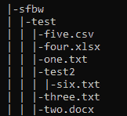

# 在 Java 中查找匹配通配符字符串的文件

> 原文：<https://web.archive.org/web/20220930061024/https://www.baeldung.com/java-files-match-wildcard-strings>

## 1.概观

在本教程中，我们将学习如何在 Java 中使用通配符字符串查找文件。

## 2.介绍

在编程领域， **[glob](/web/20220811171218/https://www.baeldung.com/linux/bash-globbing) 是一种使用通配符匹配文件名**的模式。在我们的例子中，我们将使用 glob 模式来过滤文件名列表。我们将使用流行的通配符“*”和“？”。Java 从 Java SE 7 开始就支持这个特性。

**Java 在他们的`FileSystem`类中提供了`getPathMatcher()`方法。它可以采用正则表达式(regex)或 glob 模式。**在这个例子中，我们将使用 glob 模式，因为与 regex 相比，使用通配符更简单。

让我们看一个使用 glob 模式的方法的例子:

[PRE0]

以下是 Java 中 glob 模式的一些例子:

| 一团 | 描述 |
| *.Java 语言（一种计算机语言，尤用于创建网站） | 匹配所有扩展名为“java”的文件 |
| *.{java，class} | 匹配扩展名为“java”或“class”的所有文件 |
| *.* | 匹配所有带有“.”的文件在它名字的某个地方 |
| ？？？？ | 匹配名称中包含四个字符的所有文件 |
| 【测试】。docx | 匹配文件名为“t”、“e”、“s”或“t”且扩展名为“docx”的所有文件 |
| [0-4].战斗支援车 | 匹配文件名为“0”、“1”、“2”、“3”或“4”、扩展名为“csv”的所有文件 |
| C:\\temp\\* | 匹配 Windows 系统上“C:\temp”目录中的所有文件 |
| src/test/* | 匹配基于 Unix 的系统上“src/test/”目录中的所有文件 |

## 3.履行

让我们来了解一下实现这个解决方案的细节。完成这项任务有两个步骤。

首先，我们创建一个带两个参数的方法——一个要搜索的根目录和一个要查找的通配符模式。这个方法将包含访问每个文件和目录的编程逻辑，利用 glob 模式，并最终返回匹配文件名的列表。

**其次，我们使用 Java 提供的`Files` 类中的`walkFileTree`方法来调用我们的搜索过程。**

首先，让我们用一个`searchWithWc()`方法创建我们的`SearchFileByWildcard`类，该方法将一个`Path`和`String`模式作为参数:

[PRE1]

为了访问`rootDir`中的文件，我们使用了`FileVisitor`接口。一旦我们通过调用`getDefault()`方法获得了文件系统的接口，我们就使用来自`FileSystem`类的`getPathMatcher()`方法。这就是我们在`rootDir`中对单个文件路径应用 glob 模式的地方。

在我们的例子中，我们可以使用得到的`PathMatcher` 来获得匹配文件名的`[ArrayList](/web/20220811171218/https://www.baeldung.com/java-arraylist)` 。

最后，我们从 NIO `Files`类中调用`walkFileTree`方法。文件遍历从`rootDir`开始，以深度优先的方式递归访问树中的每个节点。`matcherVisitor`包含了来自`SimpleFileVisitor`类的`visitFile`方法的实现。

既然我们已经讨论了实现基于通配符的文件搜索，那么让我们来看一些示例输出。在我们的示例中，我们将使用以下文件结构:

如果我们用`“glob:*.{txt,docx}”`模式传递一个`String`，我们的代码输出三个扩展名为`“txt”`的文件名和一个扩展名为`“docx”`的文件名:

[PRE2]

如果我们用`“glob:????.{csv}”`模式传递一个`String`，我们的代码将输出一个文件名，文件名包含四个字符，后跟一个“.”带分机`“csv”`:

[PRE3]

## 4.结论

在本教程中，我们学习了如何在 Java 中使用通配符模式搜索文件。

GitHub 上的[提供了源代码。](https://web.archive.org/web/20220811171218/https://github.com/eugenp/tutorials/tree/master/core-java-modules/core-java-nio-2)