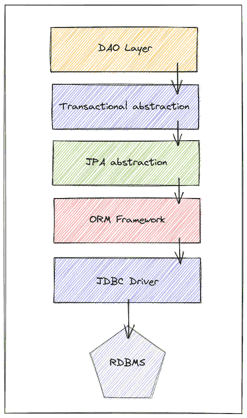

# 将事务用于只读操作

> 原文:[https://web . archive . org/web/20220930061024/https://www . bael dung . com/spring-transactions-read-only](https://web.archive.org/web/20220930061024/https://www.baeldung.com/spring-transactions-read-only)

## 1.概观

在本文中，我们将讨论只读事务。我们将讨论它们的用途以及如何使用它们，并检查它们与性能和优化相关的一些细微差别。**为了简单起见，我们将关注 MySQL 的 InnoDB 引擎**。但是，请记住，所描述的一些信息可能会因数据库/存储引擎而异。

## 2.什么是交易？

**事务是由一个或多个语句组成的原子操作**。它是原子性的，因为该操作中的所有语句要么成功(提交)，要么失败(回滚)，这意味着要么全部成功，要么什么都不做。 [ACID](/web/20220811184103/https://www.baeldung.com/cs/transactions-intro) 属性的字母“A”代表事务的原子性。

**另一个需要理解的关键点是，InnoDB 引擎中的所有语句都变成了一个事务，如果不是显式的，那么就是隐式的**。当我们将并发性添加到等式中时，这样的概念变得更加难以理解。然后，我们需要澄清另一个酸属性，即隔离的“我”。

**理解隔离级别属性对于我们能够权衡性能与一致性保证**至关重要。但是，在详细介绍隔离级别之前，请记住，由于 InnoDB 中的所有语句都是事务，因此它们可以被提交或回滚。如果没有指定事务，数据库会创建一个事务，根据`autocommit`属性，它可能被提交，也可能不被提交。

### 2.1.隔离级别

对于本文，我们将假设 MySQL 的缺省值— [repeatable read](https://web.archive.org/web/20220811184103/https://dev.mysql.com/doc/refman/5.6/en/innodb-transaction-isolation-levels.html#isolevel_repeatable-read) 。它在同一事务中提供一致的读取，这意味着第一次读取将建立快照(时间点)，所有后续读取将彼此一致。我们可以参考 MySQL 官方[文档](https://web.archive.org/web/20220811184103/https://dev.mysql.com/doc/refman/5.6/en/innodb-transaction-isolation-levels.html)了解更多信息。当然，保留这样的快照有其后果，但可以保证良好的一致性。

不同的数据库可能有不同的名称或隔离级别选项，但最有可能的是，它们是相似的。

## 3.为什么以及在哪里使用事务？

现在我们更好地理解了什么是事务及其不同的属性，让我们来谈谈只读事务。如前所述，在 InnoDB 引擎中，所有的语句都是事务，因此，它们可能涉及到诸如锁定和快照之类的事情。然而，我们可以看到**一些与事务协调相关的开销，比如用事务 id 和其他内部结构标记行，对于普通查询**可能不是必需的。这就是只读事务发挥作用的地方。

我们可以使用语法`START TRANSACTION READ ONLY`显式定义一个只读事务。MySQL 还试图自动检测只读转换。但是当显式声明一个时，可以应用进一步的优化。**读取密集型应用可以利用这些优化并节省我们数据库集群上的资源利用率**。

### 3.1.应用程序与数据库

我们需要知道，在我们的应用程序中处理持久层可能涉及许多抽象层。每一层都有不同的职责。然而，为了简化，让我们说最终，那些层影响我们的应用程序如何处理数据库或者数据库如何处理数据操作。

当然，并不是所有的应用程序都有这些层，但是这是一个很好的概括。简而言之，假设我们有一个 Spring 应用程序，这些层的目的是:

[](/web/20220811184103/https://www.baeldung.com/wp-content/uploads/2022/05/DB.png)

*   **:**在业务逻辑和持久性之间架起一座桥梁
*   事务抽象:处理事务的应用级复杂性(开始、提交、回滚)
*   JPA 抽象:在供应商之间提供标准 API 的 Java 规范
*   ORM 框架:JPA 背后的实际实现(例如 Hibernate)
*   [JDBC](/web/20220811184103/https://www.baeldung.com/java-jdbc) :负责与数据库的实际通信

主要的结论是，许多这些因素可能会影响我们的交易行为。尽管如此，让我们关注一下直接影响这种行为的特定属性组。**通常，客户端可以在全局或会话级别定义这些属性**。所有属性的列表非常广泛，因此我们将只讨论其中两个非常重要的属性。然而，我们应该对它们已经很熟悉了。

### 3.2.事务管理

**JDBC 驱动从应用端启动事务的方式是关闭 [`autocommit`](https://web.archive.org/web/20220811184103/https://dev.mysql.com/doc/refman/5.6/en/server-system-variables.html#sysvar_autocommit) 属性**。这相当于一个`BEGIN TRANSACTION`语句，从那时起，所有后续语句都必须提交或回滚，以便完成事务。

该属性在全局级别定义，它告诉数据库将所有传入请求视为手动事务，并要求用户提交或回滚。但是，如果用户在会话级覆盖了这个定义，这将不再有效。因此，许多驱动程序默认关闭该属性，以保证一致的行为，并确保应用程序能够控制它。

接下来，**我们可以使用`[transaction](https://web.archive.org/web/20220811184103/https://dev.mysql.com/doc/refman/5.6/en/set-transaction.html)`属性来定义是否允许写操作**。但是有一个警告:即使在只读事务中，也有可能操作使用`TEMPORARY`关键字创建的表。这个属性也有全局和会话范围，尽管我们通常在应用程序的会话级别处理这个和其他属性。

一个警告是，当使用连接池时，由于打开连接和重用它们的性质。处理事务和连接的框架或库必须确保会话在开始新的事务之前处于干净的状态。

因此，可能会执行一些语句来放弃任何剩余的挂起更改，并正确设置会话。

我们已经看到，读取密集型应用程序可以利用只读事务来优化和节省数据库集群中的资源。但是，许多开发人员也忘记了设置之间的切换也会导致数据库的往返，从而影响连接的吞吐量。

在 MySQL 中，我们可以在全局级别将这些属性定义为:

```
SET GLOBAL TRANSACTION READ WRITE;
SET autocommit = 0;
/* transaction */
commit; 
```

或者，我们可以在会话级别设置属性:

```
SET SESSION TRANSACTION READ ONLY;
SET autocommit = 1;
/* transaction */ 
```

### 3.3.暗示

**对于只执行一次查询的交易，启用`autocommit`属性可以节省我们** **的往返**。如果这是我们的应用程序中最常见的原因，那么使用一个设置为只读的独立数据源并默认启用`autocommit`会更好。

现在，如果事务有更多的查询，我们应该使用一个显式的只读事务。创建只读数据源还有助于避免写事务和只读事务之间的切换，从而节省往返时间。但是，**如果我们有混合工作负载，管理新数据源的复杂性可能无法证明其合理性**。

在处理包含多个语句的事务时，另一个要点是考虑由隔离级别决定的行为，因为它会改变事务的结果，并可能影响性能。为了简单起见，在我们的例子中，我们只考虑默认的一个(可重复读取)。

## 4.付诸实践

现在，从应用程序方面，我们将尝试理解如何处理这些属性，以及哪些层可以访问这些行为。但是，很明显，有许多不同的方法可以做到这一点，并且根据框架的不同，这可能会发生变化。因此，以 JPA 和 Spring 为例，我们可以很好地理解它在其他情况下会是什么样子。

### 4.1.作业的装配区（JobPackArea）

让我们看看如何使用 JPA/Hibernate 在应用程序中有效地定义一个只读事务:

```
EntityManagerFactory entityManagerFactory = Persistence.createEntityManagerFactory("jpa-unit");
EntityManager entityManager = entityManagerFactory.createEntityManager();
entityManager.unwrap(Session.class).setDefaultReadOnly(true);
entityManager.getTransaction().begin();
entityManager.find(Book.class, id);
entityManager.getTransaction().commit(); 
```

重要的是要注意到**在 JPA** 中没有定义只读事务的标准方法。出于这个原因，我们需要获得实际的 Hibernate 会话来将其定义为只读。

### 4.2.JPA+Spring

当使用 Spring 事务管理系统时，它变得更加简单，如下所示:

```
@Transactional(readOnly = true)
public Book getBookById(long id) {
    return entityManagerFactory.createEntityManager().find(Book.class, id);
}
```

通过这样做， **Spring 负责打开、关闭和定义事务模式。**然而，即使这样有时也是不必要的，因为当使用 Spring Data JPA 时，我们已经准备好了这样的配置。

Spring JPA 存储库[基类](https://web.archive.org/web/20220811184103/https://docs.spring.io/spring-data/data-jpa/docs/current/api/org/springframework/data/jpa/repository/support/SimpleJpaRepository.html)将所有方法标记为只读事务。通过在类级别添加这个注释，只需在方法级别添加`@Transactional`就可以改变方法的行为。

最后，在配置数据源时，还可以定义只读连接并更改`autcommit`属性。正如我们看到的，如果我们只需要读取，这可以进一步提高应用程序的性能。数据源保存这些配置:

```
@Bean
public DataSource readOnlyDataSource() {
    HikariConfig config = new HikariConfig();
    config.setJdbcUrl("jdbc:mysql://localhost/baeldung?useUnicode=true&characterEncoding;=UTF-8");
    config.setUsername("baeldung");
    config.setPassword("baeldung");
    config.setReadOnly(true);
    config.setAutoCommit(true);
    return new HikariDataSource(config);
}
```

然而，这只有在应用程序的主要特征是单一查询资源的情况下才有意义。此外，如果使用 Spring Data JPA，就必须禁用 Spring 创建的默认事务。因此，我们只需要将`enableDefaultTransactions`属性配置为`false`:

```
@Configuration
@EnableJpaRepositories(enableDefaultTransactions = false)
@EnableTransactionManagement
public class Config {
    //Definition of data sources and other persistence related beans
}
```

从这一刻起，我们有完全的控制权和责任在必要的时候添加`@Transactional(readOnly=true)`。尽管如此，大多数应用程序并非如此，所以我们不应该更改这些配置，除非我们确信我们的应用程序会从中受益。

### 4.3.路由语句

**在一个更真实的场景中，我们可以有两个数据源，一个是编写器数据源，一个是只读的** **数据源**。然后，我们必须定义在组件级别使用哪个数据源。**这种方法更有效地处理读取连接，并防止使用不必要的命令来确保会话干净并具有适当的设置**。

有多种方法可以达到这个结果，但是我们将首先创建一个路由器数据源类:

```
public class RoutingDS extends AbstractRoutingDataSource {

    public RoutingDS(DataSource writer, DataSource reader) {
        Map<Object, Object> dataSources = new HashMap<>();
        dataSources.put("writer", writer);
        dataSources.put("reader", reader);

        setTargetDataSources(dataSources);
    }

    @Override
    protected Object determineCurrentLookupKey() {
        return ReadOnlyContext.isReadOnly() ? "reader" : "writer";
    }
} 
```

关于[路由数据源](//web.archive.org/web/20220811184103/https://www.baeldung.com/spring-abstract-routing-data-source)还有很多需要了解的。然而，总而言之，在我们的例子中，当应用程序请求时，这个类将返回适当的数据源。为此，我们使用了在运行时保存数据源上下文的`ReadOnlyContent`类:

```
public class ReadOnlyContext {

    private static final ThreadLocal<AtomicInteger> READ_ONLY_LEVEL = ThreadLocal.withInitial(() -> new AtomicInteger(0));

    //default constructor

    public static boolean isReadOnly() {
        return READ_ONLY_LEVEL.get()
            .get() > 0;
    }

    public static void enter() {
        READ_ONLY_LEVEL.get()
            .incrementAndGet();
    }

    public static void exit() {
        READ_ONLY_LEVEL.get()
            .decrementAndGet();
    }
}
```

接下来，我们需要定义这些数据源，并在 Spring 上下文中注册它们。为此，我们只需要使用之前创建的`RoutingDS`类:

```
//annotations mentioned previously
public Config {
    //other beans...

    @Bean
    public DataSource routingDataSource() {
        return new RoutingDS(
          dataSource(false, false),
          dataSource(true, true)
        );
    }

    private DataSource dataSource(boolean readOnly, boolean isAutoCommit) {
        HikariConfig config = new HikariConfig();
        config.setJdbcUrl("jdbc:mysql://localhost/baeldung?useUnicode=true&characterEncoding;=UTF-8");
        config.setUsername("baeldung");
        config.setPassword("baeldung");
        config.setReadOnly(readOnly);
        config.setAutoCommit(isAutoCommit);
        return new HikariDataSource(config);
    }

    // other beans...
}
```

差不多了——现在，**让我们创建一个注释来告诉 Spring 何时在只读上下文中包装组件**。为此，我们将使用`@ReaderDS`注释:

```
@Inherited
@Retention(RetentionPolicy.RUNTIME)
public @interface ReaderDS {
}
```

最后，我们使用 [AOP](/web/20220811184103/https://www.baeldung.com/spring-aop) 将组件执行包装在上下文中:

```
@Aspect
@Component
public class ReadOnlyInterception {
    @Around("@annotation(com.baeldung.readonlytransactions.mysql.spring.ReaderDS)")
    public Object aroundMethod(ProceedingJoinPoint joinPoint) throws Throwable {
        try {
            ReadOnlyContext.enter();
            return joinPoint.proceed();
        } finally {
            ReadOnlyContext.exit();
        }
    }
} 
```

通常，我们希望尽可能在最高点添加注释。不过，为了简单起见，我们将添加存储库层，组件中只有一个查询:

```
public interface BookRepository extends JpaRepository<BookEntity, Long> {

    @ReaderDS
    @Query("Select t from BookEntity t where t.id = ?1")
    BookEntity get(Long id);
}
```

**正如我们所观察到的，这种设置允许我们通过利用整个只读事务和避免会话上下文切换来更有效地处理只读操作**。因此，这可以大大提高我们的应用程序的吞吐量和响应能力。

## 5.结论

在本文中，我们研究了只读事务及其好处。我们还了解了 MySQL InnoDB 引擎如何处理它们，以及如何配置影响应用程序事务的主要属性。此外，我们还讨论了通过使用专用资源(如专用数据源)进行额外改进的可能性。像往常一样，本文中使用的所有代码示例都可以从 GitHub 上的[处获得。](https://web.archive.org/web/20220811184103/https://github.com/eugenp/tutorials/tree/master/persistence-modules/read-only-transactions)