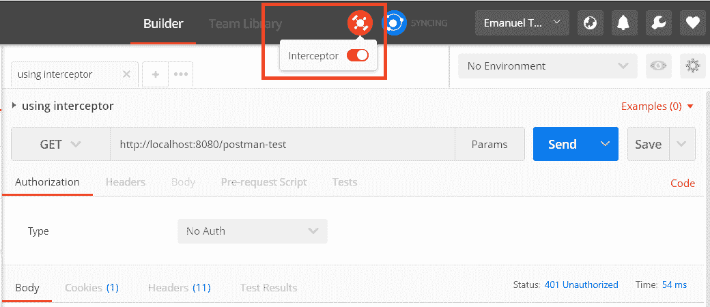
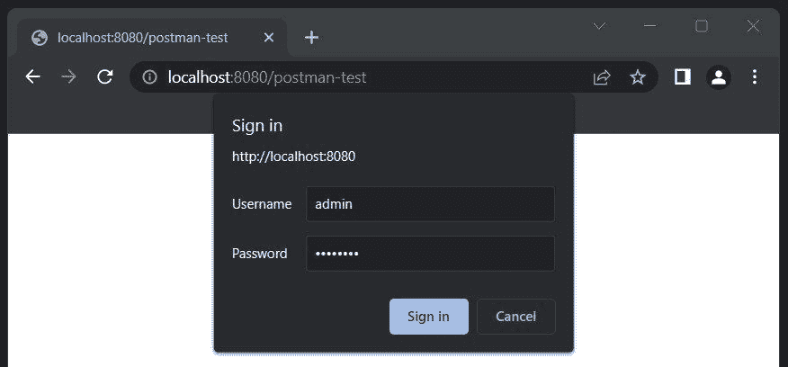

# 邮递员的基本身份验证

> 原文：<https://web.archive.org/web/20220930061024/https://www.baeldung.com/java-postman-authentication>

## 1.概观

在本教程中，我们将学习如何使用 [Postman](/web/20221108130408/https://www.baeldung.com/tag/postman/) 来测试受基本认证保护的端点。

我们将看到如何使用`“Authorization”`选项卡根据原始凭证生成标题。之后，我们将学习如何手动操作。最后，我们将看到 Postman Interceptor 是如何工作的，以及它如何派上用场。

## 2.基本认证

**基本认证是一种通过特殊报头保护 HTTP 请求的方法**:

[PRE0]

要生成凭证令牌，我们需要写用户名和密码，用分号字符连接。之后，我们需要用 Base64 编码结果字符串。

假设用户名为“`admin`”，密码为“`baeldung`”。首先，我们将创建凭证字符串，它将是“`admin:baeldung`”。然后，我们用 Base64 编码，添加“`Basic`”关键字，并将其设置为头的值:

[PRE1]

## 3.授权选项卡

首先，让我们向一个基本的 Auth-secured 端点发送一个 GET 请求，并期待响应的`Unauthorized`状态:

现在，让我们添加凭据。为此，**我们只需转到“`Authorization`”选项卡，选择“`Basic Auth`”作为授权类型**。之后，我们插入用户名和密码，一切就绪:

因此，我们可以看到请求被授权，响应代码是 200。此外，如果我们单击“`code`”链接，我们可以看到授权头现在是如何添加到请求中的:

[PRE2]

## 4.手动添加标题

Postman 允许我们手动添加标题。因此，**我们可以直接添加授权头，如果我们已经有了凭证令牌**。

我们可以从“`Headers`”选项卡中完成此操作。首先，我们设置“`Authorization`”为键。之后，我们将添加凭据令牌:

如果我们检查 HTTP 请求，我们会发现与前一个请求没有什么不同。

## 5.邮递员拦截器

Postman Interceptor 是一个 Chrome 扩展，允许我们将 Postman 应用程序绑定到浏览器会话。**换句话说，它允许 Postman 代表登录浏览器的用户执行请求。**

首先，我们需要下载并安装 [Chrome 扩展](https://web.archive.org/web/20221108130408/https://chrome.google.com/webstore/detail/postman-interceptor/aicmkgpgakddgnaphhhpliifpcfhicfo)。之后，我们从 Postman 应用程序中启用拦截器，方法是单击卫星图标:

现在，Postman 应用程序与浏览器会话绑定在一起。如果我们浏览网页，我们将能够在 Postman 的“`History`”标签中看到所有的请求。然而，如果我们现在尝试执行 GET 请求，我们仍然会得到`401 Unauthorized`响应，因为我们还没有登录。

让我们使用浏览器导航到受身份验证保护的基本页面:

在我们使用浏览器弹出窗口登录后，我们可以返回到 Postman 并再次执行请求。这一次，请求将被授权。

## 6.结论

在本文中，我们学习了基本身份验证的工作原理，并探索了用 Postman 测试安全端点的各种方法。

我们看到了如何手动添加`Authorization`头，以及如何使用 Postman 基于原始凭证生成它。最后，我们学习了 Postman Interceptor，我们发现可以用它来代表从浏览器登录的用户发送请求。

和往常一样，GitHub 上的[提供了源代码和 Postman 集合。](https://web.archive.org/web/20221108130408/https://github.com/eugenp/tutorials/tree/master/spring-security-modules/spring-security-web-rest-basic-auth)