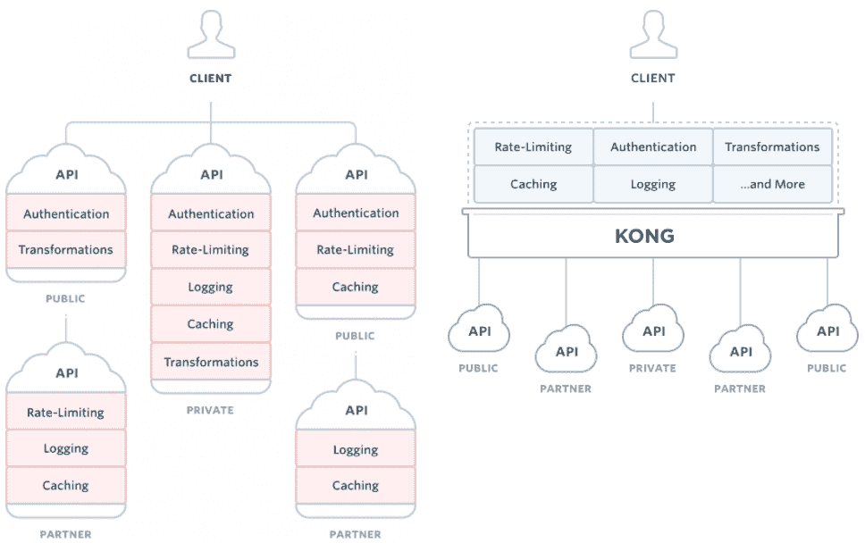

# 孔简介

> 原文：<https://web.archive.org/web/20220930061024/https://www.baeldung.com/kong>

## **1。简介**

[孔](https://web.archive.org/web/20220628162953/https://getkong.org/)是开源的 API 网关和微服务管理层。

基于 Nginx 和 [lua-nginx-module](https://web.archive.org/web/20220628162953/https://github.com/openresty/lua-nginx-module) (特别是 [OpenResty](https://web.archive.org/web/20220628162953/https://openresty.org/) )，Kong 的可插拔架构使其灵活而强大。

## **2。关键概念**

在深入研究代码示例之前，让我们先来看看 Kong 中的关键概念:

*   **API 对象–**包装任何 HTTP(s)端点的属性，以完成特定任务或提供某些服务。配置包括 HTTP 方法、端点 URIs、指向我们的 API 服务器并将用于代理请求的上游 URL、最大退休、速率限制、超时等。
*   **消费者对象–**包装使用我们 API 端点的任何人的属性。它将用于跟踪、访问控制等
*   **上游对象–**描述如何代理传入的请求或对其进行负载平衡，由虚拟主机名表示
*   **目标对象–**表示实施和提供的服务，由主机名(或 IP 地址)和端口标识。请注意，只能添加或禁用每个上游的目标。目标变化的历史由上游维护
*   **Plugin Object–**可插拔特性，在请求和响应生命周期中丰富我们应用程序的功能。例如，可以通过启用相关插件来添加 API 认证和速率限制功能。孔在他的[插件库中](https://web.archive.org/web/20220628162953/https://docs.konghq.com/hub/)提供了非常强大的插件
*   **管理 API–**RESTful API 端点，用于管理 Kong 配置、端点、消费者、插件等

下图描绘了孔与传统建筑的不同之处，这可以帮助我们理解为什么它引入了这些概念:

 
(来源:https://getkong.org/)

## 3.设置

官方文档为各种环境提供了[详细说明](https://web.archive.org/web/20220628162953/https://konghq.com/install/)。

## **4。API 管理**

在本地设置了 Kong 之后，让我们通过代理我们简单的股票查询端点来体验一下 Kong 的强大功能:

[PRE0]

### **4.1。添加 API**

接下来，让我们将查询 API 添加到 Kong 中。

管理 API 可通过`http://localhost:8001`访问，因此我们所有的 API 管理操作都将通过这个基本 URI 完成:

[PRE1]

这里，我们添加了一个具有以下配置的 API:

[PRE2]

*   `“name”`是 API 的标识符，在操作其行为时使用
*   通过匹配`“Host”`报头，`“hosts”`将被用于将传入请求路由到给定的`“upstream_url”`
*   相对路径将与配置的“uri”匹配

如果我们想弃用某个 API 或者配置错误，我们可以简单地删除它:

[PRE3]

添加 API 后，可以通过`http://localhost:8000`使用它们:

[PRE4]

在上面的代码示例中，我们尝试通过刚刚添加到 Kong 的 API 来查询股票价格。

通过请求`http://localhost:8000/stock/btc`，我们获得了与直接从`http://localhost:8080/stock/btc`查询相同的服务。

### **4.2。添加 API 消费者**

现在让我们谈谈安全性——更具体地说，是访问我们 API 的用户的身份验证。

让我们在股票查询 API 中添加一个消费者，这样我们就可以在以后启用身份验证特性。

为 API 添加消费者就像添加 API 一样简单。消费者的姓名(或 id)是所有消费者属性的唯一必填字段:

[PRE5]

在这里，我们添加了“eugenp”作为新的消费者:

[PRE6]

### **4.3。启用认证**

孔最强大的功能来了，外挂。

现在，我们将对代理股票查询 API 应用一个 auth 插件:

[PRE7]

如果我们试图通过代理 URI 查询一只股票的价格，这个请求会被拒绝:

[PRE8]

记住`Eugen`是我们的 API 消费者之一，所以我们应该通过添加一个认证密钥来允许他使用这个 API:

[PRE9]

然后`Eugen`可以像以前一样使用这个 API:

[PRE10]

## **5。高级功能**

除了基本的 API 代理和管理，Kong 还支持 API 负载平衡、集群、健康检查和监控等。

在这一节中，我们将了解如何使用 Kong 实现请求负载平衡，以及如何保护管理 API。

### **5.1。负载平衡**

Kong 为后端服务提供了两种负载平衡策略:一种是动态环平衡器，另一种是直接基于 DNS 的方法。为了简单起见，**我们将使用环形平衡器**。

正如我们前面提到的，上游用于负载平衡，每个上游可以有多个目标。

Kong 支持加权循环和基于哈希的平衡算法。**默认情况下，使用加权循环调度方案**——根据请求的权重将请求发送到每个目标。

首先，让我们准备上游:

[PRE11]

然后，为上游添加两个目标，一个带有`weight=10`的测试版本和一个带有`weight=40`的发布版本:

[PRE12]

有了上面的配置，我们可以假设 1/5 的请求将进入测试版本，4/5 将进入发布版本:

[PRE13]

请注意，加权循环调度方案将对后端服务的请求平衡到近似的权重比率，因此只能验证该比率的近似值，如上面代码的最后一行所示。

### 5.2。保护管理 API

默认情况下，Kong 只接受来自本地接口的管理请求，这在大多数情况下是一个足够好的限制。但是如果我们想通过其他网络接口来管理它，我们可以更改`kong.conf`中的`admin_listen`值，并配置防火墙规则。

或者，我们可以让 Kong 充当 Admin API 本身的代理。假设我们想用路径“/admin-api”来管理 api，我们可以像这样添加一个 API:

[PRE14]

现在，我们可以使用代理管理 API 来管理 API:

[PRE15]

当然，我们希望代理 API 是安全的。这可以通过为代理管理 API 启用身份验证插件来轻松实现。

## **6。总结**

在本文中，我们介绍了 Kong——一个微服务 API 网关平台，并重点介绍了它的核心功能——管理 API 和将请求路由到上游服务器，以及一些更高级的功能，如负载平衡。

然而，还有许多更坚实的功能等待我们去探索，如果需要，我们可以开发自己的插件——你可以在这里继续探索[官方文档](https://web.archive.org/web/20220628162953/https://getkong.org/docs/)。

和往常一样，完整的实现可以在 Github 上找到[。](https://web.archive.org/web/20220628162953/https://github.com/eugenp/tutorials/tree/master/spring-boot-modules/spring-boot-libraries-2)