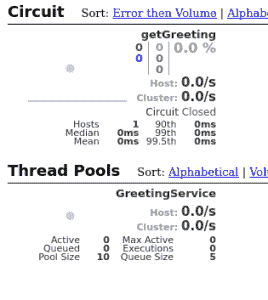

# 网飞春云指南-海斯特里克斯

> 原文：<https://web.archive.org/web/20220930061024/https://www.baeldung.com/spring-cloud-netflix-hystrix>

## 1。概述

在本教程中，我们将涵盖 Spring Cloud 网飞 Hystrix 容错库。我们将使用该库并实现断路器企业模式，该模式描述了一种针对应用程序中不同级别的故障级联的策略。

其原理类似于电子学: [Hystrix](/web/20220416114752/https://www.baeldung.com/introduction-to-hystrix) 是监视相关服务调用失败的方法。如果有这样的失败，它将打开电路，并将调用转发到一个回退方法。

该库将容许故障达到一个阈值。除此之外，它会使电路开路。这意味着，它会将所有后续调用转发给 fallback 方法，以防止将来出现故障。这为相关服务从其故障状态中恢复创建了一个时间缓冲。

## 2。休息制作人

为了创建一个演示断路器模式的场景，我们首先需要一个服务。我们将把它命名为“REST Producer ”,因为它为支持 Hystrix 的“REST Consumer”提供数据，我们将在下一步中创建它。

让我们使用`[spring-boot-starter-web](https://web.archive.org/web/20220416114752/https://search.maven.org/classic/#search%7Cgav%7C1%7Cg%3A%22org.springframework.boot%22%20AND%20a%3A%22spring-boot-starter-web%22)`依赖项创建一个新的 Maven 项目:

```
<dependency>
    <groupId>org.springframework.boot</groupId>
    <artifactId>spring-boot-starter-web</artifactId>
    <version>2.2.6.RELEASE</version>
</dependency> 
```

项目本身有意保持简单。它由一个控制器接口组成，该接口带有一个带注释的 GET 方法，只返回一个实现该接口的`String,`、`@RestController`和一个[、`@SpringBootApplication`、](/web/20220416114752/https://www.baeldung.com/spring-boot-application-configuration)。

我们将从界面开始:

```
public interface GreetingController {
    @GetMapping("/greeting/{username}")
    String greeting(@PathVariable("username") String username);
}
```

以及实现:

```
@RestController
public class GreetingControllerImpl implements GreetingController {

    @Override
    public String greeting(@PathVariable("username") String username) {
        return String.format("Hello %s!\n", username);
    }
}
```

接下来，我们将写下主要的应用程序类:

```
@SpringBootApplication
public class RestProducerApplication {
    public static void main(String[] args) {
        SpringApplication.run(RestProducerApplication.class, args);
    }
}
```

要完成这一部分，剩下唯一要做的事情就是配置一个我们将监听的应用程序端口。我们不使用默认端口 8080，因为该端口应该保留给下一步中描述的应用程序。

此外，我们正在定义一个应用程序名称，以便能够从稍后将介绍的客户端应用程序中查找我们的生产者。

然后让我们在我们的`application.properties` 文件中指定一个端口`9090` 和一个名称`rest-producer` :

```
server.port=9090
spring.application.name=rest-producer
```

现在我们可以使用 cURL 测试我们的生成器了:

```
$> curl http://localhost:9090/greeting/Cid
Hello Cid!
```

## 3。带 Hystrix 的 REST 消耗器

对于我们的演示场景，我们将实现一个 web 应用程序，它使用`RestTemplate`和`Hystrix`来消费上一步中的 REST 服务。为了简单起见，我们称之为“休息消费者”。

因此，我们创建一个新的 Maven 项目，将 [`spring-cloud-starter-` hystrix](https://web.archive.org/web/20220416114752/https://search.maven.org/classic/#search%7Cgav%7C1%7Cg%3A%22org.springframework.cloud%22%20AND%20a%3A%22spring-cloud-starter-hystrix%22) `, [spring-boot-starter-web](https://web.archive.org/web/20220416114752/https://search.maven.org/classic/#search%7Cgav%7C1%7Cg%3A%22org.springframework.boot%22%20AND%20a%3A%22spring-boot-starter-web%22)`和 [`spring-boot-starter-thymeleaf`](https://web.archive.org/web/20220416114752/https://search.maven.org/classic/#search%7Cgav%7C1%7Cg%3A%22org.springframework.boot%22%20AND%20a%3A%22spring-boot-starter-thymeleaf%22) 作为依赖项:

```
<dependency>
    <groupId>org.springframework.cloud</groupId>
    <artifactId>spring-cloud-starter-hystrix</artifactId>
    <version>1.4.7.RELEASE</version>
</dependency>
<dependency>
    <groupId>org.springframework.boot</groupId>
    <artifactId>spring-boot-starter-web</artifactId>
    <version>2.2.6.RELEASE</version>
</dependency>
<dependency>
    <groupId>org.springframework.boot</groupId>
    <artifactId>spring-boot-starter-thymeleaf</artifactId>
    <version>2.2.6.RELEASE</version>
</dependency>
```

为了让断路器工作，Hystix 将扫描 [`@Component`或`@Service`](/web/20220416114752/https://www.baeldung.com/spring-bean-annotations) 带注释的类中的`@HystixCommand`带注释的方法，为它实现一个代理并监控它的调用。

我们将首先创建一个`@Service`类，它将被注入到一个`@Controller`中。由于我们正在使用百里香叶构建一个 [web 应用程序，](/web/20220416114752/https://www.baeldung.com/thymeleaf-in-spring-mvc)我们还需要一个 HTML 模板作为视图。

这将是我们的可注入的`@Service`实现一个带有相关回退方法的`@HystrixCommand`。该回退必须使用与原始签名相同的签名:

```
@Service
public class GreetingService {
    @HystrixCommand(fallbackMethod = "defaultGreeting")
    public String getGreeting(String username) {
        return new RestTemplate()
          .getForObject("http://localhost:9090/greeting/{username}", 
          String.class, username);
    }

    private String defaultGreeting(String username) {
        return "Hello User!";
    }
}
```

`RestConsumerApplication`将是我们的主要应用类。`@EnableCircuitBreaker`注释将扫描任何兼容断路器实现的类路径。

为了显式地使用 Hystrix，我们必须用`@EnableHystrix`来注释这个类:

```
@SpringBootApplication
@EnableCircuitBreaker
public class RestConsumerApplication {
    public static void main(String[] args) {
        SpringApplication.run(RestConsumerApplication.class, args);
    }
}
```

我们将使用我们的`GreetingService`设置控制器:

```
@Controller
public class GreetingController {

    @Autowired
    private GreetingService greetingService;

    @GetMapping("/get-greeting/{username}")
    public String getGreeting(Model model, @PathVariable("username") String username) {
        model.addAttribute("greeting", greetingService.getGreeting(username));
        return "greeting-view";
    }
}
```

这是 HTML 模板:

```
<!DOCTYPE html>
<html xmlns:th="http://www.thymeleaf.org">
    <head>
        <title>Greetings from Hystrix</title>
    </head>
    <body>
        <h2 th:text="${greeting}"/>
    </body>
</html>
```

为了确保应用程序正在侦听一个定义的端口，我们将以下内容放在一个`application.properties`文件中:

```
server.port=8080
```

为了查看 Hystix 断路器的运行情况，我们启动我们的消费者，将浏览器指向 [`http://localhost:8080/get-greeting/Cid`](https://web.archive.org/web/20220416114752/http://localhost:8080/get-greeting/Cid) 。正常情况下，将显示以下内容:

```
Hello Cid!
```

为了模拟我们的生产者的失败，我们将简单地停止它，并且在我们完成刷新浏览器之后，我们应该看到一个一般的消息，从我们的`@Service`中的 fallback 方法返回:

```
Hello User!
```

## 4。用 Hystrix 让消费者休息并假装

现在，我们将修改上一步的项目，使用 Spring 网飞 Feign 作为声明性 REST 客户端，而不是 Spring `RestTemplate`。

这样做的好处是，我们以后可以很容易地重构我们的虚拟客户端接口，使用 [Spring 网飞尤里卡](/web/20220416114752/https://www.baeldung.com/spring-cloud-netflix-eureka)进行服务发现。

为了启动这个新项目，我们将复制我们的消费者，并添加我们的生产者和`[spring-cloud-starter-feign](https://web.archive.org/web/20220416114752/https://search.maven.org/classic/#search%7Cgav%7C1%7Cg%3A%22org.springframework.cloud%22%20AND%20a%3A%22spring-cloud-starter-feign%22)`作为依赖项:

```
<dependency>
    <groupId>com.baeldung.spring.cloud</groupId>
    <artifactId>spring-cloud-hystrix-rest-producer</artifactId>
    <version>1.0.0-SNAPSHOT</version>
</dependency>
<dependency>
    <groupId>org.springframework.cloud</groupId>
    <artifactId>spring-cloud-starter-feign</artifactId>
    <version>1.1.5.RELEASE</version>
</dependency>
```

现在，我们可以使用我们的`GreetingController`来扩展一个虚拟客户端。我们将把`Hystrix` fallback 实现为用`@Component`注释的静态内部类。

或者，我们可以定义一个`@Bean`带注释的方法，返回这个回退类的一个实例。

`@FeignClient`的 name 属性是强制的。它用于通过 Eureka 客户端的服务发现或通过 URL 查找应用程序，前提是给出了以下属性:

```
@FeignClient(
  name = "rest-producer"
  url = "http://localhost:9090", 
  fallback = GreetingClient.GreetingClientFallback.class
)
public interface GreetingClient extends GreetingController {

    @Component
    public static class GreetingClientFallback implements GreetingController {

        @Override
        public String greeting(@PathVariable("username") String username) {
            return "Hello User!";
        }
    }
}
```

关于使用 Spring 网飞 Eureka 进行服务发现的更多信息，请看本文。

在`RestConsumerFeignApplication`中，我们将添加一个额外的注释来启用对主应用程序类的假装集成，实际上是`@EnableFeignClients`:

```
@SpringBootApplication
@EnableCircuitBreaker
@EnableFeignClients
public class RestConsumerFeignApplication {

    public static void main(String[] args) {
        SpringApplication.run(RestConsumerFeignApplication.class, args);
    }
}
```

我们将修改控制器，使用自动连接的 Feign 客户端，而不是之前注入的`@Service`，来检索我们的问候:

```
@Controller
public class GreetingController {
    @Autowired
    private GreetingClient greetingClient;

    @GetMapping("/get-greeting/{username}")
    public String getGreeting(Model model, @PathVariable("username") String username) {
        model.addAttribute("greeting", greetingClient.greeting(username));
        return "greeting-view";
    }
}
```

为了区别这个例子和前面的例子，我们将改变`application.properties`中的应用程序监听端口:

```
server.port=8082
```

最后，我们将像上一节一样测试这个假造的消费者。预期的结果应该是一样的。

## 5。用`Hystrix` 缓存回退

现在，我们将把 Hystrix 添加到我们的 [Spring Cloud](/web/20220416114752/https://www.baeldung.com/spring-cloud-securing-services) 项目中。在这个云项目中，我们有一个评级服务，它与数据库对话并获取书籍的评级。

让我们假设我们的数据库是一个需要的资源，它的响应延迟可能随时间而变化，或者有时可能不可用。我们将使用 Hystrix 断路器回退到数据缓存来处理这种情况。

### 5.1.设置和配置

让我们将`[spring-cloud-starter-hystrix](https://web.archive.org/web/20220416114752/https://search.maven.org/classic/#search%7Cgav%7C1%7Cg%3A%22org.springframework.cloud%22%20AND%20a%3A%22spring-cloud-starter-hystrix%22)`依赖性添加到评级模块中:

```
<dependency>
    <groupId>org.springframework.cloud</groupId>
    <artifactId>spring-cloud-starter-hystrix</artifactId>
</dependency>
```

当评级在数据库中被插入/更新/删除时，我们将使用`Repository`将其复制到 Redis 缓存中。要了解更多关于 Redis 的信息，请查看本文。

让我们更新`RatingService`,用`@HystrixCommand`将数据库查询方法包装在一个 Hystrix 命令中，并将其配置为回退到从 Redis 读取:

```
@HystrixCommand(
  commandKey = "ratingsByIdFromDB", 
  fallbackMethod = "findCachedRatingById", 
  ignoreExceptions = { RatingNotFoundException.class })
public Rating findRatingById(Long ratingId) {
    return Optional.ofNullable(ratingRepository.findOne(ratingId))
      .orElseThrow(() -> 
        new RatingNotFoundException("Rating not found. ID: " + ratingId));
}

public Rating findCachedRatingById(Long ratingId) {
    return cacheRepository.findCachedRatingById(ratingId);
}
```

请注意，回退方法应该与包装方法具有相同的签名，并且必须驻留在同一个类中。现在，当`findRatingById`失败或延迟超过给定阈值时，Hystrix 退回到`findCachedRatingById.`

由于 Hystrix 功能是作为 AOP 建议透明注入的，我们必须调整建议的堆叠顺序，以防我们有其他建议，如 Spring 的事务性建议。这里，我们调整了 Spring 的事务 AOP 建议，使其优先级低于 Hystrix AOP 建议:

```
@EnableHystrix
@EnableTransactionManagement(
  order=Ordered.LOWEST_PRECEDENCE, 
  mode=AdviceMode.ASPECTJ)
public class RatingServiceApplication {
    @Bean
    @Primary
    @Order(value=Ordered.HIGHEST_PRECEDENCE)
    public HystrixCommandAspect hystrixAspect() {
        return new HystrixCommandAspect();
    }

    // other beans, configurations
}
```

这里，我们调整了 Spring 的事务 AOP 通知，使其优先级低于 Hystrix AOP 通知。

## 5.2.测试 Hystrix 回退

既然我们已经配置了电路，我们可以通过关闭我们的存储库与之交互的 H2 数据库来测试它。但是首先，让我们将 H2 实例作为外部进程运行，而不是作为嵌入式数据库运行。

让我们将 H2 库(`h2-1.4.193.jar`)复制到一个已知的目录，并启动 H2 服务器:

```
>java -cp h2-1.4.193.jar org.h2.tools.Server -tcp
TCP server running at tcp://192.168.99.1:9092 (only local connections)
```

现在让我们在`rating-service.properties`中更新我们模块的数据源 URL，以指向这个 H2 服务器:

```
spring.datasource.url = jdbc:h2:tcp://localhost/~/ratings
```

我们可以像 Spring Cloud 系列的前一篇[文章](/web/20220416114752/https://www.baeldung.com/spring-cloud-bootstrapping)中给出的那样启动我们的服务，并通过关闭我们正在运行的外部 H2 实例来测试每本书的评级。

我们可以看到，当 H2 数据库无法访问时，Hystrix 会自动返回 Redis 来读取每本书的评级。演示这个用例的源代码可以在[这里](https://web.archive.org/web/20220416114752/https://github.com/eugenp/tutorials/tree/master/spring-cloud/spring-cloud-bootstrap)找到。

## 6。使用范围

通常情况下，`@HytrixCommand`注释方法是在线程池上下文中执行的。但有时它需要在本地范围内运行，例如，一个`@SessionScope`或一个`@RequestScope`。这可以通过给命令注释提供参数来实现:

```
@HystrixCommand(fallbackMethod = "getSomeDefault", commandProperties = {
  @HystrixProperty(name = "execution.isolation.strategy", value = "SEMAPHORE")
})
```

## 7。Hystrix 仪表盘

Hystrix 的一个很好的可选特性是能够在仪表板上监控其状态。

为了启用它，我们将把`[spring-cloud-starter-hystrix-dashboard](https://web.archive.org/web/20220416114752/https://search.maven.org/classic/#search%7Cgav%7C1%7Cg%3A%22org.springframework.cloud%22%20AND%20a%3A%22spring-cloud-starter-hystrix-dashboard%22)` 和`[spring-boot-starter-actuator](https://web.archive.org/web/20220416114752/https://search.maven.org/classic/#search%7Cgav%7C1%7Cg%3A%22org.springframework.boot%22%20AND%20a%3A%22spring-boot-starter-actuator%22)`放在消费者的`pom.xml`中:

```
<dependency>
    <groupId>org.springframework.cloud</groupId>
    <artifactId>spring-cloud-starter-hystrix-dashboard</artifactId>
    <version>1.4.7.RELEASE</version>
</dependency>
<dependency>
    <groupId>org.springframework.boot</groupId>
    <artifactId>spring-boot-starter-actuator</artifactId>
    <version>2.2.6.RELEASE</version>
</dependency>
```

前者需要通过用`@EnableHystrixDashboard`注释一个`@Configuration`来启用，而后者在我们的 web 应用程序中自动启用所需的指标。

在我们完成重启应用程序后，我们将浏览器指向`[http://localhost:8080/hystrix](https://web.archive.org/web/20220416114752/http://localhost:8080/hystrix)`，输入 Hystrix 流的度量 URL 并开始监控。

最后，我们应该看到这样的内容:

[](/web/20220416114752/https://www.baeldung.com/wp-content/uploads/2016/09/Screenshot_20160819_031730-268x300-1.png)

监视一个 Hystrix 流是件好事，但是如果我们必须监视多个支持 Hystrix 的应用程序，那就不方便了。为此，Spring Cloud 提供了一个名为 Turbine 的工具，它可以将流聚合到一个 Hystrix 仪表板中。

配置涡轮机超出了本文的范围，但是这里应该提到这种可能性。因此，也可以使用涡轮流通过消息收集这些流。

## 8。结论

正如我们到目前为止所看到的，我们现在能够使用 Spring 网飞 Hystrix 以及 Spring `RestTemplate`或 Spring 网飞 Feign 来实现断路器模式。

这意味着我们能够使用默认数据使用包含回退的服务，并且能够监控这些数据的使用情况。

像往常一样，我们可以在 [GitHub](https://web.archive.org/web/20220416114752/https://github.com/eugenp/tutorials/tree/master/spring-cloud/spring-cloud-hystrix) 上找到来源。