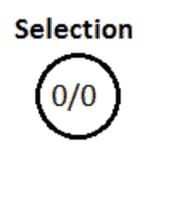
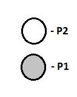

# Java 井字游戏的蒙特卡罗树搜索

> 原文：<https://web.archive.org/web/20220930061024/https://www.baeldung.com/java-monte-carlo-tree-search>

## 1。概述

在本文中，我们将探索**蒙特卡罗树搜索(MCTS)算法**及其应用。

我们将通过用 Java 实现井字游戏**来详细了解它的各个阶段。我们将设计一个通用的解决方案，只需很少的改动就可以用在许多其他的实际应用中。**

## 2。简介

简单来说，蒙特卡罗树搜索是一种概率搜索算法。这是一种独特的决策算法，因为它在具有大量可能性的开放式环境中非常有效。

如果你已经熟悉像 [Minimax](https://web.archive.org/web/20220626080136/https://en.wikipedia.org/wiki/Minimax) 这样的博弈论算法，它需要一个函数来评估当前状态，并且它必须计算博弈树中的许多级别来找到最优移动。

不幸的是，在像 [Go](https://web.archive.org/web/20220626080136/https://en.wikipedia.org/wiki/Go_(game)) 这样的游戏中这样做是不可行的，在这种游戏中有很高的分支因子(随着树的高度增加，会产生数百万种可能性)，并且很难编写一个好的评估函数来计算当前状态有多好。

**蒙特卡洛树搜索将[蒙特卡洛方法](https://web.archive.org/web/20220626080136/https://en.wikipedia.org/wiki/Monte_Carlo_method)应用于博弈树搜索。因为它是基于游戏状态的随机抽样，所以它不需要强行排除每一种可能性。同样，它不一定要求我们写一个评估或好的启发式函数。**

另外，快速补充一下——它彻底改变了计算机围棋的世界。自 2016 年 3 月以来，随着谷歌的 [AlphaGo](https://web.archive.org/web/20220626080136/https://en.wikipedia.org/wiki/AlphaGo) (由 MCTS 和神经网络构建)击败 [Lee Sedol](https://web.archive.org/web/20220626080136/https://en.wikipedia.org/wiki/Lee_Sedol "Lee Sedol") (围棋世界冠军)，这已经成为一个流行的研究话题。

## 3。蒙特卡罗树搜索算法

现在，让我们探索算法是如何工作的。最初，我们将建立一个带有根节点的前瞻树(游戏树)，然后我们将继续用随机展开来扩展它。在这个过程中，我们将维护每个节点的访问计数和获胜计数。

最后，我们将选择具有最有希望的统计数据的节点。

该算法包括四个阶段；让我们来详细探讨一下它们。

### 3.1。选择

在这个初始阶段，该算法从一个根节点开始，并选择一个子节点，以便挑选具有最大胜率的节点。我们还想确保每个节点都有公平的机会。

这个想法是不断选择最佳的子节点，直到我们到达树的叶子节点。选择这样一个子节点的好方法是使用 UCT(应用于树的置信上限)公式:
[](/web/20220626080136/https://www.baeldung.com/wp-content/uploads/2017/06/formula.png) 其中

*   *w*[*i*] =第`i`步后的赢数
*   *n*[*i*] =第`i`步后的模拟次数
*   *c* =勘探参数(理论上等于√2)
*   *t* =父节点的模拟总数

这个公式确保了没有一个州会成为饥饿的受害者，而且它比其他州更经常地扮演有前途的分支角色。

### 3.2。膨胀

当它不能再应用 UCT 来寻找后继节点时，它通过从叶节点追加所有可能的状态来扩展博弈树。

### 3.3。模拟

扩展后，该算法任意选择一个子节点，从选择的节点开始模拟随机游戏，直到达到游戏的结果状态。如果在播放过程中随机或半随机选取节点，则称为轻播放。你也可以选择通过编写质量试探法或评估函数来进行大量的工作。

### 3.4。反向传播

这也称为更新阶段。一旦算法到达游戏结束，它就评估状态，以计算出哪个玩家赢了。它向上遍历到根节点，并增加所有被访问节点的访问分数。如果该位置的玩家赢得了决赛，它还更新每个节点的获胜分数。

MCTS 不断重复这四个阶段，直到某个固定的迭代次数或某个固定的时间量。

在这种方法中，我们基于随机移动来估计每个节点的获胜分数。所以迭代次数越多，估计就越可靠。算法估计在搜索开始时会不太准确，并在足够长的时间后不断改进。同样，这完全取决于问题的类型。

## 4。试运行

[](/web/20220626080136/https://www.baeldung.com/wp-content/uploads/2017/06/Webp.net-gifmaker-2.gif)[](/web/20220626080136/https://www.baeldung.com/wp-content/uploads/2017/06/legend.png)

这里，节点包含统计数据，如总访问量/获胜分数。

## 5。实施

现在，让我们使用蒙特卡罗树搜索算法来实现一个井字游戏。

我们将为 MCTS 设计一个通用的解决方案，它也可以用于许多其他的棋盘游戏。我们将看看文章中的大部分代码。

虽然为了使解释简洁，我们可能不得不跳过一些次要的细节(与 MCTS 没有特别的关系)，但是你总能在这里找到完整的实现[。](https://web.archive.org/web/20220626080136/https://github.com/eugenp/tutorials/tree/master/algorithms-miscellaneous-1)

首先，我们需要为`Tree`和`Node`类提供一个基本的实现，以实现树搜索功能:

```
public class Node {
    State state;
    Node parent;
    List<Node> childArray;
    // setters and getters
}
public class Tree {
    Node root;
}
```

因为每个节点都有特定的问题状态，所以让我们也实现一个`State`类:

```
public class State {
    Board board;
    int playerNo;
    int visitCount;
    double winScore;

    // copy constructor, getters, and setters

    public List<State> getAllPossibleStates() {
        // constructs a list of all possible states from current state
    }
    public void randomPlay() {
        /* get a list of all possible positions on the board and 
           play a random move */
    }
}
```

现在，让我们实现`MonteCarloTreeSearch` 类，它将负责从给定的游戏位置找到下一个最佳移动:

```
public class MonteCarloTreeSearch {
    static final int WIN_SCORE = 10;
    int level;
    int opponent;

    public Board findNextMove(Board board, int playerNo) {
        // define an end time which will act as a terminating condition

        opponent = 3 - playerNo;
        Tree tree = new Tree();
        Node rootNode = tree.getRoot();
        rootNode.getState().setBoard(board);
        rootNode.getState().setPlayerNo(opponent);

        while (System.currentTimeMillis() < end) {
            Node promisingNode = selectPromisingNode(rootNode);
            if (promisingNode.getState().getBoard().checkStatus() 
              == Board.IN_PROGRESS) {
                expandNode(promisingNode);
            }
            Node nodeToExplore = promisingNode;
            if (promisingNode.getChildArray().size() > 0) {
                nodeToExplore = promisingNode.getRandomChildNode();
            }
            int playoutResult = simulateRandomPlayout(nodeToExplore);
            backPropogation(nodeToExplore, playoutResult);
        }

        Node winnerNode = rootNode.getChildWithMaxScore();
        tree.setRoot(winnerNode);
        return winnerNode.getState().getBoard();
    }
}
```

在这里，我们一直迭代所有四个阶段，直到预定的时间，最后，我们得到一个具有可靠统计数据的树，以做出明智的决策。

现在，让我们实现所有阶段的方法。

**我们将从选择阶段**开始，这也需要 UCT 实施:

```
private Node selectPromisingNode(Node rootNode) {
    Node node = rootNode;
    while (node.getChildArray().size() != 0) {
        node = UCT.findBestNodeWithUCT(node);
    }
    return node;
}
```

```
public class UCT {
    public static double uctValue(
      int totalVisit, double nodeWinScore, int nodeVisit) {
        if (nodeVisit == 0) {
            return Integer.MAX_VALUE;
        }
        return ((double) nodeWinScore / (double) nodeVisit) 
          + 1.41 * Math.sqrt(Math.log(totalVisit) / (double) nodeVisit);
    }

    public static Node findBestNodeWithUCT(Node node) {
        int parentVisit = node.getState().getVisitCount();
        return Collections.max(
          node.getChildArray(),
          Comparator.comparing(c -> uctValue(parentVisit, 
            c.getState().getWinScore(), c.getState().getVisitCount())));
    }
}
```

**该阶段推荐一个叶节点，该叶节点应在扩展阶段进一步扩展:**

```
private void expandNode(Node node) {
    List<State> possibleStates = node.getState().getAllPossibleStates();
    possibleStates.forEach(state -> {
        Node newNode = new Node(state);
        newNode.setParent(node);
        newNode.getState().setPlayerNo(node.getState().getOpponent());
        node.getChildArray().add(newNode);
    });
}
```

**接下来，我们编写代码来选择一个随机节点，并从中模拟一次随机播放。**此外，我们将有一个`update`函数从叶子到根传播分数和访问计数:

```
private void backPropogation(Node nodeToExplore, int playerNo) {
    Node tempNode = nodeToExplore;
    while (tempNode != null) {
        tempNode.getState().incrementVisit();
        if (tempNode.getState().getPlayerNo() == playerNo) {
            tempNode.getState().addScore(WIN_SCORE);
        }
        tempNode = tempNode.getParent();
    }
}
private int simulateRandomPlayout(Node node) {
    Node tempNode = new Node(node);
    State tempState = tempNode.getState();
    int boardStatus = tempState.getBoard().checkStatus();
    if (boardStatus == opponent) {
        tempNode.getParent().getState().setWinScore(Integer.MIN_VALUE);
        return boardStatus;
    }
    while (boardStatus == Board.IN_PROGRESS) {
        tempState.togglePlayer();
        tempState.randomPlay();
        boardStatus = tempState.getBoard().checkStatus();
    }
    return boardStatus;
}
```

现在我们完成了 MCTS 的实施。我们所需要的是一个井字游戏特定的`Board`类实现。注意，用我们的实现玩其他游戏；我们只需要改变`Board` 类。

```
public class Board {
    int[][] boardValues;
    public static final int DEFAULT_BOARD_SIZE = 3;
    public static final int IN_PROGRESS = -1;
    public static final int DRAW = 0;
    public static final int P1 = 1;
    public static final int P2 = 2;

    // getters and setters
    public void performMove(int player, Position p) {
        this.totalMoves++;
        boardValues[p.getX()][p.getY()] = player;
    }

    public int checkStatus() {
        /* Evaluate whether the game is won and return winner.
           If it is draw return 0 else return -1 */         
    }

    public List<Position> getEmptyPositions() {
        int size = this.boardValues.length;
        List<Position> emptyPositions = new ArrayList<>();
        for (int i = 0; i < size; i++) {
            for (int j = 0; j < size; j++) {
                if (boardValues[i][j] == 0)
                    emptyPositions.add(new Position(i, j));
            }
        }
        return emptyPositions;
    }
}
```

我们刚刚实现了一个在井字游戏中不可战胜的人工智能。让我们写一个单元案例来证明人工智能与人工智能的对决总是以平局告终:

```
@Test
public void givenEmptyBoard_whenSimulateInterAIPlay_thenGameDraw() {
    Board board = new Board();
    int player = Board.P1;
    int totalMoves = Board.DEFAULT_BOARD_SIZE * Board.DEFAULT_BOARD_SIZE;
    for (int i = 0; i < totalMoves; i++) {
        board = mcts.findNextMove(board, player);
        if (board.checkStatus() != -1) {
            break;
        }
        player = 3 - player;
    }
    int winStatus = board.checkStatus();

    assertEquals(winStatus, Board.DRAW);
}
```

## 6。优势

*   它不需要任何关于游戏的战术知识
*   一个通用的 MCTS 实现只需稍加修改，就可以在任意数量的游戏中重用
*   关注赢得游戏机会较高的节点
*   适用于具有高分支因子的问题，因为它不会在所有可能的分支上浪费计算
*   算法实现起来非常简单
*   执行可以在任何给定的时间停止，它仍然会建议到目前为止计算的下一个最佳状态

## 7。退税

如果 MCTS 以其基本形式使用而没有任何改进，它可能无法建议合理的移动。如果节点没有被充分访问，就会发生这种情况，从而导致不准确的估计。

然而，MCTS 可以通过一些技术来改进。它涉及特定领域和独立领域的技术。

在特定领域的技术中，模拟阶段比随机模拟产生更真实的结果。尽管它需要游戏特定技术和规则的知识。

## 8。总结

乍一看，很难相信一个依赖随机选择的算法可以导致智能人工智能。然而，深思熟虑的实施 MCTS 确实可以为我们提供一种解决方案，这种解决方案可以用于许多游戏以及决策问题。

与往常一样，该算法的完整代码可以在 GitHub 上找到[。](https://web.archive.org/web/20220626080136/https://github.com/eugenp/tutorials/tree/master/algorithms-modules/algorithms-searching)