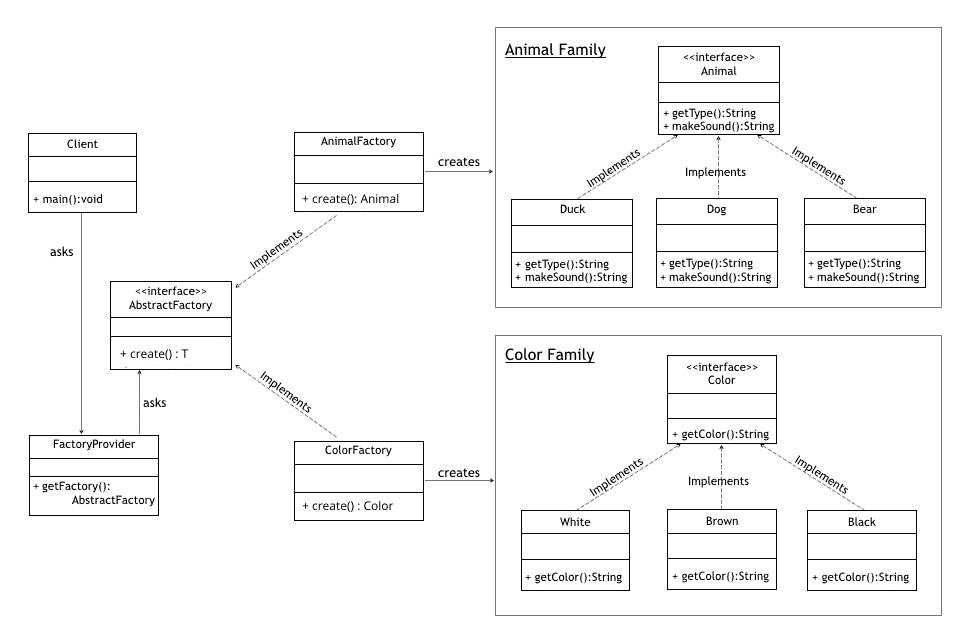

# Java 中的抽象工厂模式

> 原文：<https://web.archive.org/web/20220930061024/https://www.baeldung.com/java-abstract-factory-pattern>

## 1.概观

在本文中，我们将讨论抽象工厂设计模式。

《设计模式:可重用面向对象软件的元素》一书指出，抽象工厂**“提供了一个创建相关或依赖对象家族的接口，而无需指定它们的具体类”。**换句话说，这个模型允许我们创建遵循通用模式的对象。

JDK 中抽象工厂设计模式的一个例子是`javax.xml.parsers.DocumentBuilderFactory`类的`newInstance()`。

## 2。抽象工厂设计模式示例

在这个例子中，我们将创建工厂方法设计模式的两个实现:`AnimalFactory` 和`Color` `Factory.`

之后，我们将使用抽象工厂`AbstractFactory:`来管理对它们的访问

[](/web/20220719051117/https://www.baeldung.com/wp-content/uploads/2018/11/updated_abstract_factory.jpg)

首先，我们将创建一个`Animal` 类的家族，然后在我们的抽象工厂中使用它。

下面是`Animal`界面:

```
public interface Animal {
    String getAnimal();
    String makeSound();
}
```

还有一个具体的实现`Duck`:

```
public class Duck implements Animal {

    @Override
    public String getAnimal() {
        return "Duck";
    }

    @Override
    public String makeSound() {
        return "Squeks";
    }
} 
```

此外，我们可以创建更多具体的`Animal`接口实现(比如`Dog, Bear,` 等)。)正是以这种方式。

抽象工厂处理依赖对象的系列。考虑到这一点，我们将再引入一个家族`Color` 作为具有一些实现的接口(`White, Brown,…`)。

我们现在跳过实际的代码，但是可以在这里找到。

现在我们已经准备好了多个系列，我们可以为它们创建一个`AbstractFactory`接口:

```
public interface AbstractFactory<T> {
    T create(String animalType) ;
}
```

接下来，我们将使用我们在上一节中讨论的工厂方法设计模式来实现一个`AnimalFactory`:

```
public class AnimalFactory implements AbstractFactory<Animal> {

    @Override
    public Animal create(String animalType) {
        if ("Dog".equalsIgnoreCase(animalType)) {
            return new Dog();
        } else if ("Duck".equalsIgnoreCase(animalType)) {
            return new Duck();
        }

        return null;
    }

} 
```

类似地，我们可以使用相同的设计模式为`Color` 接口实现一个工厂。

当所有这些都设置好后，我们将创建一个`FactoryProvider`类，它将根据我们提供给`getFactory()`方法的参数为我们提供`AnimalFactory`或`ColorFactory`的实现:

```
public class FactoryProvider {
    public static AbstractFactory getFactory(String choice){

        if("Animal".equalsIgnoreCase(choice)){
            return new AnimalFactory();
        }
        else if("Color".equalsIgnoreCase(choice)){
            return new ColorFactory();
        }

        return null;
    }
}
```

## 3。何时使用抽象工厂模式:

*   客户端独立于我们如何在系统中创建和组合对象
*   该系统由多个系列的对象组成，并且这些系列被设计为一起使用
*   我们需要一个运行时值来构建一个特定的依赖关系

**虽然在创建预定义对象时模式很棒，但添加新的可能很有挑战性**。为了支持新类型的对象，需要改变`AbstractFactory`类及其所有子类。

## 4.摘要

在本文中，我们学习了抽象工厂设计模式。

最后，和往常一样，这些例子的实现可以在 GitHub 上找到[。](https://web.archive.org/web/20220719051117/https://github.com/eugenp/tutorials/tree/master/patterns/design-patterns-creational)