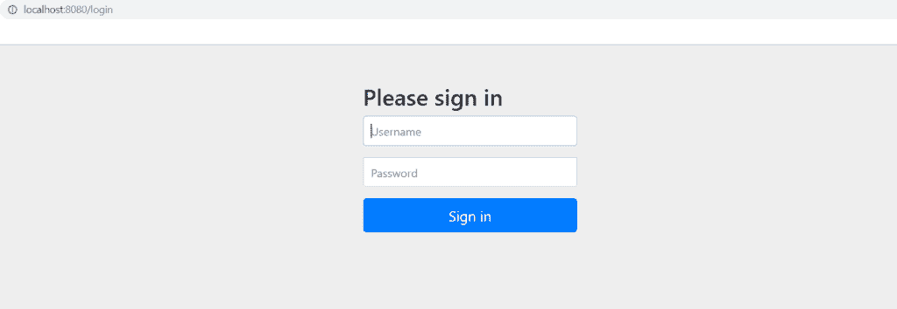

# Spring Session 响应式支持指南:WebSession

> 原文：<https://web.archive.org/web/20220930061024/https://www.baeldung.com/spring-session-reactive>

## 1。简介

在本文中，我们将学习如何将 Spring Session 与 Spring WebFlux 结合起来。具体来说，我们将学习如何使用 Spring WebSession，它将 Spring Session 与 Spring Boot 2 的 WebFlux 结合起来。

Spring `Session` 被定义为“名称-值对的简化`Map`”。`Sessions`跟踪对 HTTP 会话很重要的值，如`Users`和`Principals. `因此，我们可以使用`Session` 管理以及新的反应式 WebFlux `Mono `和`Flux` 对象`. ` Spring Session 还支持使用不同的应用程序容器(而不仅仅是 Tomcat)。

想了解更多关于春季课程的信息，请点击 [Baeldung](/web/20220926200400/https://www.baeldung.com/spring-session) 上的另一篇文章。

## 2。Maven 设置

现在，让我们来设置和配置我们的应用程序。谢天谢地，配置我们的 `pom.xml`非常容易。首先，我们需要使用 Spring Boot 2.x.x 以及相关的 Spring Session 依赖项。通过 Maven 资源库添加最新版本:

*   [Spring Boot 启动器 WebFlux](https://web.archive.org/web/20220926200400/https://mvnrepository.com/artifact/org.springframework.boot/spring-boot-starter-webflux)
*   [Spring Boot 安全](https://web.archive.org/web/20220926200400/https://mvnrepository.com/artifact/org.springframework.boot/spring-boot-starter-security)T2 首发
*   [春季会议核心](https://web.archive.org/web/20220926200400/https://mvnrepository.com/artifact/org.springframework.session/spring-session-core)

然后，我们将它们添加到`pom.xml`:

```
<dependency>
    <groupId>org.springframework.boot</groupId>
    <artifactId>spring-boot-starter-webflux</artifactId>
    <version>2.5.1</version>
</dependency>
<dependency>
    <groupId>org.springframework.boot</groupId>
    <artifactId>spring-boot-starter-security</artifactId>
    <version>2.5.1</version>
</dependency>
<dependency> 
    <groupId>org.springframework.session</groupId> 
    <artifactId>spring-session-core</artifactId> 
    <version>2.5.1</version> 
</dependency> 
```

这三个依赖项是内存会话管理的最低要求。对于 Redis，请使用:

*   [Spring Boot 首发数据 Redis](https://web.archive.org/web/20220926200400/https://mvnrepository.com/artifact/org.springframework.boot/spring-boot-starter-data-redis)
*   [春季会议数据 Redis](https://web.archive.org/web/20220926200400/https://mvnrepository.com/artifact/org.springframework.session/spring-session-data-redis)

然后，将以下内容添加到`pom.xml`:

```
<dependency>
    <groupId>org.springframework.boot</groupId>
    <artifactId>spring-boot-starter-data-redis</artifactId>
    <version>2.5.1</version>
</dependency>
<dependency>
    <groupId>org.springframework.session</groupId>
    <artifactId>spring-session-data-redis</artifactId>
    <version>2.5.1</version>
 </dependency>
```

现在，让我们配置我们的类。

## 3。内存配置

要使用内存配置，请添加 config 类:

```
@Configuration
@EnableSpringWebSession
public class SessionConfig {

    @Bean
    public ReactiveSessionRepository reactiveSessionRepository() {
        return new ReactiveMapSessionRepository(new ConcurrentHashMap<>());
    }
}
```

它将(反应式)存储库与您的会话管理器相关联。它会将这些值存储到一个`HashMap`中。

重要的是，配置类必须包括`@EnableSpringWebSession` 注释`.`

## 4 .Redis 配置

现在，让我们连接上 Redis。要使用 Redis 来管理`WebSessions, `添加配置类:

```
@Configuration
@EnableRedisWebSession
public class RedisConfig {

    @Bean
    public LettuceConnectionFactory redisConnectionFactory() {
        return new LettuceConnectionFactory();
    }
}
```

注意，配置类必须包括`@EnableRedisWebSession `注释`. `记住，我们不能同时使用`@EnableRedisWebSession` 和`EnableSpringWebSession` 注释而不引起异常。

[Docker](https://web.archive.org/web/20220926200400/https://www.docker.com/) 是与 Redis 交互的最简单方式之一。安装 Docker 后，我们只需输入三个命令即可。运行命令以启动 Redis 实例:

```
$ docker stop redis
$ docker rm redis
$ docker run -d --name redis -p 6379:6379 redis:4.0.5-alpine
```

接下来，让我们测试我们的应用程序。

## 5。在实践中

现在，让我们将反应式休息控制器添加到我们的应用程序中:

```
@GetMapping("/websession")
public Mono<String> getSession(WebSession session) {
    session.getAttributes().putIfAbsent("note", "Howdy Cosmic Spheroid!");
    return Mono.just((String) session.getAttributes().get("note"));
}
```

然后，我们可以通过向 REST 处理程序添加一个参数来使用`WebSession`。我们可以使用返回地图的 [`.getAttributes()`](https://web.archive.org/web/20220926200400/https://docs.spring.io/spring/docs/current/javadoc-api/org/springframework/web/server/WebSession.html#getAttributes--) 方法来获取或设置值。

让我们启动我们的 Spring 应用程序:

[](/web/20220926200400/https://www.baeldung.com/wp-content/uploads/2018/10/websession_one.png) 
现在，我们的 app 可以在`localhost:8080`查看，会呈现春季登录页面。尝试默认登录凭证(`-u admin -p password`):

[](/web/20220926200400/https://www.baeldung.com/wp-content/uploads/2018/10/websession_two.png)

认证之后，我们可以更改默认的`WebSession`值(`0`和`“Howdy Cosmic Spheroid!”`)。运行卷曲命令`:`

```
$ curl -i -H "Accept: application/json" -H "Content-Type:application/json" -X GET http://localhost:8080/websession/test?id=222&note;=helloworld
```

或者访问网址`http://localhost:8080/websession/test?id=222&note;=helloworld`。此后，从`localhost:8080/websession` 返回的 JSON 将显示更新后的`Session`值:

[](/web/20220926200400/https://www.baeldung.com/wp-content/uploads/2018/10/websession_three-1.png)

端点`localhost:8080/websession,`返回当前的`WebSession`属性`id`和`note.`

## 6。结论

我们已经学习了如何将 Spring WebSession 添加到我们的 WebFlux 应用程序中。要了解更多信息，请查阅重要的官方文档。

和往常一样，本文中使用的代码示例可以在 GitHub 上获得。