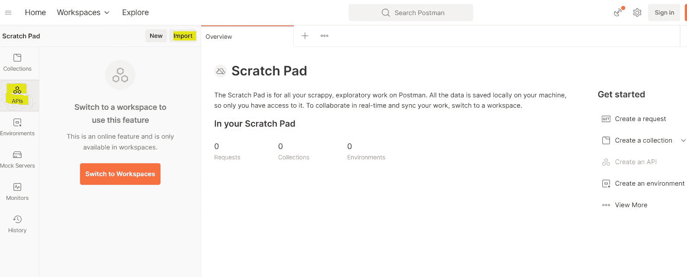
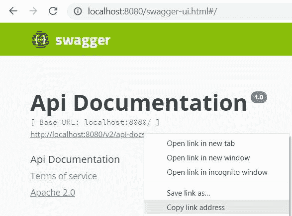
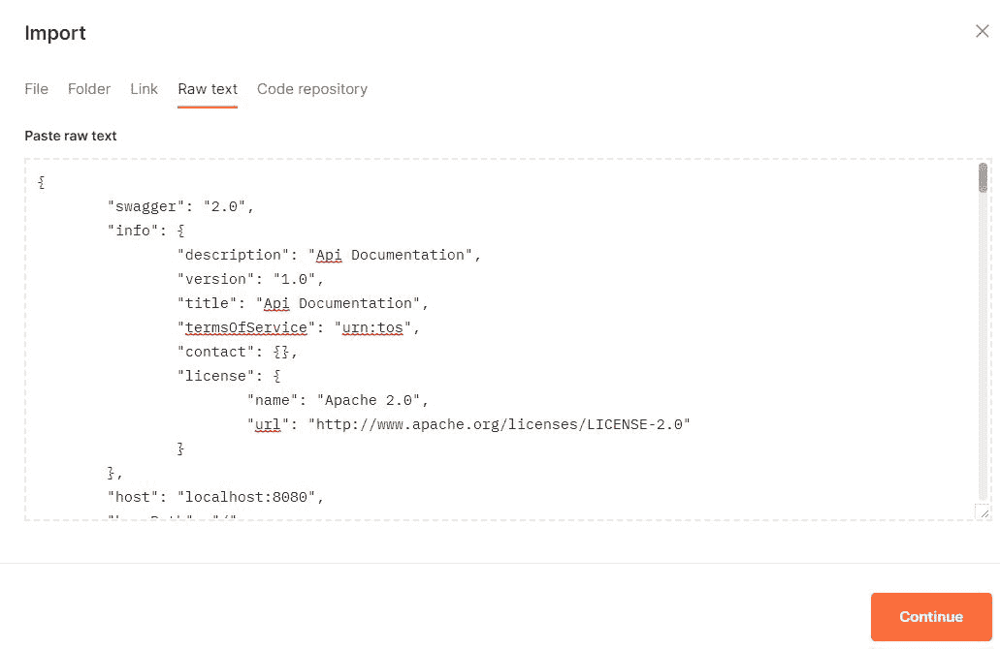

# 将 Swagger APIs 导入 Postman

> 原文：<https://web.archive.org/web/20220930061024/https://www.baeldung.com/swagger-apis-in-postman>

## 1.概观

在本文中，我们将看到如何将 Swagger APIs 导入 Postman。

## 2.Swagger 和 OpenAPI

Swagger 是一套用于开发和描述 REST APIs 的开源规则、规范和工具。然而，2021 年之后， **OpenAPI 指的是行业标准规范**，而 Swagger 指的是工具。

## 3.邮递员

Postman 是一个用于构建和使用 API 的 API 平台。Postman 简化了 API 生命周期的每个步骤，并简化了协作。我们可以使用 Postman 来测试我们的 API，而不需要编写任何代码。

我们可以使用独立的应用程序或浏览器扩展。

## 4.应用

我们可以使用任何现有的应用程序，或者我们可以[从头开始创建一个简单的应用程序，公开 REST API](/web/20220918150051/https://www.baeldung.com/swagger-2-documentation-for-spring-rest-api)。

### 4.1.Maven 依赖性

我们需要添加几个将 Swagger 用于 Swagger-UI 的依赖项:

```
<dependency>
    <groupId>io.springfox</groupId>
    <artifactId>springfox-swagger2</artifactId>
    <version>3.0.0</version>
</dependency>
<dependency>
    <groupId>io.springfox</groupId>
    <artifactId>springfox-swagger-ui</artifactId>
    <version>3.0.0</version>
</dependency>
```

### 4.2.Java 配置

Swagger 的配置非常简单:

```
@Configuration
public class SpringFoxConfig {
    @Bean
    public Docket api() {
        return new Docket(DocumentationType.SWAGGER_2)
          .select()
          .apis(RequestHandlerSelectors.any())
          .paths(PathSelectors.any())
          .build();
    }
}
```

当我们启动应用程序时，我们可以**检查 Swagger-UI 并找到每个控制器的 REST API 描述**:

[](/web/20220918150051/https://www.baeldung.com/wp-content/uploads/2022/08/1_Swagger-UI.jpg)

我们还可以检查为 REST API 生成的 **API 文档:**

[](/web/20220918150051/https://www.baeldung.com/wp-content/uploads/2022/08/Swagger-API_Docs.jpg)

## 5.导入到邮递员

有多种方法可以将 API 导入 Postman，但是在大多数情况下，它要求**Swagger 或 OpenAPI 定义在某种文本格式**(例如，JSON)中可用。

我们可以打开 Postman 并导航到左侧的`APIs`选项，然后点击`Import`查看不同的可用选项:

[](/web/20220918150051/https://www.baeldung.com/wp-content/uploads/2022/08/Postman_API_Import.jpg)

### 5.1.导入文件

**如果我们有一个可用的 Swagger JSON 文件**，我们可以通过 Postman:

[](/web/20220918150051/https://www.baeldung.com/wp-content/uploads/2022/08/Postman_API_Import_File.jpg)

### 5.2.导入链接

如果我们有 Swagger-UI 链接，我们可以**直接使用该链接将 API** 导入 Postman。

从 Swagger-UI 复制 API 链接，如下所示:

[](/web/20220918150051/https://www.baeldung.com/wp-content/uploads/2022/08/2_Swagger_Copy_Link.jpg)

并通过相同的链接从 Postman 导入它:

[](/web/20220918150051/https://www.baeldung.com/wp-content/uploads/2022/08/Postman_API_Import_Link.jpg)

### 5.3.通过原始文本导入

我们也可以**将 JSON 粘贴为原始文本**来导入 API:

[](/web/20220918150051/https://www.baeldung.com/wp-content/uploads/2022/08/Postman_API_Import_RawText.jpg)

### 5.4.通过代码库导入

为了从存储库中导入 API，我们需要登录 Postman 。以从 GitHub 导入为例，让我们遵循以下步骤:

1.  导航至`Code Repository`选项卡。
2.  点击`GitHub`。
3.  确认 GitHub 账户和**授权`postmanlabs`访问仓库**。完成后，返回到 Postman 应用程序进行进一步的操作。
4.  在邮递员上，选择`**organization**`、`**repository**`和`**branch**`，点击`Continue`。
5.  **确认我们需要导入的 API**，点击`Import`。

## 6.结论

在本文中，我们研究了将 REST APIs 导入 Postman 的不同方法。