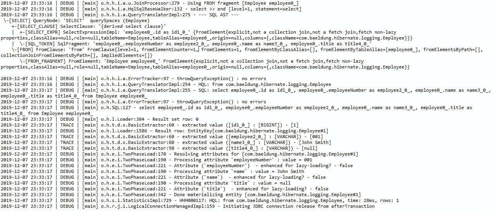

# Hibernate 中的各种日志级别

> 原文：<https://web.archive.org/web/20220930061024/https://www.baeldung.com/hibernate-logging-levels>

## **1。概述**

因为 Hibernate 为我们处理与数据库的交互，所以我们能够快速开发与数据库相关的代码。但是，这可能会使调试与数据库相关的故障变得困难。

因此，查看 Hibernate 与数据库的交互会很有用。例如，Hibernate 生成的从表中读取数据的 SQL。

在本教程中，我们将看到 Hibernate 中不同级别的日志记录可以用来实现这个。

## **2。日志 SQL**

在最基本的层面上，我们可以记录 Hibernate 生成的 SQL 语句，而不需要向它传递实际的参数值。

**Hibernate 使用类别`org.hibernate.SQL`来记录这些信息。**因此，我们要做的就是将该类别的日志记录级别设置为`DEBUG.`

在 Log4J 中，我们必须在配置 XML 中添加一个`logger`元素:

[PRE0]

类似地，在 Log4J2 中，我们将添加一个`Logger`元素:

[PRE1]

在 Logback 中，我们将添加一个`logger`元素:

[PRE2]

我们现在应该在日志中看到生成的 SQL:

[PRE3]

## **3。测井参数值**

虽然通常生成的 SQL 足以识别问题，但有时我们可能还想查看传递给 SQL 语句的参数。

**Hibernate 使用日志级别为`TRACE`** 的`org.hibernate.type.descriptor.sql`类别记录输入参数和检索结果。现在，让我们将这个类别添加到我们的配置文件中。

在 Log4J 中，我们做到了:

[PRE4]

在 Log4J2 中:

[PRE5]

最后，在 Logback 中:

[PRE6]

因此，我们应该看到传递给 SQL 语句的参数值以及执行结果:

[PRE7]

值得注意的是，我们不需要启用`org.hibernate.SQL`类别来查看以上信息。**我们可以独立启用和禁用这两个类别**。

但是，**启用`org.hibernate.SQL`是有意义的，这样我们就知道参数值与哪个 SQL 语句相关**。

## **4。激活休眠统计**

除了 SQL 和 JDBC 参数值，Hibernate 还可以记录每个 SQL 语句的统计数据。这有助于识别潜在的性能问题。

Hibernate 使用类别`*org.hibernate.stat*`来记录这些信息。但是，Hibernate 并不总是生成这些统计信息，因为这会对性能产生不良影响。

首先，**我们必须通过将配置属性`*hibernate.generate_statistics*`设置为`*true*`** 来告诉 Hibernate 生成这些统计数据。

例如，我们可以在我们的`hibernate.cfg.xml`文件中设置这个属性:

[PRE8]

除了这个属性，**将类别`*org.hibernate.stat*`设置为 DEBUG 将记录一个语句，其中包含执行的每个查询的统计信息**。它还会在会话结束时记录一个多行日志语句，其中包含汇总的统计信息:

[PRE9]

请注意日志中的第一行，它表示统计信息已启用。

## **5。记录所有活动**

**为了更深入地挖掘【Hibernate 与数据库的交互，**我们必须为类别`org.hibernate`** 启用日志记录。此类别包含 Hibernate 记录的所有消息。**

但是，我们必须小心使用这个类别，因为它可能会创建大量的日志输出:

## **6。结论**

在本教程中，我们看到了 Hibernate 中不同级别的日志记录。记录的信息在开发过程中非常有用。但是，在生产中实现这一点时，我们必须小心，因为它会对应用程序性能产生负面影响。

当然，伴随本教程的代码可以在 GitHub 上找到[。](https://web.archive.org/web/20221129004117/https://github.com/eugenp/tutorials/tree/master/persistence-modules/hibernate-enterprise)