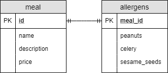

# 在 JPA 中将单个实体映射到多个表

> 原文：<https://web.archive.org/web/20220930061024/https://www.baeldung.com/jpa-mapping-single-entity-to-multiple-tables>

## 1.介绍

JPA 使我们在 Java 应用程序中处理关系数据库模型变得不那么痛苦。当我们将每个表映射到一个实体类时，事情就简单了。但是，有时我们有理由对我们的[实体](/web/20220625173829/https://www.baeldung.com/jpa-entities)和表格进行不同的建模:

*   当我们想要创建逻辑字段组时，我们可以将多个类映射到一个表中
*   如果涉及到继承，我们可以将[一个类层次映射到一个表结构](/web/20220625173829/https://www.baeldung.com/hibernate-inheritance)
*   如果相关字段分散在多个表中，并且我们希望用单个类对这些表进行建模

在这个简短的教程中，我们将看到如何处理最后一种情况。

## 2.数据模型

假设我们经营一家餐馆，我们希望存储我们提供的每一餐的数据:

*   名字
*   描述
*   价格
*   它含有哪种过敏原

由于有许多可能的过敏原，我们将把这个数据集归类在一起。此外，我们还将使用以下表定义对此进行建模:

现在让我们看看如何使用标准 JPA 注释将这些表映射到实体。

## 3.创建多个实体

最明显的解决方案是为这两个类创建一个实体。

让我们从定义`Meal` 实体开始:

[PRE0]

接下来，我们将添加`Allergens`实体:

[PRE1]

在上面的例子中，我们可以看到 `meal_id`既是主键，也是外键。这意味着我们需要使用`@PrimaryKeyJoinColumn`定义一对一的关系列。

然而，这种解决方案有两个问题:

*   我们总是想存储一顿饭的过敏原，而这个解决方案并没有执行这个规则
*   膳食和过敏原数据在逻辑上属于一起—**因此我们可能希望将这些信息存储在同一个 Java 类中，即使我们为它们创建了多个表**

第一个问题的一个可能的解决方案是在我们的`Meal`实体的`allergens`字段中添加`@NotNull`注释。如果我们有一个`null` `Allergens`，JPA 不会让我们坚持`Meal`。

然而，这不是理想的解决方案；我们想要一个更具限制性的，我们甚至没有机会在没有`Allergens.`的情况下尝试持久化一个`Meal`

## 4.用`@SecondaryTable`创建单个实体

**我们可以使用`@SecondaryTable` 注释:**创建一个实体，指定我们在不同的表中有列

[PRE2]

在后台，JPA 将主表和次表连接起来，并填充字段。**这个解决方案类似于`@OneToOne`关系，但是这样，我们可以在同一个类中拥有所有的属性。**

**需要注意的是** **如果我们有一个列在二级表中，我们必须用`@Column`注释的`table`参数指定它。**如果一个列在主表中，我们可以省略`table`参数，因为 JPA 默认在主表中查找列。

另外，请注意，如果我们将它们嵌入到`@SecondaryTables`中，我们可以有多个次级表。或者，在 Java 8 中，我们可以用多个`@SecondaryTable`注释来标记实体，因为它是一个[可重复注释](/web/20220625173829/https://www.baeldung.com/java-default-annotations)。

## 5.组合`@SecondaryTable`和`@Embedded`

正如我们所见，`@SecondaryTable`将多个表映射到同一个实体。我们还知道，`@Embedded`和@ `Embeddable`做相反的事情，而[将单个表映射到多个类](/web/20220625173829/https://www.baeldung.com/jpa-embedded-embeddable)。

让我们看看当我们将`@SecondaryTable`与`@Embedded`和`@Embeddable`组合在一起时会得到什么:

[PRE3]

这与我们使用`@OneToOne`看到的方法类似。但是，它有几个优点:

*   **JPA 为我们一起管理这两个表，所以我们可以确定在这两个表中每顿饭都有一行**
*   此外，代码更简单，因为我们需要更少的配置

尽管如此，这种一对一的解决方案只有在两个表具有匹配的 id 时才有效。

值得一提的是，如果我们想重用`Allergens`类，如果我们用`@AttributeOverride`定义`Meal`类中二级表的列会更好。

## 6.结论

在这个简短的教程中，我们看到了如何使用`@SecondaryTable` JPA 注释将多个表映射到同一个实体。

我们也看到了将`@SecondaryTable` 与`@Embedded`和`@Embeddable`结合起来获得类似一对一关系的优势。

像往常一样，这些例子可以在 GitHub 的[上找到。](https://web.archive.org/web/20220625173829/https://github.com/eugenp/tutorials/tree/master/persistence-modules/java-jpa-2)