# 理解 Java 中的内存泄漏

> 原文：<https://web.archive.org/web/20220930061024/https://www.baeldung.com/java-memory-leaks>

## **1。简介**

Java 的核心优势之一是借助内置的垃圾收集器(或简称为 **GC** )实现自动化内存管理。GC 隐式地负责分配和释放内存，因此能够处理大多数内存泄漏问题。

虽然 GC 有效地处理了很大一部分内存，但它不能保证内存泄漏的解决方案万无一失。GC 相当智能，但并非完美无缺。内存泄漏仍然可能悄悄发生，即使是在有责任心的开发人员的应用程序中。

仍然可能存在这样的情况，应用程序生成大量多余的对象，从而耗尽重要的内存资源，有时会导致整个应用程序失败。

内存泄漏是 Java 中真正的问题。在本教程中，我们将学习**内存泄漏的潜在原因是什么，如何在运行时识别它们，以及如何在我们的应用程序中处理它们**。

## **2。什么是内存泄漏**

内存泄漏是一种情况，**堆中存在不再使用的对象，但垃圾收集器无法将它们从内存中移除，**因此，不必要地维护它们。

内存泄漏是糟糕的，因为它**阻塞内存资源，并随着时间的推移降低系统性能**。如果不处理，应用程序将最终耗尽其资源，最终以致命的`java.lang.OutOfMemoryError`终止。

有两种不同类型的对象驻留在堆内存中，被引用的和未被引用的。被引用的对象是那些在应用程序中仍然有活动引用的对象，而未被引用的对象没有任何活动引用。

垃圾收集器定期移除未被引用的对象，但它从不收集仍被引用的对象。这是可能发生内存泄漏的地方:

[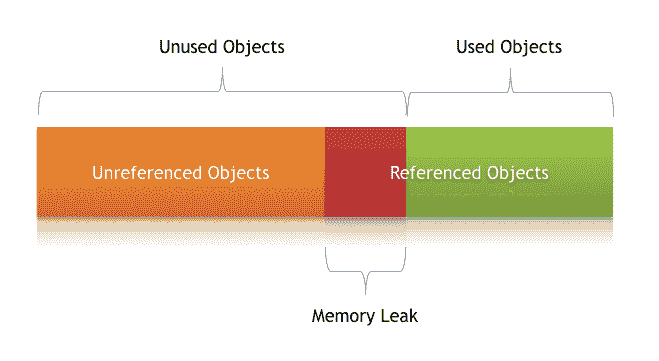](/web/20221017082550/https://www.baeldung.com/wp-content/uploads/2018/11/Memory-_Leak-_In-_Java.png)

**内存泄漏的症状**

*   当应用程序长时间连续运行时，性能会严重下降
*   `OutOfMemoryError`应用程序中的堆错误
*   自发和奇怪的应用程序崩溃
*   应用程序偶尔会耗尽连接对象。

让我们仔细看看其中的一些场景，以及如何处理它们。

## **3。Java 中的内存泄漏类型**

在任何应用程序中，内存泄漏都可能由于多种原因而发生。在这一部分，我们将讨论最常见的问题。

### **3.1。通过`static`字段**的内存泄漏

第一个可能导致潜在内存泄漏的场景是大量使用`static`变量。

在 Java 中， **`static`字段的生命周期通常与正在运行的应用程序**的整个生命周期相匹配(除非`ClassLoader`符合垃圾收集的条件)。

让我们创建一个简单的 Java 程序来填充一个`static` `List:`

[PRE0]

如果我们在这个程序执行期间分析堆内存，那么我们将看到在调试点 1 和 2 之间，堆内存如预期的那样增加了。

但是当我们将`populateList()`方法留在调试点 3 时，**堆内存还没有被垃圾收集，**正如我们在这个 VisualVM 响应中看到的:

[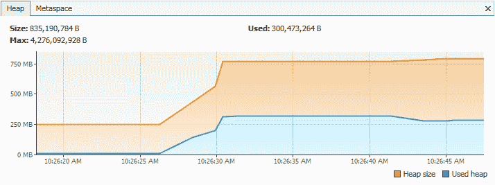](/web/20221017082550/https://www.baeldung.com/wp-content/uploads/2018/11/memory-with-static.png)

然而，如果我们只是在上面程序的第 2 行中删除关键字`static`，那么它将会给内存使用带来巨大的变化，如这个可视化 VM 响应所示:

[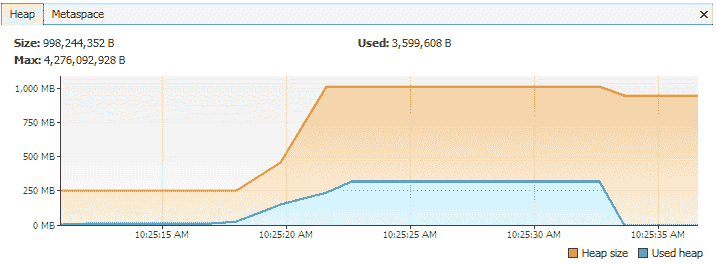](/web/20221017082550/https://www.baeldung.com/wp-content/uploads/2018/11/memory-without-static.png)

第一部分直到调试点几乎和我们在`static.` 的情况下得到的一样，但是这一次，在我们离开`populateList()`方法之后，**所有的链表内存都被垃圾收集了，因为我们没有对它的任何引用**。

所以我们需要非常注意我们对`static`变量的使用。如果集合或大型对象被声明为`static`，那么它们将在应用程序的整个生命周期中保留在内存中，从而阻塞了原本可以在其他地方使用的重要内存。

**如何预防？**

*   尽量减少使用`static`变量。
*   当使用单例时，依赖于延迟加载对象的实现，而不是急切地加载。

### **3.2。通过未关闭的资源**

每当我们建立一个新的连接或打开一个流时，JVM 都会为这些资源分配内存。这方面的一些例子包括数据库连接、输入流和会话对象。

忘记关闭这些资源会阻塞内存，从而使它们无法被 GC 访问。这甚至可能发生在异常阻止程序执行到达处理代码以关闭这些资源的语句的情况下。

在这两种情况下，**资源留下的开放连接消耗内存**，如果我们不处理它们，它们会降低性能，甚至导致`OutOfMemoryError`。

**如何预防？**

*   总是使用`finally`块来关闭资源。
*   关闭资源的代码(甚至在`finally`块中)本身不应该有任何异常。
*   在使用 Java 7+时，我们可以利用`try` -with-resources 块。

### **3.3。`equals()`和 `hashCode()`实施不当**

在定义新类时，一个非常常见的疏忽是没有为`equals()`和`hashCode()`方法编写适当的重写方法。

`HashSet`和`HashMap`在许多操作中使用这些方法，如果它们没有被正确地覆盖，它们可能成为潜在的内存泄漏问题的来源。

让我们以一个普通的`Person`类为例，将它用作`HashMap`中的一个键:

[PRE1]

现在我们将把重复的`Person`对象插入到使用这个键的`Map`中。

记住一个`Map`不能包含重复的键:

[PRE2]

这里我们使用`Person`作为一个键。由于`Map`不允许重复键，我们作为键插入的大量重复的`Person`对象不会增加内存。

但是**由于我们还没有定义合适的`equals()`方法，重复的对象堆积起来，增加了内存**，这就是为什么我们在内存中看到不止一个对象。VisualVM 中的堆内存如下所示:

[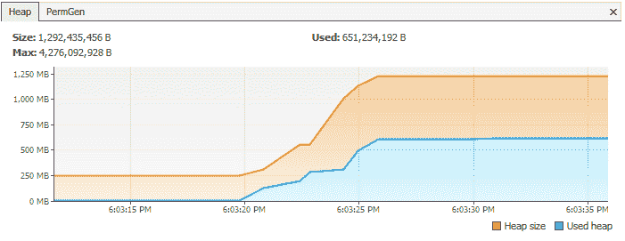](/web/20221017082550/https://www.baeldung.com/wp-content/uploads/2018/11/Before_implementing_equals_and_hashcode.png)

然而，**如果我们正确地覆盖了`equals()`和`hashCode()`方法，那么在这个`Map.`** 中将只存在一个`Person` 对象

让我们看看`Person`类的`equals()`和`hashCode()`的正确实现:

[PRE3]

在这种情况下，下列断言将是正确的:

[PRE4]

在正确覆盖了`equals()`和`hashCode()`之后，同一个程序的堆内存看起来像:

另一种选择是使用像 Hibernate 这样的 ORM 工具，它使用`equals()`和`hashCode()`方法来分析对象并将它们保存在缓存中。

如果这些方法没有被覆盖，内存泄漏的可能性很高,因为 Hibernate 不能比较对象，会用重复的对象填充缓存。

**如何预防？**

*   根据经验，当定义新实体时，总是覆盖`equals()`和`hashCode()`方法。
*   仅仅重写是不够的，还必须以最佳方式重写这些方法。

更多信息，请访问我们的教程[用 Eclipse](/web/20221017082550/https://www.baeldung.com/java-eclipse-equals-and-hashcode) 生成`equals()`和`hashCode()`以及用 Java 编写`hashCode()`的[指南。](/web/20221017082550/https://www.baeldung.com/java-hashcode)

### **3.4。引用外部类的内部类**

这发生在非静态内部类(匿名类)的情况下。对于初始化，这些内部类总是需要封闭类的一个实例。

默认情况下，每个非静态内部类都有一个对其包含类的隐式引用。如果我们在应用程序中使用这个内部 class' object，那么**即使在我们包含的 class' object 超出范围之后，它也不会被垃圾收集**。

考虑这样一个类，它保存了对大量大对象的引用，并且有一个非静态的内部类。当我们只创建内部类的对象时，内存模型看起来像这样:

[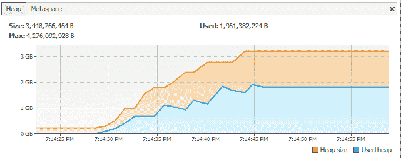](/web/20221017082550/https://www.baeldung.com/wp-content/uploads/2018/11/Inner_Classes_That_Reference_Outer_Classes.png)

然而，如果我们只是将内部类声明为静态的，那么同样的内存模型看起来是这样的:

[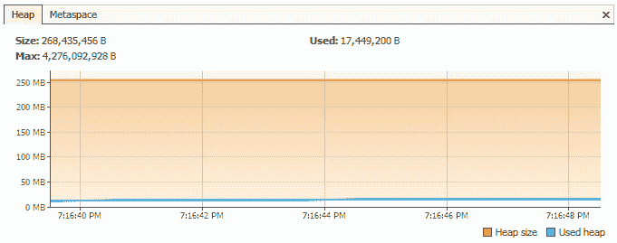](/web/20221017082550/https://www.baeldung.com/wp-content/uploads/2018/11/Static_Classes_That_Reference_Outer_Classes.png)

发生这种情况是因为内部类对象隐式地持有对外部类对象的引用，从而使它成为垃圾收集的无效候选对象。匿名类的情况也是如此。

**如何预防？**

*   如果内部类不需要访问包含它的类成员，考虑把它变成一个`static`类。

### **3.5。通过`finalize()`方法**

终结器的使用是潜在内存泄漏问题的另一个来源。每当一个类的`finalize()`方法被覆盖时，该类的**对象不会立即被垃圾收集。**取而代之的是，GC 将它们排队等待完成，这发生在稍后的时间点。

此外，如果在`finalize()`方法中编写的代码不是最佳的，并且如果终结器队列跟不上 Java 垃圾收集器，那么我们的应用程序迟早会遇到`OutOfMemoryError`。

为了演示这一点，让我们假设我们有一个类，我们已经覆盖了这个类的`finalize()`方法，并且这个方法需要一点时间来执行。当该类的大量对象被垃圾收集时，在 VisualVM 中看起来是这样的:

[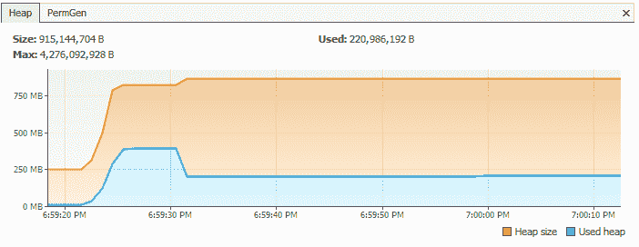](/web/20221017082550/https://www.baeldung.com/wp-content/uploads/2018/11/Finalize_method_overridden.png)

然而，如果我们只是移除被覆盖的`finalize()`方法，那么同一个程序会给出如下响应:

[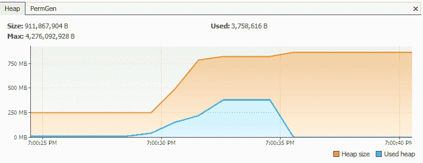](/web/20221017082550/https://www.baeldung.com/wp-content/uploads/2018/11/Finalize_method_not_overridden.png)

**如何预防？**

*   我们应该总是避免终结器。

关于`finalize()`的更多细节，我们可以参考 Java 中 finalize 方法的[指南的第 3 节`Avoiding Finalizers) `。](/web/20221017082550/https://www.baeldung.com/java-finalize)

### **3.6。被拘留`Strings`**

当 Java 7 从 PermGen 转移到 HeapSpace 时，Java `String`池经历了一个重大变化。然而，对于在版本 6 和更低版本上运行的应用程序，我们在使用大的`Strings. `时需要更加小心

**如果我们读取一个巨大的`String`对象，并在该对象上调用`intern()`，它将进入字符串池，该池位于 PermGen(永久内存)中，并且只要我们的应用程序运行，它就会一直在那里。**这会阻塞内存，并在我们的应用程序中造成严重的内存泄漏。

在 JVM 1.6 中，这种情况下的 PermGen 在 VisualVM 中是这样的:

[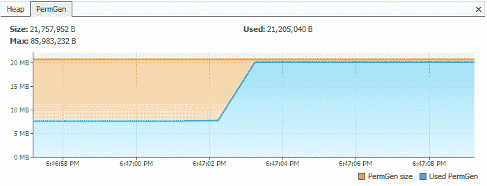](/web/20221017082550/https://www.baeldung.com/wp-content/uploads/2018/11/Interned_Strings.png)

相比之下，如果我们只是在方法中从文件中读取一个字符串，而不是对它进行整型，那么 PermGen 看起来就像:

[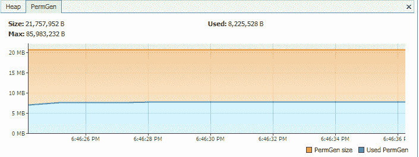](/web/20221017082550/https://www.baeldung.com/wp-content/uploads/2018/11/Normal_Strings.png)

**如何预防？**

*   解决这个问题的最简单的方法是升级到最新的 Java 版本，因为从 Java 版本 7 开始，String pool 就转移到了 HeapSpace。
*   如果我们正在处理大的`Strings`，我们可以增加永久空间的大小来避免任何潜在的`OutOfMemoryErrors` :

    [PRE5]

### **3.7。使用`ThreadLocal` s**

[`ThreadLocal`](https://web.archive.org/web/20221017082550/https://docs.oracle.com/en/java/javase/11/docs/api/java.base/java/lang/ThreadLocal.html) (在 Java 教程中的`ThreadLocal`的[介绍中详细讨论)是一个构造，它使我们能够将状态隔离到特定的线程，从而允许我们实现线程安全。](/web/20221017082550/https://www.baeldung.com/java-threadlocal)

当使用这个构造时，**每个线程将持有对其`ThreadLocal`变量副本的隐式引用，并将维护其自己的副本，而不是在多个线程之间共享资源，只要该线程是活动的。**

尽管有其优势，使用`ThreadLocal`变量是有争议的，因为如果使用不当，它们会导致内存泄漏。Joshua Bloch 曾经评论过线程本地使用:

> “草率地使用线程池和草率地使用线程局部变量会导致意外的对象保留，这一点在很多地方已经提到过。但是将责任归咎于线程局部变量是没有根据的。”

**内存泄露与`ThreadLocals`**

一旦持有线程不再存在，就应该进行垃圾收集。但是当我们将`ThreadLocals`与现代应用服务器一起使用时，问题就出现了。

现代应用服务器使用线程池来处理请求，而不是创建新的线程(例如，Apache Tomcat 中的[`Executor`](https://web.archive.org/web/20221017082550/https://tomcat.apache.org/tomcat-7.0-doc/config/executor.html))。此外，它们还使用单独的类加载器。

由于应用服务器中的[线程池](/web/20221017082550/https://www.baeldung.com/thread-pool-java-and-guava)基于线程重用的概念工作，它们永远不会被垃圾收集；相反，它们被重用来服务另一个请求。

如果任何类创建了一个`ThreadLocal `变量，但是没有显式地移除它，那么即使在 web 应用程序停止之后，该对象的一个副本也将保留在 worker `Thread`中，从而防止该对象被垃圾收集。

**如何预防？**

*   当我们不再使用它们时，把它们清理干净是个好习惯。`ThreadLocals`提供 [`remove()`](https://web.archive.org/web/20221017082550/https://docs.oracle.com/en/java/javase/11/docs/api/java.base/java/lang/ThreadLocal.html#remove()) 方法，该方法删除当前线程对于该变量的值。
*   **不要用`ThreadLocal.set(null) `清除数值。**它实际上并不清除值，而是会查找与当前线程关联的`Map`，并将键值对分别设置为当前线程和`null,`。
*   最好将`ThreadLocal `视为我们需要在`finally` 块中关闭的资源，即使是在异常情况下:

[PRE6]

## **4。处理内存泄漏的其他策略**

虽然在处理内存泄漏时没有一个通用的解决方案，但是有一些方法可以最小化这些泄漏。

### **4.1。启用分析**

Java profilers 是监视和诊断应用程序内存泄漏的工具。它们分析我们的应用程序内部发生了什么，比如我们如何分配内存。

使用评测器，我们可以比较不同的方法，并找到可以最佳利用资源的地方。

在本教程的第 3 节中，我们使用了 [Java VisualVM](https://web.archive.org/web/20221017082550/https://visualvm.github.io/) 。请查看我们的[Java Profiler 指南](/web/20221017082550/https://www.baeldung.com/java-profilers)以了解不同类型的 Profiler，如 Mission Control、JProfiler、YourKit、Java VisualVM 和 Netbeans Profiler。

### **4.2。详细垃圾收集**

通过启用详细的垃圾收集，我们可以跟踪垃圾收集的详细信息。为此，我们需要将以下内容添加到我们的 JVM 配置中:

[PRE7]

通过添加这个参数，我们可以看到 GC 内部发生的详细情况:

[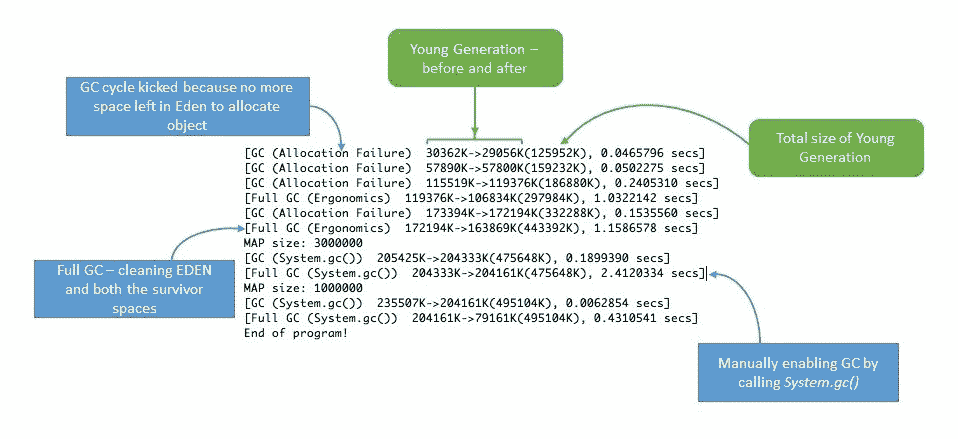](/web/20221017082550/https://www.baeldung.com/wp-content/uploads/2018/11/verbose-garbage-collection.jpg)

### **4.3。使用引用对象避免内存泄漏**

我们还可以求助于 Java 中内置于`java.lang.ref`包中的引用对象来处理内存泄漏。使用`java.lang.ref`包，而不是直接引用对象，我们使用对对象的特殊引用，这使得它们很容易被垃圾收集。

引用队列让我们知道垃圾收集器执行的操作。要了解更多信息，我们可以阅读 Java 教程中的[软引用，特别是第 4 节。](/web/20221017082550/https://www.baeldung.com/java-soft-references)

### 4.4。Eclipse 内存泄漏警告

对于 JDK 1.5 及以上版本的项目，每当遇到明显的内存泄漏时，Eclipse 都会显示警告和错误。所以在 Eclipse 中开发时，我们可以定期访问“问题”选项卡，并对内存泄漏警告(如果有的话)更加警惕:

[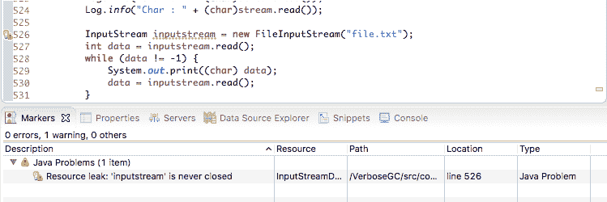](/web/20221017082550/https://www.baeldung.com/wp-content/uploads/2018/11/Eclipse-_Memor-_Leak-_Warnings.png)

### **4.5。基准测试**

我们可以通过执行基准测试来测量和分析 Java 代码的性能。这样，我们可以比较完成相同任务的不同方法的性能。这可以帮助我们选择最佳的方法，并且可以帮助我们保存记忆。

有关基准测试的更多信息，请访问我们的【Java 微基准测试教程。

### 4.6。代码审查

最后，我们总是用经典的、老派的方式进行简单的代码走查。

在某些情况下，即使这个看起来不起眼的方法也可以帮助消除一些常见的内存泄漏问题。

## **5。结论**

通俗地说，我们可以认为内存泄漏是一种疾病，它通过阻塞重要的内存资源来降低应用程序的性能。像所有其他疾病一样，如果不治愈，随着时间的推移，它会导致致命的应用程序崩溃。

内存泄漏很难解决，找到它们需要对 Java 语言有复杂的掌握和掌握。在处理内存泄漏时，没有通用的解决方案，因为泄漏可能通过各种不同的事件发生。

然而，如果我们求助于最佳实践，并定期执行严格的代码遍历和分析，我们可以将应用程序中内存泄漏的风险降至最低。

和往常一样，用于生成本文中描述的 VisualVM 响应的代码片段可以从 GitHub 上的[处获得。](https://web.archive.org/web/20221017082550/https://github.com/eugenp/tutorials/tree/master/core-java-modules/core-java-perf)