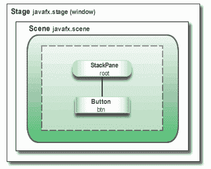
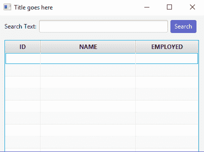

# JavaFx 简介

> 原文：<https://web.archive.org/web/20220930061024/https://www.baeldung.com/javafx>

## **1。简介**

JavaFX 是一个用 Java 构建富客户端应用程序的库。它提供了一个用于设计 GUI 应用程序的 API，这些 GUI 应用程序可以在几乎所有支持 Java 的设备上运行。

在本教程中，我们将重点介绍它的一些关键功能。

## **2。JavaFX API**

在 Java 8、9 和 10 中，开始使用 JavaFX 库不需要额外的设置。从 JDK 11 号开始，该项目将从 JDK 移除。

### **2.1。架构**

**JavaFX 使用硬件加速图形管道进行渲染，称为`Prism`** 。此外，为了充分加速图形的使用，它利用软件或硬件渲染机制，在内部使用`DirectX`和`OpenGL`。

**JavaFX 有一个平台相关的`Glass`窗口工具包层，用于连接本机操作系统**。它使用操作系统的事件队列来调度线程的使用。此外，它异步处理窗口，事件，计时器。

`Media`和`Web`引擎支持媒体播放和 HTML/CSS 支持。

让我们看看 JavaFX 应用程序的[主结构](https://web.archive.org/web/20220626211649/https://docs.oracle.com/javafx/2/get_started/img/helloworld_scenegraph.png)是什么样子的:

这里，我们注意到两个主要容器:

*   **`Stage`是主容器，也是应用**的入口点。它代表主窗口，并作为`start()`方法的参数传递。
*   是一个保存 UI 元素的容器，比如图像视图、按钮、网格、文本框。

`Scene`可以更换或切换到另一个`Scene`。这代表了一个分层对象的图，被称为`Scene`图。层次结构中的每个元素称为一个节点。单个节点有其 ID、样式、效果、事件处理程序和状态。

此外，`Scene`还包含布局容器、图像、媒体。

### **2.2。线程**

在系统级，**JVM 创建单独的线程来运行和呈现应用程序**:

*   `Prism` 渲染线程——负责单独渲染`Scene Graph`。
*   应用程序线程——是任何 JavaFX 应用程序的主线程。所有活动节点和组件都连接到该线程。

### **2.3。生命周期**

`javafx.application.Application` 类有以下生命周期方法:

*   **`init()`——在应用实例**创建后调用。此时，JavaFX API 还没有准备好，所以我们不能在这里创建图形组件。
*   `start(Stage stage)`–所有的图形组件都在这里创建。另外，**图形活动的主线程从这里开始。**
*   `stop()`–在应用程序关闭前调用；例如，当用户关闭主窗口时。在应用程序终止之前，覆盖这个方法对于一些清理工作是很有用的。

静态的`launch()`方法启动 JavaFX 应用程序。

### **2.4。FXML**

JavaFX 使用一种特殊的 FXML 标记语言来创建视图界面。

这为分离视图和业务逻辑提供了一个基于 XML 的结构。XML 在这里更合适，因为它能够非常自然地表示一个`Scene Graph`层次结构。

最后，为了加载`.fxml`文件，我们使用了`FXMLLoader`类，这产生了场景层次的对象图。

## **3。入门**

为了实用起见，让我们构建一个允许搜索人员列表的小应用程序。

首先，让我们添加一个`Person`模型类——来表示我们的领域:

[PRE0]

注意，为了包装`int, String` 和`boolean`值，我们在`javafx.beans.property`包中使用了`SimpleIntegerProperty, SimpleStringProperty, SimpleBooleanProperty`类。

**接下来，让我们创建扩展了`Application`抽象类的`Main`类:**

[PRE1]

我们的主类覆盖了`start()`方法，这是程序的入口点。

然后，`FXMLLoader`将对象图层次从`SearchController.fxml`加载到`AnchorPane`。

启动一个新的`Scene`后，我们将其设置为主`Stage`。我们还为我们的窗口设置了标题并`show()`它。

**注意，包含`main()`方法可以在没有`JavaFX Launcher`的情况下运行 JAR 文件。**

### **3.1。FXML 视图**

现在让我们更深入地研究一下`SearchController` XML 文件。

对于我们的搜索应用程序，我们将添加一个文本字段来输入关键字和搜索按钮:

[PRE2]

`AnchorPane`是这里的根容器，也是图层次的第一个节点。在调整窗口大小时，它会将子窗口重新定位到它的锚点。**`fx: controller`属性将 Java 类与标记连接起来。**

还有一些其他可用的内置布局:

*   `BorderPane`–将布局分为五个部分:顶部、右侧、底部、左侧、中间
*   `HBox –`在水平面板中排列子组件
*   `VBox –`子节点排列在垂直列中
*   grid panel——用于创建包含行和列的网格

在我们的例子中，在水平的`HBox`面板内部，我们使用了一个`Label`来放置文本，`TextField`用于输入，还有一个`Button`。使用`fx: id`,我们标记元素，这样我们可以在 Java 代码中使用它们。

`VBox`面板是我们显示搜索结果的地方。

**然后，为了将它们映射到 Java 字段，我们使用了`@FXML`注释:**

[PRE3]

**填充`@FXML`注释字段后，`initialize()`将被自动调用。**在这里，我们能够对 UI 组件执行进一步的操作，如注册事件监听器、添加样式或更改文本属性。

在`initTable()`方法中，我们将创建包含 3 列结果的表格，并将其添加到`dataContainer` VBox:

[PRE4]

最后，这里描述的所有逻辑将产生以下窗口:

## 4.`Binding API`

既然已经处理了视觉方面，让我们开始看看绑定数据。

绑定 API 提供了一些接口，当另一个对象的值发生变化时，这些接口会通知对象。

我们可以使用`bind()`方法或者通过添加监听器来绑定一个值。

单向绑定仅提供一个方向的绑定:

[PRE5]

在这里，搜索字段中的任何更改都会更新标签的文本值。

相比之下，双向绑定在两个方向上同步两个属性的值。

**可选的字段绑定方式有`ChangeListeners:`**

[PRE6]

`Observable`接口允许观察对象值的变化。

举例来说，最常用的实现是 `javafx.collections.ObservableList<T>`接口:

[PRE7]

这里，任何模型变化，比如元素的插入、更新或删除，都会立即通知 UI 控件。

`masterData`列表将包含`Person`对象的初始列表，结果列表将是我们搜索时显示的列表。

我们还必须更新`initTable()`方法，将表中的数据绑定到初始列表，并将每一列连接到`Person`类字段:

[PRE8]

## **5。并发性**

**在场景图中使用 UI 组件不是线程安全的，因为它只能从应用程序线程中访问。**`javafx.concurrent`包是用来帮助多线程的。

让我们看看如何在后台线程中执行数据搜索:

[PRE9]

在这里，我们创建一个一次性任务`javafx.concurrent.Task`对象并覆盖`call()`方法。

**`call()`方法完全在后台线程上运行，并将结果返回给应用程序线程。**这意味着在这个方法中对 UI 组件的任何操作，都会抛出一个运行时异常。

但是，可以调用`updateProgress(), updateMessage()`来更新应用程序线程项。当任务状态转换到成功状态时，从应用程序线程调用`onSucceeded()`事件处理程序:

[PRE10]

**在同一个回调中，我们已经将`tableView`数据更新到新的结果列表中。**

`Task`是`Runnable`，所以要启动它，我们只需要用`task`参数启动一个新的`Thread`:

[PRE11]

`setDaemon(true)`标志表示线程将在完成工作后终止。

## **6。事件处理**

我们可以将事件描述为应用程序可能感兴趣的动作。

例如，像鼠标点击、按键、调整窗口大小这样的用户动作由`javafx.event.Event`类或它的任何子类来处理或通知。

此外，我们区分三种类型的事件:

*   `InputEvent`–所有类型的按键和鼠标动作，如`KEY_PRESSED, KEY_TYPED, KEY_RELEASED`或`MOUSE_PRESSES, MOUSE_RELEASED`
*   `ActionEvent`–代表各种动作，如发射一枚`Button`或完成一枚`KeyFrame`
*   `WindowEvent`–`WINDOW_SHOWING, WINDOW_SHOWN`

为了进行演示，**下面的代码片段捕捉了在`searchField`** 上按下`Enter`键的事件:

[PRE12]

## 7.风格

我们可以通过应用自定义设计来改变 JavaFX 应用程序的用户界面。

默认情况下，JavaFX 使用`modena.css`作为整个应用程序的 CSS 资源。这是`jfxrt.jar`的一部分。

要覆盖默认样式，我们可以向场景添加一个样式表:

[PRE13]

我们也可以使用内嵌样式；例如，要设置特定节点的样式属性:

[PRE14]

## **8。结论**

这篇简短的文章涵盖了 JavaFX API 的基础知识。我们浏览了内部结构，并介绍了其架构、生命周期和组件的关键功能。

结果，我们学会了并且现在能够创建一个简单的 GUI 应用程序。

和往常一样，该教程的完整源代码可以在 GitHub 上的[处获得。](https://web.archive.org/web/20220626211649/https://github.com/eugenp/tutorials/tree/master/javafx)