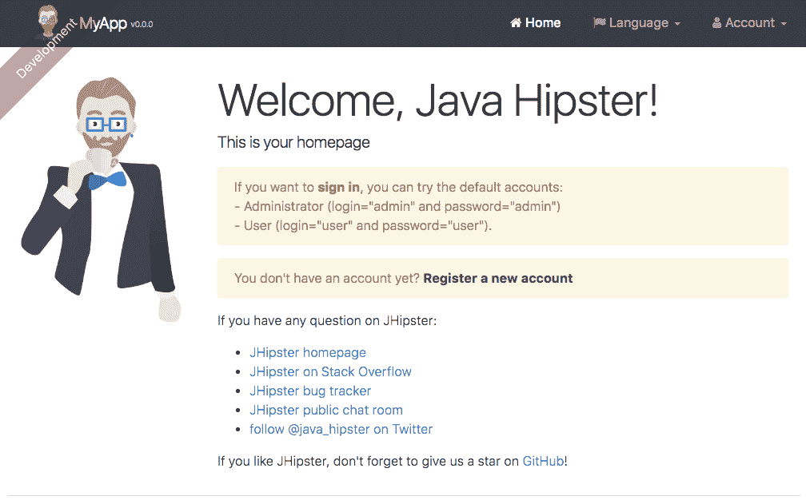
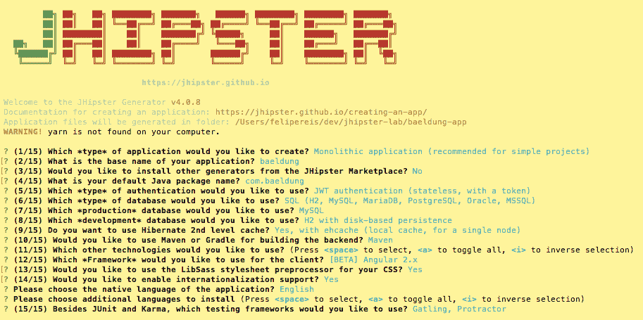
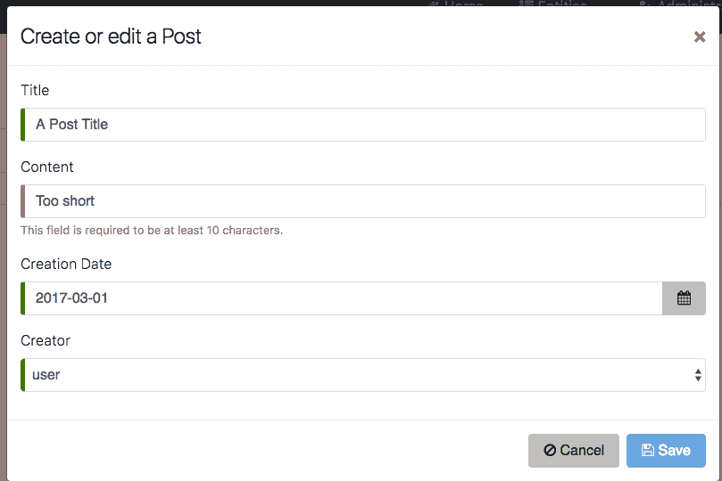

# JHipster 简介

> 原文:[https://web . archive . org/web/20220930061024/https://www . bael dung . com/jhipster](https://web.archive.org/web/20220930061024/https://www.baeldung.com/jhipster)

## **1。简介**

本文将简要介绍 JHipster，向您展示如何使用命令行工具创建一个简单的整体应用程序和定制实体。

我们还将在每个步骤中检查生成的代码，并且还将涵盖构建命令和自动化测试。

## **2。Jhipster** 是什么

[简而言之，JHipster](https://web.archive.org/web/20221129020633/https://jhipster.github.io/) 是一个基于大量尖端开发工具和平台的高级代码生成器**。**

该工具的主要组件包括:

*   [约曼](https://web.archive.org/web/20221129020633/http://yeoman.io/)，前端脚手架工具
*   好老 [Spring Boot](https://web.archive.org/web/20221129020633/https://spring.io/projects/spring-boot)
*   [AngularJS](https://web.archive.org/web/20221129020633/https://angularjs.org/) ，杰出的 Javascript 框架。杰普斯特还与[安古拉杰 2](https://web.archive.org/web/20221129020633/https://angular.io/) 合作

JHipster 只需几个 shell 命令，就能创建一个成熟的 Java web 项目，它具有友好的、响应迅速的前端、文档化的 REST API、全面的测试覆盖、基本的安全性和数据库集成！生成的代码经过了很好的注释，并且遵循了行业最佳实践。

它利用的其他关键技术有:

*   [Swagger](https://web.archive.org/web/20221129020633/http://swagger.io/) ，用于 API 文档
*   [Maven](https://web.archive.org/web/20221129020633/https://maven.apache.org/) ， [Npm](https://web.archive.org/web/20221129020633/https://www.npmjs.com/) ，[纱](https://web.archive.org/web/20221129020633/https://yarnpkg.com/en/)，[大口](https://web.archive.org/web/20221129020633/http://gulpjs.com/)和 [Bower](https://web.archive.org/web/20221129020633/https://bower.io/) 作为依赖管理器和构建工具
*   [茉莉](https://web.archive.org/web/20221129020633/https://jasmine.github.io/)、[量角器](https://web.archive.org/web/20221129020633/https://www.protractortest.org/#/)、[黄瓜](https://web.archive.org/web/20221129020633/https://cucumber.io/)和[加特林](https://web.archive.org/web/20221129020633/http://gatling.io/)作为测试框架
*   用于数据库版本控制的 [Liquibase](https://web.archive.org/web/20221129020633/https://www.liquibase.org/)

我们不需要在生成的应用程序中使用所有这些项目。可选项目是在项目创建期间选择的。

[](/web/20221129020633/https://www.baeldung.com/wp-content/uploads/2017/03/jhipster-app-1.png)

一个漂亮的 JHipster 生成的应用程序。这是我们将在本文中所做工作的结果。

## **3。安装**

要安装 JHipster，我们首先需要安装它的所有依赖项:

*   Java–[推荐使用第 8 版](https://web.archive.org/web/20221129020633/https://docs.oracle.com/javase/8/docs/technotes/guides/install/install_overview.html)
*   版本控制系统
*   [节点 j](https://web.archive.org/web/20221129020633/https://nodejs.org/en/download/)
*   约曼
*   [纱线](https://web.archive.org/web/20221129020633/https://yarnpkg.com/en/docs/install)

如果你决定使用 AngularJS 2，这就足够了。然而，**如果你更喜欢 AngularJS 1，你还需要安装[鲍尔](https://web.archive.org/web/20221129020633/https://bower.io/)和[大口](https://web.archive.org/web/20221129020633/https://github.com/gulpjs/gulp/blob/master/docs/getting-started.md)。**

最后，我们只需要安装 JHipster 本身。这是最简单的部分。因为 JHipster 是一个 [Yeoman 生成器](https://web.archive.org/web/20221129020633/http://yeoman.io/generators/)，而后者又是一个 Javascript 包，所以安装就像运行一个简单的 shell 命令一样简单:

```
yarn global add generator-jhipster
```

就是这样！我们已经使用纱线卷装管理器安装了 JHipster 发电机。

## **4。创建项目**

创建一个 JHipster 项目实质上就是构建一个 Yeoman 项目。一切始于**哟**的命令:

```
mkdir baeldung-app && cd baeldung-app
yo jhipster
```

这将创建我们的项目文件夹，名为`baeldung-app`，并启动 Yeoman 的命令行界面，引导我们创建项目。

这个过程包括 15 个步骤。我鼓励您探索每一步的可用选项。在本文的范围内，我们将创建一个简单的`Monolithic`应用程序，不会过多偏离默认选项。

以下是与本文最相关的步骤:

*   **申请类型**–选择`Monolithic application (recommended for simple projects)`
*   **安装来自 JHipster Marketplace** 的其他发电机–Type`N.` 在这一步中，我们可能想要安装很酷的附加组件。一些流行的是支持数据跟踪的实体审计；bootstrap-material-design，使用流行的材料设计组件和角度数据表
*   **玛文或格雷德**–选择`Maven`
*   **其他技术**–不要选择任何选项，只需按`Enter`进入下一步。在这里，我们可以选择插入谷歌、脸书和 Twitter 的社交登录，这是一个非常好的功能。
*   **客户端框架**–选择`[BETA] Angular 2.x.` 我们也可以使用 AngularJS 1
*   **启用国际化**–键入`Y`，然后选择`English`作为母语。我们可以选择尽可能多的语言作为第二语言
*   **测试框架**–选择`Gatling`和`Protractor`

[](/web/20221129020633/https://www.baeldung.com/wp-content/uploads/2017/03/jhipster-project-creation.png)

JHipster 将创建项目文件，然后开始安装依赖项。输出中将显示以下消息:

```
I'm all done. Running npm install for you to install the required 
   dependencies. If this fails, try running the command yourself.
```

依赖项安装可能需要一点时间。完成后，它将显示:

```
Server application generated successfully.

Run your Spring Boot application:
 ./mvnw

Client application generated successfully.

Start your Webpack development server with:
npm start
```

我们的项目现已创建。我们可以在项目根文件夹上运行主要命令:

```
./mvnw #starts Spring Boot, on port 8080
./mvnw clean test #runs the application's tests
yarn test #runs the client tests
```

JHipster 生成一个 README 文件，放在我们项目的根文件夹中。该文件包含运行与我们的项目相关的许多其他有用命令的指令。

## **5。生成代码概述**

看一下自动生成的文件。你会注意到这个项目看起来很像一个标准的 Java/Spring 项目，但是有很多额外的东西。

因为 JHipster 也负责创建前端代码，所以您会发现一个`package.json`文件、`webpack`文件夹和一些其他与 web 相关的东西。

让我们快速浏览一些关键文件。

### **5.1。后端文件**

*   正如所料，Java 代码包含在`src/main/java`文件夹中
*   `src/main/resources` 文件夹中有一些 Java 代码使用的静态内容。在这里，我们将找到国际化文件(在`i18n`文件夹中)、电子邮件模板和一些配置文件
*   单元和集成测试位于`src/test/java`文件夹中
*   性能(加特林)测试在`src/test/gatling`。但是，此时，该文件夹中不会有太多内容。一旦我们创建了一些实体，这些对象的性能测试将位于这里

### 5.2。前端

*   根前端文件夹是`src/main/webapp`
*   `app`文件夹包含了很多 AngularJS 模块
*   `i18n`包含前端部分的国际化文件
*   单元测试(Karma)在`src/test/javascript/spec` 文件夹中
*   端到端测试(量角器)在`src/test/javascript/e2e` 文件夹中

## **6。创建自定义实体**

实体是我们 JHipster 应用程序的构建块。它们代表业务对象，如`User`、`Task`、`Post`、`Comment`等。

用 JHipster 创建实体是一个轻松的过程。我们可以使用命令行工具创建一个对象，类似于我们创建项目本身的方式，或者通过 [JDL 工作室](https://web.archive.org/web/20221129020633/https://jhipster.github.io/jdl-studio/)，一个在线工具，生成实体的 JSON 表示，稍后可以导入到我们的项目中。

在本文中，让我们使用命令行工具创建两个实体:`Post`和`Comment`。

一个`Post`应该有标题、文本内容和创建日期。它还应该与一个用户相关，这个用户是`Post`的创建者。一个`User`可以有许多`Posts`与之相关联。

一个`Post`也可以有零个或者多个`Comments`。每个`Comment`都有文字和创作日期。

要启动我们的`Post` 实体的创建过程，请转到我们项目的根文件夹并键入:

```
yo jhipster:entity post
```

现在按照界面显示的步骤操作。

*   添加类型为`String` 的名为`title`的字段，并向该字段添加一些验证规则(`Required`、`Minimum length`和`Maximum length`)
*   添加另一个类型为`String` 的名为`content`的字段，并使其也成为`Required`
*   添加第三个名为`creationDate`的字段，类型为`LocalDate`
*   现在我们来加上和`User`的关系。请注意，实体`User`已经存在。它是在项目构思过程中创建的。对方实体名称为`user`，关系名称为`creator`，类型为`many-to-one`，显示字段为`name,` ，最好建立关系`required`
*   不要选择使用 DTO，用`Direct entity`代替
*   选择将存储库直接注入服务类`.` 注意，在现实世界的应用程序中，将 REST 控制器从服务类中分离出来可能更合理
*   最后，选择`infinite scroll`作为分页类型
*   如果需要，授予 JHipster 覆盖现有文件的权限

重复上面的过程，创建一个名为`comment`的实体，它有两个字段，类型为`String,`的文本和类型为`LocalDate`的`creationDate`。`Comment`也应该和`Post`有必要的`many-to-one`关系。

就是这样！这个过程有很多步骤，但是你会发现完成它们并不需要太多时间。

您会注意到，作为创建实体过程的一部分，JHipster 创建了一系列新文件，并修改了其他一些文件:

*   答。`jhipster`文件夹被创建，包含每个对象的一个`JSON`文件。这些文件描述了实体的结构
*   实际的`@Entity`注释类在`domain`包中
*   存储库是在`repository`包中创建的
*   REST 控制器放在`web.rest`包中
*   每个表创建的 Liquibase changelogs 都在`resources/config/liquibase/changelog`文件夹中
*   在前端部分，在`entities` 目录中为每个实体创建一个文件夹
*   国际化文件设置在`i18n`文件夹中(如果你愿意，可以随意修改这些文件)
*   在`src/test`文件夹中创建了几个测试，前端和后端

这是相当多的代码！

请随意运行测试，并仔细检查所有都通过了。现在我们也可以用 Gatling 运行性能测试，使用命令(应用程序必须运行才能通过这些测试):

```
mvnw gatling:execute
```

如果您想检查运行中的前端，请使用。`/mvnw`，导航到`http://localhost:8080`，以`admin`用户身份登录(密码为`admin`)。

在顶部菜单的`Entities`菜单项下选择`Post` 。您将看到一个空列表，稍后将包含所有帖子。点击`Create a new Post`按钮，调出包含表格:

[](/web/20221129020633/https://www.baeldung.com/wp-content/uploads/2017/03/jhipster-entity-form.png)

注意 JHipster 对表单组件和验证消息是多么的小心。当然，我们可以修改前端，因为我们想要的，但形式是非常好的建设，因为它是。

## 7 .**。持续集成支持**

JHipster 可以为最常用的持续集成工具自动创建配置文件。只需运行以下命令:

```
yo jhipster:ci-cd
```

回答问题。在这里，我们可以选择要为哪些 CI 工具创建配置文件，是否要使用 Docker、Sonar，甚至部署到 Heroku 作为构建过程的一部分。

`ci-cd`命令可以为以下 CI 工具创建配置文件:

*   詹金斯:文件是`JenkinsFile`
*   Travis CI:文件是`.travis.yml`
*   圈 CI:文件是`circle.yml`
*   GitLab:文件是`.gitlab-ci.yml`

## **8。结论**

这篇文章稍微展示了 JHipster 的能力。当然，还有很多我们无法在这里涵盖的内容，所以一定要继续探索 JHipster 官方网站。

和往常一样，代码可以在 GitHub 的[上获得。](https://web.archive.org/web/20221129020633/https://github.com/eugenp/tutorials/tree/master/jhipster-modules/jhipster-monolithic)