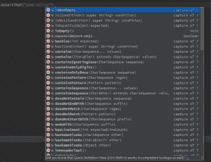

# 资产简介 j

> 原文:[https://web . archive . org/web/20220930061024/https://www . bael dung . com/introduction-to-assertj](https://web.archive.org/web/20220930061024/https://www.baeldung.com/introduction-to-assertj)

[This article is part of a series:](javascript:void(0);)• Introduction to AssertJ (current article)[• AssertJ for Guava](/web/20220628132606/https://www.baeldung.com/assertJ-for-guava)
[• AssertJ’s Java 8 Features](/web/20220628132606/https://www.baeldung.com/assertJ-java-8-features)
[• Custom Assertions with AssertJ](/web/20220628132606/https://www.baeldung.com/assertj-custom-assertion)

## 1.**概述**

在本文中，我们将探索[AssertJ](https://web.archive.org/web/20220628132606/https://joel-costigliola.github.io/assertj/)——一个开源社区驱动的库，用于在 Java 测试中编写流畅而丰富的断言。

本文主要关注基本 AssertJ 模块中可用的工具，称为 **AssertJ-core** 。

## 2. **Maven 依赖关系**

为了使用 AssertJ，您需要在您的`pom.xml`文件中包含以下部分:

```
<dependency>
    <groupId>org.assertj</groupId>
    <artifactId>assertj-core</artifactId>
    <version>3.4.1</version>
    <scope>test</scope>
</dependency> 
```

这种依赖只包括基本的 Java 断言。如果您想要使用高级断言，您将需要单独添加额外的模块。

注意，对于 Java 7 和更早的版本，您应该使用 AssertJ core 版本 2.x.x。

最新版本可以在这里找到[。](https://web.archive.org/web/20220628132606/https://search.maven.org/classic/#search%7Cga%7C1%7Ca%3A%22assertj-core%22)

## 3.介绍

AssertJ 提供了一组类和实用方法，允许我们轻松地为以下内容编写流畅美观的断言:

*   标准 Java
*   Java 8
*   番石榴
*   Joda 时间
*   Neo4J 和
*   摇摆组件

所有模块的详细列表可在项目的[网站](https://web.archive.org/web/20220628132606/https://joel-costigliola.github.io/assertj)上获得。

让我们从 AssertJ 文档中的几个例子开始:

```
assertThat(frodo)
  .isNotEqualTo(sauron)
  .isIn(fellowshipOfTheRing);

assertThat(frodo.getName())
  .startsWith("Fro")
  .endsWith("do")
  .isEqualToIgnoringCase("frodo");

assertThat(fellowshipOfTheRing)
  .hasSize(9)
  .contains(frodo, sam)
  .doesNotContain(sauron);
```

上面的例子只是冰山一角，但是给我们一个用这个库编写断言的大概样子。

## 4.**行动中的资产**

在这一节中，我们将重点介绍如何设置 AssertJ 并探索其可能性。

### **4.1。入门**

有了类路径上的 jar 库，启用断言就像向测试类添加一个静态导入一样简单:

```
import static org.assertj.core.api.Assertions.*;
```

### **4.2。写断言**

为了编写一个断言，你总是需要从将你的对象传递给`Assertions.assertThat()`方法开始，然后你就可以使用实际的断言了。

重要的是要记住，与其他一些库不同，下面的代码实际上并没有断言任何东西，并且**永远不会**测试失败:

```
assertThat(anyRefenceOrValue);
```

如果利用 IDE 的代码完成特性，编写 AssertJ 断言会变得非常容易，因为它采用了非常描述性的方法。这是它在 IntelliJ IDEA 16 中的样子:

[](/web/20220628132606/https://www.baeldung.com/wp-content/uploads/2016/06/ide.png)

IDE 的代码完成功能

如你所见，你有几十种上下文方法可供选择，这些方法仅适用于`String`类型。让我们详细研究一下这个 API，看看一些具体的断言。

### **`4.3\. Object`断言**

`Objects`可以通过多种方式进行比较，以确定两个对象是否相等，或者检查一个对象的字段。

让我们来看两种比较两个对象相等性的方法。给定下面两个`Dog` 对象`fido` 和`fidosClone`:

```
public class Dog { 
    private String name; 
    private Float weight;

    // standard getters and setters
}

Dog fido = new Dog("Fido", 5.25);

Dog fidosClone = new Dog("Fido", 5.25);
```

我们可以用下面的断言来比较等式:

```
assertThat(fido).isEqualTo(fidosClone);
```

当`isEqualTo()`比较对象引用时，这将失败。如果我们想比较它们的内容，我们可以像这样使用`isEqualToComparingFieldByFieldRecursively()`:

```
assertThat(fido).isEqualToComparingFieldByFieldRecursively(fidosClone);
```

当进行逐字段递归比较时，`Fido`和`fidosClone` 是相等的，因为一个对象的每个字段都与另一个对象中的字段进行比较。

还有许多其他断言方法，它们提供了不同的方法来比较和收缩对象，以及检查和断言它们的字段。为了发现它们，请参考官方的`AbstractObjectAssert` [文档](https://web.archive.org/web/20220628132606/https://joel-costigliola.github.io/assertj/core-8/api/org/assertj/core/api/AbstractObjectAssert.html)。

### **`4.4\. Boolean` 断言**

真理测试有一些简单的方法:

*   `isTrue()`
*   `isFalse()`

让我们看看他们的行动:

```
assertThat("".isEmpty()).isTrue();
```

### **`4.5\. Iterable/Array` 断言**

对于一个`Iterable`或一个`Array`来说，有多种方法可以断言它们的内容存在。最常见的断言之一是检查`Iterable`或 `Array`是否包含给定的元素:

```
List<String> list = Arrays.asList("1", "2", "3");

assertThat(list).contains("1");
```

或者如果`List`不为空:

```
assertThat(list).isNotEmpty();
```

或者一个`List`是否以一个给定的字符开始。例如“1”:

```
assertThat(list).startsWith("1");
```

请记住，如果您想要为同一个对象创建多个断言，您可以很容易地将它们连接在一起。

下面是一个断言示例，它检查提供的列表是否不为空，是否包含“1”元素，是否不包含任何空值，以及是否包含元素“2”、“3”的序列:

```
assertThat(list)
  .isNotEmpty()
  .contains("1")
  .doesNotContainNull()
  .containsSequence("2", "3");
```

当然，对于这些类型，还存在更多可能的断言。为了发现它们，请参考官方的`AbstractIterableAssert` [文档](https://web.archive.org/web/20220628132606/https://joel-costigliola.github.io/assertj/core-8/api/org/assertj/core/api/AbstractIterableAssert.html)。

### **`4.6\. Character` 断言**

字符类型的断言主要涉及比较，甚至检查给定的字符是否来自`Unicode`表。

下面是一个断言示例，它检查提供的字符是否不是“a”，是否在 Unicode 表中，是否大于“b”并且是小写的:

```
assertThat(someCharacter)
  .isNotEqualTo('a')
  .inUnicode()
  .isGreaterThanOrEqualTo('b')
  .isLowerCase();
```

有关所有字符类型断言的详细列表，请参见`AbstractCharacterAssert` [文档](https://web.archive.org/web/20220628132606/https://joel-costigliola.github.io/assertj/core-8/api/org/assertj/core/api/AbstractCharacterAssert.html)。

### **`4.7\. Class` 断言**

类型的断言主要是检查它的字段、`Class`类型、注释的存在和类的终结性。

如果你想断言类`Runnable`是一个接口，你只需要简单地写:

```
assertThat(Runnable.class).isInterface();
```

或者，如果您想检查一个类是否可以从另一个类进行赋值:

```
assertThat(Exception.class).isAssignableFrom(NoSuchElementException.class);
```

所有可能的`Class`断言都可以在`AbstractClassAssert` [文档](https://web.archive.org/web/20220628132606/https://joel-costigliola.github.io/assertj/core-8/api/org/assertj/core/api/AbstractClassAssert.html)中查看。

### **`4.8\. File`断言**

断言都是关于检查一个给定的`File`实例是否存在，是一个目录还是一个文件，是否有特定的内容，是否可读，或者是否有给定的扩展名。

在这里，您可以看到一个断言示例，它检查给定的文件是否存在，是否是文件而不是目录，是否可读写:

```
 assertThat(someFile)
   .exists()
   .isFile()
   .canRead()
   .canWrite();
```

所有可能的类断言都可以在`AbstractFileAssert` [文档](https://web.archive.org/web/20220628132606/https://joel-costigliola.github.io/assertj/core-8/api/org/assertj/core/api/AbstractFileAssert.html)中查看。

### **`4.9\. Double/Float/Integer`断言**

**`Double/Float/Integer`和其他`Number`类型**

数值断言是关于在给定偏移量内或不在给定偏移量内比较数值。例如，如果您想根据给定的精度检查两个值是否相等，我们可以执行以下操作:

```
assertThat(5.1).isEqualTo(5, withPrecision(1d));
```

注意，我们使用已经导入的`withPrecision(Double offset)`辅助方法来生成`Offset`对象。

更多断言，请访问 AbstractDoubleAssert [文档](https://web.archive.org/web/20220628132606/https://joel-costigliola.github.io/assertj/core-8/api/org/assertj/core/api/AbstractDoubleAssert.html)。

### **`4.10\. InputStream`断言**

只有一个特定于`InputStream`的断言可用:

*   `hasSameContentAs(InputStream expected)`

实际上:

```
assertThat(given).hasSameContentAs(expected);
```

### **`4.11\. Map`断言**

断言允许你检查一个映射是否包含某个条目、一组条目或单独的键/值。

在这里，您可以看到一个断言示例，它检查给定的映射是否不为空，是否包含数字键“2”，是否包含数字键“10”，以及是否包含条目:`key: 2, value: “a”`:

```
assertThat(map)
  .isNotEmpty()
  .containsKey(2)
  .doesNotContainKeys(10)
  .contains(entry(2, "a"));
```

更多断言见`AbstractMapAssert` [文档](https://web.archive.org/web/20220628132606/https://joel-costigliola.github.io/assertj/core-8/api/org/assertj/core/api/AbstractMapAssert.html)。

### **`4.12\. Throwable`断言**

断言允许例如:检查异常消息、堆栈跟踪、原因检查或验证是否已经抛出异常。

让我们来看一个断言的例子，它检查一个给定的异常是否被抛出并有一条以“c”结尾的消息:

```
assertThat(ex).hasNoCause().hasMessageEndingWith("c");
```

有关更多断言，请参见 AbstractThrowableAssert [文档](https://web.archive.org/web/20220628132606/https://joel-costigliola.github.io/assertj/core-8/api/org/assertj/core/api/AbstractThrowableAssert.html)。

## **5。描述断言**

为了达到更高的详细程度，您可以为您的断言创建动态生成的定制描述。做到这一点的关键是`as(String description, Object… args)` 方法。

如果您这样定义您的断言:

```
assertThat(person.getAge())
  .as("%s's age should be equal to 100", person.getName())
  .isEqualTo(100);
```

这是运行测试时您将得到的结果:

```
[Alex's age should be equal to 100] expected:<100> but was:<34>
```

## 6.Java 8

AssertJ 充分利用了 Java 8 的函数式编程特性。让我们深入一个例子，看看它是如何工作的。首先让我们看看在 Java 7 中是如何做到的:

```
assertThat(fellowshipOfTheRing)
  .filteredOn("race", HOBBIT)
  .containsOnly(sam, frodo, pippin, merry);
```

这里，我们正在过滤一个关于霍比特人的集合，在 Java 8 中，我们可以这样做:

```
assertThat(fellowshipOfTheRing)
  .filteredOn(character -> character.getRace().equals(HOBBIT))
  .containsOnly(sam, frodo, pippin, merry);
```

我们将在本系列的下一篇文章中探讨 AssertJ 的 Java8 功能。以上例子摘自 AssertJ 的[网站](https://web.archive.org/web/20220628132606/https://joel-costigliola.github.io/assertj/)。

## 7.**结论**

在本文中，我们简要探讨了 AssertJ 给我们带来的可能性，以及核心 Java 类型最流行的断言。

所有示例和代码片段的实现都可以在 GitHub 项目中找到。

Next **»**[AssertJ for Guava](/web/20220628132606/https://www.baeldung.com/assertJ-for-guava)