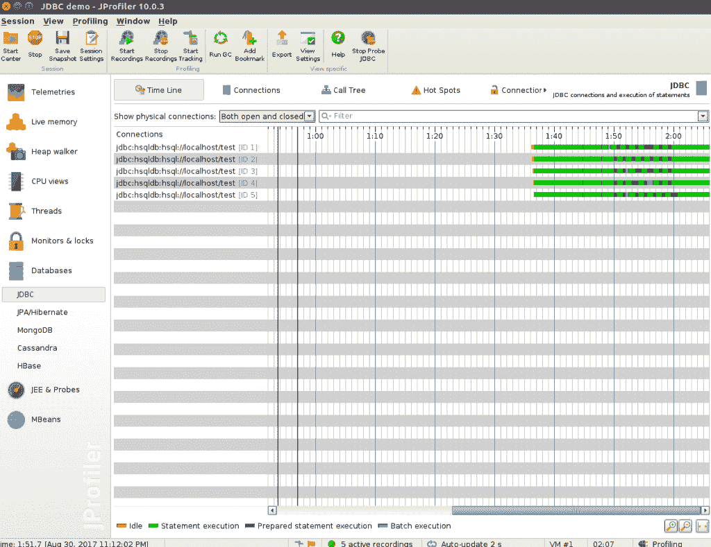
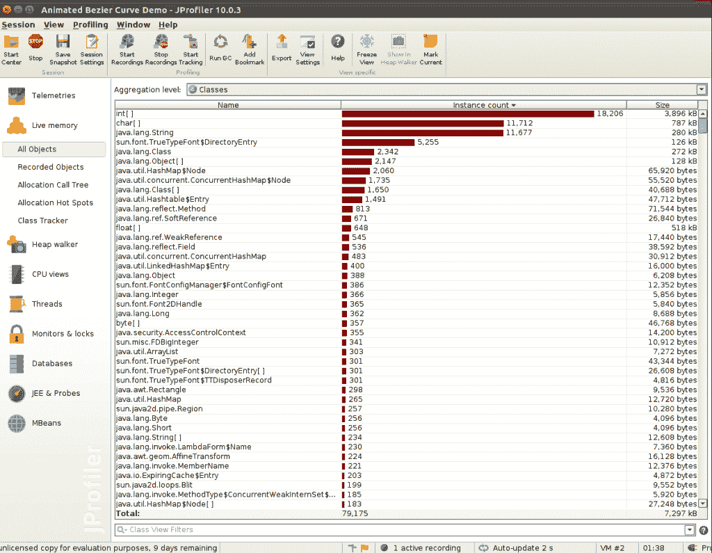
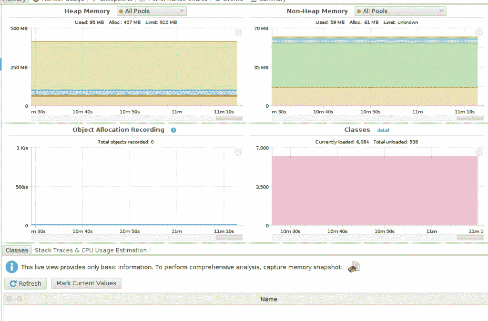
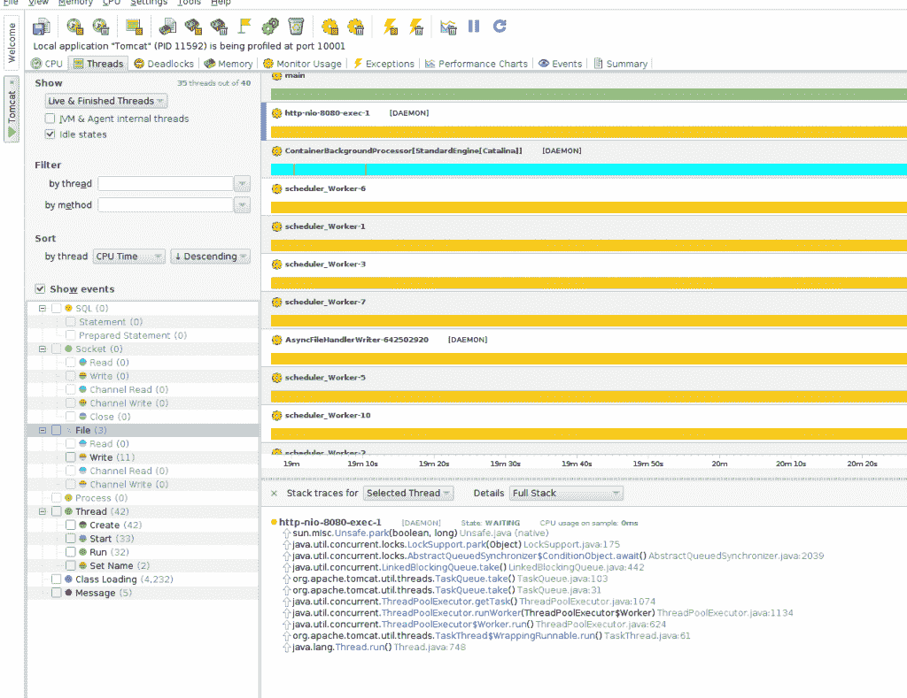
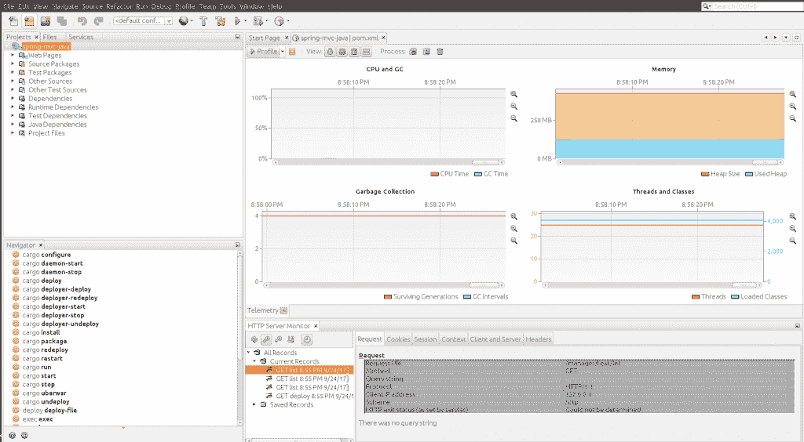

# Java 分析器指南

> 原文:[https://web . archive . org/web/20220930061024/https://www . bael dung . com/Java-profilers](https://web.archive.org/web/20220930061024/https://www.baeldung.com/java-profilers)

## **1。概述**

有时，仅仅编写能够运行的代码是不够的。我们可能想知道内部发生了什么，比如内存是如何分配的，使用一种编码方法比使用另一种编码方法的结果，并发执行的含义，需要提高性能的地方，等等。我们可以用侧写仪来做这个。

Java Profiler 是一种工具，**在 JVM 级别**监控 Java 字节码结构和操作。这些代码构造和操作包括对象创建、迭代执行(包括递归调用)、方法执行、线程执行和垃圾收集。

在本文中，我们将讨论主要的 Java 分析器: [JProfiler](https://web.archive.org/web/20220927082550/https://www.ej-technologies.com/products/jprofiler/overview.html) 、 [YourKit](https://web.archive.org/web/20220927082550/https://www.yourkit.com/java/profiler/) 、 [Java VisualVM](https://web.archive.org/web/20220927082550/https://visualvm.github.io/) 、Netbeans 分析器和 [IntelliJ 分析器](https://web.archive.org/web/20220927082550/https://lp.jetbrains.com/intellij-idea-profiler/)。

## **2。JProfiler**

JProfiler 是许多开发者的首选。通过直观的 UI，JProfiler 提供了查看系统性能、内存使用、潜在内存泄漏和线程分析的界面。

有了这些信息，我们可以很容易地知道我们需要在底层系统中优化、消除或改变什么。

该产品需要[购买许可证](https://web.archive.org/web/20220927082550/https://www.ej-technologies.com/buy/jprofiler/select)，但也提供免费试用。

JProfiler 的界面如下所示:

 [ JProfiler 概述界面与功能](/web/20220927082550/https://www.baeldung.com/wp-content/uploads/2017/10/1-jprofiler-overview-probing.png)

像大多数分析器一样，我们可以在本地和远程应用程序中使用这个工具。这意味着有可能**分析运行在远程机器上的 Java 应用程序，而不必在它们上面安装任何东西**。

JProfiler 还为 SQL 和 NoSQL 数据库提供了**高级分析。它为分析 JDBC、JPA/Hibernate、MongoDB、Casandra 和 HBase 数据库提供了特定的支持。**

下面的屏幕截图显示了带有当前连接列表的 JDBC 探测界面:

[jprofile 数据库探测视图](/web/20220927082550/https://www.baeldung.com/wp-content/uploads/2017/10/2-jprofiler-database-probing-1.png)

如果我们渴望了解与我们的数据库交互的**调用树**并看到可能泄露的**连接**，JProfiler 很好地处理了这一点。

动态内存是 JProfiler 的一个特性，它允许我们通过应用程序查看当前的内存使用情况。我们可以查看对象声明和实例或者整个调用树的内存使用情况。

在分配调用树的情况下，我们可以选择查看活动对象、垃圾收集对象或两者的调用树。我们还可以决定这个分配树是应该用于特定的类、包还是所有的类。

下面的屏幕显示了具有实例计数的所有对象的实时内存使用情况:

 [ JProfiler 现场内存查看](/web/20220927082550/https://www.baeldung.com/wp-content/uploads/2017/10/3-jprofiler-live-memory.png)

JProfiler 支持**与流行的 ide**集成，比如 Eclipse、NetBeans 和 IntelliJ。甚至可以**从快照导航到源代码**！

## **3。yourketer**

YourKit Java Profiler 运行在许多不同的平台上，并为每个支持的操作系统(Windows、MacOS、Linux、Solaris、FreeBSD 等)提供单独的安装。).

像 JProfiler 一样，YourKit 具有可视化线程、垃圾收集、内存使用和内存泄漏的核心特性，并通过 ssh 隧道支持本地和远程分析。

YourKit 既提供[付费许可](https://web.archive.org/web/20220927082550/https://www.yourkit.com/java/profiler/purchase/)用于商业用途，还提供免费试用，以及非商业用途的低价或免费许可。

下面快速浏览一下 Tomcat 服务器应用程序的内存分析结果:

[your kit Java Profiler Tomcat 服务器应用程序的内存分析](/web/20220927082550/https://www.baeldung.com/wp-content/uploads/2017/10/4-yourkit-tomcat-profiling-memory.png)

当我们想要**分析抛出的异常**时，YourKit 也会派上用场。我们可以很容易地找出抛出了什么类型的异常以及每个异常发生的次数。

YourKit 有一个有趣的 **CPU 剖析特性，它允许对我们代码的某些区域**进行重点剖析，比如线程中的方法或子树。这是非常强大的，因为它允许通过假设分析特性进行条件分析。

图 5 显示了一个线程分析接口的例子:

 [图 5。YourKit Java Profiler 线程分析接口](/web/20220927082550/https://www.baeldung.com/wp-content/uploads/2017/10/5-yourkit-threads-profiling.png)

我们还可以用工具包**分析 SQL 和 NoSQL 数据库调用**。它甚至为实际执行的查询提供了一个视图。

虽然这不是技术上的考虑，但是 YourKit 的许可模式使它成为多用户或分布式团队以及单个许可购买的好选择。

## **4。Java VisualVM**

Java VisualVM 是一个简化但健壮的 Java 应用程序分析工具。这是一个免费的开源分析器。

在 JDK 8 之前，这个工具**与 Java 开发工具包** (JDK)捆绑在一起，但在 JDK 9 中被移除，现在作为独立工具分发: [VisualVM 下载](https://web.archive.org/web/20220927082550/https://visualvm.github.io/download.html)。

其操作依赖于 JDK 提供的其他独立工具，如`JConsole`、`jstat`、`jstack`、`jinfo`、`jmap`。

下面，我们可以看到一个使用 Java VisualVM 的正在进行的概要分析会话的简单概述界面:

 [ Java VisualVM 本地 tomcat 服务器 app 剖析](/web/20220927082550/https://www.baeldung.com/wp-content/uploads/2017/10/6-visualvm-overview.png)

Java VisualVM 的一个有趣的优势是我们可以**扩展它来开发新的功能作为插件**。然后我们可以将这些插件添加到 Java VisualVM 的内置更新中心。

Java VisualVM 支持**本地和远程剖析**，以及内存和 CPU 剖析。**连接到远程应用程序需要提供凭证**(必要时提供主机名/IP 和密码)**，但不支持 ssh 隧道**。我们也可以选择使用即时更新(通常每 2 秒一次)来启用**实时分析。**

下面，我们可以看到使用 Java VisualVM 分析的 Java 应用程序的内存前景:

 [ Java VisualVM 内存堆直方图](/web/20220927082550/https://www.baeldung.com/wp-content/uploads/2017/10/7-visualvm-sample-memory.png)

有了 Java VisualVM 的快照特性，我们可以**获取概要分析会话的快照，以供以后分析**。

## **5。NetBeans 分析器**

NetBeans Profiler 与 Oracle 的开源 NetBeans IDE 捆绑在一起。

虽然这个分析器**与 Java VisualVM** 有很多相似之处，但是当我们想要将所有东西都打包在一个程序中时，它是一个不错的选择(IDE +分析器)。

上面讨论的所有其他分析器都提供了插件来增强 ide 集成。

下面的屏幕截图显示了 NetBeans Profiler 界面的示例:

Netbeans Profiler 遥测接口

Netbeans Profiler 也是轻量级开发和分析的好选择。NetBeans Profiler 提供了一个窗口来配置和控制分析会话并显示结果。它提供了一个独特的特性，知道**垃圾收集多长时间发生一次**。

## 6.IntelliJ 探查器

IntelliJ Profiler 是一个简单而强大的工具，用于分析 CPU 和内存分配。它结合了两个流行的 Java 分析器的力量:和异步分析器。

虽然有一些高级功能，但主要重点是易用性。IntelliJ Profiler 使您无需任何配置，只需点击几下鼠标即可开始，同时提供了一些有用的功能来帮助您作为开发人员进行日常工作。

作为 IntelliJ IDEA Ultimate 的一部分， **IntelliJ Profiler 可以通过单击**连接到一个进程，我们可以在快照和源代码之间导航，就像它们是一个整体一样。它的其他功能，如差异火焰图，允许我们直观地评估不同方法的性能，并快速有效地了解运行时操作:

IntelliJ Profiler 可以在 Windows、Linux 和 macOS 上运行。

## **7。其他固体轮廓仪**

这里值得一提的有 [Java Mission Control](https://web.archive.org/web/20220927082550/http://www.oracle.com/technetwork/java/javaseproducts/mission-control/java-mission-control-1998576.html) 、 [New Relic](https://web.archive.org/web/20220927082550/https://newrelic.com/) 和[前缀](https://web.archive.org/web/20220927082550/https://stackify.com/prefix/)(来自[Stackify](https://web.archive.org/web/20220927082550/https://stackify.com/))——这些整体市场份额较少，但绝对值得一提。例如，Stackify 的 Prefix 是一个优秀的轻量级分析工具，不仅非常适合分析 Java 应用程序，也非常适合分析其他 web 应用程序。

## **8。结论**

在这篇文章中，我们讨论了概要分析和 Java 概要分析器。我们研究了每种分析器的特性，以及它们之间的潜在区别。

有许多可用的 Java 分析器，其中一些具有独特的特征。正如我们在本文中看到的，选择使用哪种 Java 分析器主要取决于开发人员对工具的选择、所需的分析水平以及分析器的特性。