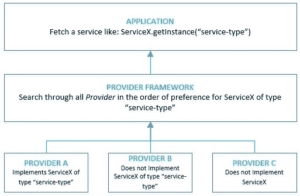

# Java 安全性的基础

> 原文：<https://web.archive.org/web/20220930061024/https://www.baeldung.com/java-security-overview>

## 1.概观

在本教程中，我们将介绍 Java 平台上的安全性基础知识。我们还将关注我们可以用来编写安全应用程序的东西。

安全是一个包含许多领域的大话题。其中一些是语言本身的一部分，比如访问修饰符和类装入器。此外，其他服务也是可用的，包括数据加密、安全通信、认证和授权等等。

因此，在本教程中获得所有这些有意义的见解是不实际的。然而，我们将努力获得至少一个有意义的词汇。

## 2.语言特征

最重要的是，Java 的安全性从语言特性的层面开始。这使我们能够编写安全的代码，并受益于许多隐含的安全特性:

*   静态数据类型化:Java 是一种静态类型化语言，这**降低了运行时检测类型相关错误的可能性**
*   访问修饰符:Java 允许我们使用**不同的访问修饰符，比如 public 和 private，来控制对字段、方法和类的访问**
*   自动内存管理:Java 有**基于垃圾收集的内存管理**，这让开发人员不用手动管理
*   字节码验证:Java 是一种编译语言，这意味着它将代码转换成与平台无关的字节码，并且**运行时验证它为执行而加载的每一个字节码**

这不是 Java 提供的安全特性的完整列表，但是它足以给我们一些保证！

## 3.Java 中的安全体系结构

在我们开始探索具体领域之前，让我们花一些时间来理解 Java 中安全性的核心架构。

Java 安全性的核心原则是由**可互操作和可扩展的`Provider`实现**驱动的。`Provider`的特定实现可以实现部分或全部安全服务。

例如，a `Provider`可能实现的一些典型服务是:

*   加密算法(如 DSA、RSA 或 SHA-256)
*   密钥生成、转换和管理工具(例如针对特定算法的密钥)

Java 附带了许多内置的提供者。此外，一个应用程序可以按照优先顺序配置多个提供者。

[](/web/20221126232640/https://www.baeldung.com/wp-content/uploads/2019/09/Java-Providers.jpg)

因此， **Java 中的提供者框架在所有提供者中搜索服务的特定实现，搜索顺序是对它们设置的首选项**。

此外，在这种架构中，总是可以实现具有可插入安全功能的定制提供者。

## 4.密码系统

密码学是 Java 安全特性的基石。这指的是**在对手面前进行安全通信的工具和技术**。

### 4.1.Java 密码术

[Java 加密架构(JCA)](https://web.archive.org/web/20221126232640/https://docs.oracle.com/javase/9/security/java-cryptography-architecture-jca-reference-guide.htm) 提供了一个框架来访问和实现 Java 中的加密功能，包括:

*   数字签名
*   [消息摘要](/web/20221126232640/https://www.baeldung.com/java-password-hashing)
*   [对称和非对称密码](/web/20221126232640/https://www.baeldung.com/java-cipher-class)
*   消息认证码
*   主要发电机和主要工厂

最重要的是，Java 利用基于 [`Provider`的实现](https://web.archive.org/web/20221126232640/https://docs.oracle.com/javase/9/security/howtoimplaprovider.htm)来加密函数。

此外，Java 包括常用加密算法的内置提供程序，如 RSA、DSA 和 AES 等。我们可以使用这些算法来增加静态、使用中或动态数据的安全性。

### 4.2.实践中的密码学

应用程序中一个非常常见的用例是存储用户密码。我们在稍后的时间点使用它进行身份验证。很明显，存储纯文本密码会损害安全性。

因此，一个解决方案是以这样一种方式打乱密码，即该过程是可重复的，但只是单向的。这个过程被称为加密哈希函数，SHA1 就是这样一种流行的算法。

那么，让我们看看如何在 Java 中做到这一点:

```
MessageDigest md = MessageDigest.getInstance("SHA-1");
byte[] hashedPassword = md.digest("password".getBytes());
```

这里，`MessageDigest`是我们感兴趣的加密服务。我们**使用方法`getInstance`()向任何可用的安全提供者**请求这项服务。

## 5.公钥基础设施

公钥基础设施(PKI)指的是使用公钥加密在网络上实现安全信息交换的**设置。这种设置依赖于通信各方之间建立的信任。这种信任是基于由被称为证书颁发机构(CA)的中立可信机构颁发的数字证书。**

### 5.1.Java 中的 PKI 支持

Java 平台有 API 来[促进数字证书的创建、存储和验证](https://web.archive.org/web/20221126232640/https://docs.oracle.com/javase/9/security/java-pki-programmers-guide.htm):

*   [`KeyStore`](/web/20221126232640/https://www.baeldung.com/java-keystore) : Java 提供了`KeyStore`类，用于持久存储密钥和可信证书。这里， **`KeyStore`可以表示密钥存储和信任存储文件**。这些文件有相似的内容，但它们的用法不同。
*   `CertStore`:另外，Java 有`CertStore`类，它代表了潜在的不可信证书和撤销列表的公共存储库。我们需要检索证书和撤销列表**，以便在其他用途中构建证书路径**。

Java 有一个名为“cacerts”的内置信任存储，其中包含众所周知的 ca 的证书。

### 5.2.用于 PKI 的 Java 工具

Java 有一些非常方便的工具来促进可信通信:

*   有一个名为“keytool”的内置工具来创建和管理密钥存储和信任存储
*   还有另一个工具“jarsigner ”,我们可以用它来签名和验证 JAR 文件

### 5.3.在 Java 中使用证书

让我们看看如何使用 Java 中的证书来建立使用 SSL 的安全连接。相互认证的 SSL 连接需要我们做两件事:

*   出示证书—我们需要向通信中的另一方出示有效证书。为此，我们需要加载密钥存储文件，其中必须有我们的公钥:

```
KeyStore keyStore = KeyStore.getInstance(KeyStore.getDefaultType());
char[] keyStorePassword = "changeit".toCharArray();
try(InputStream keyStoreData = new FileInputStream("keystore.jks")){
    keyStore.load(keyStoreData, keyStorePassword);
}
```

*   验证证书—我们还需要验证通信中另一方提供的证书。为此，我们需要加载信任存储，其中必须有以前来自其他方的可信证书:

```
KeyStore trustStore = KeyStore.getInstance(KeyStore.getDefaultType());
// Load the trust-store from filesystem as before
```

我们很少需要通过编程来实现这一点，通常在运行时将系统参数传递给 Java:

```
-Djavax.net.ssl.trustStore=truststore.jks 
-Djavax.net.ssl.keyStore=keystore.jks
```

## 6.证明

身份验证是根据附加数据(如密码、令牌或目前可用的各种其他凭证)来验证用户或机器的身份的过程。

### 6.1.Java 中的认证

Java APIs 利用[可插拔登录模块](https://web.archive.org/web/20221126232640/https://docs.oracle.com/javase/9/security/java-authentication-and-authorization-service-jaas-loginmodule-developers-guide1.htm)为应用程序提供不同的、通常是多重的认证机制。`LoginContext`提供了这种抽象，而这种抽象又引用了配置并加载了一个适当的`LoginModule`。

虽然多个提供商提供了他们的登录模块，但是 **Java 有一些默认的模块可以使用**:

*   `Krb5LoginModule`，用于基于 Kerberos 的认证
*   `JndiLoginModule`，用于由 LDAP 存储支持的基于用户名和密码的身份验证
*   `KeyStoreLoginModule`，用于基于密钥的加密认证

### 6.2.通过示例登录

最常见的身份验证机制之一是用户名和密码。让我们看看如何通过`JndiLoginModule`来实现这一点。

该模块负责从用户处获取用户名和密码，并根据在 JNDI 配置的目录服务对其进行验证:

```
LoginContext loginContext = new LoginContext("Sample", new SampleCallbackHandler());
loginContext.login();
```

这里，**使用`LoginContext`的一个实例来执行登录**。`LoginContext`取登录配置中条目的名称——在本例中，它是“Sample”。此外，我们必须提供一个`CallbackHandler`的实例，使用`LoginModule`与用户交互用户名和密码等细节。

让我们来看看我们的登录配置:

```
Sample {
  com.sun.security.auth.module.JndiLoginModule required;
};
```

很简单，这表明我们使用`JndiLoginModule`作为强制`LoginModule`。

## 7.安全通信

网络上的通信容易受到许多攻击媒介的攻击。例如，有人可能接入网络，在我们传输数据包时读取它们。多年来，业界已经建立了许多协议来保护这种通信。

### 7.1.Java 对安全通信的支持

Java 提供了[API，通过**加密、消息完整性以及客户端和服务器认证**来保护网络通信](https://web.archive.org/web/20221126232640/https://docs.oracle.com/javase/9/security/java-secure-socket-extension-jsse-reference-guide.htm):

*   SSL/TLS: SSL 及其后继者 TLS 通过数据加密和公钥基础设施为不受信任的网络通信提供安全性。Java 通过包“`java.security.ssl`”中定义的`SSLSocket`提供对 SSL/TLS 的支持。
*   SASL:简单身份验证和安全层(SASL)是客户端和服务器之间的身份验证标准。Java 支持 SASL 作为包“`java.security.sasl`”的一部分。
*   GGS-API/Kerberos:通用安全服务 API(GSS API)通过各种安全机制(如 Kerberos v5)提供对安全服务的统一访问。Java 支持 GSS API 作为包“`java.security.jgss`”的一部分。

### 7.2.SSL 通信在运行

现在让我们看看如何使用`SSLSocket` 在 [Java 中打开与其他方的安全连接:](/web/20221126232640/https://www.baeldung.com/java-ssl)

```
SocketFactory factory = SSLSocketFactory.getDefault();
try (Socket connection = factory.createSocket(host, port)) {
    BufferedReader input = new BufferedReader(
      new InputStreamReader(connection.getInputStream()));
    return input.readLine();
}
```

这里，我们使用`SSLSocketFactory`来创建`SSLSocket`。作为其中的一部分，我们可以设置可选参数，如密码套件和使用哪个协议。

为了正常工作，**我们必须像前面看到的那样创建并设置我们的密钥存储库和信任存储库**。

## 8.访问控制

访问控制指的是**保护敏感资源，如文件系统**或代码库，防止未经授权的访问。这通常是通过限制对此类资源的访问来实现的。

### 8.1.Java 中的访问控制

我们可以通过`SecurityManager`类使用类`Policy`和`Permission`在 Java **中实现访问控制。`SecurityManager`是“`java.lang`包的一部分，负责在 Java 中执行访问控制检查。**

当类加载器在运行时加载一个类时，它会自动授予封装在`Permission` 对象中的类一些默认权限。除了这些默认权限，我们还可以通过安全策略授予一个类更多的权限。这些由类`Policy`表示。

在代码执行序列期间，如果运行时遇到对受保护资源的请求， **`SecurityManager`通过调用堆栈对照已安装的`Policy`** 验证所请求的`Permission`。因此，它要么授予许可，要么抛出`SecurityException`。

### 8.2.Java 策略工具

Java 有一个默认的实现`Policy`，它从属性文件中读取授权数据。但是，这些策略文件中的策略条目必须采用特定的格式。

Java 附带了“policytool”，这是一个用于编写策略文件的图形化工具。

### 8.3.通过示例进行访问控制

让我们看看如何在 Java 中限制对资源(如文件)的访问:

```
SecurityManager securityManager = System.getSecurityManager();
if (securityManager != null) {
    securityManager.checkPermission(
      new FilePermission("/var/logs", "read"));
}
```

这里，我们使用`SecurityManager`来验证我们对一个文件的读请求，它被包装在`FilePermission`中。

但是，`SecurityManager`将这个请求委托给了`AccessController`。`AccessController`内部利用已安装的`Policy`做出决定。

让我们看一个策略文件的示例:

```
grant {
  permission 
    java.security.FilePermission
      <<ALL FILES>>, "read";
};
```

我们本质上是授予每个人对所有文件的读取权限。但是，**我们可以通过安全策略**提供更细粒度的控制。

值得注意的是，在 Java 中，默认情况下可能不会安装`SecurityManager`。我们可以通过始终使用以下参数启动 Java 来确保这一点:

```
-Djava.security.manager -Djava.security.policy=/path/to/sample.policy
```

## 9.XML 签名

XML 签名**有助于保护数据并提供数据完整性**。W3C 为 XML 签名的治理提供了建议。我们可以使用 XML 签名来保护任何类型的数据，比如二进制数据。

### 9.1.Java 中的 XML 签名

Java API 支持按照推荐的准则生成和验证 XML 签名。Java XML 数字签名 API 封装在包“`java.xml.crypto`”中。

签名本身只是一个 XML 文档。XML 签名可以有三种类型:

*   分离的:这种类型的签名覆盖签名元素外部的数据
*   包络:这种类型的签名覆盖签名元素内部的数据
*   Enveloped:这种类型的签名位于包含签名元素本身的数据之上

当然，Java 支持创建和验证上述所有类型的 XML 签名。

### 9.2.创建 XML 签名

现在，我们将卷起袖子，为我们的数据生成一个 XML 签名。例如，我们可能要通过网络发送一个 XML 文档。因此，**我们希望我们的接收者能够验证其完整性**。

那么，让我们看看如何在 Java 中实现这一点:

```
XMLSignatureFactory xmlSignatureFactory = XMLSignatureFactory.getInstance("DOM");
DocumentBuilderFactory documentBuilderFactory = DocumentBuilderFactory.newInstance();
documentBuilderFactory.setNamespaceAware(true);

Document document = documentBuilderFactory
  .newDocumentBuilder().parse(new FileInputStream("data.xml"));

DOMSignContext domSignContext = new DOMSignContext(
  keyEntry.getPrivateKey(), document.getDocumentElement());

XMLSignature xmlSignature = xmlSignatureFactory.newXMLSignature(signedInfo, keyInfo);
xmlSignature.sign(domSignContext);
```

为了澄清，我们正在为文件`“data.xml”.`中的数据生成一个 XML 签名。同时，这段代码需要注意一些事情:

*   首先，`XMLSignatureFactory`是用于生成 XML 签名的工厂类
*   `XMLSigntaure`需要一个`SignedInfo`对象来计算签名
*   `XMLSigntaure`还需要`KeyInfo`，它封装了签名密钥和证书
*   最后，`XMLSignature`使用封装为`DOMSignContext`的私钥对文档进行签名

因此，**XML 文档现在将包含签名元素**，它可以用来验证其完整性。

## 10.超越核心 Java 的安全性

正如我们现在所看到的，Java 平台提供了许多编写安全应用程序所必需的功能。然而，有时，这些是非常低级的，不能直接应用于，例如，网络上的标准安全机制。

例如，在我们的系统上工作时，**我们通常不希望必须阅读完整的 OAuth RFC 并自己实现它**。我们经常需要更快、更高级别的方法来实现安全性。这就是应用程序框架发挥作用的地方——它们帮助我们用更少的样板代码实现我们的目标。

并且，在 Java 平台上—**通常意味着 Spring 安全**。该框架是 Spring 生态系统的一部分，但它实际上可以在纯 Spring 应用程序之外使用。

简单地说，它帮助 is 以一种简单的、声明性的、高级的方式实现认证、授权和其他安全特性。

当然，Spring Security 在[系列教程](/web/20221126232640/https://www.baeldung.com/security-spring)中有广泛的介绍，在 [Learn Spring Security 课程](/web/20221126232640/https://www.baeldung.com/learn-spring-security-course)中也有指导。

## 11.结论

简而言之，在本教程中，我们介绍了 Java 中安全性的高级架构。此外，我们了解 Java 如何为我们提供一些标准加密服务的实现。

我们还看到了一些常见的模式，我们可以应用这些模式在身份验证和访问控制等领域实现可扩展和可插拔的安全性。

综上所述，这只是给我们提供了一个窥见 Java 安全特性的机会。因此，本教程中讨论的每个领域都值得进一步探索。但希望，我们应该有足够的洞察力开始这个方向！