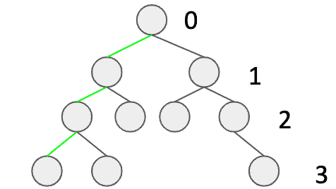

# 在 Java 中如何判断一棵二叉树是否平衡

> 原文：<https://web.archive.org/web/20220930061024/https://www.baeldung.com/java-balanced-binary-tree>

## 1.概观

树是计算机科学中最重要的数据结构之一。我们通常对平衡的树感兴趣，因为它有价值的属性。它们的结构允许在对数时间内执行查询、插入、删除等操作。

在本教程中，我们将学习如何判断一棵二叉树是否平衡。

## 2.定义

首先，让我们介绍一些定义，以确保我们在同一页上:

*   [`A binary tree`](/web/20221117030339/https://www.baeldung.com/java-binary-tree)–一种树，其中每个节点都有零个、一个或两个孩子
*   树的高度——从树根到树叶的最大距离(与最深树叶的深度相同)
*   平衡树——一种这样的树:对于每个子树，从根到任何叶子的最大距离最多比从根到任何叶子的最小距离大 1

我们可以在下面找到一个平衡二叉树的例子。三个绿色的边是如何确定高度的简单可视化，而数字表示水平。

## 3.域对象

所以，让我们从我们的树的类开始:

[PRE0]

为了简单起见，我们假设**每个节点都有一个整数值**。注意，**如果左树和右树都是`null,`，那么这意味着我们的节点是一片叶子**。

在介绍我们的主方法之前，让我们看看它应该返回什么:

[PRE1]

因此，对于每一个单独的呼叫，我们将有关于高度和平衡的信息。

## 4.算法

有了平衡树的定义，我们就可以想出一个算法。我们需要做的是检查每个节点的期望属性。这可以通过递归深度优先搜索遍历轻松实现。

现在，我们的递归方法将为每个节点调用。此外，它将跟踪当前的深度。每次调用都会返回关于身高和平衡的信息。

现在，让我们看看我们的深度优先方法:

[PRE2]

首先，我们需要考虑如果我们的节点是`null`的情况:我们将返回`true`(这意味着树是平衡的)和`-1`作为高度。

然后，**我们对左边和右边的子树进行两次递归调用，保持深度最新**。

此时，我们已经为当前节点的子节点执行了计算。现在，我们有了检查平衡所需的所有数据:

*   `isBalanced`变量检查儿童的身高，并且
*   `substreesAreBalanced `表示子树是否都平衡

最后，我们可以返回关于平衡和高度的信息。用 facade 方法简化第一个递归调用也是一个好主意:

[PRE3]

## 5.摘要

在本文中，我们已经讨论了如何确定二叉树是否平衡。我们已经解释了深度优先搜索方法。

像往常一样，带有测试的源代码可以在 GitHub 上的[处获得。](https://web.archive.org/web/20221117030339/https://github.com/eugenp/tutorials/tree/master/algorithms-modules/algorithms-miscellaneous-5)