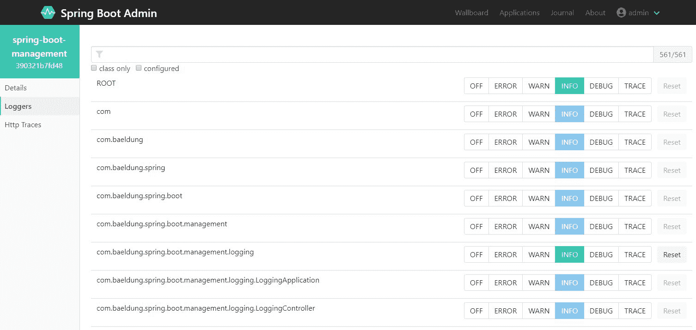
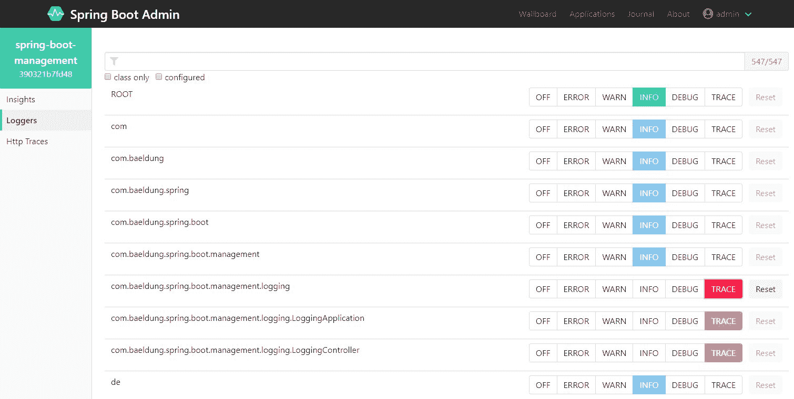

# 在运行时更改 Spring Boot 应用程序的日志记录级别

> 原文：<https://web.archive.org/web/20220930061024/https://www.baeldung.com/spring-boot-changing-log-level-at-runtime>

## 1.介绍

在本教程中，我们将探讨如何在运行时改变 Spring Boot 应用程序的日志级别。和许多事情一样， [Spring Boot 有内置的日志功能](/web/20221118232022/https://www.baeldung.com/spring-boot-logging)为我们配置它。我们将探讨如何调整正在运行的应用程序的日志记录级别。

我们将看看三种方法:使用 [Spring Boot 致动器](/web/20221118232022/https://www.baeldung.com/spring-boot-actuators) loggers 端点，使用 [Logback](/web/20221118232022/https://www.baeldung.com/logback) 中的自动扫描功能，最后使用 [Spring Boot 管理](/web/20221118232022/https://www.baeldung.com/spring-boot-admin)工具。

## 2.Spring Boot 执行器

我们将从使用/ `loggers` Actuator 端点来显示和更改我们的日志记录级别开始。**/`loggers`端点在`actuator/loggers`可用，我们可以通过在路径中附加一个特定的记录器名称来访问它。**

例如，我们可以通过 URL [`http://localhost:8080/actuator/loggers/root`](https://web.archive.org/web/20221118232022/http://localhost:8080/actuator/loggers/root) 访问根日志记录器。

### 2.1.设置

让我们从设置应用程序来使用 Spring Boot 执行器开始。

首先，我们需要将 [Spring Boot 致动器 Maven 依赖关系](https://web.archive.org/web/20221118232022/https://search.maven.org/search?q=spring-boot-starter-actuator)添加到我们的`pom.xml`文件中:

[PRE0]

**从 Spring Boot 2.x 开始，默认情况下大多数端点都是禁用的**，所以我们还需要在我们的`application.properties`文件中启用/ `loggers`端点:

[PRE1]

最后，让我们用一系列日志语句创建一个控制器，这样我们就可以看到实验的效果:

[PRE2]

### 2.2.使用/ `loggers`端点

让我们启动应用程序并访问我们的日志 API:

[PRE3]

然后，让我们检查日志，在那里我们应该找到三个日志记录语句:

[PRE4]

现在，让我们调用/ `loggers`执行器端点来检查我们的`com.baeldung.spring.boot.management.logging`包的日志记录级别:

[PRE5]

要更改日志记录级别，我们可以向/ `loggers`端点发出一个`POST`请求:

[PRE6]

如果我们再次检查日志级别，我们应该看到它被设置为`TRACE`:

[PRE7]

最后，我们可以重新运行我们的日志 API，并查看我们的实际变化:

[PRE8]

现在，让我们再次检查日志:

[PRE9]

## 3.回退自动扫描

默认情况下，我们的 Spring Boot 应用程序使用回退日志库。现在让我们看看如何利用 Logback 的自动扫描特性来改变我们的日志记录级别。

首先，让我们通过在我们的`src/main/resources`目录下放置一个名为`logback.xml`的文件来添加一些日志回溯配置:

[PRE10]

关键细节在`logback.xml`文件的第一行。**通过将`scan`属性设置为`true`，我们告诉 Logback 检查配置文件的变化。默认情况下，自动扫描每 60 秒进行一次。**

将`scanPeriod`设置为 15 秒，告诉它每 15 秒重新加载一次，这样我们就不必在实验中等待太久。

让我们通过启动应用程序并再次调用我们的日志 API 来尝试一下:

[PRE11]

我们的输出应该反映我们包的`INFO`日志记录级别:

[PRE12]

现在，让我们将`logback.xml`中的`com.baeldung.spring.boot.management.logging`记录器修改为`TRACE`:

[PRE13]

15 秒后，让我们在 [`http://localhost:8080/log`](https://web.archive.org/web/20221118232022/http://localhost:8080/log) 重新运行日志 API，并检查我们的日志输出:

[PRE14]

## 4.Spring Boot 管理

第三种改变日志级别的方法是通过 Spring Boot 管理工具。要使用 Spring Boot 管理，我们需要创建一个服务器应用程序，并将我们的应用程序配置为客户端。

### 4.1.管理应用程序

要更改 Spring Boot 管理的登录级别，我们需要设置一个新的应用程序作为我们的管理服务器。为此我们可以使用[弹簧初始值](https://web.archive.org/web/20221118232022/https://start.spring.io/)。

让我们将最新的 [`spring-boot-admin-starter-server`](https://web.archive.org/web/20221118232022/https://search.maven.org/search?q=spring-boot-admin-starter-server) 添加到我们的 pom.xml 中:

[PRE15]

有关设置管理服务器的详细说明，请参见我们的[Spring Boot 管理指南](/web/20221118232022/https://www.baeldung.com/spring-boot-admin)的第 2 部分。此外，第 4 部分包括设置安全性所需的信息，因为我们将保护我们的客户端。

### 4.2.客户端配置

一旦我们有了管理服务器，我们需要将我们的应用程序设置为客户机。

首先，让我们为`[spring-boot-admin-starter-client](https://web.archive.org/web/20221118232022/https://search.maven.org/search?q=spring-boot-admin-starter-client)`添加一个 Maven 依赖项:

[PRE16]

我们还需要管理服务器和客户端之间的安全性，所以让我们使用 [Spring Boot 安全启动器](https://web.archive.org/web/20221118232022/https://search.maven.org/search?q=spring-boot-starter-security):

[PRE17]

接下来，我们需要在我们的`application.properties`文件中做一些配置更改。

管理服务器在端口 8080 上运行，所以让我们首先更改我们的端口，并为应用程序命名:

[PRE18]

现在，让我们添加访问服务器所需的配置:

[PRE19]

这包括运行管理服务器的 URL 以及客户机和管理服务器的登录信息。

最后，我们需要为管理服务器启用/ `health, /info` 和 `/metrics`执行器端点，以便能够确定客户机的状态:

[PRE20]

因为更改记录器级别是一项后期操作，所以我们还需要添加一些安全配置来忽略对执行器端点的 CSRF 保护:

[PRE21]

### 4.3.使用 Spring Boot 管理

配置完成后，让我们使用`mvn spring-boot:run`启动客户机和服务器应用程序。

让我们从在 [`http://localhost:8081/log`](https://web.archive.org/web/20221118232022/http://localhost:8081/log) 访问我们的日志 API 开始，不做任何更改。我们现在已经启用了安全性，所以我们将被要求使用我们在`application.properties`中指定的凭证登录。

我们的日志输出应该显示反映我们的信息日志级别的日志消息:

[PRE22]

现在，让我们登录到 Spring Boot 管理服务器并更改我们的登录级别。让我们转到`http://localhost:8080`并使用管理员凭据登录。我们将被带到注册应用程序列表，在那里我们将看到我们的`spring-boot-management`应用程序:

让我们选择`spring-boot-management` 并使用左侧菜单查看记录器:

`com.baeldung.spring.boot.management.logging`记录器被设置为信息。让我们将它改为 TRACE 并重新运行我们的日志 API:

我们的日志输出现在应该反映新的日志记录级别:

[PRE23]

## 5.结论

在本文中，我们探讨了在运行时控制日志级别的不同方法。我们开始使用内置的执行器功能。之后，我们使用了 Logback 的自动扫描功能。

最后，我们学习了如何使用 Spring Boot 管理来监控和更改注册的客户端应用程序中的日志级别。

使用执行器和回退的示例代码[和设置 Spring Boot 管理的示例代码](https://web.archive.org/web/20221118232022/https://github.com/eugenp/tutorials/tree/master/spring-boot-modules/spring-boot-runtime)都可以在 GitHub 上获得。