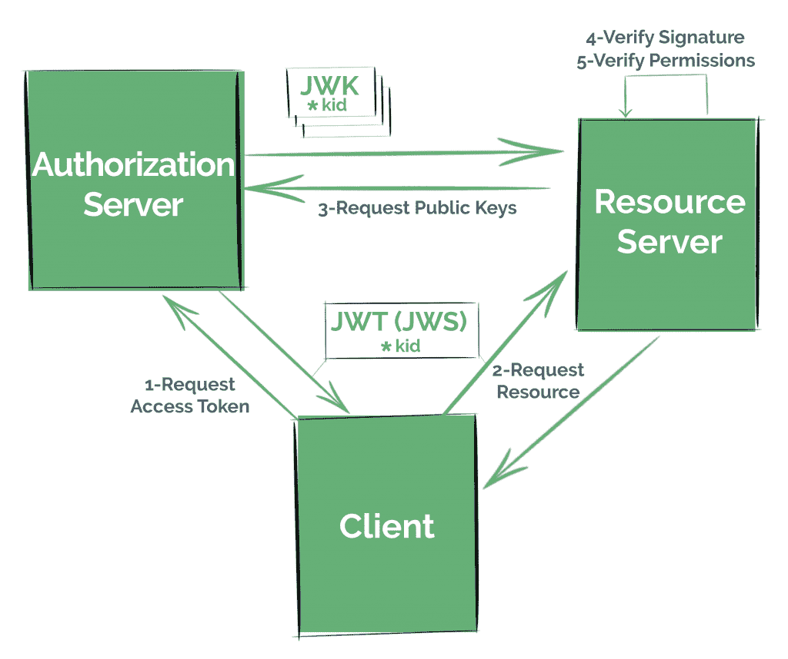

# Spring Security OAuth2 应用程序中的 JWS + JWK

> 原文:[https://web . archive . org/web/20220930061024/https://www . bael dung . com/spring-security-oauth 2-jws-jwk](https://web.archive.org/web/20220930061024/https://www.baeldung.com/spring-security-oauth2-jws-jwk)

## 1.概观

在本教程中，我们将了解 JSON Web Signature (JWS ),以及如何在配置了 Spring Security OAuth2 的应用程序上使用 JSON Web Key (JWK)规范来实现它。

我们应该记住，尽管 [Spring 正在努力将所有的 Spring Security OAuth 特性迁移到 Spring Security framework](https://web.archive.org/web/20220630125936/https://github.com/spring-projects/spring-security/wiki/OAuth-2.0-Features-Matrix#frequently-asked-questions) 上，但是本指南仍然是理解这些规范的基本概念的一个很好的起点，并且在任何框架上实现它们的时候都会派上用场。

首先，我们将尝试理解基本概念；比如什么是 JWS 和 JWK，它们的目的以及我们如何轻松地配置资源服务器来使用这个 OAuth 解决方案。

然后我们会更深入，我们会通过分析 OAuth2 Boot 在幕后做什么，以及通过设置授权服务器来使用 JWK，来详细分析规范。

## 2.了解 JWS 和 JWK 的整体情况

[](/web/20220630125936/https://www.baeldung.com/wp-content/uploads/2019/07/bael-1239-image-simple-1-1024x858.png)

开始之前，正确理解一些基本概念很重要。建议先浏览一下我们的 [OAuth](/web/20220630125936/https://www.baeldung.com/rest-api-spring-oauth2-angular) 和 [JWT](/web/20220630125936/https://www.baeldung.com/spring-security-oauth-jwt) 的文章，因为这些话题不属于本教程的范围。

[JWS](https://web.archive.org/web/20220630125936/https://tools.ietf.org/html/rfc7515) 是 IETF 创建的规范，**描述了不同的密码机制来验证数据**的完整性，即 [JSON Web Token (JWT)](https://web.archive.org/web/20220630125936/https://tools.ietf.org/html/rfc7519) 中的数据。它定义了一个 JSON 结构，其中包含这样做所必需的信息。

这是广泛使用的 JWT 规范中的一个关键方面，因为声明需要签名或加密才能被认为是有效安全的。

在第一种情况下，JWT 被表示为 JWS。如果加密了，JWT 将被编码成 JSON 网络加密(JWE)结构。

使用 OAuth 时最常见的场景是刚刚签署了 jwt。这是因为我们通常不需要“隐藏”信息，而只是简单地验证数据的完整性。

当然，无论我们处理的是签名的还是加密的 jwt，我们都需要正式的指南来有效地传输公钥。

这就是[JWK](https://web.archive.org/web/20220630125936/https://tools.ietf.org/html/rfc7517)的目的，它是一个 JSON 结构，代表一个加密密钥，也是由 IETF 定义的。

许多认证提供者提供一个“JWK Set”端点，也在规范中定义。有了它，其他应用程序可以找到关于公钥的信息来处理 jwt。

例如，资源服务器使用 JWT 中的`kid`(密钥 Id)字段在 JWK 集合中查找正确的密钥。

### 2.1.使用 JWK 实现解决方案

通常，如果我们希望我们的应用程序以安全的方式提供资源，比如使用 OAuth 2.0 这样的标准安全协议，我们需要遵循以下步骤:

1.  在授权服务器上注册客户——可以是我们自己的服务，也可以是 Okta、脸书或 Github 等知名提供商的服务
2.  这些客户端将按照我们可能配置的任何 OAuth 策略，从授权服务器请求一个访问令牌
3.  然后，他们将尝试访问向资源服务器提供令牌(在本例中，作为 JWT)的资源
4.  **资源服务器必须通过检查其签名**来验证令牌未被操纵，并验证其声明
5.  最后，我们的资源服务器检索资源，现在确保客户机拥有正确的权限

## 3.JWK 和资源服务器配置

稍后，我们将看到如何设置我们自己的授权服务器来服务 jwt 和一个“JWK Set”端点。

不过，在这一点上，我们将把重点放在最简单的——可能也是最常见的——场景上，我们指向一个现有的授权服务器。

我们所要做的就是指出服务必须如何验证它收到的访问令牌，比如它应该使用什么公钥来验证 JWT 的签名。

我们将使用 [Spring Security OAuth 的 Autoconfig](https://web.archive.org/web/20220630125936/https://docs.spring.io/spring-security-oauth2-boot/docs/current/reference/html5/#boot-features-security-oauth2-resource-server) 特性，以简单明了的方式实现这一点，只使用应用程序属性。

### 3.1.Maven 依赖性

我们需要将 OAuth2 自动配置依赖项添加到 Spring 应用程序的 pom 文件中:

```
<dependency>
    <groupId>org.springframework.security.oauth.boot</groupId>
    <artifactId>spring-security-oauth2-autoconfigure</artifactId>
    <version>2.1.6.RELEASE</version>
</dependency>
```

像往常一样，我们可以在 [Maven Central](https://web.archive.org/web/20220630125936/https://search.maven.org/search?q=a:spring-security-oauth2-autoconfigure) 查看神器的最新版本。

注意，这个依赖项不是由 Spring Boot 管理的，因此我们需要指定它的版本。

它应该与我们正在使用的 Spring Boot 版本相匹配。

### 3.2.配置资源服务器

接下来，我们必须用`@EnableResourceServer`注释来启用应用程序中的资源服务器特性:

```
@SpringBootApplication
@EnableResourceServer
public class ResourceServerApplication {

    public static void main(String[] args) {
        SpringApplication.run(ResourceServerApplication.class, args);
    }
}
```

现在，我们需要指出我们的应用程序如何获得验证 jwt 签名所必需的公钥，jwt 是作为不记名令牌接收的。

OAuth2 引导提供了不同的策略来验证令牌。

正如我们之前所说的，**大多数授权服务器公开一个 URI，其中包含一组其他服务可以用来验证签名的密钥。**

我们将配置本地授权服务器的 JWK Set 端点，我们将在后面继续工作。

让我们在`application.properties`中添加以下内容:

```
security.oauth2.resource.jwk.key-set-uri=
  http://localhost:8081/sso-auth-server/.well-known/jwks.json
```

当我们详细分析这个主题时，我们将看看其他策略。

**注意**:新的 Spring Security 5.1 资源服务器只支持 JWK 签名的 jwt 作为授权，Spring Boot 也提供了非常相似的属性来配置 JWK Set 端点:

```
spring.security.oauth2.resourceserver.jwk-set-uri=
  http://localhost:8081/sso-auth-server/.well-known/jwks.json
```

### 3.3.引擎盖下的弹簧配置

我们之前添加的属性转化为几个 Spring beans 的创建。

更准确地说，OAuth2 引导将创建:

*   唯一能够解码 JWT 并验证其签名的人
*   一个`DefaultTokenServices `实例使用前一个`TokenStore`

## 4.授权服务器中的 JWK 设置端点

现在我们将更深入地讨论这个主题，在我们配置一个发布 jwt 并为其 JWK Set 端点提供服务的授权服务器时，分析 JWK 和 JWS 的一些关键方面。

注意，由于 Spring Security 还没有提供设置授权服务器的特性，所以使用 Spring Security OAuth 功能创建一个授权服务器是这个阶段唯一的选择。不过，它将与 Spring 安全资源服务器兼容。

### 4.1.启用授权服务器功能

第一步是配置我们的授权服务器，以便在需要时发布访问令牌。

我们还将添加`spring-security-oauth2-autoconfigure `依赖项，就像我们对资源服务器所做的那样。

首先，我们将使用`@EnableAuthorizationServer `注释来配置 OAuth2 授权服务器机制:

```
@Configuration
@EnableAuthorizationServer
public class JwkAuthorizationServerConfiguration {

    // ...

}
```

我们将使用属性注册一个 OAuth 2.0 客户端:

```
security.oauth2.client.client-id=bael-client
security.oauth2.client.client-secret=bael-secret
```

这样，我们的应用程序将在收到相应凭证请求时检索随机令牌:

```
curl bael-client:bael-secret\
  @localhost:8081/sso-auth-server/oauth/token \
  -d grant_type=client_credentials \
  -d scope=any
```

正如我们所看到的，Spring Security OAuth **默认情况下检索一个随机的字符串值，而不是 JWT 编码的:**

```
"access_token": "af611028-643f-4477-9319-b5aa8dc9408f"
```

### 4.2.发布 jwt

我们可以通过在上下文中创建一个`JwtAccessTokenConverter` bean 来轻松地改变这一点:

```
@Bean
public JwtAccessTokenConverter accessTokenConverter() {
    return new JwtAccessTokenConverter();
}
```

并在一个`JwtTokenStore`实例中使用它:

```
@Bean
public TokenStore tokenStore() {
    return new JwtTokenStore(accessTokenConverter());
}
```

因此，随着这些变化，让我们请求一个新的访问令牌，这次我们将获得一个 JWT，准确地说是编码为 JWS。

我们可以很容易地识别 JWSs 它们的结构由三个字段(报头、有效载荷和签名)组成，用点分隔:

```
"access_token":"eyJhbGciOiJIUzI1NiIsInR5cCI6IkpXVCJ9
  .
  eyJzY29wZSI6WyJhbnkiXSwiZXhwIjoxNTYxOTcy...
  .
  XKH70VUHeafHLaUPVXZI9E9pbFxrJ35PqBvrymxtvGI"
```

默认情况下，Spring 使用消息认证码(MAC)方法对报头和有效载荷进行签名。

我们可以通过在众多 [JWT 解码器/验证器在线工具](https://web.archive.org/web/20220630125936/https://kjur.github.io/jsrsasign/tool/tool_jwtveri.html)中分析 JWT 来验证这一点。

如果我们对获得的 JWT 进行解码，我们会看到`alg`属性的值是`HS256`，这表明使用了一种`HMAC-SHA256`算法来对令牌进行签名。

为了理解为什么这种方法不需要 JWKs，我们必须理解 MAC 散列函数是如何工作的。

### 4.3.默认对称签名

MAC 哈希使用相同的密钥对消息进行签名并验证其完整性；这是一个对称散列函数。

因此，出于安全目的，应用程序不能公开共享其签名密钥。

仅出于学术原因，我们将公开 Spring Security OAuth `/oauth/token_key` 端点:

```
security.oauth2.authorization.token-key-access=permitAll()
```

我们将在配置`JwtAccessTokenConverter ` bean 时定制签名密钥值:

```
converter.setSigningKey("bael");
```

确切地知道使用的是哪一个对称密钥。

注意:即使我们不发布签名密钥，设置弱签名密钥也是字典攻击的潜在威胁。

一旦我们知道了签名密钥，我们就可以使用前面提到的在线工具手动验证令牌的完整性。

Spring Security OAuth 库还配置了一个`/oauth/check_token`端点，用于验证和检索解码后的 JWT。

这个端点也配置了一个`denyAll()` 访问规则，应该有意识地保护它。为此，我们可以像之前对令牌密钥那样使用`security.oauth2.authorization.check-token-access `属性。

### 4.4.资源服务器配置的替代方案

根据我们的安全需求，我们可能认为适当地保护最近提到的一个端点——同时使它们可以被资源服务器访问——就足够了。

如果是这种情况，那么我们可以让授权服务器保持原样，并为资源服务器选择另一种方法。

资源服务器希望授权服务器有安全的端点，所以首先，我们需要提供客户端凭证，以及我们在授权服务器中使用的相同属性:

```
security.oauth2.client.client-id=bael-client
security.oauth2.client.client-secret=bael-secret
```

然后我们可以选择使用`/oauth/check_token`端点(也称为自省端点)或者从`/oauth/token_key`获得一个单独的密钥:

```
## Single key URI:
security.oauth2.resource.jwt.key-uri=
  http://localhost:8081/sso-auth-server/oauth/token_key
## Introspection endpoint:
security.oauth2.resource.token-info-uri=
  http://localhost:8081/sso-auth-server/oauth/check_token
```

或者，我们可以只配置将用于验证资源服务中令牌的密钥:

```
## Verifier Key
security.oauth2.resource.jwt.key-value=bael
```

使用这种方法，将不会与授权服务器进行交互，但是当然，这意味着令牌签名配置更改的灵活性降低。

与密钥 URI 策略一样，最后一种方法可能只适用于非对称签名算法。

### 4.5.创建密钥库文件

让我们不要忘记我们的最终目标。我们希望像大多数知名的提供者一样提供一个 JWK Set 端点。

如果我们要共享密钥，最好使用非对称加密(特别是数字签名算法)来签署令牌。

第一步是创建一个密钥库文件。

实现这一点的一个简单方法是:

1.  在您手边的任何 JDK 或 JRE 的`/bin`目录中打开命令行:

```
cd $JAVA_HOME/bin
```

2.  使用相应的参数运行`keytool`命令:

```
./keytool -genkeypair \
  -alias bael-oauth-jwt \
  -keyalg RSA \
  -keypass bael-pass \
  -keystore bael-jwt.jks \
  -storepass bael-pass
```

请注意，我们在这里使用了 RSA 算法，这是不对称的。

3.  回答交互式问题并生成密钥库文件

### 4.6.向我们的应用程序添加密钥库文件

我们必须将密钥库添加到我们的项目资源中。

这是一个简单的任务，但是请记住这是一个二进制文件。这意味着它不能被[过滤](https://web.archive.org/web/20220630125936/https://maven.apache.org/plugins/maven-resources-plugin/examples/filter.html)，否则它会被破坏。

如果我们使用 Maven，一个替代方法是将文本文件放在一个单独的文件夹中，并相应地配置`pom.xml`:

```
<build>
    <resources>
        <resource>
            <directory>src/main/resources</directory>
            <filtering>false</filtering>
        </resource>
        <resource>
            <directory>src/main/resources/filtered</directory>
            <filtering>true</filtering>
        </resource>
    </resources>
</build>
```

### 4.7.配置`TokenStore`

下一步是用密钥对配置我们的`TokenStore`;私有者签署令牌，公共者验证完整性。

我们将使用类路径中的密钥库文件创建一个`KeyPair `实例，以及创建`.jks` 文件时使用的参数:

```
ClassPathResource ksFile =
  new ClassPathResource("bael-jwt.jks");
KeyStoreKeyFactory ksFactory =
  new KeyStoreKeyFactory(ksFile, "bael-pass".toCharArray());
KeyPair keyPair = ksFactory.getKeyPair("bael-oauth-jwt");
```

我们将在我们的`JwtAccessTokenConverter` bean 中配置它，删除任何其他配置:

```
converter.setKeyPair(keyPair);
```

我们可以再次请求并解码 JWT，以检查`alg`参数是否改变。

如果我们看一下令牌密钥端点，我们将看到从密钥库中获得的公钥。

通过 [PEM](https://web.archive.org/web/20220630125936/https://tools.ietf.org/html/rfc1421) “封装边界”报头很容易识别；以`—–BEGIN PUBLIC KEY—–``.`开头的字符串

### 4.8.JWK 设置端点依赖关系

**Spring Security OAuth 库不支持 JWK 开箱即用。**

因此，我们需要向我们的项目添加另一个依赖项，`nimbus-jose-jwt`,它提供了一些基本的 JWK 实现:

```
<dependency>
    <groupId>com.nimbusds</groupId>
    <artifactId>nimbus-jose-jwt</artifactId>
    <version>7.3</version>
</dependency>
```

记住，我们可以使用 Maven 中央存储库搜索引擎来检查库的最新版本。

### 4.9.创建 JWK 集端点

让我们从使用之前配置的`KeyPair`实例创建一个`JWKSet` bean 开始:

```
@Bean
public JWKSet jwkSet() {
    RSAKey.Builder builder = new RSAKey.Builder((RSAPublicKey) keyPair().getPublic())
      .keyUse(KeyUse.SIGNATURE)
      .algorithm(JWSAlgorithm.RS256)
      .keyID("bael-key-id");
    return new JWKSet(builder.build());
}
```

现在创建端点非常简单:

```
@RestController
public class JwkSetRestController {

    @Autowired
    private JWKSet jwkSet;

    @GetMapping("/.well-known/jwks.json")
    public Map<String, Object> keys() {
        return this.jwkSet.toJSONObject();
    }
}
```

我们在`JWKSet `实例中配置的键 Id 字段转化为`kid`参数。

**这个`kid`是关键字**的任意别名，它通常被资源服务器用来**从集合**中选择正确的条目，因为同一个关键字应该**包含在 JWT 报头中。**

我们现在面临一个新问题；由于 Spring Security OAuth 不支持 JWK，发出的 jwt 不会包含`kid`头。

让我们找到一个变通办法来解决这个问题。

### 4.10.将`kid`值添加到 JWT 报头

我们将创建一个新的`class` ,扩展我们一直在使用的`JwtAccessTokenConverter `,并允许向 jwt 添加头条目:

```
public class JwtCustomHeadersAccessTokenConverter
  extends JwtAccessTokenConverter {

    // ...

}
```

首先，我们需要:

*   像我们一直做的那样配置父类，设置我们配置的`KeyPair`
*   从密钥库中获取一个使用私钥的`Signer`对象
*   当然，我们想要添加到结构中的自定义标题的集合

让我们在此基础上配置构造函数:

```
private Map<String, String> customHeaders = new HashMap<>();
final RsaSigner signer;

public JwtCustomHeadersAccessTokenConverter(
  Map<String, String> customHeaders,
  KeyPair keyPair) {
    super();
    super.setKeyPair(keyPair);
    this.signer = new RsaSigner((RSAPrivateKey) keyPair.getPrivate());
    this.customHeaders = customHeaders;
}
```

现在我们将覆盖`encode `方法。我们的实现将与父实现相同，唯一的区别是我们在创建`String`令牌时也将传递自定义头:

```
private JsonParser objectMapper = JsonParserFactory.create();

@Override
protected String encode(OAuth2AccessToken accessToken,
  OAuth2Authentication authentication) {
    String content;
    try {
        content = this.objectMapper
          .formatMap(getAccessTokenConverter()
          .convertAccessToken(accessToken, authentication));
    } catch (Exception ex) {
        throw new IllegalStateException(
          "Cannot convert access token to JSON", ex);
    }
    String token = JwtHelper.encode(
      content,
      this.signer,
      this.customHeaders).getEncoded();
    return token;
}
```

现在让我们在创建`JwtAccessTokenConverter` bean 时使用这个类:

```
@Bean
public JwtAccessTokenConverter accessTokenConverter() {
    Map<String, String> customHeaders =
      Collections.singletonMap("kid", "bael-key-id");
    return new  JwtCustomHeadersAccessTokenConverter(
      customHeaders,
      keyPair());
}
```

我们准备好出发了。记得将资源服务器的属性改回来。我们只需要使用我们在教程开始时设置的`key-set-uri` 属性。

我们可以请求一个访问令牌，检查它的`kid`值，并使用它来请求一个资源。

一旦检索到公钥，资源服务器就将它存储在内部，并将其映射到密钥 Id 以备将来的请求。

## 5.结论

在这本关于 JWT、JWS 和 JWK 的综合指南中，我们学到了很多。不仅仅是特定于 Spring 的配置，还有一般的安全概念，通过一个实际的例子来看它们。

我们已经看到了使用 JWK Set 端点处理 jwt 的资源服务器的基本配置。

最后，我们扩展了基本的 Spring 安全 OAuth 特性，通过设置一个授权服务器来有效地公开 JWK Set 端点。

一如既往，我们可以在 OAuth Github repo 中找到这两个服务。