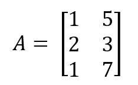
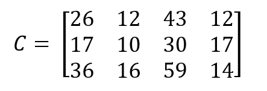
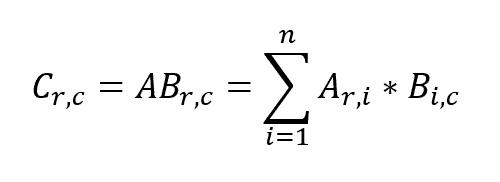

# Java 中的矩阵乘法

> 原文：<https://web.archive.org/web/20220930061024/https://www.baeldung.com/java-matrix-multiplication>

## 1.概观

在本教程中，我们将看看如何在 Java 中将两个矩阵相乘。

由于矩阵的概念在语言中并不存在，我们将自己实现它，我们还将与一些库合作，看看它们是如何处理矩阵乘法的。

最后，我们将对我们探索的不同解决方案进行一些基准测试，以确定最快的解决方案。

## 2.这个例子

让我们从设置一个例子开始，我们将在整个教程中引用这个例子。

首先，我们将想象一个 3×2 矩阵:

[](/web/20221206031235/https://www.baeldung.com/wp-content/uploads/2019/07/firstMatrix-1.png)

现在让我们想象第二个矩阵，这次是两行四列:

[](/web/20221206031235/https://www.baeldung.com/wp-content/uploads/2019/07/secondMatrux-1.png)

然后，将第一个矩阵乘以第二个矩阵，这将产生 3×4 矩阵:

[](/web/20221206031235/https://www.baeldung.com/wp-content/uploads/2019/07/multiplicatedMatrix-1.png)

提醒一下，**这个结果是通过用公式**计算结果矩阵的每个单元得到的:

[](/web/20221206031235/https://www.baeldung.com/wp-content/uploads/2019/07/multiplicationAlgorithm-1.png)

其中`r`是矩阵`A`的行数，`c `是矩阵`B`的列数，`n`是矩阵`A`的列数，必须与矩阵`B`的行数相匹配。

## 3.矩阵乘法

### 3.1.自己的实现

让我们从我们自己的矩阵实现开始。

我们将保持简单，只使用二维数组:

```
double[][] firstMatrix = {
  new double[]{1d, 5d},
  new double[]{2d, 3d},
  new double[]{1d, 7d}
};

double[][] secondMatrix = {
  new double[]{1d, 2d, 3d, 7d},
  new double[]{5d, 2d, 8d, 1d}
};
```

这是我们例子中的两个矩阵。让我们创建一个预期的乘法结果:

```
double[][] expected = {
  new double[]{26d, 12d, 43d, 12d},
  new double[]{17d, 10d, 30d, 17d},
  new double[]{36d, 16d, 59d, 14d}
};
```

现在一切都设置好了，让我们实现乘法算法。**我们将首先创建一个空的结果数组，并遍历它的单元格来存储每个单元格中的预期值:**

```
double[][] multiplyMatrices(double[][] firstMatrix, double[][] secondMatrix) {
    double[][] result = new double[firstMatrix.length][secondMatrix[0].length];

    for (int row = 0; row < result.length; row++) {
        for (int col = 0; col < result[row].length; col++) {
            result[row][col] = multiplyMatricesCell(firstMatrix, secondMatrix, row, col);
        }
    }

    return result;
}
```

最后，让我们实现单个单元格的计算。为了实现这一点，**我们将使用之前在示例**的演示中显示的公式:

```
double multiplyMatricesCell(double[][] firstMatrix, double[][] secondMatrix, int row, int col) {
    double cell = 0;
    for (int i = 0; i < secondMatrix.length; i++) {
        cell += firstMatrix[row][i] * secondMatrix[i][col];
    }
    return cell;
}
```

最后，让我们检查算法的结果是否与我们的预期结果相匹配:

```
double[][] actual = multiplyMatrices(firstMatrix, secondMatrix);
assertThat(actual).isEqualTo(expected);
```

### 3.2.EJML

我们要看的第一个库是 EJML，它代表[高效 Java 矩阵库](https://web.archive.org/web/20221206031235/http://ejml.org/wiki/index.php?title=Main_Page)。在写这篇教程的时候，它是最近更新的 Java 矩阵库之一**。其目的是在计算和内存使用方面尽可能高效。**

我们必须将[依赖项添加到我们的`pom.xml`中的库](https://web.archive.org/web/20221206031235/https://search.maven.org/search?q=g:org.ejml%20AND%20a:ejml-all):

```
<dependency>
    <groupId>org.ejml</groupId>
    <artifactId>ejml-all</artifactId>
    <version>0.38</version>
</dependency>
```

我们将使用与之前几乎相同的模式:根据我们的示例创建两个矩阵，并检查它们相乘的结果是否是我们之前计算的结果。

因此，让我们使用 EJML 创建矩阵。为了实现这一点，**我们将使用库**提供的`SimpleMatrix`类。

它可以接受一个二维`double`数组作为其构造函数的输入:

```
SimpleMatrix firstMatrix = new SimpleMatrix(
  new double[][] {
    new double[] {1d, 5d},
    new double[] {2d, 3d},
    new double[] {1d ,7d}
  }
);

SimpleMatrix secondMatrix = new SimpleMatrix(
  new double[][] {
    new double[] {1d, 2d, 3d, 7d},
    new double[] {5d, 2d, 8d, 1d}
  }
);
```

现在，让我们定义乘法的预期矩阵:

```
SimpleMatrix expected = new SimpleMatrix(
  new double[][] {
    new double[] {26d, 12d, 43d, 12d},
    new double[] {17d, 10d, 30d, 17d},
    new double[] {36d, 16d, 59d, 14d}
  }
);
```

现在我们都设置好了，让我们看看如何将两个矩阵相乘。**`SimpleMatrix`类提供了一个`mult()`方法**，将另一个`SimpleMatrix`作为参数，返回两个矩阵的乘积:

```
SimpleMatrix actual = firstMatrix.mult(secondMatrix);
```

让我们检查一下获得的结果是否与预期的相匹配。

由于`SimpleMatrix`没有覆盖`equals()`方法，我们不能依赖它来做验证。但是，**提供了一个替代方案:`isIdentical()`方法**，它不仅采用了另一个矩阵参数，还采用了一个`double`容错参数，以忽略由于双精度导致的微小差异:

```
assertThat(actual).matches(m -> m.isIdentical(expected, 0d));
```

这就结束了 EJML 库的矩阵乘法。让我们看看其他公司提供什么。

### 3.3.ND4J

现在让我们试试 [ND4J 库](https://web.archive.org/web/20221206031235/https://deeplearning4j.konduit.ai/nd4j/tutorials/quickstart)。ND4J 是一个计算库，是 [deeplearning4j](https://web.archive.org/web/20221206031235/https://deeplearning4j.konduit.ai/) 项目的一部分。除此之外，ND4J 还提供了矩阵计算特性。

首先，我们必须得到[库依赖关系](https://web.archive.org/web/20221206031235/https://search.maven.org/search?q=g:org.nd4j%20AND%20a:nd4j-native):

```
<dependency>
    <groupId>org.nd4j</groupId>
    <artifactId>nd4j-native</artifactId>
    <version>1.0.0-beta4</version>
</dependency>
```

请注意，我们在这里使用的是测试版，因为 GA 版本似乎有一些错误。

为了简洁起见，我们不会重写二维`double` 数组，而只关注它们如何与每个库一起使用。因此，对于 ND4J，我们必须创建一个`INDArray`。为了做到这一点，**我们将调用`Nd4j.create()`工厂方法，并传递给它一个代表我们的矩阵**的`double` 数组:

```
INDArray matrix = Nd4j.create(/* a two dimensions double array */);
```

和上一节一样，我们将创建三个矩阵:两个要相乘，一个是预期结果。

之后，我们想要使用`INDArray.mmul()` 方法实际执行前两个矩阵之间的乘法:

```
INDArray actual = firstMatrix.mmul(secondMatrix);
```

然后，我们再次检查实际结果是否与预期结果相匹配。这一次我们可以依靠等式检查:

```
assertThat(actual).isEqualTo(expected);
```

这演示了如何使用 ND4J 库进行矩阵计算。

### 3.4 .Apache common(Apache 公共)

现在让我们来谈谈 [Apache Commons Math3 模块](https://web.archive.org/web/20221206031235/https://commons.apache.org/proper/commons-math/)，它为我们提供了包括矩阵操作在内的数学计算。

同样，我们必须在我们的`pom.xml`中指定[依赖关系](https://web.archive.org/web/20221206031235/https://search.maven.org/search?q=g:org.apache.commons%20AND%20a:commons-math3):

```
<dependency>
    <groupId>org.apache.commons</groupId>
    <artifactId>commons-math3</artifactId>
    <version>3.6.1</version>
</dependency>
```

一旦设置好，我们就可以使用**`RealMatrix`接口及其`Array2DRowRealMatrix`实现**来创建我们常用的矩阵。实现类的构造函数将一个二维的`double` 数组作为它的参数:

```
RealMatrix matrix = new Array2DRowRealMatrix(/* a two dimensions double array */);
```

对于矩阵乘法，**`RealMatrix`接口提供了一个`multiply()`方法**带另一个`RealMatrix`参数:

```
RealMatrix actual = firstMatrix.multiply(secondMatrix);
```

我们最终可以验证结果是否与我们期望的一样:

```
assertThat(actual).isEqualTo(expected);
```

让我们看看下一个图书馆！

### 3.5.LA4J

这个被命名为 LA4J，代表 Java 的线性代数。

让我们也为这个添加依赖关系:

```
<dependency>
    <groupId>org.la4j</groupId>
    <artifactId>la4j</artifactId>
    <version>0.6.0</version>
</dependency>
```

现在，LA4J 的工作方式与其他库非常相似。**它提供了一个带有`Basic2DMatrix`实现**的`Matrix`接口，该接口将一个二维`double` 数组作为输入:

```
Matrix matrix = new Basic2DMatrix(/* a two dimensions double array */);
```

正如在 Apache Commons Math3 模块中一样，**的乘法方法是`multiply()`** ，并以另一个`Matrix` 作为其参数:

```
Matrix actual = firstMatrix.multiply(secondMatrix);
```

我们可以再次检查结果是否符合我们的预期:

```
assertThat(actual).isEqualTo(expected);
```

现在让我们看看最后一个库:Colt。

### 3.6.未阉割的小雄马

[Colt](https://web.archive.org/web/20221206031235/https://dst.lbl.gov/ACSSoftware/colt/) 是 CERN 开发的一个库。它提供支持高性能科学和技术计算的功能。

和前面的库一样，我们必须让[拥有正确的依赖关系](https://web.archive.org/web/20221206031235/https://search.maven.org/search?q=g:colt%20AND%20a:colt):

```
<dependency>
    <groupId>colt</groupId>
    <artifactId>colt</artifactId>
    <version>1.2.0</version>
</dependency>
```

为了用 Colt，**创建矩阵，我们必须利用`DoubleFactory2D class`** 。它有三个工厂实例:`dense, sparse`和`rowCompressed`。每种方法都经过优化，以创建匹配的矩阵。

出于我们的目的，我们将使用`dense` 实例。这一次，**调用的方法是`make()`** ，它再次使用二维的`double array`，产生一个`DoubleMatrix2D`对象:

```
DoubleMatrix2D matrix = doubleFactory2D.make(/* a two dimensions double array */);
```

一旦我们的矩阵被实例化，我们就要把它们相乘。这一次，matrix 对象上没有这样做的方法。我们已经创建了一个 **`Algebra`类的实例，它有一个`mult()`方法**，接受两个矩阵作为参数:

```
Algebra algebra = new Algebra();
DoubleMatrix2D actual = algebra.mult(firstMatrix, secondMatrix);
```

然后，我们可以将实际结果与预期结果进行比较:

```
assertThat(actual).isEqualTo(expected);
```

## 4.标杆管理

既然我们已经探索完了矩阵乘法的不同可能性，让我们来看看哪一种是性能最好的。

### 4.1.小矩阵

让我们从小矩阵开始。这里，一个 3×2 矩阵和一个 2×4 矩阵。

**为了实施性能测试，我们将使用**[**【JMH】标杆库**](/web/20221206031235/https://www.baeldung.com/java-microbenchmark-harness) 。让我们用以下选项配置一个基准测试类:

```
public static void main(String[] args) throws Exception {
    Options opt = new OptionsBuilder()
      .include(MatrixMultiplicationBenchmarking.class.getSimpleName())
      .mode(Mode.AverageTime)
      .forks(2)
      .warmupIterations(5)
      .measurementIterations(10)
      .timeUnit(TimeUnit.MICROSECONDS)
      .build();

    new Runner(opt).run();
}
```

这样，JMH 将对每个用`@Benchmark`标注的方法进行两次完整的运行，每次运行五次预热迭代(不考虑平均计算)和十次测量迭代。至于测量，它将收集不同库的平均执行时间，以微秒计。

然后，我们必须创建一个包含数组的状态对象:

```
@State(Scope.Benchmark)
public class MatrixProvider {
    private double[][] firstMatrix;
    private double[][] secondMatrix;

    public MatrixProvider() {
        firstMatrix =
          new double[][] {
            new double[] {1d, 5d},
            new double[] {2d, 3d},
            new double[] {1d ,7d}
          };

        secondMatrix =
          new double[][] {
            new double[] {1d, 2d, 3d, 7d},
            new double[] {5d, 2d, 8d, 1d}
          };
    }
}
```

这样，我们可以确保阵列初始化不是基准测试的一部分。之后，我们仍然需要创建执行矩阵乘法的方法，使用`MatrixProvider`对象作为数据源。我们不会在这里重复代码，因为我们在前面已经看到了每个库。

最后，我们将使用我们的`main` 方法运行基准测试流程。这给了我们以下结果:

```
Benchmark                                                           Mode  Cnt   Score   Error  Units
MatrixMultiplicationBenchmarking.apacheCommonsMatrixMultiplication  avgt   20   1,008 ± 0,032  us/op
MatrixMultiplicationBenchmarking.coltMatrixMultiplication           avgt   20   0,219 ± 0,014  us/op
MatrixMultiplicationBenchmarking.ejmlMatrixMultiplication           avgt   20   0,226 ± 0,013  us/op
MatrixMultiplicationBenchmarking.homemadeMatrixMultiplication       avgt   20   0,389 ± 0,045  us/op
MatrixMultiplicationBenchmarking.la4jMatrixMultiplication           avgt   20   0,427 ± 0,016  us/op
MatrixMultiplicationBenchmarking.nd4jMatrixMultiplication           avgt   20  12,670 ± 2,582  us/op
```

正如我们所见， **`EJML`和`Colt`的性能非常好，每操作大约五分之一微秒，而`ND4j`的性能稍差，每操作十微秒多一点**。其他图书馆的表演介于两者之间。

另外，值得注意的是，当预热迭代次数从 5 次增加到 10 次时，所有库的性能都会提高。

### 4.2.大型矩阵

现在，如果我们采用更大的矩阵，比如 3000×3000，会发生什么？为了检查发生了什么，让我们首先创建另一个 state 类，提供该大小的生成矩阵:

```
@State(Scope.Benchmark)
public class BigMatrixProvider {
    private double[][] firstMatrix;
    private double[][] secondMatrix;

    public BigMatrixProvider() {}

    @Setup
    public void setup(BenchmarkParams parameters) {
        firstMatrix = createMatrix();
        secondMatrix = createMatrix();
    }

    private double[][] createMatrix() {
        Random random = new Random();

        double[][] result = new double[3000][3000];
        for (int row = 0; row < result.length; row++) {
            for (int col = 0; col < result[row].length; col++) {
                result[row][col] = random.nextDouble();
            }
        }
        return result;
    }
}
```

如我们所见，我们将创建 3000×3000 个二维双数组，用随机实数填充。

现在让我们创建基准测试类:

```
public class BigMatrixMultiplicationBenchmarking {
    public static void main(String[] args) throws Exception {
        Map<String, String> parameters = parseParameters(args);

        ChainedOptionsBuilder builder = new OptionsBuilder()
          .include(BigMatrixMultiplicationBenchmarking.class.getSimpleName())
          .mode(Mode.AverageTime)
          .forks(2)
          .warmupIterations(10)
          .measurementIterations(10)
          .timeUnit(TimeUnit.SECONDS);

        new Runner(builder.build()).run();
    }

    @Benchmark
    public Object homemadeMatrixMultiplication(BigMatrixProvider matrixProvider) {
        return HomemadeMatrix
          .multiplyMatrices(matrixProvider.getFirstMatrix(), matrixProvider.getSecondMatrix());
    }

    @Benchmark
    public Object ejmlMatrixMultiplication(BigMatrixProvider matrixProvider) {
        SimpleMatrix firstMatrix = new SimpleMatrix(matrixProvider.getFirstMatrix());
        SimpleMatrix secondMatrix = new SimpleMatrix(matrixProvider.getSecondMatrix());

        return firstMatrix.mult(secondMatrix);
    }

    @Benchmark
    public Object apacheCommonsMatrixMultiplication(BigMatrixProvider matrixProvider) {
        RealMatrix firstMatrix = new Array2DRowRealMatrix(matrixProvider.getFirstMatrix());
        RealMatrix secondMatrix = new Array2DRowRealMatrix(matrixProvider.getSecondMatrix());

        return firstMatrix.multiply(secondMatrix);
    }

    @Benchmark
    public Object la4jMatrixMultiplication(BigMatrixProvider matrixProvider) {
        Matrix firstMatrix = new Basic2DMatrix(matrixProvider.getFirstMatrix());
        Matrix secondMatrix = new Basic2DMatrix(matrixProvider.getSecondMatrix());

        return firstMatrix.multiply(secondMatrix);
    }

    @Benchmark
    public Object nd4jMatrixMultiplication(BigMatrixProvider matrixProvider) {
        INDArray firstMatrix = Nd4j.create(matrixProvider.getFirstMatrix());
        INDArray secondMatrix = Nd4j.create(matrixProvider.getSecondMatrix());

        return firstMatrix.mmul(secondMatrix);
    }

    @Benchmark
    public Object coltMatrixMultiplication(BigMatrixProvider matrixProvider) {
        DoubleFactory2D doubleFactory2D = DoubleFactory2D.dense;

        DoubleMatrix2D firstMatrix = doubleFactory2D.make(matrixProvider.getFirstMatrix());
        DoubleMatrix2D secondMatrix = doubleFactory2D.make(matrixProvider.getSecondMatrix());

        Algebra algebra = new Algebra();
        return algebra.mult(firstMatrix, secondMatrix);
    }
}
```

当我们运行该基准测试时，我们获得了完全不同的结果:

```
Benchmark                                                              Mode  Cnt    Score    Error  Units
BigMatrixMultiplicationBenchmarking.apacheCommonsMatrixMultiplication  avgt   20  511.140 ± 13.535   s/op
BigMatrixMultiplicationBenchmarking.coltMatrixMultiplication           avgt   20  197.914 ±  2.453   s/op
BigMatrixMultiplicationBenchmarking.ejmlMatrixMultiplication           avgt   20   25.830 ±  0.059   s/op
BigMatrixMultiplicationBenchmarking.homemadeMatrixMultiplication       avgt   20  497.493 ±  2.121   s/op
BigMatrixMultiplicationBenchmarking.la4jMatrixMultiplication           avgt   20   35.523 ±  0.102   s/op
BigMatrixMultiplicationBenchmarking.nd4jMatrixMultiplication           avgt   20    0.548 ±  0.006   s/op
```

正如我们所看到的，自制的实现和 Apache 库现在比以前差多了，执行两个矩阵的乘法需要将近 10 分钟。

柯尔特花了 3 分多一点，这是更好的，但仍然很长。EJML 和 LA4J 的表现非常好，它们的运行时间接近 30 秒。**但是，是 ND4J 在 [CPU 后端](https://web.archive.org/web/20221206031235/https://deeplearning4j.konduit.ai/v/en-1.0.0-beta7/config/backends/performance-issues)上以不到一秒**的时间赢得了基准测试。

### 4.3.分析

这向我们表明，基准测试结果确实取决于矩阵的特性，因此很难指出哪一个是赢家。

## 5.结论

在这篇文章中，我们已经学习了如何在 Java 中进行矩阵乘法，或者自己做，或者使用外部库。在探索了所有解决方案之后，我们对所有解决方案进行了基准测试，发现除了 ND4J 之外，它们在小型矩阵上的表现都相当不错。另一方面，在更大的矩阵上，ND4J 是领先的。

像往常一样，这篇文章的完整代码可以在 GitHub 上找到[。](https://web.archive.org/web/20221206031235/https://github.com/eugenp/tutorials/tree/master/core-java-modules/core-java-lang-math-2)