# Eclipse 中的重构

> 原文：<https://web.archive.org/web/20220930061024/https://www.baeldung.com/eclipse-refactoring>

## 1.概观

在[refactoring.com](https://web.archive.org/web/20220802012320/https://refactoring.com/)上，我们读到“重构是一种重组现有代码体的训练有素的技术，改变其内部结构而不改变其外部行为。”

通常，我们可能想要重命名变量或方法，或者我们可能想要通过引入设计模式使我们的代码更加面向对象。现代的 ide 有许多内置的特性来帮助我们实现这些类型的重构目标和许多其他目标。

在本教程中，我们将关注 Eclipse 中的重构，这是一个免费的流行 Java IDE。

在我们开始任何重构之前，最好有一套可靠的测试来检查我们在重构时没有破坏任何东西。

## 2.重新命名

### 2.1.重命名变量和方法

我们可以通过以下简单的步骤来**重命名变量和方法:**

*   键入新名称
*   按下`Enter`

[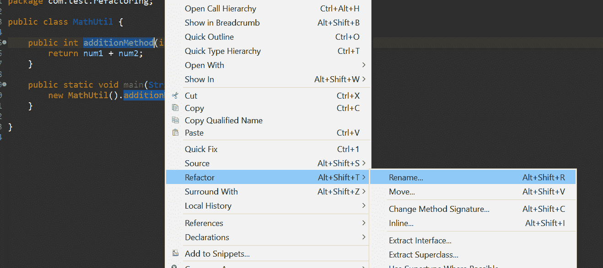](/web/20220802012320/https://www.baeldung.com/wp-content/uploads/2019/06/Eclipse-refactor-1.png)

我们也可以通过快捷键**、`Alt+Shift+R`、**来执行第二步和第三步。

当执行上述操作时，Eclipse 将在该文件中找到该元素的所有用法，并将它们全部替换。

我们还可以使用一个高级特性来更新其他类中的引用，方法是当 refactor 打开时将鼠标悬停在该项上，然后单击`Options`:

这将打开一个弹出窗口，我们既可以重命名变量或方法，也可以选择更新其他类中的引用:

[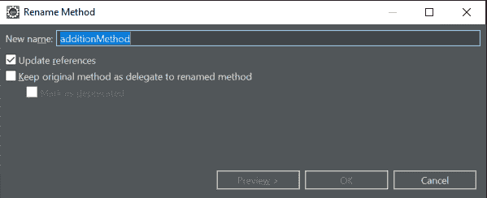](/web/20220802012320/https://www.baeldung.com/wp-content/uploads/2019/06/Eclipse-refactor-3.png)

### 2.2.重命名包

我们可以通过选择包名并执行与上一个示例相同的操作来重命名包。将立即出现一个弹出窗口，我们可以在其中重命名包，并提供更新引用和重命名子包等选项。

我们也可以在 Project Explorer 视图中通过按 F2 来重命名包**:**

[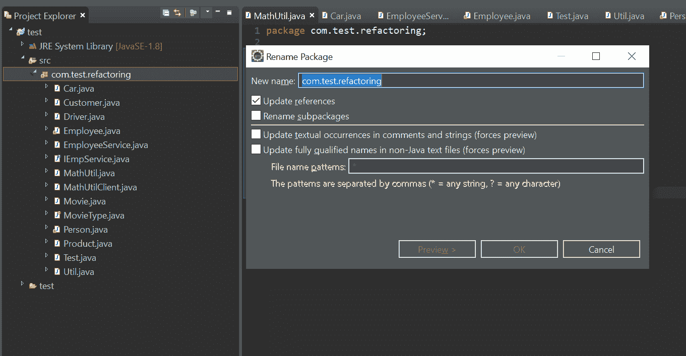](/web/20220802012320/https://www.baeldung.com/wp-content/uploads/2019/06/Eclipse-refactor-26.png)

### 2.3.重命名类和接口

我们可以通过使用相同的动作或者仅仅通过在项目浏览器中按下`F2`来重命名一个类或者接口。这将打开一个弹出窗口，其中包含更新参考的选项，以及一些高级选项:

[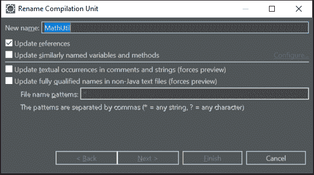](/web/20220802012320/https://www.baeldung.com/wp-content/uploads/2019/06/Eclipse-refactor-5.png)

## 3.提取

现在，我们来谈谈提取。提取代码意味着**取出一段代码并移动它。**

例如，我们可以将代码提取到不同的类、超类或接口中。我们甚至可以将代码提取到同一个类中的变量或方法中。

Eclipse 提供了多种实现提取的方法，我们将在接下来的小节中演示。

### 3.1.提取类

假设我们的代码库中有下面的`Car`类:

[PRE0]

现在，假设我们想将驱动程序细节提取到一个不同的类中。我们可以通过**右键单击类中的任意位置并选择`Refactor > Extract Class`选项**来实现:

[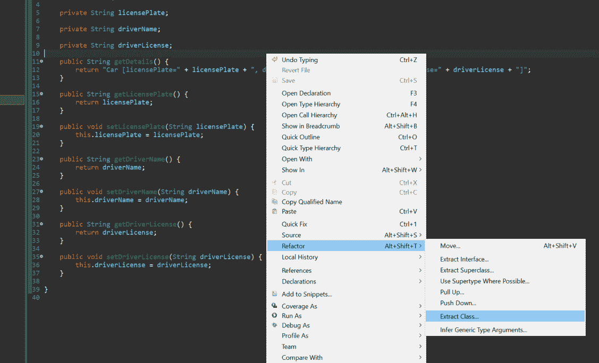](/web/20220802012320/https://www.baeldung.com/wp-content/uploads/2019/06/Eclipse-refactor-6.png)

这将打开一个弹出窗口，我们可以在其中命名类并选择要移动的字段，以及一些其他选项:

[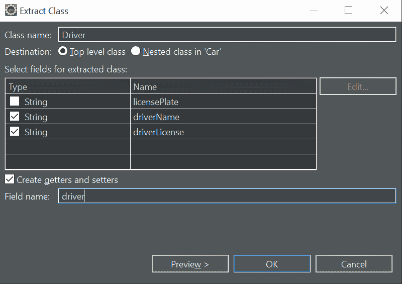](/web/20220802012320/https://www.baeldung.com/wp-content/uploads/2019/06/Eclipse-refactor-7.png)

**我们还可以在前进之前预览代码。**当我们点击`OK`时，Eclipse 将创建一个名为`Driver`的新类，之前的代码将被重构为:

[PRE1]

### 3.2.提取接口

我们也可以用类似的方式提取一个接口。假设我们有下面的`EmployeeService`类:

[PRE2]

我们可以通过**右击类中的任何地方并选择`Refactor > Extract Interface`选项、**来提取一个接口，或者我们可以使用`Alt+Shift+T`快捷键命令直接调出菜单:

[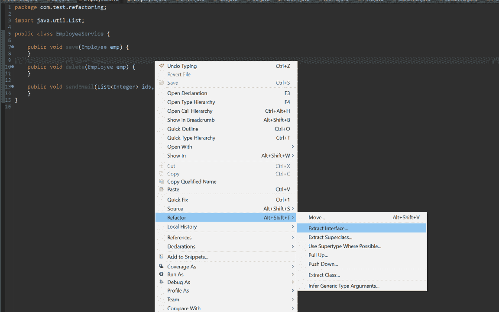](/web/20220802012320/https://www.baeldung.com/wp-content/uploads/2019/06/Eclipse-refactor-19.png)

这将打开一个弹出窗口，我们可以在其中输入接口名称并决定在接口中声明哪些成员:

[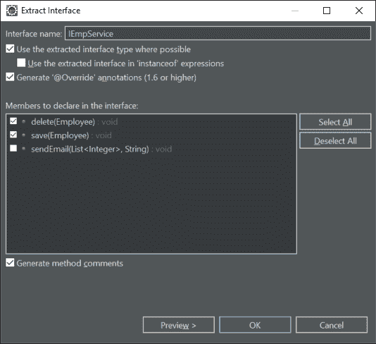](/web/20220802012320/https://www.baeldung.com/wp-content/uploads/2019/06/Eclipse-refactor-8.png)

作为这一重构的结果，我们将拥有一个接口`IEmpService`，并且我们的`EmployeeService`类也将被改变:

[PRE3]

### 3.3.提取超类

假设我们有一个包含几个属性的`Employee`类，这些属性不一定与这个人的职业有关:

[PRE4]

我们可能希望将与雇佣无关的属性提取到一个`Person`超类中。为了将项目提取到一个超类中，我们可以**在类中的任何地方右击并选择`Refactor > Extract Superclass`选项，或者使用 Alt+Shift+T** 直接调出菜单:

[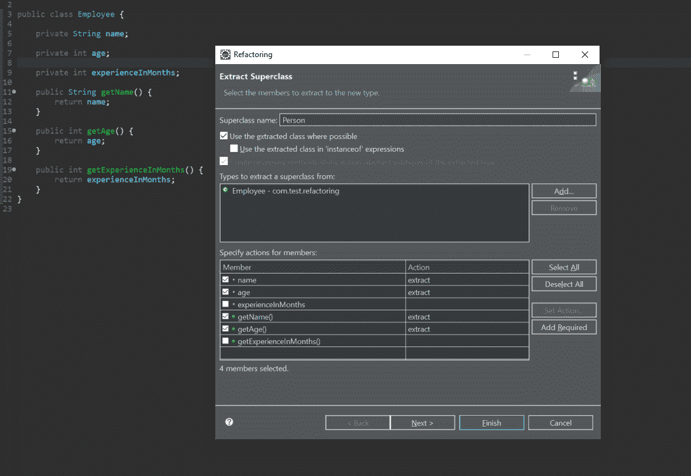](/web/20220802012320/https://www.baeldung.com/wp-content/uploads/2019/06/Eclipse-refactor-9.png)

这将使用我们选择的变量和方法创建一个新的`Person`类，并且`Employee`类将被重构为:

[PRE5]

### 3.4.提取方法

有时，我们可能希望将方法中的某段代码提取到不同的方法中，以保持代码的整洁和易于维护。

例如，假设我们的方法中嵌入了一个 for 循环:

[PRE6]

要调用`Extract Method`向导，我们需要执行以下步骤:

*   选择我们想要提取的代码行
*   右键单击选定的区域
*   点击 **`Refactor > Extract Method`选项**

[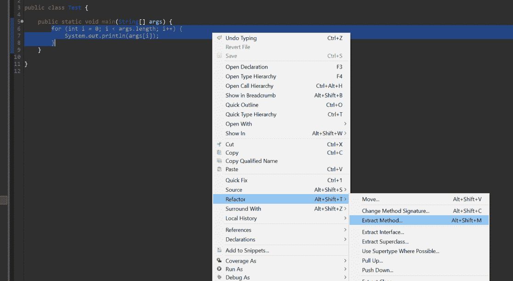](/web/20220802012320/https://www.baeldung.com/wp-content/uploads/2019/06/Eclipse-refactor-20.png)

**后两步也可以通过键盘快捷键`Alt+Shift+M`** 来实现。让我们看看`Extract Method`对话框:

[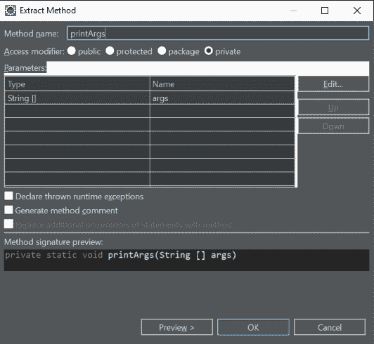](/web/20220802012320/https://www.baeldung.com/wp-content/uploads/2019/06/Eclipse-refactor-10.png)

这将重构我们的代码:

[PRE7]

### 3.5.提取局部变量

我们可以提取某些项目作为局部变量，以使我们的代码更具可读性。

当我们有一个*字符串*时，这很方便:

[PRE8]

我们想把它提取到一个局部变量中。

为此，我们需要:

*   选择项目
*   点击右键，选择 **`Refactor > Extract Local Variable`**

[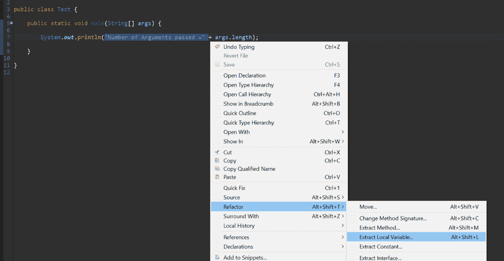](/web/20220802012320/https://www.baeldung.com/wp-content/uploads/2019/06/Eclipse-refactor-21.png)

**最后一步也可以通过键盘快捷键`Alt+Shift+L`** 来实现。现在，我们可以提取局部变量:

[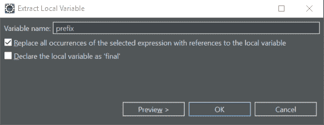](/web/20220802012320/https://www.baeldung.com/wp-content/uploads/2019/06/Eclipse-refactor-11.png)

这是这次重构的结果:

[PRE9]

### 3.6.提取常数

或者，我们可以提取表达式和文字值给`static final`类属性。

我们可以将`3.14 `值提取到一个局部变量中，正如我们刚刚看到的:

[PRE10]

但是，将它提取为常量可能更好，为此我们需要:

*   选择项目
*   右击并选择`**Refactor > Extract Constant**`

这将打开一个对话框，我们可以在其中为常量命名并设置其可见性，以及一些其他选项:

现在，我们的代码看起来更易读了:

[PRE11]

## 4.内嵌

我们也可以走另一条路，内联代码。

考虑一个`Util `类，它有一个只使用一次的局部变量:

[PRE12]

我们想要移除局部变量`result`并内联`isPrime`方法调用。为此，我们遵循以下步骤:

*   选择我们想要嵌入的项目
*   右键点击**选择`Refactor > Inline`选项**

**最后一步也可以通过快捷键`Alt+Shift+I` :** 来实现

[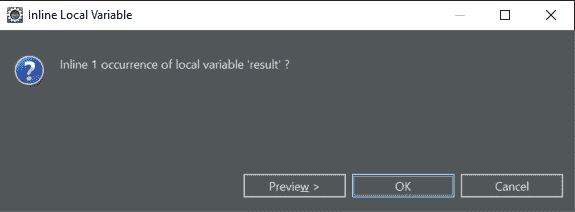](/web/20220802012320/https://www.baeldung.com/wp-content/uploads/2019/06/Eclipse-refactor-13.png)

之后，我们又少了一个需要跟踪的变量:

[PRE13]

## 5.向下推，向上拉

如果我们的类之间有父子关系(就像我们之前的`Employee`和`Person`例子),并且我们想要在它们之间移动某些方法或变量，我们可以使用 Eclipse 提供的推/拉选项。

顾名思义，`Push Down`选项将方法和字段从父类移动到所有子类，而`Pull Up`将方法和字段从特定子类移动到父类，从而使该方法可用于所有子类。

为了将方法下移到子类，我们需要**右键单击类中的任意位置，并选择`Refactor > Push Down`选项**:

[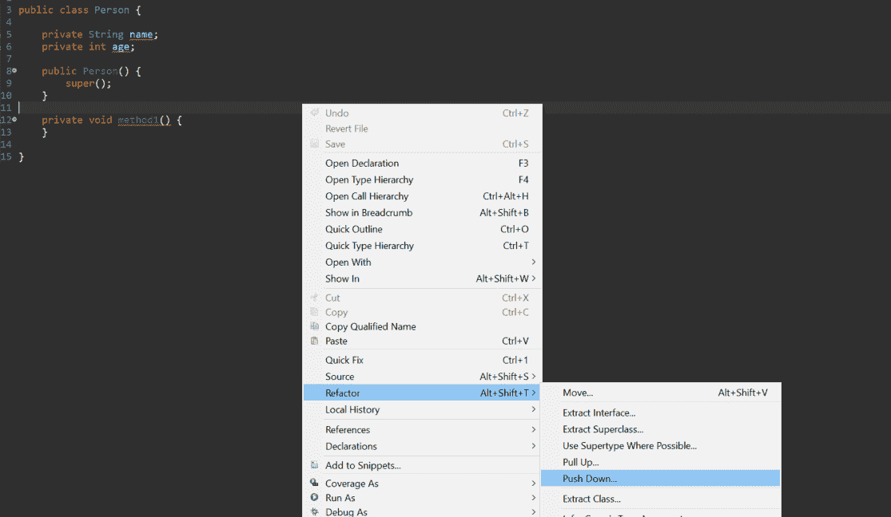](/web/20220802012320/https://www.baeldung.com/wp-content/uploads/2019/06/Eclipse-refactor-24.png)

这将打开一个向导，我们可以在其中选择要下推的项目:

类似地，为了将方法从子类移动到父类，我们需要**右键单击类中的任意位置并选择`Refactor > Pull Up`** :

[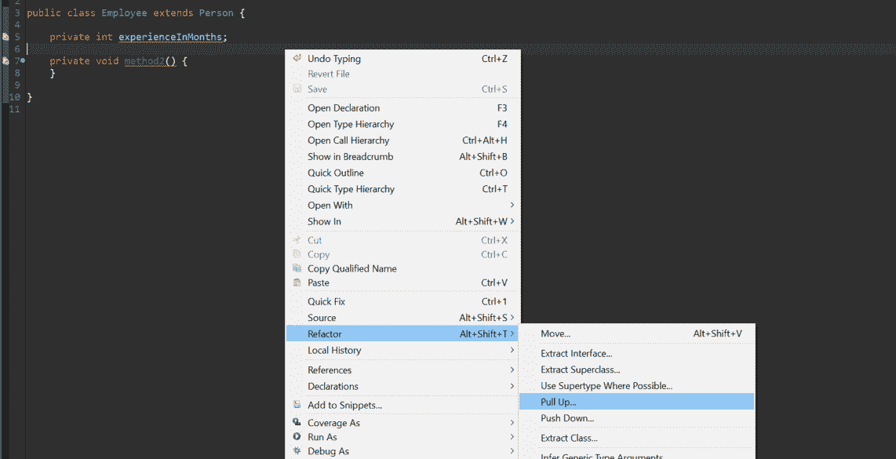](/web/20220802012320/https://www.baeldung.com/wp-content/uploads/2019/06/Eclipse-refactor-25.png)

这将打开一个类似的向导，我们可以在其中选择要调出的项目:

## 6.更改方法签名

要更改现有方法的方法签名，我们可以遵循几个简单的步骤:

*   选择方法或将光标放在内部的某个位置
*   **点击右键，选择`Refactor > Change Method Signature`**

**最后一步也可以通过键盘快捷键 `Alt+Shift+C.`** 来实现

这将打开一个弹出窗口，您可以在其中相应地更改方法签名:

[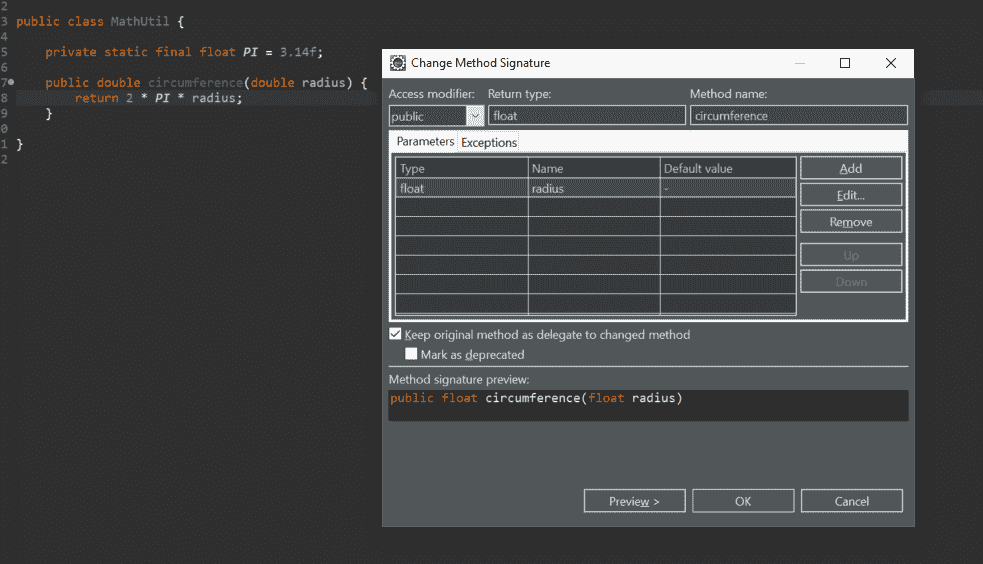](/web/20220802012320/https://www.baeldung.com/wp-content/uploads/2019/06/Eclipse-refactor-17.png)

## 7.移动的

有时，我们只是想将方法转移到另一个现有的类中，使我们的代码更加面向对象。

考虑我们有一个`Movie`类的场景:

[PRE14]

而`MovieType`是一个简单的枚举:

[PRE15]

假设我们有一个要求，如果一个`Customer`租了一部`NEW`的电影，它将被多收两美元，我们的`Customer`类有以下逻辑来计算`totalCost`():

[PRE16]

显然，基于`MovieType`的电影成本计算更适合放在`Movie`类中，而不是`Customer`类中。我们可以很容易地在 Eclipse 中移动这个计算逻辑:

*   选择要移动的线条
*   **点击右键，选择`Refactor > Move`选项**

**最后一步也可以通过快捷键`Alt+Shift+V` :** 来实现

Eclipse 足够聪明，能够意识到这个逻辑应该在我们的`Movie`类中。如果需要，我们可以更改方法名以及其他高级选项。

最终的`Customer`类代码将被重构为:

[PRE17]

正如我们所见，`movieCost`方法已经被移到我们的`Movie`类中，并且正在被重构的`Customer`类中使用。

## 8.结论

在本教程中，我们研究了 Eclipse 提供的一些主要重构技术。我们从一些基本的重构开始，比如重命名和提取。后来，我们看到了在不同的类之间移动方法和字段。

要了解更多，我们可以参考关于重构的官方 Eclipse 文档。